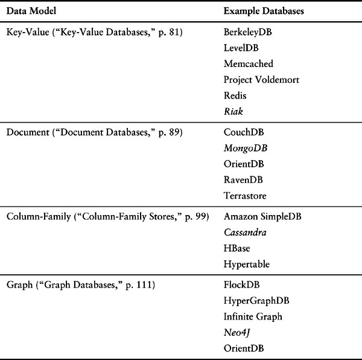

## Preface

We’ve spent some twenty years in the world of enterprise computing. We’ve seen many things change in languages, architectures, platforms, and processes. But through all this time one thing has stayed constant—relational databases store the data. There have been challengers, some of which have had success in some niches, but on the whole the data storage question for architects has been the question of which relational database to use.

There is a lot of value in the stability of this reign. An organization’s data lasts much longer that its programs (at least that’s what people tell us—we’ve seen plenty of very old programs out the re). It’s valuable to have a stable data storage that’s well understood and accessible from many application programming platforms.

Now, however, there’s a new challenger on the block under the confrontational tag of NoSQL. It’s born out of a need to handle larger data volumes which forced a fundamental shift to building large hardware platforms through clusters of commodity servers. This need has also raised long-running concerns about the difficulties of making application code play well with the relational data model.

The term “NoSQL” is very ill-defined. It’s generally applied to a number of recent nonrelational databases such as Cassandra, Mongo, Neo4J, and Riak. They embrace schemaless data, run on clusters, and have the ability to trade off traditional consistency for other useful properties.

Advocates of NoSQL databases claim that they can build systems that are more performant, scale much better, and are easier to program with.

Is this the first rattle of the death knell for relational databases, or yet another pretender to the throne? Our answer to that is “neither.” Relational databases are a powerful tool that we expect to be using for many more decades, but we do see a profound change in that relational databases won’t be the only databases in use. Our view is that we are entering a world of Polyglot Persistence where
enterprises, and even individual applications, use multiple technologies for data management. As a
result, architects will need to be familiar with these technologies and be able to evaluate which ones
to use for differing needs. Had we not thought that, we wouldn’t have spent the time and effort writing
this book.

This book seeks to give you enough information to answer the question of whether NoSQL
databases are worth serious consideration for your future projects. Every project is different, and
there’s no way we can write a simple decision tree to choose the right data store. Instead, what we
are attempting here is to provide you with enough background on how NoSQL databases work, so that
you can make those judgments yourself without having to trawl the whole web. We’ve deliberately
made this a small book, so you can get this overview pretty quickly. It won’t answer your questions
definitively, but it should narrow down the range of options you have to consider and help you
understand what questions you need to ask.

### Why Are NoSQL Databases Interesting?

We see two primary reasons why people consider using a NoSQL database.

- **Application development productivity.** A lot of application development effort is spent on
    mapping data between in-memory data structures and a relational database. A NoSQL database
    may provide a data model that better fits the application’s needs, thus simplifying that
    interaction and resulting in less code to write, debug, and evolve.

- **Large-scale data.** Organizations are finding it valuable to capture more data and process it
    more quickly. They are finding it expensive, if even possible, to do so with relational
    databases. The primary reason is that a relational database is designed to run on a single
    machine, but it is usually more economic to run large data and computing loads on clusters of
    many smaller and cheaper machines. Many NoSQL databases are designed explicitly to run on
    clusters, so they make a better fit for big data scenarios.

### What’s in the Book

We’ve broken this book up into two parts. The first part concentrates on core concepts that we think
you need to know in order to judge whether NoSQL databases are relevant for you and how they
differ. In the second part we concentrate more on implementing systems with NoSQL databases.

Chapter 1 begins by explaining why NoSQL has had such a rapid rise—the need to process larger
data volumes led to a shift, in large systems, from scaling vertically to scaling horizontally on
clusters. This explains an important feature of the data model of many NoSQL databases—the explicit
storage of a rich structure of closely related data that is accessed as a unit. In this book we call this
kind of structure an _aggregate_.

Chapter 2 describes how aggregates manifest themselves in three of the main data models in
NoSQL land: key-value (“Key-Value and Document Data Models,” p. 20 ), document (“Key-Value
and Document Data Models,” p. 20 ), and column family (“Column-Family Stores,” p. 21 ) databases.
Aggregates provide a natural unit of interaction for many kinds of applications, which both improves
running on a cluster and makes it easier to program the data access. Chapter 3 shifts to the downside
of aggregates—the difficulty of handling relationships (“Relationships,” p. 25 ) between entities in
different aggregates. This leads us naturally to graph databases (“Graph Databases,” p. 26 ), a NoSQL
data model that doesn’t fit into the aggregate-oriented camp. We also look at the common
characteristic of NoSQL databases that operate without a schema (“Schemaless Databases,” p. 28 )—
a feature that provides some greater flexibility, but not as much as you might first think.

Having covered the data-modeling aspect of NoSQL, we move on to distribution: Chapter 4
describes how databases distribute data to run on clusters. This breaks down into sharding
(“Sharding,” p. 38 ) and replication, the latter being either master-slave (“Master-Slave Replication,”
p. 40 ) or peer-to-peer (“Peer-to-Peer Replication,” p. 42 ) replication. With the distribution models
defined, we can then move on to the issue of consistency. NoSQL databases provide a more varied
range of consistency options than relational databases—which is a consequence of being friendly to
clusters. So Chapter 5 talks about how consistency changes for updates (“Update Consistency,” p. 47 )
and reads (“Read Consistency,” p. 49 ), the role of quorums (“Quorums,” p. 57 ), and how even some
durability (“Relaxing Durability,” p. 56 ) can be traded off. If you’ve heard anything about NoSQL,
you’ll almost certainly have heard of the CAP theorem; the “The CAP Theorem” section on p. 53
explains what it is and how it fits in.

While these chapters concentrate primarily on the principles of how data gets distributed and kept
consistent, the next two chapters talk about a couple of important tools that make this work. Chapter 6
describes version stamps, which are for keeping track of changes and detecting inconsistencies.
Chapter 7 outlines map-reduce, which is a particular way of organizing parallel computation that fits
in well with clusters and thus with NoSQL systems.

Once we’re done with concepts, we move to implementation issues by looking at some example
databases under the four key categories: Chapter 8 uses Riak as an example of key-value databases,

Chapter 9 takes MongoDB as an example for document databases, Chapter 10 chooses Cassandra to
explore column-family databases, and finally Chapter 11 plucks Neo4J as an example of graph
databases. We must stress that this is not a comprehensive study—there are too many out there to
write about, let alone for us to try. Nor does our choice of examples imply any recommendations. Our
aim here is to give you a feel for the variety of stores that exist and for how different database
technologies use the concepts we outlined earlier. You’ll see what kind of code you need to write to
program against these systems and get a glimpse of the mindset you’ll need to use them.

A common statement about NoSQL databases is that since they have no schema, there is no
difficulty in changing the structure of data during the life of an application. We disagree—a
schemaless database still has an implicit schema that needs change discipline when you implement it,
so Chapter 12 explains how to do data migration both for strong schemas and for schemaless systems.

All of this should make it clear that NoSQL is not a single thing, nor is it something that will
replace relational databases. Chapter 13 looks at this future world of Polyglot Persistence, where
multiple data-storage worlds coexist, even within the same application. Chapter 14 then expands our
horizons beyond this book, considering other technologies that we haven’t covered that may also be a
part of this polyglot-persistent world.

With all of this information, you are finally at a point where you can make a choice of what data
storage technologies to use, so our final chapter (Chapter 15, “Choosing Your Database,” p. 147 )
offers some advice on how to think about these choices. In our view, there are two key factors—
finding a productive programming model where the data storage model is well aligned to your
application, and ensuring that you can get the data access performance and resilience you need. Since
this is early days in the NoSQL life story, we’re afraid that we don’t have a well-defined procedure
to follow, and you’ll need to test your options in the context of your needs.

This is a brief overview—we’ve been very deliberate in limiting the size of this book. We’ve
selected the information we think is the most important—so that you don’t have to. If you are going to
seriously investigate these technologies, you’ll need to go further than what we cover here, but we
hope this book provides a good context to start you on your way.

We also need to stress that this is a very volatile field of the computer industry. Important aspects
of these stores are changing every year—new features, new databases. We’ve made a strong effort to
focus on concepts, which we think will be valuable to understand even as the underlying technology
changes. We’re pretty confident that most of what we say will have this longevity, but absolutely sure
that not all of it will.

### Who Should Read This Book

Our target audience for this book is people who are considering using some form of a NoSQL
database. This may be for a new project, or because they are hitting barriers that are suggesting a shift
on an existing project.

Our aim is to give you enough information to know whether NoSQL technology makes sense for
your needs, and if so which tool to explore in more depth. Our primary imagined audience is an
architect or technical lead, but we think this book is also valuable for people involved in software
management who want to get an overview of this new technology. We also think that if you’re a
developer who wants an overview of this technology, this book will be a good starting point.

We don’t go into the details of programming and deploying specific databases here—we leave that for specialist books. We’ve also been very firm on a page limit, to keep this book a brief
introduction. This is the kind of book we think you should be able to read on a plane flight: It won’t
answer all your questions but should give you a good set of questions to ask.

If you’ve already delved into the world of NoSQL, this book probably won’t commit any new
items to your store of knowledge. However, it may still be useful by helping you explain what you’ve
learned to others. Making sense of the issues around NoSQL is important—particularly if you’re
trying to persuade someone to consider using NoSQL in a project.

### What Are the Databases

In this book, we’ve followed a common approach of categorizing NoSQL databases according to
their data model. Here is a table of the four data models and some of the databases that fit each
model. This is not a comprehensive list—it only mentions the more common databases we’ve come
across. At the time of writing, you can find more comprehensive lists at [http://nosql-database.org](http://nosql-database.org) and
[http://nosql.mypopescu.com/kb/nosql.](http://nosql.mypopescu.com/kb/nosql.) For each category, we mark with italics the database we use as
an example in the relevant chapter.

Our goal is to pick a representative tool from each of the categories of the databases. While we talk about specific examples, most of the discussion should apply to the entire category, even though these products are unique and cannot be generalized as such. We will pick one database for each of the key-value, document, column family, and graph databases; where appropriate, we will mention other products that may fulfill a specific feature need.

This classification by data model is useful, but crude. The lines between the different data models, such as the distinction between key-value and document databases (“Key-Value and Document Data Models,” p. 20 ), are often blurry. Many databases don’t fit cleanly into categories; for example, OrientDB calls itself both a document database and a graph database.

### Acknowledgments

Our first thanks go to our colleagues at ThoughtWorks, many of whom have been applying NoSQL to
our delivery projects over the last couple of years. Their experiences have been a primary source
both of our motivation in writing this book and of practical information on the value of this
technology. The positive experience we’ve had so far with NoSQL data stores is the basis of our
view that this is an important technology and a significant shift in data storage.

We’d also like to thank various groups who have given public talks, published articles, and blogs
on their use of NoSQL. Much progress in software development gets hidden when people don’t share
with their peers what they’ve learned. Particular thanks here go to Google and Amazon whose papers
on Bigtable and Dynamo were very influential in getting the NoSQL movement going. We also thank
companies that have sponsored and contributed to the open-source development of NoSQL databases.
An interesting difference with previous shifts in data storage is the degree to which the NoSQL
movement is rooted in open-source work.

Particular thanks go to ThoughtWorks for giving us the time to work on this book. We joined
ThoughtWorks at around the same time and have been here for over a decade. ThoughtWorks
continues to be a very hospitable home for us, a source of knowledge and practice, and a welcome
environment of openly sharing what we learn—so different from the traditional systems delivery
organizations.

Bethany Anders-Beck, Ilias Bartolini, Tim Berglund, Duncan Craig, Paul Duvall, Oren Eini, Perryn
Fowler, Michael Hunger, Eric Kascic, Joshua Kerievsky, Anand Krishnaswamy, Bobby Norton, Ade
Oshineye, Thiyagu Palanisamy, Prasanna Pendse, Dan Pritchett, David Rice, Mike Roberts, Marko
Rodriquez, Andrew Slocum, Toby Tripp, Steve Vinoski, Dean Wampler, Jim Webber, and Wee
Witthawaskul reviewed early drafts of this book and helped us improve it with their advice.

Additionally, Pramod would like to thank Schaumburg Library for providing great service and
quiet space for writing; Arhana and Arula, my beautiful daughters, for their understanding that daddy
would go to the library and not take them along; Rupali, my beloved wife, for her immense support
and help in keeping me focused.