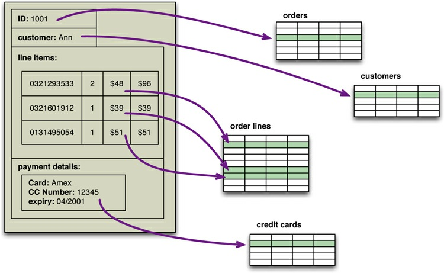

# Chapter 1. Why NoSQL?

For almost as long as we’ve been in the software profession, relational databases have been the
default choice for serious data storage, especially in the world of enterprise applications. If you’re an
architect starting a new project, your only choice is likely to be which relational database to use.
(And often not even that, if your company has a dominant vendor.) There have been times when a
database technology threatened to take a piece of the action, such as object databases in the 1990’s,
but these alternatives never got anywhere.

After such a long period of dominance, the current excitement about NoSQL databases comes as a
surprise. In this chapter we’ll explore why relational databases became so dominant, and why we
think the current rise of NoSQL databases isn’t a flash in the pan.

## 1.1. The Value of Relational Databases

Relational databases have become such an embedded part of our computing culture that it’s easy to
take them for granted. It’s therefore useful to revisit the benefits they provide.

**1.1.1. Getting at Persistent Data**

Probably the most obvious value of a database is keeping large amounts of persistent data. Most
computer architectures have the notion of two areas of memory: a fast volatile “main memory” and a
larger but slower “backing store.” Main memory is both limited in space and loses all data when you
lose power or something bad happens to the operating system. Therefore, to keep data around, we
write it to a backing store, commonly seen a disk (although these days that disk can be persistent
memory).

The backing store can be organized in all sorts of ways. For many productivity applications (such
as word processors), it’s a file in the file system of the operating system. For most enterprise
applications, however, the backing store is a database. The database allows more flexibility than a
file system in storing large amounts of data in a way that allows an application program to get at
small bits of that information quickly and easily.

**1.1.2. Concurrency**

Enterprise applications tend to have many people looking at the same body of data at once, possibly
modifying that data. Most of the time they are working on different areas of that data, but occasionally
they operate on the same bit of data. As a result, we have to worry about coordinating these
interactions to avoid such things as double booking of hotel rooms.

Concurrency is notoriously difficult to get right, with all sorts of errors that can trap even the most
careful programmers. Since enterprise applications can have lots of users and other systems all
working concurrently, there’s a lot of room for bad things to happen. Relational databases help handle
this by controlling all access to their data through transactions. While this isn’t a cure-all (you still
have to handle a transactional error when you try to book a room that’s just gone), the transactional
mechanism has worked well to contain the complexity of concurrency.

Transactions also play a role in error handling. With transactions, you can make a change, and if an
error occurs during the processing of the change you can roll back the transaction to clean things up.

**1.1.3. Integration**

Enterprise applications live in a rich ecosystem that requires multiple applications, written by
different teams, to collaborate in order to get things done. This kind of inter-application collaboration
is awkward because it means pushing the human organizational boundaries. Applications often need
to use the same data and updates made through one application have to be visible to others.

A common way to do this is **shared database integration** [Hohpe and Woolf] where multiple
applications store their data in a single database. Using a single database allows all the applications
to use each others’ data easily, while the database’s concurrency control handles multiple
applications in the same way as it handles multiple users in a single application.

**1.1.4. A (Mostly) Standard Model**

Relational databases have succeeded because they provide the core benefits we outlined earlier in a
(mostly) standard way. As a result, developers and database professionals can learn the basic
relational model and apply it in many projects. Although there are differences between different
relational databases, the core mechanisms remain the same: Different vendors’ SQL dialects are
similar, transactions operate in mostly the same way.

## 1.2. Impedance Mismatch

Relational databases provide many advantages, but they are by no means perfect. Even from their
early days, there have been lots of frustrations with them.

For application developers, the biggest frustration has been what’s commonly called the
**impedance mismatch** : the difference between the relational model and the in-memory data structures.
The relational data model organizes data into a structure of tables and rows, or more properly,
relations and tuples. In the relational model, a **tuple** is a set of name-value pairs and a **relation** is a
set of tuples. (The relational definition of a tuple is slightly different from that in mathematics and
many programming languages with a tuple data type, where a tuple is a sequence of values.) All
operations in SQL consume and return relations, which leads to the mathematically elegant relational
algebra.

This foundation on relations provides a certain elegance and simplicity, but it also introduces
limitations. In particular, the values in a relational tuple have to be simple—they cannot contain any
structure, such as a nested record or a list. This limitation isn’t true for in-memory data structures,
which can take on much richer structures than relations. As a result, if you want to use a richer in-
memory data structure, you have to translate it to a relational representation to store it on disk. Hence
the impedance mismatch—two different representations that require translation (see Figure 1.1).

**Figure 1.1. An order, which looks like a single aggregate structure in the UI, is split into many
rows from many tables in a relational database**

The impedance mismatch is a major source of frustration to application developers, and in the
1990s many people believed that it would lead to relational databases being replaced with databases
that replicate the in-memory data structures to disk. That decade was marked with the growth of
object-oriented programming languages, and with them came object-oriented databases—both
looking to be the dominant environment for software development in the new millennium.

However, while object-oriented languages succeeded in becoming the major force in
programming, object-oriented databases faded into obscurity. Relational databases saw off the
challenge by stressing their role as an integration mechanism, supported by a mostly standard
language of data manipulation (SQL) and a growing professional divide between application
developers and database administrators.

Impedance mismatch has been made much easier to deal with by the wide availability of object-
relational mapping frameworks, such as Hibernate and iBATIS that implement well-known mapping
patterns [Fowler PoEAA], but the mapping problem is still an issue. Object-relational mapping
frameworks remove a lot of grunt work, but can become a problem of their own when people try too
hard to ignore the database and query performance suffers.

Relational databases continued to dominate the enterprise computing world in the 2000s, but during
that decade cracks began to open in their dominance.

## 1.3. Application and Integration Databases

The exact reasons why relational databases triumphed over OO databases are still the subject of an
occasional pub debate for developers of a certain age. But in our view, the primary factor was the
role of SQL as an integration mechanism between applications. In this scenario, the database acts as

an **integration database** —with multiple applications, usually developed by separate teams, storing
their data in a common database. This improves communication because all the applications are
operating on a consistent set of persistent data.

There are downsides to shared database integration. A structure that’s designed to integrate many
applications ends up being more complex—indeed, often dramatically more complex—than any
single application needs. Furthermore, should an application want to make changes to its data storage,
it needs to coordinate with all the other applications using the database. Different applications have
different structural and performance needs, so an index required by one application may cause a
problematic hit on inserts for another. The fact that each application is usually a separate team also
means that the database usually cannot trust applications to update the data in a way that preserves
database integrity and thus needs to take responsibility for that within the database itself.

A different approach is to treat your database as an **application database** —which is only directly
accessed by a single application codebase that’s looked after by a single team. With an application
database, only the team using the application needs to know about the database structure, which
makes it much easier to maintain and evolve the schema. Since the application team controls both the
database and the application code, the responsibility for database integrity can be put in the
application code.

Interoperability concerns can now shift to the interfaces of the application, allowing for better
interaction protocols and providing support for changing them. During the 2000s we saw a distinct
shift to web services [Daigneau], where applications would communicate over HTTP. Web services
enabled a new form of a widely used communication mechanism—a challenger to using the SQL with
shared databases. (Much of this work was done under the banner of “Service-Oriented
Architecture”—a term most notable for its lack of a consistent meaning.)

An interesting aspect of this shift to web services as an integration mechanism was that it resulted
in more flexibility for the structure of the data that was being exchanged. If you communicate with
SQL, the data must be structured as relations. However, with a service, you are able to use richer
data structures with nested records and lists. These are usually represented as documents in XML or,
more recently, JSON. In general, with remote communication you want to reduce the number of round
trips involved in the interaction, so it’s useful to be able to put a rich structure of information into a
single request or response.

If you are going to use services for integration, most of the time web services—using text over
HTTP—is the way to go. However, if you are dealing with highly performance-sensitive interactions,
you may need a binary protocol. Only do this if you are sure you have the need, as text protocols are
easier to work with—consider the example of the Internet.

Once you have made the decision to use an application database, you get more freedom of choosing
a database. Since there is a decoupling between your internal database and the services with which
you talk to the outside world, the outside world doesn’t have to care how you store your data,
allowing you to consider nonrelational options. Furthermore, there are many features of relational
databases, such as security, that are less useful to an application database because they can be done
by the enclosing application instead.

Despite this freedom, however, it wasn’t apparent that application databases led to a big rush to
alternative data stores. Most teams that embraced the application database approach stuck with
relational databases. After all, using an application database yields many advantages even ignoring

the database flexibility (which is why we generally recommend it). Relational databases are familiar
and usually work very well or, at least, well enough. Perhaps, given time, we might have seen the
shift to application databases to open a real crack in the relational hegemony—but such cracks came
from another source.

## 1.4. Attack of the Clusters

At the beginning of the new millennium the technology world was hit by the busting of the 1990s dot-
com bubble. While this saw many people questioning the economic future of the Internet, the 2000s
did see several large web properties dramatically increase in scale.

This increase in scale was happening along many dimensions. Websites started tracking activity
and structure in a very detailed way. Large sets of data appeared: links, social networks, activity in
logs, mapping data. With this growth in data came a growth in users—as the biggest websites grew to
be vast estates regularly serving huge numbers of visitors.

Coping with the increase in data and traffic required more computing resources. To handle this
kind of increase, you have two choices: up or out. Scaling up implies bigger machines, more
processors, disk storage, and memory. But bigger machines get more and more expensive, not to
mention that there are real limits as your size increases. The alternative is to use lots of small
machines in a cluster. A cluster of small machines can use commodity hardware and ends up being
cheaper at these kinds of scales. It can also be more resilient—while individual machine failures are
common, the overall cluster can be built to keep going despite such failures, providing high
reliability.

As large properties moved towards clusters, that revealed a new problem—relational databases
are not designed to be run on clusters. Clustered relational databases, such as the Oracle RAC or
Microsoft SQL Server, work on the concept of a shared disk subsystem. They use a cluster-aware file
system that writes to a highly available disk subsystem—but this means the cluster still has the disk
subsystem as a single point of failure. Relational databases could also be run as separate servers for
different sets of data, effectively sharding (“Sharding,” p. 38 ) the database. While this separates the
load, all the sharding has to be controlled by the application which has to keep track of which
database server to talk to for each bit of data. Also, we lose any querying, referential integrity,
transactions, or consistency controls that cross shards. A phrase we often hear in this context from
people who’ve done this is “unnatural acts.”

These technical issues are exacerbated by licensing costs. Commercial relational databases are
usually priced on a single-server assumption, so running on a cluster raised prices and led to
frustrating negotiations with purchasing departments.

This mismatch between relational databases and clusters led some organization to consider an
alternative route to data storage. Two companies in particular—Google and Amazon—have been
very influential. Both were on the forefront of running large clusters of this kind; furthermore, they
were capturing huge amounts of data. These things gave them the motive. Both were successful and
growing companies with strong technical components, which gave them the means and opportunity. It
was no wonder they had murder in mind for their relational databases. As the 2000s drew on, both
companies produced brief but highly influential papers about their efforts: BigTable from Google and
Dynamo from Amazon.

It’s often said that Amazon and Google operate at scales far removed from most organizations, so
the solutions they needed may not be relevant to an average organization. While it’s true that most

software projects don’t need that level of scale, it’s also true that more and more organizations are
beginning to explore what they can do by capturing and processing more data—and to run into the
same problems. So, as more information leaked out about what Google and Amazon had done, people
began to explore making databases along similar lines—explicitly designed to live in a world of
clusters. While the earlier menaces to relational dominance turned out to be phantoms, the threat from
clusters was serious.

## 1.5. The Emergence of NoSQL

It’s a wonderful irony that the term “NoSQL” first made its appearance in the late 90s as the name of
an open-source relational database [Strozzi NoSQL]. Led by Carlo Strozzi, this database stores its
tables as ASCII files, each tuple represented by a line with fields separated by tabs. The name comes
from the fact that the database doesn’t use SQL as a query language. Instead, the database is
manipulated through shell scripts that can be combined into the usual UNIX pipelines. Other than the
terminological coincidence, Strozzi’s NoSQL had no influence on the databases we describe in this
book.

The usage of “NoSQL” that we recognize today traces back to a meetup on June 11, 2009 in San
Francisco organized by Johan Oskarsson, a software developer based in London. The example of
BigTable and Dynamo had inspired a bunch of projects experimenting with alternative data storage,
and discussions of these had become a feature of the better software conferences around that time.
Johan was interested in finding out more about some of these new databases while he was in San
Francisco for a Hadoop summit. Since he had little time there, he felt that it wouldn’t be feasible to
visit them all, so he decided to host a meetup where they could all come together and present their
work to whoever was interested.

Johan wanted a name for the meetup—something that would make a good Twitter hashtag: short,
memorable, and without too many Google hits so that a search on the name would quickly find the
meetup. He asked for suggestions on the #cassandra IRC channel and got a few, selecting the
suggestion of “NoSQL” from Eric Evans (a developer at Rackspace, no connection to the DDD Eric
Evans). While it had the disadvantage of being negative and not really describing these systems, it did
fit the hashtag criteria. At the time they were thinking of only naming a single meeting and were not
expecting it to catch on to name this entire technology trend [Oskarsson].

The term “NoSQL” caught on like wildfire, but it’s never been a term that’s had much in the way of
a strong definition. The original call [NoSQL Meetup] for the meetup asked for “open-source,
distributed, nonrelational databases.” The talks there [NoSQL Debrief] were from Voldemort,
Cassandra, Dynomite, HBase, Hypertable, CouchDB, and MongoDB—but the term has never been
confined to that original septet. There’s no generally accepted definition, nor an authority to provide
one, so all we can do is discuss some common characteristics of the databases that tend to be called
“NoSQL.”

To begin with, there is the obvious point that NoSQL databases don’t use SQL. Some of them do
have query languages, and it makes sense for them to be similar to SQL in order to make them easier
to learn. Cassandra’s CQL is like this—“exactly like SQL (except where it’s not)” [CQL]. But so far
none have implemented anything that would fit even the rather flexible notion of standard SQL. It will
be interesting to see what happens if an established NoSQL database decides to implement a
reasonably standard SQL; the only predictable outcome for such an eventuality is plenty of argument.

Another important characteristic of these databases is that they are generally open-source projects.

Although the term NoSQL is frequently applied to closed-source systems, there’s a notion that
NoSQL is an open-source phenomenon.

Most NoSQL databases are driven by the need to run on clusters, and this is certainly true of those
that were talked about during the initial meetup. This has an effect on their data model as well as their
approach to consistency. Relational databases use ACID transactions (p. 19 ) to handle consistency
across the whole database. This inherently clashes with a cluster environment, so NoSQL databases
offer a range of options for consistency and distribution.

However, not all NoSQL databases are strongly oriented towards running on clusters. Graph
databases are one style of NoSQL databases that uses a distribution model similar to relational
databases but offers a different data model that makes it better at handling data with complex
relationships.

NoSQL databases are generally based on the needs of the early 21st century web estates, so usually
only systems developed during that time frame are called NoSQL—thus ruling out hoards of
databases created before the new millennium, let alone BC (Before Codd).

NoSQL databases operate without a schema, allowing you to freely add fields to database records
without having to define any changes in structure first. This is particularly useful when dealing with
nonuniform data and custom fields which forced relational databases to use names like
customField6 or custom field tables that are awkward to process and understand.

All of the above are common characteristics of things that we see described as NoSQL databases.
None of these are definitional, and indeed it’s likely that there will never be a coherent definition of
“NoSQL” (sigh). However, this crude set of characteristics has been our guide in writing this book.
Our chief enthusiasm with this subject is that the rise of NoSQL has opened up the range of options
for data storage. Consequently, this opening up shouldn’t be confined to what’s usually classed as a
NoSQL store. We hope that other data storage options will become more acceptable, including many
that predate the NoSQL movement. There is a limit, however, to what we can usefully discuss in this
book, so we’ve decided to concentrate on this noDefinition.

When you first hear “NoSQL,” an immediate question is what does it stand for—a “no” to SQL?
Most people who talk about NoSQL say that it really means “Not Only SQL,” but this interpretation
has a couple of problems. Most people write “NoSQL” whereas “Not Only SQL” would be written
“NOSQL.” Also, there wouldn’t be much point in calling something a NoSQL database under the “not
only” meaning—because then, Oracle or Postgres would fit that definition, we would prove that black
equals white and would all get run over on crosswalks.

To resolve this, we suggest that you don’t worry about what the term stands for, but rather about
what it means (which is recommended with most acronyms). Thus, when “NoSQL” is applied to a
database, it refers to an ill-defined set of mostly open-source databases, mostly developed in the
early 21st century, and mostly not using SQL.

The “not-only” interpretation does have its value, as it describes the ecosystem that many people
think is the future of databases. This is in fact what we consider to be the most important contribution
of this way of thinking—it’s better to think of NoSQL as a movement rather than a technology. We
don’t think that relational databases are going away—they are still going to be the most common form
of database in use. Even though we’ve written this book, we still recommend relational databases.
Their familiarity, stability, feature set, and available support are compelling arguments for most
projects.

The change is that now we see relational databases as one option for data storage. This point of
view is often referred to as **polyglot persistence** —using different data stores in different
circumstances. Instead of just picking a relational database because everyone does, we need to
understand the nature of the data we’re storing and how we want to manipulate it. The result is that
most organizations will have a mix of data storage technologies for different circumstances.

In order to make this polyglot world work, our view is that organizations also need to shift from
integration databases to application databases. Indeed, we assume in this book that you’ll be using a
NoSQL database as an application database; we don’t generally consider NoSQL databases a good
choice for integration databases. We don’t see this as a disadvantage as we think that even if you
don’t use NoSQL, shifting to encapsulating data in services is a good direction to take.

In our account of the history of NoSQL development, we’ve concentrated on big data running on
clusters. While we think this is the key thing that drove the opening up of the database world, it isn’t
the only reason we see project teams considering NoSQL databases. An equally important reason is
the old frustration with the impedance mismatch problem. The big data concerns have created an
opportunity for people to think freshly about their data storage needs, and some development teams
see that using a NoSQL database can help their productivity by simplifying their database access even
if they have no need to scale beyond a single machine.

So, as you read the rest of this book, remember there are two primary reasons for considering
NoSQL. One is to handle data access with sizes and performance that demand a cluster; the other is to
improve the productivity of application development by using a more convenient data interaction
style.

## 1.6. Key Points

- Relational databases have been a successful technology for twenty years, providing persistence,
    concurrency control, and an integration mechanism.
- Application developers have been frustrated with the impedance mismatch between the
    relational model and the in-memory data structures.
- There is a movement away from using databases as integration points towards encapsulating
    databases within applications and integrating through services.
- The vital factor for a change in data storage was the need to support large volumes of data by
    running on clusters. Relational databases are not designed to run efficiently on clusters.
- NoSQL is an accidental neologism. There is no prescriptive definition—all you can make is an
    observation of common characteristics.
- The common characteristics of NoSQL databases are
    - Not using the relational model
    - Running well on clusters
    - Open-source
    - Built for the 21st century web estates
    - Schemaless
- The most important result of the rise of NoSQL is Polyglot Persistence.

