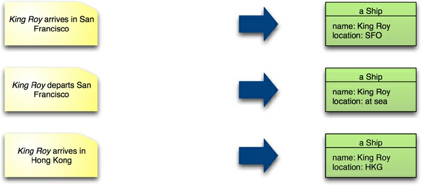
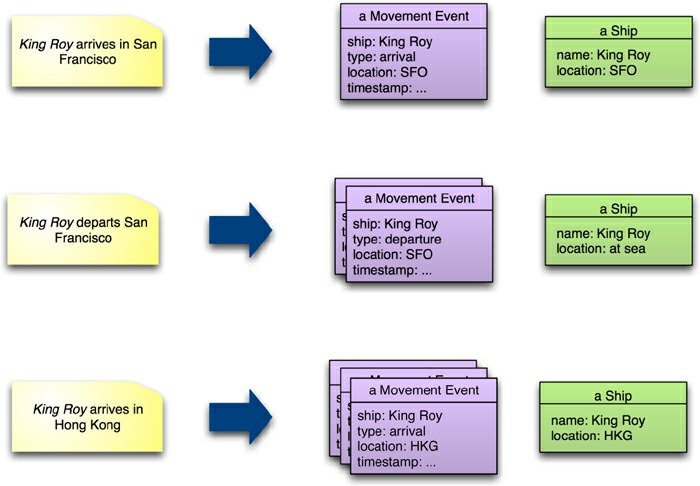
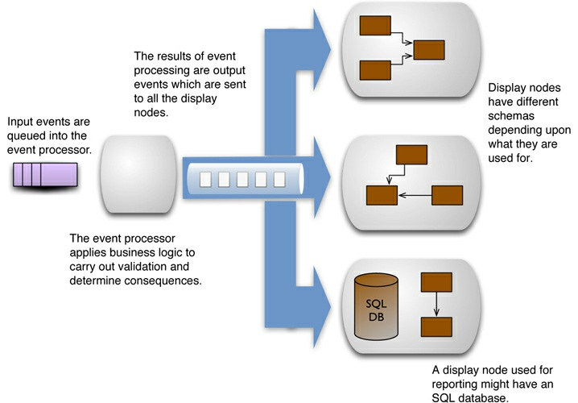

# Chapter 14. Beyond NoSQL

The appearance of NoSQL databases has done a great deal to shake up and open up the world of
databases, but we think the kind of NoSQL databases we have discussed here is only part of the
picture of polyglot persistence. So it makes sense to spend some time discussing solutions that don’t
easily fit into the NoSQL bucket.

## 14.1. File Systems

Databases are very common, but file systems are almost ubiquitous. In the last couple of decades
they’ve been widely used for personal productivity documents, but not for enterprise applications.
They don’t advertise any internal structure, so they are more like key-value stores with a hierarchic
key. They also provide little control over concurrency other than simple file locking—which itself is
similar to the way NoSQL only provides locking within a single aggregate.

File systems have the advantage of being simple and widely implemented. They cope well with
very large entities, such as video and audio. Often, databases are used to index media assets stored in
files. Files also work very well for sequential access, such as streaming, which can be handy for data
which is append-only.

Recent attention to clustered environments has seen a rise of distributed file systems. Technologies
like the Google File System and Hadoop [Hadoop] provide support for replication of files. Much of
the discussion of map-reduce is about manipulating large files on cluster systems, with tools for
automatic splitting of large files into segments to be processed on multiple nodes. Indeed a common
entry path into NoSQL is from organizations that have been using Hadoop.

File systems work best for a relatively small number of large files that can be processed in big
chunks, preferably in a streaming style. Large numbers of small files generally perform badly—this is
where a data store becomes more efficient. Files also provide no support for queries without
additional indexing tools such as Solr [Solr].

## 14.2. Event Sourcing

Event sourcing is an approach to persistence that concentrates on persisting all the changes to a
persistent state, rather than persisting the current application state itself. It’s an architectural pattern
that works quite well with most persistence technologies, including relational databases. We mention
it here because it also underpins some of the more unusual ways of thinking about persistence.

Consider an example of a system that keeps a log of the location of ships (Figure 14.1). It has a
simple ship record that keeps the name of the ship and its current location. In the usual way of
thinking, when we hear that the ship _King Roy_ has arrived in San Francisco, we change the value of
_King Roy_ ’s location field to San Francisco. Later on, we hear it’s departed, so we change it to at
sea, changing it again once we know it’s arrived in Hong Kong.

**Figure 14.1. In a typical system, notice of a change causes an update to the application’s state.**

With an event-sourced system, the first step is to construct an event object that captures the
information about the change (Figure 14.2). This event object is stored in a durable event log. Finally,
we process the event in order to update the application’s state.

**Figure 14.2. With event sourcing, the system stores each event, together with the derived application state.**

As a consequence, in an event-sourced system we store every event that’s caused a state change of
the system in the event log, and the application’s state is entirely derivable from this event log. At any
time, we can safely throw away the application state and rebuild it from the event log.

In theory, event logs are all you need because you can always recreate the application state
whenever you need it by replaying the event log. In practice, this may be too slow. As a result, it’s
usually best to provide the ability to store and recreate the application state in a snapshot. A **snapshot** is designed to persist the memory image optimized for rapid recovery of the state. It is an
optimization aid, so it should never take precedence over the event log for authority on the data.

How frequently you take a snapshot depends on your uptime needs. The snapshot doesn’t need to
be completely up to date, as you can rebuild memory by loading the latest snapshot and then replaying
all events processed since that snapshot was taken. An example approach would be to take a snapshot
every night; should the system go down during the day, you’d reload last night’s snapshot followed by
today’s events. If you can do that quickly enough, all will be fine.

To get a full record of every change in your application state, you need to keep the event log going
back to the beginning of time for your application. But in many cases such a long-lived record isn’t
necessary, as you can fold older events into a snapshot and only use the event log after the date of the
snapshot.

Using event sourcing has a number of advantages. You can broadcast events to multiple systems,
each of which can build a different application state for different purposes (Figure 14.3). For read-
intensive systems, you can provide multiple read nodes, with potentially different schemas, while
concentrating the writes on a different processing system (an approach broadly known as CQRS
[CQRS]).

**Figure 14.3. Events can be broadcast to multiple display systems.**

Event sourcing is also an effective platform for analyzing historic information, since you can
replicate any past state in the event log. You can also easily investigate alternative scenarios by

introducing hypothetical events into an analysis processor.

Event sourcing does add some complexity—most notably, you have to ensure that all state changes
are captured and stored as events. Some architectures and tools can make that inconvenient. Any
collaboration with external systems needs to take the event sourcing into account; you’ll need to be
careful of external side effects when replaying events to rebuild an application state.

## 14.3. Memory Image

One the consequences of event sourcing is that the event log becomes the definitive persistent record
—but it is not necessary for the application state to be persistent. This opens up the option of keeping
the application state in memory using only in-memory data structures. Keeping all your working data
in memory provides a performance advantage, since there’s no disk I/O to deal with when an event is
processed. It also simplifies programming since there is no need to perform mapping between disk
and in-memory data structures.

The obvious limitation here is that you must be able to store all the data you’ll need to access in
memory. This is an increasingly viable option—we can remember disk sizes that were considerably
less than the current memory sizes. You also need to ensure that you can recover quickly enough from
a system crash—either by reloading events from the event log or by running a duplicate system and
cutting over.

You’ll need some explicit mechanism to deal with concurrency. One route is a transactional
memory system, such as the one that comes with the Clojure language. Another route is to do all input
processing on a single thread. Designed carefully, a single-threaded event processor can achieve
impressive throughput at low latency [Fowler lmax].

Breaking the separation between in-memory and persistent data also affects how you handle errors.
A common approach is to update a model and roll back any changes should an error occur. With a
memory image, you’ll usually not have an automated rollback facility; you either have to write your
own (complicated) or ensure that you do thorough validation before you begin to apply any changes.

## 14.4. Version Control

For most software developers, their most common experience of an event-sourced system is a version
control system. Version control allows many people on a team to coordinate their modifications of a
complex interconnected system, with the ability to explore past states of that system and alternative
realities through branching.

When we think of data storage, we tend to think of a single-point-of-time worldview, which is very
limiting compared to the complexity supported by a version control system. It’s therefore surprising
that data storage tools haven’t borrowed some of the ideas from version control systems. After all,
many situations require historic queries and support for multiple views of the world.

Version control systems are built on top of file systems, and thus have many of the same limitations
for data storage as a file system. They are not designed for application data storage, so are awkward
to use in that context. However, they are worth considering for scenarios where their timeline
capabilities are useful.

## 14.5. XML Databases

Around the turn of the millennium, people seemed to want to use XML for everything, and there was a flurry of interest in databases specifically designed to store and query XML documents. While that
flurry had as little impact on the relational dominance as previous blusters, XML databases are still
around.

We think of XML databases as document databases where the documents are stored in a data
model compatible with XML, and where various XML technologies are used to manipulate the
document. You can use various forms of XML schema definitions (DTDs, XML Schema, RelaxNG)
to check document formats, run queries with XPath and XQuery, and perform transformations with
XSLT.

Relational databases took on XML and blended these XML capabilities with relational ones,
usually by embedding XML documents as a column type and allowing some way to blend SQL and
XML query languages.

Of course there’s no reason why you can’t use XML as a structuring mechanism within a key-value
store. XML is less fashionable these days than JSON, but is equally capable of storing complex
aggregates, and XML’s schema and query capabilities are greater than what you can typically get for
JSON. Using an XML database means that the database itself is able to take advantage of the XML
structure and not just treat the value as a blob, but that advantage needs to be weighed with the other
database characteristics.

## 14.6. Object Databases

When object-oriented programming started its rise in popularity, there was a flurry of interest in
object-oriented databases. The focus here was the complexity of mapping from in-memory data
structures to relational tables. The idea of an object-oriented database is that you avoid this
complexity—the database would automatically manage the storage of in-memory structures onto disk.
You could think of it as a persistent virtual memory system, allowing you to program with persistence
yet without taking any notice of a database at all.

Object databases didn’t take off. One reason was that the benefit of the close integration with the
application meant you couldn’t easily access data other than with that application. A shift from
integration databases to application databases could well make object databases more viable in the
future.

An important issue with object databases is how to deal with migration as the data structures
change. Here, the close linkage between the persistent storage and in-memory structures can become a
problem. Some object databases include the ability to add migration functions to object definitions.

## 14.7. Key Points

- NoSQL is just one set of data storage technologies. As they increase comfort with polyglot persistence, we should consider other data storage technologies whether or not they bear the NoSQL label.

