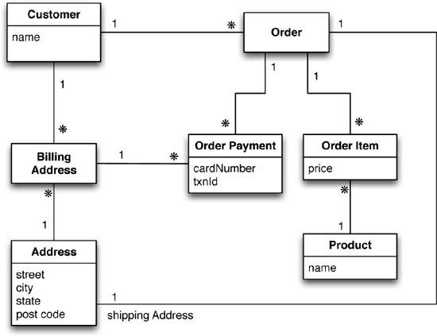
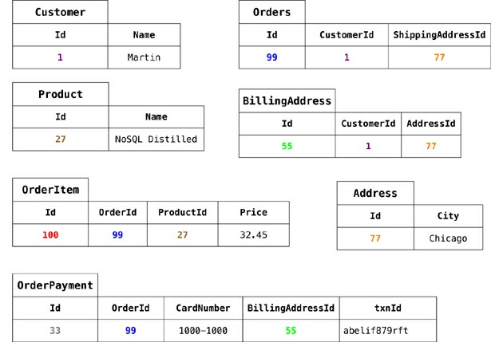
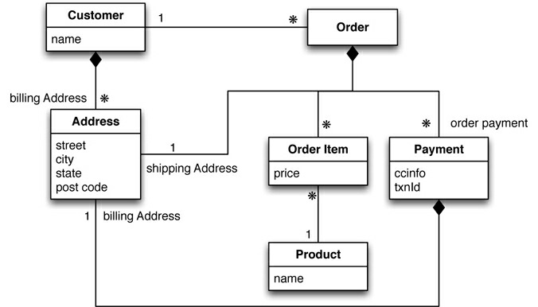
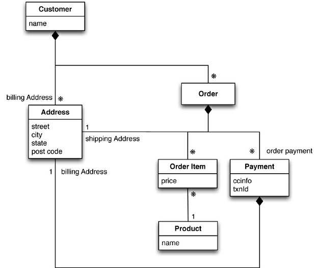
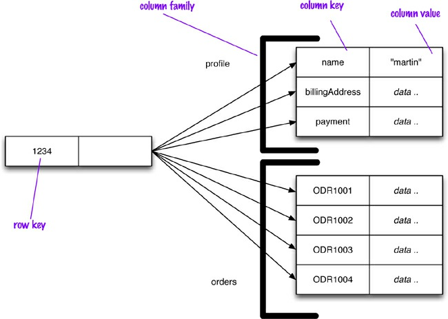

# Chapter 2. Aggregate Data Models

A data model is the model through which we perceive and manipulate our data. For people using a
database, the data model describes how we interact with the data in the database. This is distinct
from a storage model, which describes how the database stores and manipulates the data internally. In
an ideal world, we should be ignorant of the storage model, but in practice we need at least some
inkling of it—primarily to achieve decent performance.

In conversation, the term “data model” often means the model of the specific data in an application.
A developer might point to an entity-relationship diagram of their database and refer to that as their
data model containing customers, orders, products, and the like. However, in this book we’ll mostly
be using “data model” to refer to the model by which the database organizes data—what might be
more formally called a metamodel.

The dominant data model of the last couple of decades is the relational data model, which is best
visualized as a set of tables, rather like a page of a spreadsheet. Each table has rows, with each row
representing some entity of interest. We describe this entity through columns, each having a single
value. A column may refer to another row in the same or different table, which constitutes a
relationship between those entities. (We’re using informal but common terminology when we speak
of tables and rows; the more formal terms would be relations and tuples.)

One of the most obvious shifts with NoSQL is a move away from the relational model. Each
NoSQL solution has a different model that it uses, which we put into four categories widely used in
the NoSQL ecosystem: key-value, document, column-family, and graph. Of these, the first three share
a common characteristic of their data models which we will call aggregate orientation. In this chapter
we’ll explain what we mean by aggregate orientation and what it means for data models.

## 2.1. Aggregates

The relational model takes the information that we want to store and divides it into tuples (rows). A
tuple is a limited data structure: It captures a set of values, so you cannot nest one tuple within another
to get nested records, nor can you put a list of values or tuples within another. This simplicity
underpins the relational model—it allows us to think of all operations as operating on and returning
tuples.

Aggregate orientation takes a different approach. It recognizes that often, you want to operate on
data in units that have a more complex structure than a set of tuples. It can be handy to think in terms
of a complex record that allows lists and other record structures to be nested inside it. As we’ll see,
key-value, document, and column-family databases all make use of this more complex record.
However, there is no common term for this complex record; in this book we use the term “aggregate.”

Aggregate is a term that comes from Domain-Driven Design [Evans]. In Domain-Driven Design, an
**aggregate** is a collection of related objects that we wish to treat as a unit. In particular, it is a unit for
data manipulation and management of consistency. Typically, we like to update aggregates with
atomic operations and communicate with our data storage in terms of aggregates. This definition
matches really well with how key-value, document, and column-family databases work. Dealing in
aggregates makes it much easier for these databases to handle operating on a cluster, since the
aggregate makes a natural unit for replication and sharding. Aggregates are also often easier for
application programmers to work with, since they often manipulate data through aggregate structures.


### **2.1.1. Example of Relations and Aggregates**

At this point, an example may help explain what we’re talking about. Let’s assume we have to build
an e-commerce website; we are going to be selling items directly to customers over the web, and we
will have to store information about users, our product catalog, orders, shipping addresses, billing
addresses, and payment data. We can use this scenario to model the data using a relation data store as
well as NoSQL data stores and talk about their pros and cons. For a relational database, we might
start with a data model shown in Figure 2.1.



**Figure 2.1. Data model oriented around a relational database (using UML notation FowlerUML))**

Figure 2.2 presents some sample data for this model.



**Figure 2.2. Typical data using RDBMS data model**


As we’re good relational soldiers, everything is properly normalized, so that no data is repeated in
multiple tables. We also have referential integrity. A realistic order system would naturally be more
involved than this, but this is the benefit of the rarefied air of a book.

Now let’s see how this model might look when we think in more aggregate-oriented terms (Figure
2.3).



**Figure 2.3. An aggregate data model**

Again, we have some sample data, which we’ll show in JSON format as that’s a common representation for data in NoSQL land.

```javascript
// in customers
{
    "id":1,
    "name":"Martin",
    "billingAddress":[{"city":"Chicago"}]
}

// in orders
{
    "id": 99,
    "customerId": 1,
    "orderItems": [
        {
            "productId":27,
            "price": 32.45,
            "productName": "NoSQL Distilled"
        }
    ],
    "shippingAddress":[{"city":"Chicago"}]
    "orderPayment":[
        {
            "ccinfo":"1000-1000-1000-1000",
            "txnId":"abelif879rft",
            "billingAddress": {"city": "Chicago"}
        }
    ],
}
```

In this model, we have two main aggregates: customer and order. We’ve used the black-diamond
composition marker in UML to show how data fits into the aggregation structure. The customer
contains a list of billing addresses; the order contains a list of order items, a shipping address, and
payments. The payment itself contains a billing address for that payment.

A single logical address record appears three times in the example data, but instead of using IDs
it’s treated as a value and copied each time. This fits the domain where we would not want the
shipping address, nor the payment’s billing address, to change. In a relational database, we would
ensure that the address rows aren’t updated for this case, making a new row instead. With aggregates,
we can copy the whole address structure into the aggregate as we need to.

The link between the customer and the order isn’t within either aggregate—it’s a relationship
between aggregates. Similarly, the link from an order item would cross into a separate aggregate
structure for products, which we haven’t gone into. We’ve shown the product name as part of the
order item here—this kind of denormalization is similar to the tradeoffs with relational databases, but
is more common with aggregates because we want to minimize the number of aggregates we access
during a data interaction.

The important thing to notice here isn’t the particular way we’ve drawn the aggregate boundary so
much as the fact that you have to think about accessing that data—and make that part of your thinking
when developing the application data model. Indeed we could draw our aggregate boundaries
differently, putting all the orders for a customer into the customer aggregate (Figure 2.4).




**Figure 2.4. Embed all the objects for customer and the customer’s orders**

Using the above data model, an example Customer and Order would look like this:

```json
// in customers
{
    "customer": {
        "id": 1,
        "name": "Martin",
        "billingAddress": [{"city": "Chicago"}],
        "orders": [
            {
                "id":99,
                "customerId":1,
                "orderItems":[
                    {
                        "productId":27,
                        "price": 32.45,
                        "productName": "NoSQL Distilled"
                    }
                ],
                "shippingAddress":[{"city":"Chicago"}],
                "orderPayment":[
                    {
                    "ccinfo":"1000-1000-1000-1000",
                    "txnId":"abelif879rft",
                    "billingAddress": {"city": "Chicago"}
                    }
                ],
            }
        ]
    }
}
```

Like most things in modeling, there’s no universal answer for how to draw your aggregate
boundaries. It depends entirely on how you tend to manipulate your data. If you tend to access a
customer together with all of that customer’s orders at once, then you would prefer a single aggregate.
However, if you tend to focus on accessing a single order at a time, then you should prefer having
separate aggregates for each order. Naturally, this is very context-specific; some applications will
prefer one or the other, even within a single system, which is exactly why many people prefer
aggregate ignorance.

### **2.1.2. Consequences of Aggregate Orientation**

While the relational mapping captures the various data elements and their relationships reasonably
well, it does so without any notion of an aggregate entity. In our domain language, we might say that
an order consists of order items, a shipping address, and a payment. This can be expressed in the
relational model in terms of foreign key relationships—but there is nothing to distinguish
relationships that represent aggregations from those that don’t. As a result, the database can’t use a
knowledge of aggregate structure to help it store and distribute the data.

Various data modeling techniques have provided ways of marking aggregate or composite
structures. The problem, however, is that modelers rarely provide any semantics for what makes an
aggregate relationship different from any other; where there are semantics, they vary. When working
with aggregate-oriented databases, we have a clearer semantics to consider by focusing on the unit of
interaction with the data storage. It is, however, not a logical data property: It’s all about how the
data is being used by applications—a concern that is often outside the bounds of data modeling.

Relational databases have no concept of aggregate within their data model, so we call them
**aggregate-ignorant**. In the NoSQL world, graph databases are also aggregate-ignorant. Being
aggregate-ignorant is not a bad thing. It’s often difficult to draw aggregate boundaries well,
particularly if the same data is used in many different contexts. An order makes a good aggregate
when a customer is making and reviewing orders, and when the retailer is processing orders.
However, if a retailer wants to analyze its product sales over the last few months, then an order
aggregate becomes a trouble. To get to product sales history, you’ll have to dig into every aggregate
in the database. So an aggregate structure may help with some data interactions but be an obstacle for
others. An aggregate-ignorant model allows you to easily look at the data in different ways, so it is a
better choice when you don’t have a primary structure for manipulating your data.

The clinching reason for aggregate orientation is that it helps greatly with running on a cluster,
which as you’ll remember is the killer argument for the rise of NoSQL. If we’re running on a cluster,
we need to minimize how many nodes we need to query when we are gathering data. By explicitly
including aggregates, we give the database important information about which bits of data will be
manipulated together, and thus should live on the same node.

Aggregates have an important consequence for transactions. Relational databases allow you to
manipulate any combination of rows from any tables in a single transaction. Such transactions are
called **ACID transactions** : Atomic, Consistent, Isolated, and Durable. ACID is a rather contrived
acronym; the real point is the atomicity: Many rows spanning many tables are updated as a single
operation. This operation either succeeds or fails in its entirety, and concurrent operations are isolated from each other so they cannot see a partial update.

It’s often said that NoSQL databases don’t support ACID transactions and thus sacrifice
consistency. This is a rather sweeping simplification. In general, it’s true that aggregate-oriented
databases don’t have ACID transactions that span multiple aggregates. Instead, they support atomic
manipulation of a single aggregate at a time. This means that if we need to manipulate multiple
aggregates in an atomic way, we have to manage that ourselves in the application code. In practice,
we find that most of the time we are able to keep our atomicity needs to within a single aggregate;
indeed, that’s part of the consideration for deciding how to divide up our data into aggregates. We
should also remember that graph and other aggregate-ignorant databases usually do support ACID
transactions similar to relational databases. Above all, the topic of consistency is much more
involved than whether a database is ACID or not, as we’ll explore in Chapter 5.

## 2.2. Key-Value and Document Data Models

We said earlier on that key-value and document databases were strongly aggregate-oriented. What we
meant by this was that we think of these databases as primarily constructed through aggregates. Both
of these types of databases consist of lots of aggregates with each aggregate having a key or ID that’s
used to get at the data.

The two models differ in that in a key-value database, the aggregate is opaque to the database—just
some big blob of mostly meaningless bits. In contrast, a document database is able to see a structure
in the aggregate. The advantage of opacity is that we can store whatever we like in the aggregate. The
database may impose some general size limit, but other than that we have complete freedom. A
document database imposes limits on what we can place in it, defining allowable structures and
types. In return, however, we get more flexibility in access.

With a key-value store, we can only access an aggregate by lookup based on its key. With a
document database, we can submit queries to the database based on the fields in the aggregate, we
can retrieve part of the aggregate rather than the whole thing, and database can create indexes based
on the contents of the aggregate.

In practice, the line between key-value and document gets a bit blurry. People often put an ID field
in a document database to do a key-value style lookup. Databases classified as key-value databases
may allow you structures for data beyond just an opaque aggregate. For example, Riak allows you to
add metadata to aggregates for indexing and interaggregate links, Redis allows you to break down the
aggregate into lists or sets. You can support querying by integrating search tools such as Solr. As an
example, Riak includes a search facility that uses Solr-like searching on any aggregates that are
stored as JSON or XML structures.

Despite this blurriness, the general distinction still holds. With key-value databases, we expect to
mostly look up aggregates using a key. With document databases, we mostly expect to submit some
form of query based on the internal structure of the document; this might be a key, but it’s more likely
to be something else.

## 2.3. Column-Family Stores

One of the early and influential NoSQL databases was Google’s BigTable [Chang etc.]. Its name
conjured up a tabular structure which it realized with sparse columns and no schema. As you’ll soon
see, it doesn’t help to think of this structure as a table; rather, it is a two-level map. But, however you
think about the structure, it has been a model that influenced later databases such as HBase and


Cassandra.

These databases with a bigtable-style data model are often referred to as column stores, but that
name has been around for a while to describe a different animal. Pre-NoSQL column stores, such as
C-Store [C-Store], were happy with SQL and the relational model. The thing that made them different
was the way in which they physically stored data. Most databases have a row as a unit of storage
which, in particular, helps write performance. However, there are many scenarios where writes are
rare, but you often need to read a few columns of many rows at once. In this situation, it’s better to
store groups of columns for all rows as the basic storage unit—which is why these databases are
called column stores.

Bigtable and its offspring follow this notion of storing groups of columns (column families)
together, but part company with C-Store and friends by abandoning the relational model and SQL. In
this book, we refer to this class of databases as column-family databases.

Perhaps the best way to think of the column-family model is as a two-level aggregate structure. As
with key-value stores, the first key is often described as a row identifier, picking up the aggregate of
interest. The difference with column-family structures is that this row aggregate is itself formed of a
map of more detailed values. These second-level values are referred to as columns. As well as
accessing the row as a whole, operations also allow picking out a particular column, so to get a
particular customer’s name from Figure 2.5 you could do something like get('1234', 'name').



**Figure 2.5. Representing customer information in a column-family structure**

Column-family databases organize their columns into column families. Each column has to be part
of a single column family, and the column acts as unit for access, with the assumption that data for a
particular column family will be usually accessed together.

This also gives you a couple of ways to think about how the data is structured.
- Row-oriented: Each row is an aggregate (for example, customer with the ID of 1234) with column families representing useful chunks of data (profile, order history) within that aggregate.
- Column-oriented: Each column family defines a record type (e.g., customer profiles) with rows for each of the records. You then think of a row as the join of records in all column families.

This latter aspect reflects the columnar nature of column-family databases. Since the database knows about these common groupings of data, it can use this information for its storage and access behavior. Even though a document database declares some structure to the database, each document is still seen as a single unit. Column families give a two-dimensional quality to column-family databases.

This terminology is as established by Google Bigtable and HBase, but Cassandra looks at things
slightly differently. A row in Cassandra only occurs in one column family, but that column family may
contain supercolumns—columns that contain nested columns. The supercolumns in Cassandra are the
best equivalent to the classic Bigtable column families.

It can still be confusing to think of column-families as tables. You can add any column to any row,
and rows can have very different column keys. While new columns are added to rows during regular
database access, defining new column families is much rarer and may involve stopping the database
for it to happen.

The example of Figure 2.5 illustrates another aspect of column-family databases that may be
unfamiliar for people used to relational tables: the orders column family. Since columns can be
added freely, you can model a list of items by making each item a separate column. This is very odd if
you think of a column family as a table, but quite natural if you think of a column-family row as an
aggregate. Cassandra uses the terms “wide” and “skinny.” **Skinny rows** have few columns with the
same columns used across the many different rows. In this case, the column family defines a record
type, each row is a record, and each column is a field. A **wide row** has many columns (perhaps
thousands), with rows having very different columns. A wide column family models a list, with each
column being one element in that list.

A consequence of wide column families is that a column family may define a sort order for its
columns. This way we can access orders by their order key and access ranges of orders by their keys.
While this might not be useful if we keyed orders by their IDs, it would be if we made the key out of a
concatenation of date and ID (e.g., 20111027-1001).

Although it’s useful to distinguish column families by their wide or skinny nature, there’s no
technical reason why a column family cannot contain both field-like columns and list-like columns—
although doing this would confuse the sort ordering.

## 2.4. Summarizing Aggregate-Oriented Databases

At this point, we’ve covered enough material to give you a reasonable overview of the three different
styles of aggregate-oriented data models and how they differ.

What they all share is the notion of an aggregate indexed by a key that you can use for lookup. This
aggregate is central to running on a cluster, as the database will ensure that all the data for an
aggregate is stored together on one node. The aggregate also acts as the atomic unit for updates,
providing a useful, if limited, amount of transactional control.

Within that notion of aggregate, we have some differences. The key-value data model treats the
aggregate as an opaque whole, which means you can only do key lookup for the whole aggregate—


you cannot run a query nor retrieve a part of the aggregate.

The document model makes the aggregate transparent to the database allowing you to do queries
and partial retrievals. However, since the document has no schema, the database cannot act much on
the structure of the document to optimize the storage and retrieval of parts of the aggregate.

Column-family models divide the aggregate into column families, allowing the database to treat
them as units of data within the row aggregate. This imposes some structure on the aggregate but
allows the database to take advantage of that structure to improve its accessibility.

## 2.5. Further Reading

For more on the general concept of aggregates, which are often used with relational databases too,
see [Evans]. The Domain-Driven Design community is the best source for further information about
aggregates—recent information usually appears at [http://domaindrivendesign.org.](http://domaindrivendesign.org.)

## 2.6. Key Points

- An aggregate is a collection of data that we interact with as a unit. Aggregates form the boundaries for ACID operations with the database.
- Key-value, document, and column-family databases can all be seen as forms of aggregate-oriented database.
- Aggregates make it easier for the database to manage data storage over clusters.
- Aggregate-oriented databases work best when most data interaction is done with the same aggregate; aggregate-ignorant databases are better when interactions use data organized in many different formations.