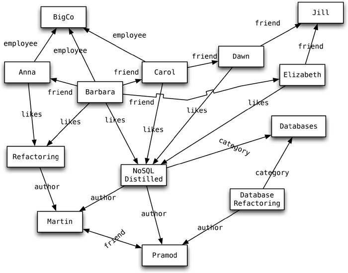
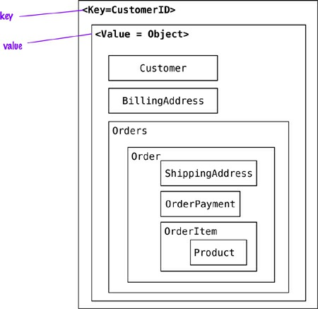
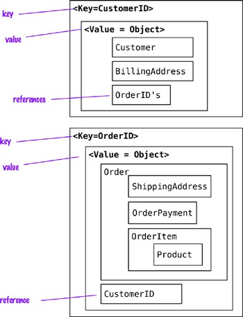
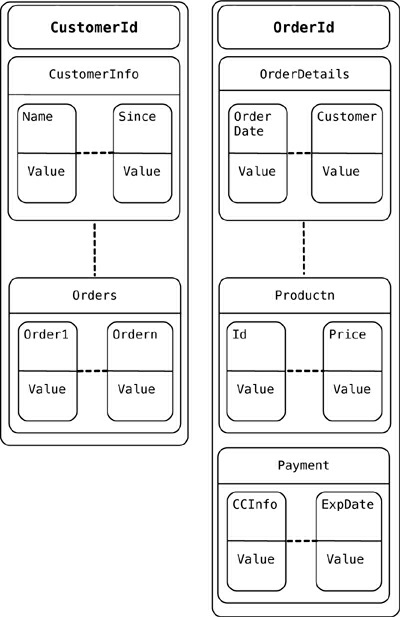
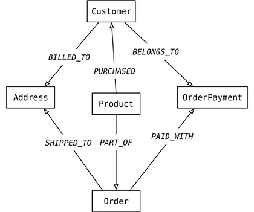

# Chapter 3. More Details on Data Models

So far we’ve covered the key feature in most NoSQL databases: their use of aggregates and how
aggregate-oriented databases model aggregates in different ways. While aggregates are a central part
of the NoSQL story, there is more to the data modeling side than that, and we’ll explore these further
concepts in this chapter.

## 3.1. Relationships

Aggregates are useful in that they put together data that is commonly accessed together. But there are
still lots of cases where data that’s related is accessed differently. Consider the relationship between
a customer and all of his orders. Some applications will want to access the order history whenever
they access the customer; this fits in well with combining the customer with his order history into a
single aggregate. Other applications, however, want to process orders individually and thus model
orders as independent aggregates.

In this case, you’ll want separate order and customer aggregates but with some kind of relationship
between them so that any work on an order can look up customer data. The simplest way to provide
such a link is to embed the ID of the customer within the order’s aggregate data. That way, if you need
data from the customer record, you read the order, ferret out the customer ID, and make another call to
the database to read the customer data. This will work, and will be just fine in many scenarios—but
the database will be ignorant of the relationship in the data. This can be important because there are
times when it’s useful for the database to know about these links.

As a result, many databases—even key-value stores—provide ways to make these relationships
visible to the database. Document stores make the content of the aggregate available to the database to
form indexes and queries. Riak, a key-value store, allows you to put link information in metadata,
supporting partial retrieval and link-walking capability.

An important aspect of relationships between aggregates is how they handle updates. Aggregate-
oriented databases treat the aggregate as the unit of data-retrieval. Consequently, atomicity is only
supported within the contents of a single aggregate. If you update multiple aggregates at once, you
have to deal yourself with a failure partway through. Relational databases help you with this by
allowing you to modify multiple records in a single transaction, providing ACID guarantees while
altering many rows.

All of this means that aggregate-oriented databases become more awkward as you need to operate
across multiple aggregates. There are various ways to deal with this, which we’ll explore later in this
chapter, but the fundamental awkwardness remains.

This may imply that if you have data based on lots of relationships, you should prefer a relational
database over a NoSQL store. While that’s true for aggregate-oriented databases, it’s worth
remembering that relational databases aren’t all that stellar with complex relationships either. While
you can express queries involving joins in SQL, things quickly get very hairy—both with SQL writing
and with the resulting performance—as the number of joins mounts up.

This makes it a good moment to introduce another category of databases that’s often lumped into
the NoSQL pile.

## 3.2. Graph Databases


Graph databases are an odd fish in the NoSQL pond. Most NoSQL databases were inspired by the
need to run on clusters, which led to aggregate-oriented data models of large records with simple
connections. Graph databases are motivated by a different frustration with relational databases and
thus have an opposite model—small records with complex interconnections, something like Figure
3.1.



**Figure 3.1. An example graph structure**

In this context, a graph isn’t a bar chart or histogram; instead, we refer to a graph data structure of
nodes connected by edges.

In Figure 3.1 we have a web of information whose nodes are very small (nothing more than a name) but there is a rich structure of interconnections between them. With this structure, we can ask questions such as “*find the books in the Databases category that are written by someone whom a friend of mine likes.*”

Graph databases specialize in capturing this sort of information—but on a much larger scale than a
readable diagram could capture. This is ideal for capturing any data consisting of complex
relationships such as social networks, product preferences, or eligibility rules.

The fundamental data model of a graph database is very simple: nodes connected by edges (also
called arcs). Beyond this essential characteristic there is a lot of variation in data models—in
particular, what mechanisms you have to store data in your nodes and edges. A quick sample of some
current capabilities illustrates this variety of possibilities: FlockDB is simply nodes and edges with
no mechanism for additional attributes; Neo4J allows you to attach Java objects as properties to


nodes and edges in a schemaless fashion (“Features,” p. 113 ); Infinite Graph stores your Java objects,
which are subclasses of its built-in types, as nodes and edges.

Once you have built up a graph of nodes and edges, a graph database allows you to query that
network with query operations designed with this kind of graph in mind. This is where the important
differences between graph and relational databases come in. Although relational databases can
implement relationships using foreign keys, the joins required to navigate around can get quite
expensive—which means performance is often poor for highly connected data models. Graph
databases make traversal along the relationships very cheap. A large part of this is because graph
databases shift most of the work of navigating relationships from query time to insert time. This
naturally pays off for situations where querying performance is more important than insert speed.

Most of the time you find data by navigating through the network of edges, with queries such as
“tell me all the things that both Anna and Barbara like.” You do need a starting place, however, so
usually some nodes can be indexed by an attribute such as ID. So you might start with an ID lookup
(i.e., look up the people named “Anna” and “Barbara”) and then start using the edges. Still, graph
databases expect most of your query work to be navigating relationships.

The emphasis on relationships makes graph databases very different from aggregate-oriented
databases. This data model difference has consequences in other aspects, too; you’ll find such
databases are more likely to run on a single server rather than distributed across clusters. ACID
transactions need to cover multiple nodes and edges to maintain consistency. The only thing they have
in common with aggregate-oriented databases is their rejection of the relational model and an upsurge
in attention they received around the same time as the rest of the NoSQL field.

## 3.3. Schemaless Databases

A common theme across all the forms of NoSQL databases is that they are schemaless. When you
want to store data in a relational database, you first have to define a schema—a defined structure for
the database which says what tables exist, which columns exist, and what data types each column can
hold. Before you store some data, you have to have the schema defined for it.

With NoSQL databases, storing data is much more casual. A key-value store allows you to store
any data you like under a key. A document database effectively does the same thing, since it makes no
restrictions on the structure of the documents you store. Column-family databases allow you to store
any data under any column you like. Graph databases allow you to freely add new edges and freely
add properties to nodes and edges as you wish.

Advocates of schemalessness rejoice in this freedom and flexibility. With a schema, you have to
figure out in advance what you need to store, but that can be hard to do. Without a schema binding
you, you can easily store whatever you need. This allows you to easily change your data storage as
you learn more about your project. You can easily add new things as you discover them. Furthermore,
if you find you don’t need some things anymore, you can just stop storing them, without worrying
about losing old data as you would if you delete columns in a relational schema.

As well as handling changes, a schemaless store also makes it easier to deal with **nonuniform
data** : data where each record has a different set of fields. A schema puts all rows of a table into a
straightjacket, which becomes awkward if you have different kinds of data in different rows. You
either end up with lots of columns that are usually null (a sparse table), or you end up with
meaningless columns like custom column 4. Schemalessness avoids this, allowing each record to


contain just what it needs—no more, no less.

Schemalessness is appealing, and it certainly avoids many problems that exist with fixed-schema
databases, but it brings some problems of its own. If all you are doing is storing some data and
displaying it in a report as a simple list of fieldName: value lines then a schema is only going to
get in the way. But usually we do with our data more than this, and we do it with programs that need
to know that the billing address is called billingAddress and not addressForBilling and that the
quantify field is going to be an integer 5 and not five.

The vital, if sometimes inconvenient, fact is that whenever we write a program that accesses data,
that program almost always relies on some form of implicit schema. Unless it just says something like

```js
//pseudo code
foreach (Record r in records) {
    foreach (Field f in r.fields) {
        print (f.name, f.value)
    }
}
```

it will assume that certain field names are present and carry data with a certain meaning, and assume
something about the type of data stored within that field. Programs are not humans; they cannot read
“qty” and infer that that must be the same as “quantity”—at least not unless we specifically program
them to do so. So, however schemaless our database is, there is usually an implicit schema present.
This **implicit schema** is a set of assumptions about the data’s structure in the code that manipulates the
data.

Having the implicit schema in the application code results in some problems. It means that in order
to understand what data is present you have to dig into the application code. If that code is well
structured you should be able to find a clear place from which to deduce the schema. But there are no
guarantees; it all depends on how clear the application code is. Furthermore, the database remains
ignorant of the schema—it can’t use the schema to help it decide how to store and retrieve data
efficiently. It can’t apply its own validations upon that data to ensure that different applications don’t
manipulate data in an inconsistent way.

These are the reasons why relational databases have a fixed schema, and indeed the reasons why
most databases have had fixed schemas in the past. Schemas have value, and the rejection of schemas
by NoSQL databases is indeed quite startling.

Essentially, a schemaless database shifts the schema into the application code that accesses it. This
becomes problematic if multiple applications, developed by different people, access the same
database. These problems can be reduced with a couple of approaches. One is to encapsulate all
database interaction within a single application and integrate it with other applications using web
services. This fits in well with many people’s current preference for using web services for
integration. Another approach is to clearly delineate different areas of an aggregate for access by
different applications. These could be different sections in a document database or different column
families an a column-family database.

Although NoSQL fans often criticize relational schemas for having to be defined up front and being
inflexible, that’s not really true. Relational schemas can be changed at any time with standard SQL
commands. If necessary, you can create new columns in an ad-hoc way to store nonuniform data. We
have only rarely seen this done, but it worked reasonably well where we have. Most of the time,


however, nonuniformity in your data is a good reason to favor a schemaless database.

Schemalessness does have a big impact on changes of a database’s structure over time, particularly
for more uniform data. Although it’s not practiced as widely as it ought to be, changing a relational
database’s schema can be done in a controlled way. Similarly, you have to exercise control when
changing how you store data in a schemaless database so that you can easily access both old and new
data. Furthermore, the flexibility that schemalessness gives you only applies within an aggregate—if
you need to change your aggregate boundaries, the migration is every bit as complex as it is in the
relational case. We’ll talk more about database migration later (“Schema Migrations,” p. 123 ).

## 3.4. Materialized Views

When we talked about aggregate-oriented data models, we stressed their advantages. If you want to
access orders, it’s useful to have all the data for an order contained in a single aggregate that can be
stored and accessed as a unit. But aggregate-orientation has a corresponding disadvantage: What
happens if a product manager wants to know how much a particular item has sold over the last couple
of weeks? Now the aggregate-orientation works against you, forcing you to potentially read every
order in the database to answer the question. You can reduce this burden by building an index on the
product, but you’re still working against the aggregate structure.

Relational databases have an advantage here because their lack of aggregate structure allows them
to support accessing data in different ways. Furthermore, they provide a convenient mechanism that
allows you to look at data differently from the way it’s stored—views. A view is like a relational
table (it is a relation) but it’s defined by computation over the base tables. When you access a view,
the database computes the data in the view—a handy form of encapsulation.

Views provide a mechanism to hide from the client whether data is derived data or base data—but
can’t avoid the fact that some views are expensive to compute. To cope with this, **materialized views**
were invented, which are views that are computed in advance and cached on disk. Materialized
views are effective for data that is read heavily but can stand being somewhat stale.

Although NoSQL databases don’t have views, they may have precomputed and cached queries, and
they reuse the term “materialized view” to describe them. It’s also much more of a central aspect for
aggregate-oriented databases than it is for relational systems, since most applications will have to
deal with some queries that don’t fit well with the aggregate structure. (Often, NoSQL databases
create materialized views using a map-reduce computation, which we’ll talk about in Chapter 7.)

There are two rough strategies to building a materialized view. The first is the eager approach
where you update the materialized view at the same time you update the base data for it. In this case,
adding an order would also update the purchase history aggregates for each product. This approach is
good when you have more frequent reads of the materialized view than you have writes and you want
the materialized views to be as fresh as possible. The application database (p. 7 ) approach is
valuable here as it makes it easier to ensure that any updates to base data also update materialized
views.

If you don’t want to pay that overhead on each update, you can run batch jobs to update the
materialized views at regular intervals. You’ll need to understand your business requirements to
assess how stale your materialized views can be.

You can build materialized views outside of the database by reading the data, computing the view,
and saving it back to the database. More often databases will support building materialized views


themselves. In this case, you provide the computation that needs to be done, and the database executes
the computation when needed according to some parameters that you configure. This is particularly
handy for eager updates of views with incremental map-reduce (“Incremental Map-Reduce,” p. 76 ).

Materialized views can be used within the same aggregate. An order document might include an
order summary element that provides summary information about the order so that a query for an
order summary does not have to transfer the entire order document. Using different column families
for materialized views is a common feature of column-family databases. An advantage of doing this is
that it allows you to update the materialized view within the same atomic operation.

## 3.5. Modeling for Data Access

As mentioned earlier, when modeling data aggregates we need to consider how the data is going to be
read as well as what are the side effects on data related to those aggregates.

Let’s start with the model where all the data for the customer is embedded using a key-value store
(see Figure 3.2).



**Figure 3.2. Embed all the objects for customer and their orders.**

In this scenario, the application can read the customer’s information and all the related data by
using the key. If the requirements are to read the orders or the products sold in each order, the whole
object has to be read and then parsed on the client side to build the results. When references are
needed, we could switch to document stores and then query inside the documents, or even change the
data for the key-value store to split the value object into Customer and Order objects and then
maintain these objects’ references to each other.

With the references (see Figure 3.3), we can now find the orders independently from the
Customer, and with the orderId reference in the Customer we can find all Orders for the
Customer. Using aggregates this way allows for read optimization, but we have to push the orderId reference into Customer every time with a new Order.


```json
// Customer object
{
    "customerId": 1,
    "customer": {
        "name": "Martin",
        "billingAddress": [{"city": "Chicago"}],
        "payment": [{"type": "debit","ccinfo": "1000-1000-1000-1000"}],
        "orders":[{"orderId":99}]
    }
}

// Order object
{
    "customerId": 1,
    "orderId": 99,
    "order":{
        "orderDate":"Nov-20-2011",
        "orderItems":[{"productId":27, "price": 32.45}],
        "orderPayment":[{"ccinfo":"1000-1000-1000-1000",
        "txnId":"abelif879rft"}],
        "shippingAddress":{"city":"Chicago"}
    }
}
```



**Figure 3.3. Customer is stored separately from Order.**

Aggregates can also be used to obtain analytics; for example, an aggregate update may fill in
information on which Orders have a given Product in them. This denormalization of the data allows
for fast access to the data we are interested in and is the basis for **Real Time BI** or **Real Time**


**Analytics** where enterprises don’t have to rely on end-of-the-day batch runs to populate data
warehouse tables and generate analytics; now they can fill in this type of data, for multiple types of
requirements, when the order is placed by the customer.

```java
{
    "itemid": 27,
    "orders": {99,545,897,678}
}
{
    "itemid": 29,
    "orders": {199,545,704,819}
}
```

In document stores, since we can query inside documents, removing references to Orders from the
Customer object is possible. This change allows us to not update the Customer object when new
orders are placed by the Customer.

**Click here to view code image**

```json
// Customer object
{
    "customerId": 1,
    "name": "Martin",
    "billingAddress": [{"city": "Chicago"}],
    "payment": [
        {"type": "debit","ccinfo": "1000-1000-1000-1000"}
    ]
}
// Order object
{
    "orderId": 99,
    "customerId": 1,
    "orderDate":"Nov-20-2011",
    "orderItems":[{"productId":27, "price": 32.45}],
    "orderPayment":[{"ccinfo":"1000-1000-1000-1000",
    "txnId":"abelif879rft"}],
    "shippingAddress":{"city":"Chicago"}
}
```

Since document data stores allow you to query by attributes inside the document, searches such as
“find all orders that include the _Refactoring Databases_ product” are possible, but the decision to
create an aggregate of items and orders they belong to is not based on the database’s query capability
but on the read optimization desired by the application.

When modeling for column-family stores, we have the benefit of the columns being ordered,
allowing us to name columns that are frequently used so that they are fetched first. When using the
column families to model the data, it is important to remember to do it per your query requirements
and not for the purpose of writing; the general rule is to make it easy to query and denormalize the
data during write.

As you can imagine, there are multiple ways to model the data; one way is to store the Customer
and Order in different _column-family_ families (see Figure 3.4). Here, it is important to note the
reference to all the orders placed by the customer are in the Customer column family. Similar other
denormalizations are generally done so that query (read) performance is improved.



**Figure 3.4. Conceptual view into a column data store**

When using graph databases to model the same data, we model all objects as nodes and relations
within them as relationships; these relationships have types and directional significance.

Each node has independent relationships with other nodes. These relationships have names like
_PURCHASED_ , _PAID_WITH_ , or _BELONGS_TO_ (see Figure 3.5); these relationship names let you
traverse the graph. Let’s say you want to find all the Customers who _PURCHASED_ a product with the
name _Refactoring Database_. All we need to do is query for the product node Refactoring
Databases and look for all the Customers with the incoming _PURCHASED_ relationship.



**Figure 3.5. Graph model of e-commerce data**

This type of relationship traversal is very easy with graph databases. It is especially convenient
when you need to use the data to recommend products to users or to find patterns in actions taken by
users.

## 3.6. Key Points

- Aggregate-oriented databases make inter-aggregate relationships more difficult to handle than     intra-aggregate relationships.
- Graph databases organize data into node and edge graphs; they work best for data that has complex relationship structures.
- Schemaless databases allow you to freely add fields to records, but there is usually an implicit schema expected by users of the data.
- Aggregate-oriented databases often compute materialized views to provide data organized differently from their primary aggregates. This is often done with map-reduce computations.

