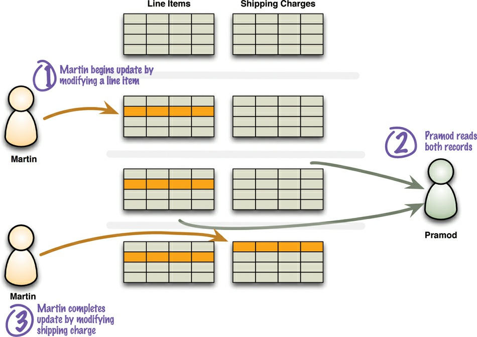
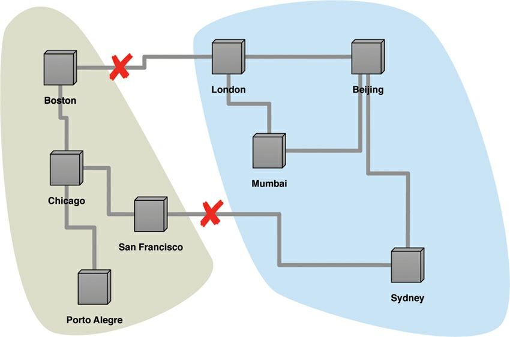

# Chapter 5. Consistency

One of the biggest changes from a centralized relational database to a cluster-oriented NoSQL
database is in how you think about consistency. Relational databases try to exhibit **strong
consistency** by avoiding all the various inconsistencies that we’ll shortly be discussing. Once you
start looking at the NoSQL world, phrases such as “CAP theorem” and “eventual consistency”
appear, and as soon as you start building something you have to think about what sort of consistency
you need for your system.

Consistency comes in various forms, and that one word covers a myriad of ways errors can creep
into your life. So we’re going to begin by talking about the various shapes consistency can take. After
that we’ll discuss why you may want to relax consistency (and its big sister, durability).

### 5.1. Update Consistency

We’ll begin by considering updating a telephone number. Coincidentally, Martin and Pramod are
looking at the company website and notice that the phone number is out of date. Implausibly, they both
have update access, so they both go in at the same time to update the number. To make the example
interesting, we’ll assume they update it slightly differently, because each uses a slightly different
format. This issue is called a **write-write conflict** : two people updating the same data item at the
same time.

When the writes reach the server, the server will **serialize** them—decide to apply one, then the
other. Let’s assume it uses alphabetical order and picks Martin’s update first, then Pramod’s. Without
any concurrency control, Martin’s update would be applied and immediately overwritten by
Pramod’s. In this case Martin’s is a **lost update**. Here the lost update is not a big problem, but often it is. We see this as a failure of consistency because Pramod’s update was based on the state before Martin’s update, yet was applied after it.

Approaches for maintaining consistency in the face of concurrency are often described as
pessimistic or optimistic. A **pessimistic** approach works by preventing conflicts from occurring; an
**optimistic** approach lets conflicts occur, but detects them and takes action to sort them out. For update conflicts, the most common pessimistic approach is to have write locks, so that in order to change a value you need to acquire a lock, and the system ensures that only one client can get a lock at a time. 

So Martin and Pramod would both attempt to acquire the write lock, but only Martin (the first one)
would succeed. Pramod would then see the result of Martin’s write before deciding whether to make
his own update.

A common optimistic approach is a **conditional update** where any client that does an update tests
the value just before updating it to see if it’s changed since his last read. In this case, Martin’s update would succeed but Pramod’s would fail. The error would let Pramod know that he should look at the
value again and decide whether to attempt a further update.

Both the pessimistic and optimistic approaches that we’ve just described rely on a consistent
serialization of the updates. With a single server, this is obvious—it has to choose one, then the other.

But if there’s more than one server, such as with peer-to-peer replication, then two nodes might apply
the updates in a different order, resulting in a different value for the telephone number on each peer.
Often, when people talk about concurrency in distributed systems, they talk about sequential
consistency—ensuring that all nodes apply operations in the same order.

There is another optimistic way to handle a write-write conflict—save both updates and record
that they are in conflict. This approach is familiar to many programmers from version control systems,
particularly distributed version control systems that by their nature will often have conflicting
commits. The next step again follows from version control: You have to merge the two updates
somehow. Maybe you show both values to the user and ask them to sort it out—this is what happens if
you update the same contact on your phone and your computer. Alternatively, the computer may be
able to perform the merge itself; if it was a phone formatting issue, it may be able to realize that and
apply the new number with the standard format. Any automated merge of write-write conflicts is
highly domain-specific and needs to be programmed for each particular case.

Often, when people first encounter these issues, their reaction is to prefer pessimistic concurrency
because they are determined to avoid conflicts. While in some cases this is the right answer, there is
always a tradeoff. Concurrent programming involves a fundamental tradeoff between safety (avoiding
errors such as update conflicts) and liveness (responding quickly to clients). Pessimistic approaches
often severely degrade the responsiveness of a system to the degree that it becomes unfit for its
purpose. This problem is made worse by the danger of errors—pessimistic concurrency often leads
to deadlocks, which are hard to prevent and debug.

Replication makes it much more likely to run into write-write conflicts. If different nodes have
different copies of some data which can be independently updated, then you’ll get conflicts unless you
take specific measures to avoid them. Using a single node as the target for all writes for some data
makes it much easier to maintain update consistency. Of the distribution models we discussed earlier,
all but peer-to-peer replication do this.

### 5.2. Read Consistency

Having a data store that maintains update consistency is one thing, but it doesn’t guarantee that
readers of that data store will always get consistent responses to their requests. Let’s imagine we
have an order with line items and a shipping charge. The shipping charge is calculated based on the
line items in the order. If we add a line item, we thus also need to recalculate and update the shipping
charge. In a relational database, the shipping charge and line items will be in separate tables. The
danger of inconsistency is that Martin adds a line item to his order, Pramod then reads the line items
and shipping charge, and then Martin updates the shipping charge. This is an **inconsistent read** or
**read-write conflict** : In Figure 5.1 Pramod has done a read in the middle of Martin’s write.

**Figure 5.1. A read-write conflict in logical consistency**

We refer to this type of consistency as **logical consistency** : ensuring that different data items make sense together. To avoid a logically inconsistent read-write conflict, relational databases support the notion of transactions. Providing Martin wraps his two writes in a transaction, the system guarantees that Pramod will either read both data items before the update or both after the update.

A common claim we hear is that NoSQL databases don’t support transactions and thus can’t be
consistent. Such claim is mostly wrong because it glosses over lots of important details. Our first
clarification is that any statement about lack of transactions usually only applies to some NoSQL
databases, in particular the aggregate-oriented ones. In contrast, graph databases tend to support
ACID transactions just the same as relational databases.

Secondly, aggregate-oriented databases do support atomic updates, but only within a single
aggregate. This means that you will have logical consistency within an aggregate but not between
aggregates. So in the example, you could avoid running into that inconsistency if the order, the
delivery charge, and the line items are all part of a single order aggregate.

Of course not all data can be put in the same aggregate, so any update that affects multiple
aggregates leaves open a time when clients could perform an inconsistent read. The length of time an
inconsistency is present is called the **inconsistency window**. A NoSQL system may have a quite short
inconsistency window: As one data point, Amazon’s documentation says that the inconsistency
window for its SimpleDB service is usually less than a second.

This example of a logically inconsistent read is the classic example that you’ll see in any book that
touches database programming. Once you introduce replication, however, you get a whole new kind
of inconsistency. Let’s imagine there’s one last hotel room for a desirable event. The hotel
reservation system runs on many nodes. Martin and Cindy are a couple considering this room, but they
are discussing this on the phone because Martin is in London and Cindy is in Boston. Meanwhile
Pramod, who is in Mumbai, goes and books that last room. That updates the replicated room
availability, but the update gets to Boston quicker than it gets to London. When Martin and Cindy fire
up their browsers to see if the room is available, Cindy sees it booked and Martin sees it free. This is
another inconsistent read—but it’s a breach of a different form of consistency we call **replication
consistency** : ensuring that the same data item has the same value when read from different replicas
(see Figure 5.2).

**Figure 5.2. An example of replication inconsistency**

Eventually, of course, the updates will propagate fully, and Martin will see the room is fully
booked. Therefore this situation is generally referred to as **eventually consistent** , meaning that at any time nodes may have replication inconsistencies but, if there are no further updates, eventually all nodes will be updated to the same value. Data that is out of date is generally referred to as **stale** , which reminds us that a cache is another form of replication—essentially following the master-slave distribution model.

Although replication consistency is independent from logical consistency, replication can
exacerbate a logical inconsistency by lengthening its inconsistency window. Two different updates on
the master may be performed in rapid succession, leaving an inconsistency window of milliseconds.
But delays in networking could mean that the same inconsistency window lasts for much longer on a
slave.

Consistency guarantees aren’t something that’s global to an application. You can usually specify the level of consistency you want with individual requests. This allows you to use weak consistency
most of the time when it isn’t an issue, but request strong consistency when it is.

The presence of an inconsistency window means that different people will see different things at
the same time. If Martin and Cindy are looking at rooms while on a transatlantic call, it can cause
confusion. It’s more common for users to act independently, and then this is not a problem. But
inconsistency windows can be particularly problematic when you get inconsistencies with yourself.
Consider the example of posting comments on a blog entry. Few people are going to worry about
inconsistency windows of even a few minutes while people are typing in their latest thoughts. Often,
systems handle the load of such sites by running on a cluster and load-balancing incoming requests to
different nodes. Therein lies a danger: You may post a message using one node, then refresh your
browser, but the refresh goes to a different node which hasn’t received your post yet—and it looks
like your post was lost.

In situations like this, you can tolerate reasonably long inconsistency windows, but you need **read-
your-writes consistency** which means that, once you’ve made an update, you’re guaranteed to
continue seeing that update. One way to get this in an otherwise eventually consistent system is to
provide **session consistency** : Within a user’s session there is read-your-writes consistency. This
does mean that the user may lose that consistency should their session end for some reason or should
the user access the same system simultaneously from different computers, but these cases are
relatively rare.

There are a couple of techniques to provide session consistency. A common way, and often the
easiest way, is to have a **sticky session** : a session that’s tied to one node (this is also called **session affinity** ). A sticky session allows you to ensure that as long as you keep read-your-writes consistency on a node, you’ll get it for sessions too. The downside is that sticky sessions reduce the ability of the load balancer to do its job.

Another approach for session consistency is to use version stamps (“Version Stamps,” p. 61 ) and
ensure every interaction with the data store includes the latest version stamp seen by a session. The
server node must then ensure that it has the updates that include that version stamp before responding
to a request.

Maintaining session consistency with sticky sessions and master-slave replication can be awkward
if you want to read from the slaves to improve read performance but still need to write to the master.
One way of handling this is for writes to be sent the slave, who then takes responsibility for
forwarding them to the master while maintaining session consistency for its client. Another approach
is to switch the session to the master temporarily when doing a write, just long enough that reads are
done from the master until the slaves have caught up with the update.

We’re talking about replication consistency in the context of a data store, but it’s also an important
factor in overall application design. Even a simple database system will have lots of occasions
where data is presented to a user, the user cogitates, and then updates that data. It’s usually a bad idea
to keep a transaction open during user interaction because there’s a real danger of conflicts when the
user tries to make her update, which leads to such approaches as offline locks [Fowler PoEAA].

### 5.3. Relaxing Consistency

Consistency is a Good Thing—but, sadly, sometimes we have to sacrifice it. It is always possible to
design a system to avoid inconsistencies, but often impossible to do so without making unbearable sacrifices in other characteristics of the system. As a result, we often have to tradeoff consistency for something else. While some architects see this as a disaster, we see it as part of the inevitable
tradeoffs involved in system design. Furthermore, different domains have different tolerances for
inconsistency, and we need to take this tolerance into account as we make our decisions.

Trading off consistency is a familiar concept even in single-server relational database systems.
Here, our principal tool to enforce consistency is the transaction, and transactions can provide strong
consistency guarantees. However, transaction systems usually come with the ability to relax isolation
levels, allowing queries to read data that hasn’t been committed yet, and in practice we see most
applications relax consistency down from the highest isolation level (serialized) in order to get
effective performance. We most commonly see people using the read-committed transaction level,
which eliminates some read-write conflicts but allows others.

Many systems forgo transactions entirely because the performance impact of transactions is too
high. We’ve seen this in a couple different ways. On a small scale, we saw the popularity of MySQL
during the days when it didn’t support transactions. Many websites liked the high speed of MySQL
and were prepared to live without transactions. At the other end of the scale, some very large
websites, such as eBay [Pritchett], have had to forgo transactions in order to perform acceptably—
this is particularly true when you need to introduce sharding. Even without these constraints, many
application builders need to interact with remote systems that can’t be properly included within a
transaction boundary, so updating outside of transactions is a quite common occurrence for enterprise
applications.

### **5.3.1. The CAP Theorem**

In the NoSQL world it’s common to refer to the CAP theorem as the reason why you may need to
relax consistency. It was originally proposed by Eric Brewer in 2000 [Brewer] and given a formal
proof by Seth Gilbert and Nancy Lynch [Lynch and Gilbert] a couple of years later. (You may also
hear this referred to as Brewer’s Conjecture.)

The basic statement of the CAP theorem is that, given the three properties of Consistency,
Availability, and Partition tolerance, you can only get two. Obviously this depends very much on how
you define these three properties, and differing opinions have led to several debates on what the real
consequences of the CAP theorem are.

Consistency is pretty much as we’ve defined it so far. **Availability** has a particular meaning in the
context of CAP—it means that if you can talk to a node in the cluster, it can read and write data.
That’s subtly different from the usual meaning, which we’ll explore later. **Partition tolerance** means
that the cluster can survive communication breakages in the cluster that separate the cluster into
multiple partitions unable to communicate with each other (situation known as a **split brain** , see
Figure 5.3).

**Figure 5.3. With two breaks in the communication lines, the network partitions into two groups.**

A single-server system is the obvious example of a CA system—a system that has Consistency and Availability but not Partition tolerance. A single machine can’t partition, so it does not have to worry
about partition tolerance. There’s only one node—so if it’s up, it’s available. Being up and keeping
consistency is reasonable. This is the world that most relational database systems live in.

It is theoretically possible to have a CA cluster. However, this would mean that if a partition ever
occurs in the cluster, all the nodes in the cluster would go down so that no client can talk to a node.
By the usual definition of “available,” this would mean a lack of availability, but this is where CAP’s
special usage of “availability” gets confusing. CAP defines “availability” to mean “every request
received by a nonfailing node in the system must result in a response” [Lynch and Gilbert]. So a
failed, unresponsive node doesn’t infer a lack of CAP availability.

This does imply that you can build a CA cluster, but you have to ensure it will only partition rarely
and completely. This can be done, at least within a data center, but it’s usually prohibitively
expensive. Remember that in order to bring down all the nodes in a cluster on a partition, you also
have to detect the partition in a timely manner—which itself is no small feat.

So clusters have to be tolerant of network partitions. And here is the real point of the CAP theorem.
Although the CAP theorem is often stated as “you can only get two out of three,” in practice what it’s
saying is that in a system that may suffer partitions, as distributed system do, you have to trade off
consistency versus availability. This isn’t a binary decision; often, you can trade off a little
consistency to get some availability. The resulting system would be neither perfectly consistent nor
perfectly available—but would have a combination that is reasonable for your particular needs.

An example should help illustrate this. Martin and Pramod are both trying to book the last hotel
room on a system that uses peer-to-peer distribution with two nodes (London for Martin and Mumbai
for Pramod). If we want to ensure consistency, then when Martin tries to book his room on the London
node, that node must communicate with the Mumbai node before confirming the booking. Essentially,
both nodes must agree on the serialization of their requests. This gives us consistency—but should the
network link break, then neither system can book any hotel room, sacrificing availability.

One way to improve availability is to designate one node as the master for a particular hotel and
ensure all bookings are processed by that master. Should that master be Mumbai, then Mumbai can
still process hotel bookings for that hotel and Pramod will get the last room. If we use master-slave
replication, London users can see the inconsistent room information but cannot make a booking and
thus cause an update inconsistency. However, users expect that it could happen in this situation—so,
again, the compromise works for this particular use case.

This improves the situation, but we still can’t book a room on the London node for the hotel whose
master is in Mumbai if the connection goes down. In CAP terminology, this is a failure of availability
in that Martin can talk to the London node but the London node cannot update the data. To gain more
availability, we might allow both systems to keep accepting hotel reservations even if the network
link breaks down. The danger here is that Martin and Pramod book the last hotel room. However,
depending on how this hotel operates, that may be fine. Often, travel companies tolerate a certain
amount of overbooking in order to cope with no-shows. Conversely, some hotels always keep a few
rooms clear even when they are fully booked, in order to be able to swap a guest out of a room with
problems or to accommodate a high-status late booking. Some might even cancel the booking with an
apology once they detected the conflict—reasoning that the cost of that is less than the cost of losing
bookings on network failures.

The classic example of allowing inconsistent writes is the shopping cart, as discussed in Dynamo
[Amazon’s Dynamo]. In this case you are always allowed to write to your shopping cart, even if
network failures mean you end up with multiple shopping carts. The checkout process can merge the
two shopping carts by putting the union of the items from the carts into a single cart and returning that.
Almost always that’s the correct answer—but if not, the user gets the opportunity to look at the cart
before completing the order.

The lesson here is that although most software developers treat update consistency as The Way
Things Must Be, there are cases where you can deal gracefully with inconsistent answers to requests.
These situations are closely tied to the domain and require domain knowledge to know how to
resolve. Thus you can’t usually look to solve them purely within the development team—you have to
talk to domain experts. If you can find a way to handle inconsistent updates, this gives you more
options to increase availability and performance. For a shopping cart, it means that shoppers can
always shop, and do so quickly. And as Patriotic Americans, we know how vital it is to support Our
Retail Destiny.

A similar logic applies to read consistency. If you are trading financial instruments over a
computerized exchange, you may not be able to tolerate any data that isn’t right up to date. However,
if you are posting a news item to a media website, you may be able to tolerate old pages for minutes.

In these cases you need to know how tolerant you are of stale reads, and how long the
inconsistency window can be—often in terms of the average length, worst case, and some measure of
the distribution for the lengths. Different data items may have different tolerances for staleness, and
thus may need different settings in your replication configuration.

Advocates of NoSQL often say that instead of following the ACID properties of relational
transactions, NoSQL systems follow the BASE properties (Basically Available, Soft state, Eventual
consistency) [Brewer]. Although we feel we ought to mention the BASE acronym here, we don’t think
it’s very useful. The acronym is even more contrived than ACID, and neither “basically available”
nor “soft state” have been well defined. We should also stress that when Brewer introduced the
notion of BASE, he saw the tradeoff between ACID and BASE as a spectrum, not a binary choice.

We’ve included this discussion of the CAP theorem because it’s often used (and abused) when
talking about the tradeoffs involving consistency in distributed databases. However, it’s usually better
to think not about the tradeoff between consistency and availability but rather between consistency
and _latency_. We can summarize much of the discussion about consistency in distribution by saying
that we can improve consistency by getting more nodes involved in the interaction, but each node we
add increases the response time of that interaction. We can then think of availability as the limit of
latency that we’re prepared to tolerate; once latency gets too high, we give up and treat the data as
unavailable—which neatly fits its definition in the context of CAP.

### 5.4. Relaxing Durability

So far we’ve talked about consistency, which is most of what people mean when they talk about the
ACID properties of database transactions. The key to Consistency is serializing requests by forming
Atomic, Isolated work units. But most people would scoff at relaxing durability—after all, what is the
point of a data store if it can lose updates?

As it turns out, there are cases where you may want to trade off some durability for higher
performance. If a database can run mostly in memory, apply updates to its in-memory representation,
and periodically flush changes to disk, then it may be able to provide substantially higher
responsiveness to requests. The cost is that, should the server crash, any updates since the last flush
will be lost.

One example of where this tradeoff may be worthwhile is storing user-session state. A big website
may have many users and keep temporary information about what each user is doing in some kind of
session state. There’s a lot of activity on this state, creating lots of demand, which affects the
responsiveness of the website. The vital point is that losing the session data isn’t too much of a
tragedy—it will create some annoyance, but maybe less than a slower website would cause. This
makes it a good candidate for nondurable writes. Often, you can specify the durability needs on a
call-by-call basis, so that more important updates can force a flush to disk.

Another example of relaxing durability is capturing telemetric data from physical devices. It may
be that you’d rather capture data at a faster rate, at the cost of missing the last updates should the
server go down.

Another class of durability tradeoffs comes up with replicated data. A failure of **replication durability** occurs when a node processes an update but fails before that update is replicated to the
other nodes. A simple case of this may happen if you have a master-slave distribution model where
the slaves appoint a new master automatically should the existing master fail. If a master does fail,
any writes not passed onto the replicas will effectively become lost. Should the master come back
online, those updates will conflict with updates that have happened since. We think of this as a
durability problem because you think your update has succeeded since the master acknowledged it,
but a master node failure caused it to be lost.

If you’re sufficiently confident in bringing the master back online rapidly, this is a reason not to
auto-failover to a slave. Otherwise, you can improve replication durability by ensuring that the master
waits for some replicas to acknowledge the update before the master acknowledges it to the client.
Obviously, however, that will slow down updates and make the cluster unavailable if slaves fail—
so, again, we have a tradeoff, depending upon how vital durability is. As with basic durability, it’s
useful for individual calls to indicate what level of durability they need.

### 5.5. Quorums

When you’re trading off consistency or durability, it’s not an all or nothing proposition. The more
nodes you involve in a request, the higher is the chance of avoiding an inconsistency. This naturally
leads to the question: How many nodes need to be involved to get strong consistency?

Imagine some data replicated over three nodes. You don’t need all nodes to acknowledge a write
to ensure strong consistency; all you need is two of them—a majority. If you have conflicting writes,
only one can get a majority. This is referred to as a **write quorum** and expressed in a slightly
pretentious inequality of W > N/2, meaning the number of nodes participating in the write (W) must be
more than the half the number of nodes involved in replication (N). The number of replicas is often
called the **replication factor**.

Similarly to the write quorum, there is the notion of read quorum: How many nodes you need to
contact to be sure you have the most up-to-date change. The read quorum is a bit more complicated
because it depends on how many nodes need to confirm a write.

Let’s consider a replication factor of 3. If all writes need two nodes to confirm (W = 2) then we
need to contact at least two nodes to be sure we’ll get the latest data. If, however, writes are only
confirmed by a single node (W = 1) we need to talk to all three nodes to be sure we have the latest
updates. In this case, since we don’t have a write quorum, we may have an update conflict, but by
contacting enough readers we can be sure to detect it. Thus we can get strongly consistent reads even
if we don’t have strong consistency on our writes.

This relationship between the number of nodes you need to contact for a read (`R`), those confirming
a write (`W`), and the replication factor (`N`) can be captured in an inequality: You can have a strongly
consistent read if `R + W > N.`

These inequalities are written with a peer-to-peer distribution model in mind. If you have a master-
slave distribution, you only have to write to the master to avoid write-write conflicts, and similarly
only read from the master to avoid read-write conflicts. With this notation, it is common to confuse
the number of nodes in the cluster with the replication factor, but these are often different. I may have
100 nodes in my cluster, but only have a replication factor of 3, with most of the distribution
occurring due to sharding.

Indeed most authorities suggest that a replication factor of 3 is enough to have good resilience. This
allows a single node to fail while still maintaining quora for reads and writes. If you have automatic
rebalancing, it won’t take too long for the cluster to create a third replica, so the chances of losing a second replica before a replacement comes up are slight.

The number of nodes participating in an operation can vary with the operation. When writing, we
might require quorum for some types of updates but not others, depending on how much we value
consistency and availability. Similarly, a read that needs speed but can tolerate staleness should
contact less nodes.

Often you may need to take both into account. If you need fast, strongly consistent reads, you could
require writes to be acknowledged by all the nodes, thus allowing reads to contact only one (N = 3, W
= 3, R = 1). That would mean that your writes are slow, since they have to contact all three nodes,
and you would not be able to tolerate losing a node. But in some circumstances that may be the
tradeoff to make.

The point to all of this is that you have a range of options to work with and can choose which
combination of problems and advantages to prefer. Some writers on NoSQL talk about a simple
tradeoff between consistency and availability; we hope you now realize that it’s more flexible—and
more complicated—than that.

### 5.6. Further Reading

There are all sorts of interesting blog posts and papers on the Internet about consistency in distributed
systems, but the most helpful source for us was [Tanenbaum and Van Steen]. It does an excellent job
of organizing much of the fundamentals of distributed systems and is the best place to go if you’d like
to delve deeper than we have in this chapter.

As we were finishing this book, _IEEE Computer_ had a special issue [IEEE Computer Feb 2012]
on the growing influence of the CAP theorem, which is a helpful source of further clarification for this
topic.

### 5.7. Key Points

- Write-write conflicts occur when two clients try to write the same data at the same time. Read-    write conflicts occur when one client reads inconsistent data in the middle of another client’s     write.
- Pessimistic approaches lock data records to prevent conflicts. Optimistic approaches detect     conflicts and fix them.
- Distributed systems see read-write conflicts due to some nodes having received updates while     other nodes have not. Eventual consistency means that at some point the system will become    consistent once all the writes have propagated to all the nodes.
- Clients usually want read-your-writes consistency, which means a client can write and then     immediately read the new value. This can be difficult if the read and the write happen on different nodes.
- To get good consistency, you need to involve many nodes in data operations, but this increases     latency. So you often have to trade off consistency versus latency.
- The CAP theorem states that if you get a network partition, you have to trade off availability of     data versus consistency.
- Durability can also be traded off against latency, particularly if you want to survive failures with replicated data.
- You do not need to contact all replicants to preserve strong consistency with replication; you just need a large enough quorum.
