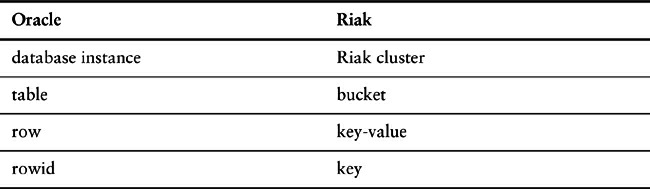
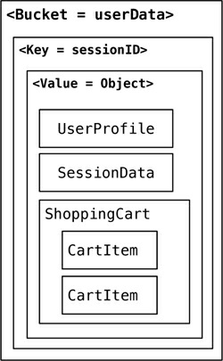
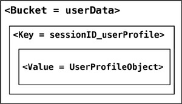

# Chapter 8. Key-Value Databases

A key-value store is a simple hash table, primarily used when all access to the database is via
primary key. Think of a table in a traditional RDBMS with two columns, such as ID and NAME, the ID
column being the key and NAME column storing the value. In an RDBMS, the NAME column is restricted
to storing data of type String. The application can provide an ID and VALUE and persist the pair; if
the ID already exists the current value is overwritten, otherwise a new entry is created. Let’s look at
how terminology compares in Oracle and Riak.



## 8.1. What Is a Key-Value Store

Key-value stores are the simplest NoSQL data stores to use from an API perspective. The client can
either get the value for the key, put a value for a key, or delete a key from the data store. The value is
a blob that the data store just stores, without caring or knowing what’s inside; it’s the responsibility
of the application to understand what was stored. Since key-value stores always use primary-key
access, they generally have great performance and can be easily scaled.

Some of the popular key-value databases are [Riak](https://riak.com/), Redis (often referred to as Data
Structure server) [Redis](https://redis.io/), Memcached DB and its flavors [Memcached](https://memcached.org/), Berkeley DB [Berkeley DB](https://www.oracle.com/database/technologies/related/berkeleydb-downloads.html), HamsterDB (especially suited for embedded use) [HamsterDB](https://github.com/GerHobbelt/hamsterdb), [Amazon Dynamo](https://aws.amazon.com/dynamodb/) (not open-source), and  [Project Voldemort](https://www.project-voldemort.com/voldemort/) (an open-source
implementation of Amazon DynamoDB).

In some key-value stores, such as Redis, the aggregate being stored does not have to be a domain
object—it could be any data structure. Redis supports storing lists, sets, hashes and can do range,
diff, union, and intersection operations. These features allow Redis to be used in more different ways
than a standard key-value store.

There are many more key-value databases and many new ones are being worked on at this time.
For the sake of keeping discussions in this book easier we will focus mostly on Riak. Riak lets us
store keys into buckets, which are just a way to segment the keys—think of buckets as flat namespaces
for the keys.

If we wanted to store user session data, shopping cart information, and user preferences in Riak,
we could just store all of them in the same bucket with a single key and single value for all of these
objects. In this scenario, we would have a single object that stores all the data and is put into a single bucket (Figure 8.1).



**Figure 8.1. Storing all the data in a single bucket**

The downside of storing all the different objects (aggregates) in the single bucket would be that one
bucket would store different types of aggregates, increasing the chance of key conflicts. An alternate
approach would be to append the name of the object to the key, such as
288790b8a421_userProfile, so that we can get to individual objects as they are needed (Figure
8.2).



**Figure 8.2. Change the key design to segment the data in a single bucket.**

We could also create buckets which store specific data. In Riak, they are known as **domain buckets** allowing the serialization and deserialization to be handled by the client driver.


```java
Bucket bucket = client.fetchBucket(bucketName).execute();
DomainBucket<UserProfile> profileBucket = DomainBucket.builder(bucket, UserProfile.class).build();
```

Using domain buckets or different buckets for different objects (such as UserProfile and
ShoppingCart) segments the data across different buckets allowing you to read only the object you
need without having to change key design.

Key-value stores such as Redis also support storing random data structures, which can be sets,
hashes, strings, and so on. This feature can be used to store lists of things, like states or


addressTypes, or an array of user’s visits.

## 8.2. Key-Value Store Features

While using any NoSQL data stores, there is an inevitable need to understand how the features
compare to the standard RDBMS data stores that we are so used to. The primary reason is to
understand what features are missing and how does the application architecture need to change to
better use the features of a key-value data store. Some of the features we will discuss for all the
NoSQL data stores are consistency, transactions, query features, structure of the data, and scaling.

### **8.2.1. Consistency**

Consistency is applicable only for operations on a single key, since these operations are either a get,
put, or delete on a single key. Optimistic writes can be performed, but are very expensive to
implement, because a change in value cannot be determined by the data store.

In distributed key-value store implementations like Riak, the _eventually consistent_ (p. 50 ) model
of consistency is implemented. Since the value may have already been replicated to other nodes, Riak
has two ways of resolving update conflicts: either the newest write wins and older writes loose, or
both (all) values are returned allowing the client to resolve the conflict.

In Riak, these options can be set up during the bucket creation. Buckets are just a way to namespace
keys so that key collisions can be reduced—for example, all customer keys may reside in the
customer bucket. When creating a bucket, default values for consistency can be provided, for
example that a write is considered good only when the data is consistent across all the nodes where
the data is stored.


```java
Bucket bucket = connection
                    .createBucket(bucketName)
                    .withRetrier(attempts(3))
                    .allowSiblings(siblingsAllowed)
                    .nVal(numberOfReplicasOfTheData)
                    .w(numberOfNodesToRespondToWrite)
                    .r(numberOfNodesToRespondToRead)
                    .execute();
```

If we need data in every node to be consistent, we can increase the *numberOfNodesToRespondToWrite* set by w to be the same as nVal. Of course doing that will decrease the write performance of the cluster. To improve on write or read conflicts, we can change the allowSiblings flag during bucket creation: If it is set to false, we let the last write to win and not create siblings.

### **8.2.2. Transactions**

Different products of the key-value store kind have different specifications of transactions. Generally
speaking, there are no guarantees on the writes. Many data stores do implement transactions in
different ways. Riak uses the concept of quorum (“Quorums,” p. 57 ) implemented by using the W value
—replication factor—during the write API call.

Assume we have a Riak cluster with a replication factor of 5 and we supply the W value of 3. When
writing, the write is reported as successful only when it is written and reported as a success on at
least three of the nodes. This allows Riak to have write tolerance; in our example, with N equal to 5


and with a W value of 3 , the cluster can tolerate N - W = 2 nodes being down for write operations,
though we would still have lost some data on those nodes for read.

### **8.2.3. Query Features**

All key-value stores can query by the key—and that’s about it. If you have requirements to query by
using some attribute of the value column, it’s not possible to use the database: Your application needs
to read the value to figure out if the attribute meets the conditions.

Query by key also has an interesting side effect. What if we don’t know the key, especially during
ad-hoc querying during debugging? Most of the data stores will not give you a list of all the primary
keys; even if they did, retrieving lists of keys and then querying for the value would be very
cumbersome. Some key-value databases get around this by providing the ability to search inside the
value, such as **Riak Search** that allows you to query the data just like you would query it using
Lucene indexes.

While using key-value stores, lots of thought has to be given to the design of the key. Can the key be
generated using some algorithm? Can the key be provided by the user (user ID, email, etc.)? Or
derived from timestamps or other data that can be derived outside of the database?

These query characteristics make key-value stores likely candidates for storing session data (with
the session ID as the key), shopping cart data, user profiles, and so on. The expiry_secs property
can be used to expire keys after a certain time interval, especially for session/shopping cart objects.

```java
Bucket bucket = getBucket(bucketName);
IRiakObject riakObject = bucket.store(key, value).execute();
```

When writing to the Riak bucket using the store API, the object is stored for the key provided.
Similarly, we can get the value stored for the key using the fetch API.

```java
Bucket bucket = getBucket(bucketName);
IRiakObject riakObject = bucket.fetch(key).execute();
byte[] bytes = riakObject.getValue();
String value = new String(bytes);
```

Riak provides an HTTP-based interface, so that all operations can be performed from the web
browser or on the command line using curl. Let’s save this data to Riak:

```json
{
    "lastVisit":1324669989288,
    "user":{
        "customerId":"91cfdf5bcb7c",
        "name":"buyer",
        "countryCode":"US",
        "tzOffset":0
    }
}
```

Use the curl command to POST the data, storing the data in the session bucket with the key of
`a7e618d9db25` (we have to provide this key):


```
curl -v -X POST -d '
{ "lastVisit":1324669989288,
"user":{"customerId":"91cfdf5bcb7c",
"name":"buyer",
"countryCode":"US",
"tzOffset":0}
}'
-H "Content-Type: application/json" http://localhost:8098/buckets/session/keys/a7e618d9db25
```

The data for the key a7e618d9db25 can be fetched by using the curl command:

```
curl -i http://localhost:8098/buckets/session/keys/a7e618d9db25
```

### **8.2.4. Structure of Data**

Key-value databases don’t care what is stored in the value part of the key-value pair. The value can
be a blob, text, JSON, XML, and so on. In Riak, we can use the Content-Type in the POST request to
specify the data type.

### **8.2.5. Scaling**

Many key-value stores scale by using sharding (“Sharding,” p. 38 ). With sharding, the value of the
key determines on which node the key is stored. Let’s assume we are sharding by the first character of
the key; if the key is f4b19d79587d, which starts with an f, it will be sent to different node than the
key ad9c7a396542. This kind of sharding setup can increase performance as more nodes are added to
the cluster.

Sharding also introduces some problems. If the node used to store f goes down, the data stored on
that node becomes unavailable, nor can new data be written with keys that start with f.

Data stores such as Riak allow you to control the aspects of the CAP Theorem (“The CAP
Theorem,” p. 53 ): N (number of nodes to store the key-value replicas), R (number of nodes that have
to have the data being fetched before the read is considered successful), and W (the number of nodes
the write has to be written to before it is considered successful).

Let’s assume we have a 5-node Riak cluster. Setting N to 3 means that all data is replicated to at
least three nodes, setting R to 2 means any two nodes must reply to a GET request for it to be
considered successful, and setting W to 2 ensures that the PUT request is written to two nodes before
the write is considered successful.

These settings allow us to fine-tune node failures for read or write operations. Based on our need,
we can change these values for better read availability or write availability. Generally speaking
choose a W value to match your consistency needs; these values can be set as defaults during bucket
creation.

## 8.3. Suitable Use Cases

Let’s discuss some of the problems where key-value stores are a good fit.

### **8.3.1. Storing Session Information**

Generally, every web session is unique and is assigned a unique sessionid value. Applications that
store the sessionid on disk or in an RDBMS will greatly benefit from moving to a key-value store,
since everything about the session can be stored by a single PUT request or retrieved using GET. This


single-request operation makes it very fast, as everything about the session is stored in a single
object. Solutions such as Memcached are used by many web applications, and Riak can be used when
availability is important.

### **8.3.2. User Profiles, Preferences**

Almost every user has a unique userId, username, or some other attribute, as well as preferences
such as language, color, timezone, which products the user has access to, and so on. This can all be
put into an object, so getting preferences of a user takes a single GET operation. Similarly, product
profiles can be stored.

### **8.3.3. Shopping Cart Data**

E-commerce websites have shopping carts tied to the user. As we want the shopping carts to be
available all the time, across browsers, machines, and sessions, all the shopping information can be
put into the value where the key is the userid. A Riak cluster would be best suited for these kinds of
applications.

## 8.4. When Not to Use

There are problem spaces where key-value stores are not the best solution.

### **8.4.1. Relationships among Data**

If you need to have relationships between different sets of data, or correlate the data between
different sets of keys, key-value stores are not the best solution to use, even though some key-value
stores provide link-walking features.

### **8.4.2. Multioperation Transactions**

If you’re saving multiple keys and there is a failure to save any one of them, and you want to revert or
roll back the rest of the operations, key-value stores are not the best solution to be used.

### **8.4.3. Query by Data**

If you need to search the keys based on something found in the value part of the key-value pairs, then
key-value stores are not going to perform well for you. There is no way to inspect the value on the
database side, with the exception of some products like Riak Search or indexing engines like Lucene
[Lucene] or Solr [Solr].

### **8.4.4. Operations by Sets**

Since operations are limited to one key at a time, there is no way to operate upon multiple keys at the
same time. If you need to operate upon multiple keys, you have to handle this from the client side.
