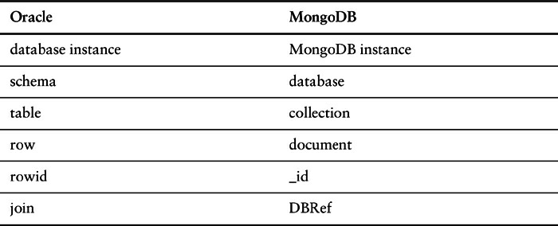
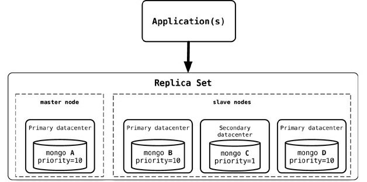
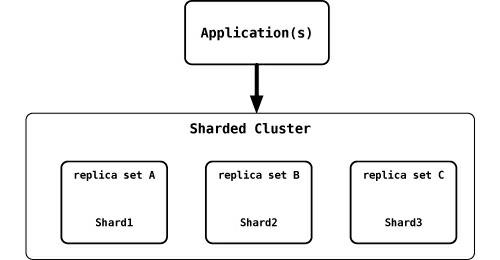

# Chapter 9. Document Databases

Documents are the main concept in document databases. The database stores and retrieves documents, which can be XML, JSON, BSON, and so on. These documents are self-describing, hierarchical tree data structures which can consist of maps, collections, and scalar values. The documents stored are similar to each other but do not have to be exactly the same. Document databases store documents in the value part of the key-value store; think about document databases as key-value stores where the value is examinable. Let’s look at how terminology compares in Oracle and MongoDB.



The `_id` is a special field that is found on all documents in Mongo, just like `ROWID` in Oracle. In 
MongoDB, `_id` can be assigned by the user, as long as it is unique.

## 9.1. What Is a Document Database?


```json
{ 
    "firstname": "Martin",
    "likes": [ "Biking", "Photography" ],
    "lastcity": "Boston",
    "lastVisited": "..."
}
```

The above document can be considered a row in a traditional RDBMS. Let’s look at another
document:

```json
{
    "firstname": "Pramod",
    "citiesvisited": [ "Chicago", "London", "Pune", "Bangalore" ],
    "addresses": [
        { 
            "state": "AK",
            "city": "DILLINGHAM",
            "type": "R"
        },
        { 
            "state": "MH",
            "city": "PUNE",
            "type": "R" 
        }
    ],
    "lastcity": "Chicago"
}
```

Looking at the documents, we can see that they are similar, but have differences in attribute names.
This is allowed in document databases. The schema of the data can differ across documents, but these
documents can still belong to the same collection—unlike an RDBMS where every row in a table has
to follow the same schema. We represent a list of citiesvisited as an array, or a list of addresses
as list of documents embedded inside the main document. Embedding child documents as subobjects
inside documents provides for easy access and better performance.

If you look at the documents, you will see that some of the attributes are similar, such as
firstname or city. At the same time, there are attributes in the second document which do not exist
in the first document, such as addresses, while likes is in the first document but not the second.

This different representation of data is not the same as in RDBMS where every column has to be
defined, and if it does not have data it is marked as empty or set to null. In documents, there are no
empty attributes; if a given attribute is not found, we assume that it was not set or not relevant to the
document. Documents allow for new attributes to be created without the need to define them or to
change the existing documents.

Some of the popular document databases we have seen are [MongoDB](https://www.mongodb.com/), CouchDB
[CouchDB](https://couchdb.apache.org/),  [Terrastore](https://code.google.com/archive/p/terrastore/),  [OrientDB](https://www.orientdb.org/),  [RavenDB](https://ravendb.net/), and of course the
well-known and often reviled Lotus Notes [Notes Storage Facility] that uses document storage.

## 9.2. Features

While there are many specialized document databases, we will use MongoDB as a representative of
the feature set. Keep in mind that each product has some features that may not be found in other
document databases.

Let’s take some time to understand how MongoDB works. Each MongoDB instance has multiple
_databases_ , and each database can have multiple _collections_. When we compare this with RDBMS, an
RDBMS instance is the same as MongoDB instance, the schemas in RDBMS are similar to MongoDB
databases, and the RDBMS tables are collections in MongoDB. When we store a document, we have
to choose which database and collection this document belongs in—for example,
database.collection.insert(document), which is usually represented as
db.coll.insert(document).

### **9.2.1. Consistency**

Consistency in MongoDB database is configured by using the **replica sets** and choosing to wait for
the writes to be replicated to all the slaves or a given number of slaves. Every write can specify the
number of servers the write has to be propagated to before it returns as successful.

A command like `db.runCommand({ getlasterror : 1 , w : "majority" })` tells the database how strong is the consistency you want. For example, if you have one server and specify the w as majority, the write will return immediately since there is only one node. If you have three nodes in the replica set and specify w as majority, the write will have to complete at a minimum of
two nodes before it is reported as a success. You can increase the w value for stronger consistency
but you will suffer on write performance, since now the writes have to complete at more nodes.
Replica sets also allow you to increase the read performance by allowing reading from slaves by
setting slaveOk; this parameter can be set on the connection, or database, or collection, or individually for each operation.

```java
Mongo mongo = new Mongo("localhost:27017");
mongo.slaveOk();
```

Here we are setting slaveOk per operation, so that we can decide which operations can work with
data from the slave node.

```java
DBCollection collection = getOrderCollection();
BasicDBObject query = new BasicDBObject();
query.put("name", "Martin");
DBCursor cursor = collection.find(query).slaveOk();
```

Similar to various options available for read, you can change the settings to achieve strong write
consistency, if desired. By default, a write is reported successful once the database receives it; you
can change this so as to wait for the writes to be synced to disk or to propagate to two or more slaves.
This is known as WriteConcern: You make sure that certain writes are written to the master and
some slaves by setting WriteConcern to REPLICAS_SAFE. Shown below is code where we are
setting the WriteConcern for all writes to a collection:


```java
DBCollection shopping = database.getCollection("shopping");
shopping.setWriteConcern(REPLICAS_SAFE);
```

WriteConcern can also be set per operation by specifying it on the save command:

```java
WriteResult result = shopping.insert(order, REPLICAS_SAFE);
```

There is a tradeoff that you need to carefully think about, based on your application needs and
business requirements, to decide what settings make sense for slaveOk during read or what safety
level you desire during write with WriteConcern.

### **9.2.2. Transactions**

Transactions, in the traditional RDBMS sense, mean that you can start modifying the database with
insert, update, or delete commands over different tables and then decide if you want to keep the
changes or not by using commit or rollback. These constructs are generally not available in NoSQL
solutions—a write either succeeds or fails. Transactions at the single-document level are known as
**atomic transactions**. Transactions involving more than one operation are not possible, although there
are products such as RavenDB that do support transactions across multiple operations.

By default, all writes are reported as successful. A finer control over the write can be achieved by
using `WriteConcern` parameter. We ensure that order is written to more than one node before it’s
reported successful by using `WriteConcern.REPLICAS_SAFE`. Different levels of WriteConcern let
you choose the safety level during writes; for example, when writing log entries, you can use lowest
level of safety, `WriteConcern.NONE`.

```java
final Mongo mongo = new Mongo(mongoURI);
mongo.setWriteConcern(REPLICAS_SAFE);

DBCollection shopping = mongo.getDB(orderDatabase)
                            .getCollection(shoppingCollection); 
try {
    WriteResult result = shopping.insert(order, REPLICAS_SAFE);
    //Writes made it to primary and at least one secondary
} catch (MongoException writeException) {
    //Writes did not make it to minimum of two nodes including primary
    dealWithWriteFailure(order, writeException);
}
```

### **9.2.3. Availability**

The CAP theorem (“The CAP Theorem,” p. 53 ) dictates that we can have only two of Consistency,
Availability, and Partition Tolerance. Document databases try to improve on availability by
replicating data using the master-slave setup. The same data is available on multiple nodes and the
clients can get to the data even when the primary node is down. Usually, the application code does
not have to determine if the primary node is available or not. MongoDB implements replication,
providing high availability using **replica sets**.

In a replica set, there are two or more nodes participating in an asynchronous master-slave
replication. The replica-set nodes elect the master, or primary, among themselves. Assuming all the
nodes have equal voting rights, some nodes can be favored for being closer to the other servers, for
having more RAM, and so on; users can affect this by assigning a priority—a number between 0 and
1000—to a node.

All requests go to the master node, and the data is replicated to the slave nodes. If the master node
goes down, the remaining nodes in the replica set vote among themselves to elect a new master; all
future requests are routed to the new master, and the slave nodes start getting data from the new
master. When the node that failed comes back online, it joins in as a slave and catches up with the rest
of the nodes by pulling all the data it needs to get current.

Figure 9.1 is an example configuration of replica sets. We have two nodes, **mongo A** and **mongo
B** , running the MongoDB database in the primary data-center, and **mongo C** in the secondary
datacenter. If we want nodes in the primary datacenter to be elected as primary nodes, we can assign
them a higher priority than the other nodes. More nodes can be added to the replica sets without
having to take them offline.


**Figure 9.1. Replica set configuration with higher priority assigned to nodes in the same datacenter**

The application writes or reads from the primary (master) node. When connection is established,
the application only needs to connect to one node (primary or not, does not matter) in the replica set,
and the rest of the nodes are discovered automatically. When the primary node goes down, the driver
talks to the new primary elected by the replica set. The application does not have to manage any of
the communication failures or node selection criteria. Using replica sets gives you the ability to have
a highly available document data store.

Replica sets are generally used for data redundancy, automated failover, read scaling, server
maintenance without downtime, and disaster recovery. Similar availability setups can be achieved
with CouchDB, RavenDB, Terrastore, and other products.

### **9.2.4. Query Features**

Document databases provide different query features. CouchDB allows you to query via views—
complex queries on documents which can be either materialized (“Materialized Views,” p. 30 ) or
dynamic (think of them as RDBMS views which are either materialized or not). With CouchDB, if
you need to aggregate the number of reviews for a product as well as the average rating, you could
add a view implemented via map-reduce (“Basic Map-Reduce,” p. 68 ) to return the count of reviews
and the average of their ratings.

When there are many requests, you don’t want to compute the count and average for every request;
instead you can add a materialized view that precomputes the values and stores the results in the
database. These materialized views are updated when queried, if any data was changed since the last
update.

One of the good features of document databases, as compared to key-value stores, is that we can
query the data inside the document without having to retrieve the whole document by its key and then
introspect the document. This feature brings these databases closer to the RDBMS query model.

MongoDB has a query language which is expressed via JSON and has constructs such as $query
for the where clause, $orderby for sorting the data, or $explain to show the execution plan of the
query. There are many more constructs like these that can be combined to create a MongoDB query.


Let’s look at certain queries that we can do against MongoDB. Suppose we want to return all the
documents in an order collection (all rows in the order table). The SQL for this would be:

```sql
SELECT * FROM order
```

The equivalent query in Mongo shell would be:

```java
db.order.find()
```

Selecting the orders for a single customerId of `883c2c5b4e5b` would be:

```sql
SELECT * FROM order WHERE customerId = "883c2c5b4e5b"
```

The equivalent query in Mongo to get all orders for a single customerId of `883c2c5b4e5b`:

```java
db.order.find({"customerId":"883c2c5b4e5b"})
```

Similarly, selecting orderId and orderDate for one customer in SQL would be:

```sql
SELECT orderId,orderDate FROM order WHERE customerId = "883c2c5b4e5b"
```

and the equivalent in Mongo would be:

```java
db.order.find({customerId:"883c2c5b4e5b"},{orderId:1,orderDate:1})
```

Similarly, queries to count, sum, and so on are all available. Since the documents are aggregated
objects, it is really easy to query for documents that have to be matched using the fields with child
objects. Let’s say we want to query for all the orders where one of the items ordered has a name like
Refactoring. The SQL for this requirement would be:

```sql
SELECT * FROM customerOrder, orderItem, product
WHERE customerOrder.orderId = orderItem.customerOrderId
    AND orderItem.productId = product.productId
    AND product.name LIKE '%Refactoring%'
```

and the equivalent Mongo query would be:

```java
db.orders.find({"items.product.name":/Refactoring/})
```

The query for MongoDB is simpler because the objects are embedded inside a single document and you can query based on the embedded child documents.

### **9.2.5. Scaling**

The idea of scaling is to add nodes or change data storage without simply migrating the database to a
bigger box. We are not talking about making application changes to handle more load; instead, we are
interested in what features are in the database so that it can handle more load.

Scaling for heavy-read loads can be achieved by adding more read slaves, so that all the reads can be directed to the slaves. Given a heavy-read application, with our 3-node replica-set cluster, we can
add more read capacity to the cluster as the read load increases just by adding more slave nodes to
the replica set to execute reads with the slaveOk flag (Figure 9.2). This is horizontal scaling for
reads.



**Figure 9.2. Adding a new node, mongo D, to an existing replica-set cluster**

Once the new node, mongo D, is started, it needs to be added to the replica set

```java
rs.add("mongod:27017");
```

When a new node is added, it will sync up with the existing nodes, join the replica set as
secondary node, and start serving read requests. An advantage of this setup is that we do not have to
restart any other nodes, and there is no downtime for the application either.

When we want to scale for write, we can start sharding (“Sharding,” p. 38 ) the data. Sharding is
similar to partitions in RDBMS where we split data by value in a certain column, such as state or
year. With RDBMS, partitions are usually on the same node, so the client application does not have to
query a specific partition but can keep querying the base table; the RDBMS takes care of finding the
right partition for the query and returns the data.

In sharding, the data is also split by certain field, but then moved to different Mongo nodes. The
data is dynamically moved between nodes to ensure that shards are always balanced. We can add
more nodes to the cluster and increase the number of writable nodes, enabling horizontal scaling for
writes.

```java
db.runCommand( { shardcollection : "ecommerce.customer", key : {firstname : 1} } )
```

Splitting the data on the first name of the customer ensures that the data is balanced across the
shards for optimal write performance; furthermore, each shard can be a replica set ensuring better
read performance within the shard (Figure 9.3). When we add a new shard to this existing sharded
cluster, the data will now be balanced across four shards instead of three. As all this data movement
and infrastructure refactoring is happening, the application will not experience any downtime,
although the cluster may not perform optimally when large amounts of data are being moved to
rebalance the shards.



**Figure 9.3. MongoDB sharded setup where each shard is a replica set**

The shard key plays an important role. You may want to place your MongoDB database shards
closer to their users, so sharding based on user location may be a good idea. When sharding by
customer location, all user data for the East Coast of the USA is in the shards that are served from the
East Coast, and all user data for the West Coast is in the shards that are on the West Coast.

## 9.3. Suitable Use Cases

### **9.3.1. Event Logging**

Applications have different event logging needs; within the enterprise, there are many different
applications that want to log events. Document databases can store all these different types of events
and can act as a central data store for event storage. This is especially true when the type of data
being captured by the events keeps changing. Events can be sharded by the name of the application
where the event originated or by the type of event such as order_processed or customer_logged.

### **9.3.2. Content Management Systems, Blogging Platforms**

Since document databases have no predefined schemas and usually understand JSON documents, they
work well in content management systems or applications for publishing websites, managing user
comments, user registrations, profiles, web-facing documents.

### **9.3.3. Web Analytics or Real-Time Analytics**

Document databases can store data for real-time analytics; since parts of the document can be
updated, it’s very easy to store page views or unique visitors, and new metrics can be easily added
without schema changes.

### **9.3.4. E-Commerce Applications**

E-commerce applications often need to have flexible schema for products and orders, as well as the
ability to evolve their data models without expensive database refactoring or data migration
(“Schema Changes in a NoSQL Data Store,” p. 128 ).

## 9.4. When Not to Use

There are problem spaces where document databases are not the best solution.

### **9.4.1. Complex Transactions Spanning Different Operations**


If you need to have atomic cross-document operations, then document databases may not be for you.
However, there are some document databases that do support these kinds of operations, such as
RavenDB.

### **9.4.2. Queries against Varying Aggregate Structure**

Flexible schema means that the database does not enforce any restrictions on the schema. Data is
saved in the form of application entities. If you need to query these entities ad hoc, your queries will
be changing (in RDBMS terms, this would mean that as you join criteria between tables, the tables to
join keep changing). Since the data is saved as an aggregate, if the design of the aggregate is
constantly changing, you need to save the aggregates at the lowest level of granularity—basically, you
need to normalize the data. In this scenario, document databases may not work.
