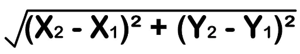
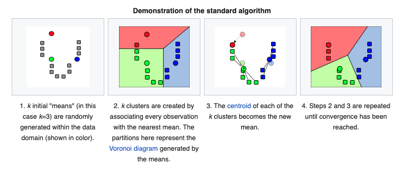
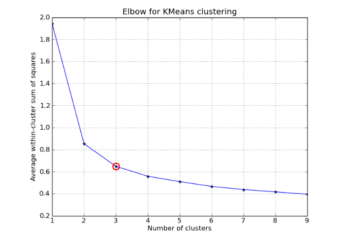

# AI Notes

[Sách tiếng việt](https://phamdinhkhanh.github.io/content)

## Vector

https://www.mathsisfun.com/algebra/vectors.html

How many features of object (student, vehicle, ...) 
- E.g: Grade of math & literature of students => vector 2D
- Vector is display data

**Image**
black & white image => each px has value 0 - 255 
colorful image => RGB - each px is vector 3D

**Face recognition**
- E.g Image 10px x 10px => vector 100 Dimensions 
- From multiple images => bring all to vectors with same dimensions
- AI => find the correlation of vectors return (`f(x)` => `probability` ) => recognition

**Voice / Languague recognition**
encoding => from voice to vector. Fb or GG will do it for us 😗
few famous encoding
- TFIDF
- word2vec
- BERT
- fasttext
Sentences has same meaning, vectors should be near. 

**Distance of 2 vectors**
 

```py
def distance(p1,p2):
	return math.sqrt((p1[0]-p2[0]) * (p1[0]-p2[0]) + (p1[1] - p2[1]) * (p1[1] - p2[1]))
```


**Matrix** was made by vectors

## K-means

https://phamdinhkhanh.github.io/deepai-book/ch_ml/KMeans.html

k-means clustering is a method of vector quantization, originally from signal processing, that aims to partition `n` observations into `k` clusters in which each observation belongs to the cluster with the nearest mean (cluster centers or cluster centroid), serving as a prototype of the cluster.



- cluster-ceatroid
- label 

[sklearn.cluster.KMeans](https://scikit-learn.org/stable/modules/generated/sklearn.cluster.KMeans.html#sklearn.cluster.KMeans)

```py
from sklearn.cluster import KMeans

# init 
points = [[1, 2], [2, 3]]
K = 2

# run
kmeans = KMeans(n_clusters=K).fit(points) 
labels = kmeans.predict(points)
clusters = kmeans.cluster_centers_
```

**Choose K - elbow method**


**Image compression**


## Linear Regression

https://phamdinhkhanh.github.io/deepai-book/ch_ml/prediction.html

https://www.youtube.com/watch?v=nk2CQITm_eo&ab_channel=StatQuestwithJoshStarmer

```py
import numpy as np
import matplotlib
import matplotlib.pyplot as plt
from sklearn import linear_model

# Random data
A = np.array([[2,5,7,9,11,16,19,23,22,29,29,35,37,40,46]]).T
b = np.array([[2,3,4,5,6,7,8,9,10,11,12,13,14,15,16]]).T

# Create model
lr = linear_model.LinearRegression()
# Fit (train the model)
lr.fit(A,b)

# y = ax+b, a: coefficient, b: intercept
print(lr.intercept_)
print(lr.coef_)

# Draw random data
plt.plot(A,b,'ro')

# Draw line
x0 = np.array([[1,46]]).T
y0 = x0 * lr.coef_ + lr.intercept_

plt.plot(x0,y0)
plt.show()
```

## Gradient Descent
- Line 
- Parabole

## KNN
- regression
- categorized


## Vokas
- feature
- fit <--> train model
- single prediction / batch prediction
- supervised learning - data has labels 
- unsupervised learning - data has no label
- row space => column space