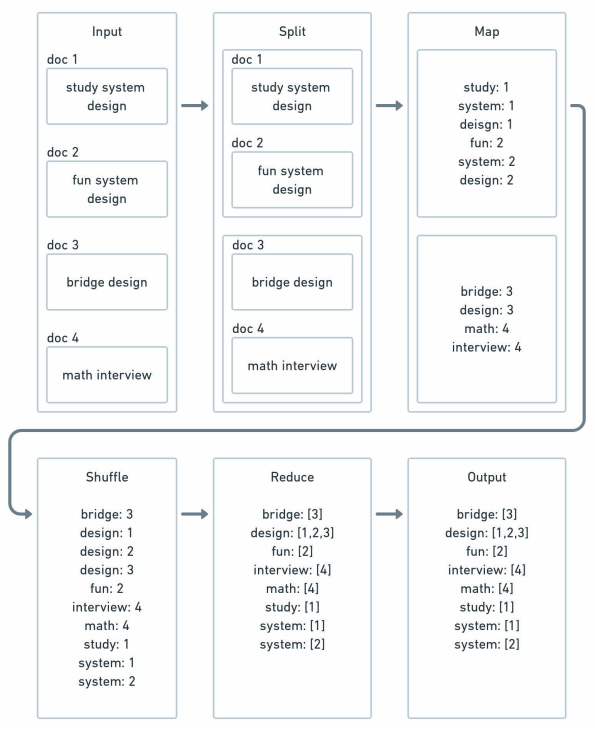
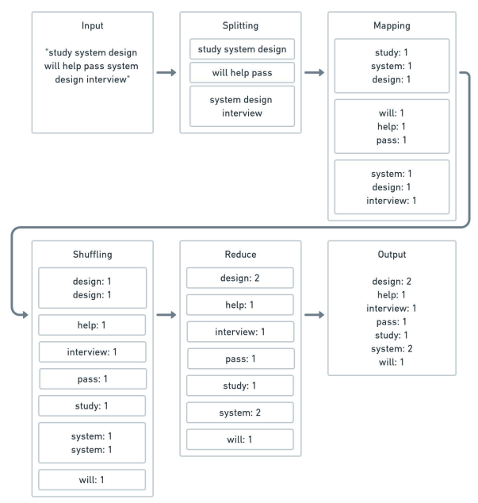
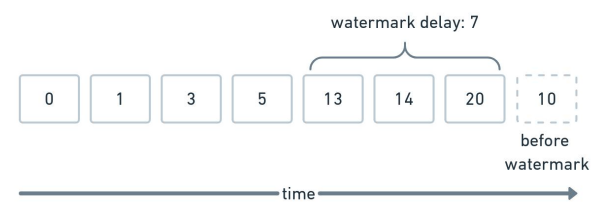
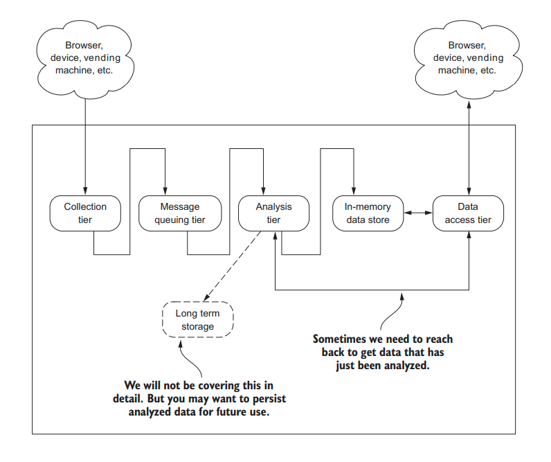

# Lambda Architecture

## Asynchronous Processing

::: quote
Asynchronous processing is when a client executes something and doesn’t wait for that task to complete before moving onto something else.
:::

The purpose of asynchronous processing is to offload the task at hand to a background processing such that the caller does not have to wait for the response of the task result. This leads to lower latency because the request processing doesn’t block the client.

### Reasons for Asynchronous Processing

The main idea for asynchronous processing is you don’t want the end-user to wait for your task to complete because waiting for the job to complete
would be a bad user experience. So, in an interview, you should justify why asynchronous processing would improve the end-user experience. Here are
some examples that might be a good candidate for asynchronous processing:

- The Processing Time is Indeterministic
- The Processing Time is Long-Running
- Improve Perceived Latency


## Batch processing

Batch processing is a form of asynchronous processing. In batch processing, the system processes a large amount of data periodically to
generate output to let clients consume later. Here are some use cases for batch processing:
- Run payroll, billing, and accounting for the company
- Generate reverse index for documents
- Generate word count for documents
- Distributed sorting

When talking about batch processing, most people will think about MapReduce. It doesn’t have to be. Batch processing on a high-level means grabbing some data sources periodically, applying custom business logic, and creating an output to be consumed by another consumer. You can write custom code for each process. 

MapReduce consists of:

```
Input => Splitting => Mapping => Shuffling => Reduce => Output
```

### Build Reverse Index for Search



### Word count for document




## Stream Processing

Data is unbounded in a stream processing architecture since data continuously comes in, and the system has to deal with it. The advantage of stream processing over batch is that the output will be much fresher since it’s processing near real-time, but it also comes at the expense of complexities.

In some streaming applications, event time does not need to be considered.

For example, if you have a global counter that keeps track of the number of events since the beginning of time, the event time is irrelevant in this context. However, if you are keeping track of the number of events from one period to another, then event time is crucial because you need to ensure the event time belongs in that period.

### Realtime Classification

Classification | Examples | Latency measured in | Tolerance for delay 
--- | --- | --- | --- 
Hard | Pacemaker, anti-lock brakes | microseconds - milliseconds | None - total system failure, potential loss of life 
Soft | Airline reservation system, online stock quotes, VoIP (Skype) | milliseconds - seconds | Low - no system failure, no life at risk 
Near | Skype video, home automation | seconds - minutes | High - no system failure, no life at risk 


### System is Down

Since streaming is near real-time, and batch processing is much less frequent, if the service is down for 10 minutes, it has a much more significant implication for a near real-time system. Also, when the system comes back up, you need to think about how the system will process the 10 minutes of unprocessed data.

### Late and Out of Order Events

In the real-life system, events come in late. Imagine you have a mobile phone that omits events, and the network is down. The mobile phone
queues up the events, and when you reconnect to the internet, the events are late with respect to the processing time. On top of late events, since there's a
clock skew (each machine has its clock) in a distributed system, you can’t assume the events are ordered since it makes it difficult for you to assume
you’ve seen all the events before a certain time.

### Watermark

The intuition behind the watermark is that you have a heuristic behind whether you have received enough data for a time-period to move on. 

For example, if you are collecting data from time_0 to time_1, due to late events, how do you know you have collected enough information about that interval such that you hope events between time_0 and time_1 won’t ever come anymore?


Assume you have a watermark delay of 7. If you see a time_20 event, you have a watermark of time_13. If you see events before time_13, you will consider it past the watermark and treat it accordingly, such as dropping the event. A trade-off you can discuss is the bigger the watermark, the more memory you have to hold to account for late data with the benefit of not dropping late events.



Now, what happens if another event belongs in time_0 to time_1? That depends on your application. Some common options are discarding it or updating the previous record. Discarding is easy but may lead to an inaccuracy that’s poor for user experience. On the other hand, updating records isn’t as simple as just append-only applications and may require a separate pipeline for updating existing records.

### Checkpointing

There is usually some intermediate data structure in streaming applications to keep track of the data processed so far. What if that host goes down? Processing failure is where checkpointing helps so you don’t have to reprocess all the events from the beginning. The frequency of the
checkpoint and how and what you persist in the checkpoints.  More frequent checkpointing means lower performance but faster failure recovery, and the
reverse is true for less frequent checkpointing.

### Batch Size

Even in stream processing, it doesn’t mean you process event by event, which may kill the throughput of your system since there’s additional
overhead per event. For example, imagine for each event you need to do a network or disk IO. To do it on every event will cause IOs to become the bottleneck. Sometimes it's more efficient to micro-batch to make that more efficient. A trade-off discussion is the batch size. A bigger batch size causes delay but may have better throughput since there’s less IO overhead per batch.

### Streaming Architectural blueprint




## Lambda Architecture

Sometimes the application can not wait for a delay in processing for the end-user at the same time. Doing the processing accurately and consistently
will be difficult with the existing infrastructure. There’s lambda architecture with a fast lane and a slow lane. 

Fast lane tries to minimize latency at the sacrifice of completeness and accuracy like stream processing. 

Slow lane will have most, if not all the data available to compute a more accurate result for the end-user like batch processing. 

In practice, there’s operational complexity to managing two similar systems.


[Read more](https://www.databricks.com/glossary/lambda-architecture)