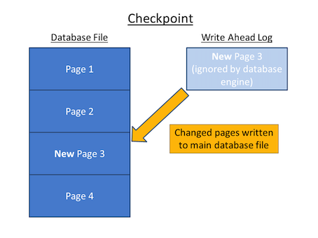
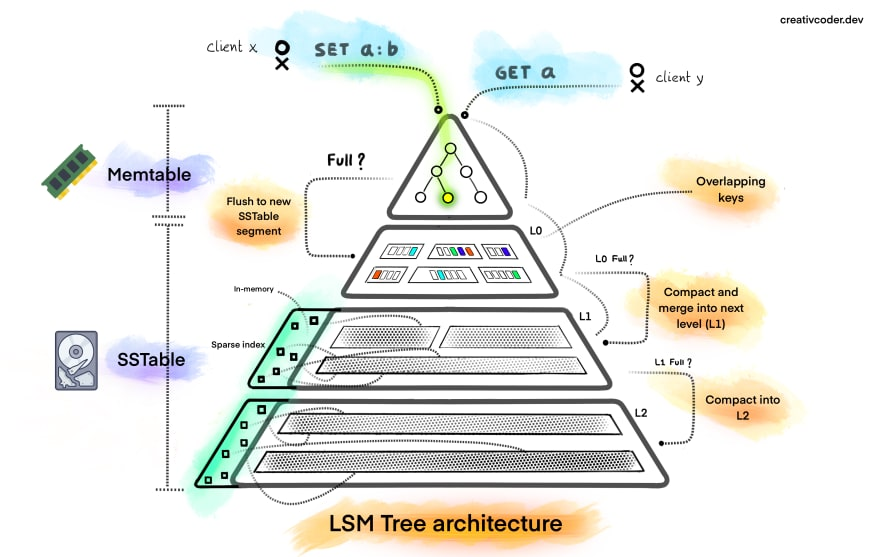
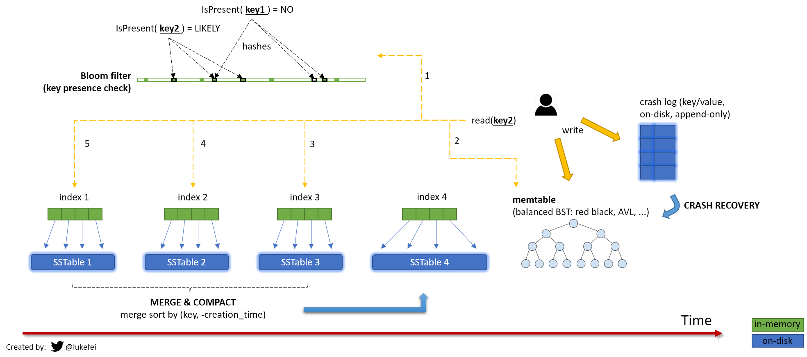
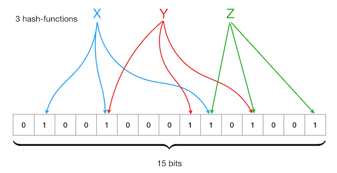

# Data structure

## [Skiplist](https://en.wikipedia.org/wiki/Skip_list)
- a common in-memory index type
- to build the `Sorted Set`
- allows for fast lookups, range queries, and other operations
- DB used: Redis

https://www.geeksforgeeks.org/skip-list/

https://www.npmjs.com/package/ts-skiplist

## Log Structured Storage

Log Structured Storage là trường phái Database dựa trên Append-only Log, tức là dữ liệu được ghi lưu lại dưới dạng log, chỉ có ghi xuống cuối file chứ không thể ghi đè.

## Write ahead log (WAL)
- Must force the log record for an update before the correspoding data gets to disk
- Must write all log records for a Xact before commit

- Guarantees Atomicity
- Guarantees Durability

### How it works
- Each log record has unique **Log Sequence Number (LSN)** (increment)
- Each data page contains a pageLSN, the LSN of the most recent log record for an update to that page
- System keeps track of flushedLSN
- WAL: before a page is written `pageLSN <= flushedLSN`

http://redbook.cs.berkeley.edu/redbook3/aries/sld013.htm

## Binary tree

### AVL Tree
AVL Tree = Adelson-Velsky and Landis Tree = self-balancing binary search tree

AVL tree is a self-balancing Binary Search Tree (BST) where the difference between heights of left and right subtrees cannot be more than one for all nodes. 

### Red-Black Tree

Red-Black tree is a binary search tree in which every node is colored with either red or black. It is a type of self balancing binary search tree. It has a good efficient worst case running time complexity.

https://www.geeksforgeeks.org/insertion-in-an-avl-tree/

https://www.geeksforgeeks.org/introduction-to-red-black-tree/

- Node Packages [bintrees](https://www.npmjs.com/package/bintrees) (Bin Tree & RB Tree)

## Hash Index aka HashTable
- allows for fast lookups, insertions & deletions

https://stackoverflow.com/questions/61745927/why-sequential-write-is-faster-than-random-write-on-hdd/61753068#61753068

## BTree

https://viblo.asia/p/mot-it-ve-b-tree-XL6lAPPrZek

## LSM tree

LSM tree = Log-Structured Merge-Tree

Sparse index in memory = LSM Tree Index

- DB used: RocksDB, LevelDB, Cassandra, HBase,  BigTable, Lucene

Big picture

### SSTable 

SSTable = Sorted Strings Table

Về bản chất thì nó khá giống với kiến trúc Log file

Điểm khác biệt duy nhất đó là: mỗi key trong SSTable đều chỉ xuất hiện 1 lần duy nhất (không có chuyện trùng lặp Key), và các row được sắp xếp theo Key.

- to store data on disk in sorted order
- file-based data structure that used to store large amounts of data in a highly compressed & efficient format

immutable on-disk “Map” implementation

### MemTable 
- use data structure AVL Tree or Red Black Tree 

## Bloom filter

A Bloom filter is a **space-efficient probabilistic** data structure that is used to test whether an element is a member of a set.

Use case: 
- avoid attack miss cache attack 

Refs
- Node Package [bloom-filters](https://www.npmjs.com/package/bloom-filters)
- [Bloom filters Introduction](https://www.geeksforgeeks.org/bloom-filters-introduction-and-python-implementation/?ref=gcse)

https://www.scylladb.com/glossary/sstable/

## Data structure

A good engineer needs to recognize how data structures are used in our daily lives.

- **list**: keep your Twitter feeds
- **stack**: support undo/redo of the word editor
- **queue**: keep printer jobs, or send user actions in-game
- **heap**: task scheduling
- **tree**: keep the HTML document, or for AI decision
- **suffix tree**: for searching string in a document
- **graph**: for tracking friendship, or path finding
- **r-tree**: for finding the nearest neighbor
- **vertex buffer**: for sending data to GPU for rendering
