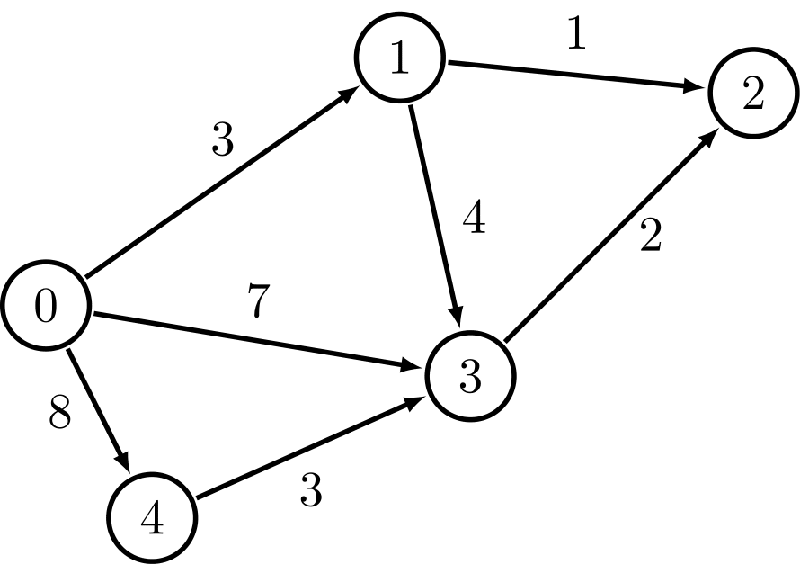

# Terms in Graph

A graph models a set of connections.

*directly graph*

*undirectly graph*

Each graph is made up of **nodes** and **edges**. 

A node can be directly connected to many other nodes. Those called its **neighbors**.

An undirected graph doesn't have any arrows, and both nodes are each other's neighbors.

Directed graph - the relationship is only one way.

Each edge in the graph has a number assosiated with it. These are called *weights*. 

A graph with weights is called *weighted graph*. To calculate the shortest path in a weighted path, use **Dijkstra's algorithm**.

A graph without weights is called *unweighted graph*. To calculate the shortest path in an unweighted graph, use **breath-first search**.

