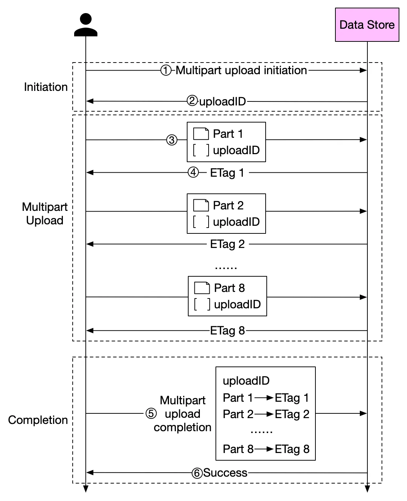

# Upload large file

[Example Repo](https://github.com/nguyenngockhank/large-file-upload)

## FE Implementation 

You can use the JavaScript [Blob object](https://www.w3.org/TR/FileAPI/#dfn-Blob) to slice (`Blob.prototype.slice`) large files into smaller chunks and transfer **concurrently** these to the server to be merged together. This has the added benefit of being able to pause/resume downloads and indicate progress.

Due to concurrency, the order of transmission to the server may change, so we also need to record **the order for each chunk.**

- [20 Javascript Libraries To Manage File Upload](https://bashooka.com/coding/20-javascript-libraries-to-manage-file-upload/)


:::: tabs

::: tab data
```js
const Status = {
  wait: "wait",
  pause: "pause",
  uploading: "uploading"
};

export default {
    data: () => ({
        container: {
            file: null,
            hash: "",
            worker: null
        },
    }),
}
```
:::

::: tab handleUpload

```js
async handleUpload() {
    if (!this.container.file) return;
    this.status = Status.uploading;
    const fileChunkList = this.createFileChunk(this.container.file);
    this.container.hash = await this.calculateHash(fileChunkList);

    const { shouldUpload, uploadedList } = await this.verifyUpload(
        this.container.file.name,
        this.container.hash
    );

    if (!shouldUpload) {
        this.$message.success(
        "skip upload：file upload success, check /target directory"
        );
        this.status = Status.wait;
        return;
    }

    this.data = fileChunkList.map(({ file }, index) => ({
        fileHash: this.container.hash,
        index,
        hash: this.container.hash + "-" + index,
        chunk: file,
        size: file.size,
        percentage: uploadedList.includes(index) ? 100 : 0
    }));

    await this.uploadChunks(uploadedList);
}
```
:::


::: tab calculateHash
```js
createFileChunk(file, size = SIZE) {
    const fileChunkList = [];
    let cur = 0;
    while (cur < file.size) {
        fileChunkList.push({ 
            file: file.slice(cur, cur + size) 
        });
        cur += size;
    }
    return fileChunkList;
},
calculateHash(fileChunkList) {
    return new Promise(resolve => {
        this.container.worker = new Worker("/hash.js");
        this.container.worker.postMessage({ fileChunkList });
        this.container.worker.onmessage = e => {
            const { percentage, hash } = e.data;
            this.hashPercentage = percentage;
            if (hash) {
                resolve(hash);
            }
        };
    });
},
```
:::


::: tab uploadChunks
```js
async uploadChunks(uploadedList = []) {
    const requestList = this.data
        .filter(({ hash }) => !uploadedList.includes(hash))
        .map(({ chunk, hash, index }) => {
            const formData = new FormData();
            formData.append("chunk", chunk);
            formData.append("hash", hash);
            formData.append("filename", this.container.file.name);
            formData.append("fileHash", this.container.hash);
            return { formData, index };
        })
        .map(({ formData, index }) =>
            this.request({
                url: "http://localhost:3000",
                data: formData,
                onProgress: this.createProgressHandler(this.data[index]),
                requestList: this.requestList
            })
        );

    await Promise.all(requestList);
    // merge chunks when the number of chunks uploaded before and
    // the number of chunks uploaded this time
    // are equal to the number of all chunks
    if (uploadedList.length + requestList.length === this.data.length) {
        await this.mergeRequest();
    }
},
```
:::
::::


## BE (Node) Implementation

Endpoints: `upload/:id/part`, `upload/:id/merge`

### Accept chunks
Node package [multiparty](https://www.npmjs.com/package/multiparty) for parsing incoming HTML form data.

When accepting file chunks, you need to create a **folder for temporarily storing chunks** and the filename as a suffix.

```
└── upload-files/
    └── upload-id/
        ├── chunk-1
        ├── chunk-2
        └── chunk-3
```

```js
async handleFormData(req, res) {
    const multipart = new multiparty.Form();

    multipart.parse(req, async (err, fields, files) => {
        if (err) {
            console.error(err);
            res.status = 500;
            res.end("process file chunk failed");
            return;
        }
        const [chunk] = files.chunk;
        const [hash] = fields.hash;
        const [fileHash] = fields.fileHash;
        const [filename] = fields.filename;
        const filePath = path.resolve(
            UPLOAD_DIR,
            `${fileHash}${extractExt(filename)}`
        );
        const chunkDir = getChunkDir(fileHash);
        const chunkPath = path.resolve(chunkDir, hash);

        // return if file is exists
        if (fse.existsSync(filePath)) {
            res.end("file exist");
            return;
        }

        // return if chunk is exists
        if (fse.existsSync(chunkPath)) {
            res.end("chunk exist");
            return;
        }

        // if chunk directory is not exist, create it
        if (!fse.existsSync(chunkDir)) {
            await fse.mkdirs(chunkDir);
        }

        // use fs.move instead of fs.rename
        // https://github.com/meteor/meteor/issues/7852#issuecomment-255767835
        await fse.move(chunk.path, path.resolve(chunkDir, hash));
        res.end("received file chunk");
    });
}
```

### Merge chunks

- use `fs.createWriteStream` to create a writable stream
- merge the transmission into the target file.


*Note*: 
- delete the chunk after each merge, 
- delete the chunk folder after all the chunks are merged.

```js
async handleMerge(req, res) {
    const data = await resolvePost(req);
    const { fileHash, filename, size } = data;
    const ext = extractExt(filename);
    const filePath = path.resolve(UPLOAD_DIR, `${fileHash}${ext}`);
    await mergeFileChunk(filePath, fileHash, size);
    res.end(
      JSON.stringify({
        code: 0,
        message: "file merged success"
      })
    );
}

const getChunkDir = fileHash => path.resolve(UPLOAD_DIR, `chunkDir_${fileHash}`);

const mergeFileChunk = async (filePath, fileHash, size) => {
  const chunkDir = getChunkDir(fileHash);
  const chunkPaths = await fse.readdir(chunkDir);

  // sort by chunk index
  // otherwise, the order of reading the directory may be wrong
  chunkPaths.sort((a, b) => a.split("-")[1] - b.split("-")[1]);

  // write file concurrently
  await Promise.all(
    chunkPaths.map((chunkPath, index) =>
      pipeStream(
        path.resolve(chunkDir, chunkPath),
        // create write stream at the specified starting location according to size
        fse.createWriteStream(filePath, {
          start: index * size
        })
      )
    )
  );

  // delete chunk directory after merging
  fse.rmdirSync(chunkDir);
}

// write to file stream
const pipeStream = (path, writeStream) =>
  new Promise(resolve => {
    const readStream = fse.createReadStream(path);
    readStream.on("end", () => {
      fse.unlinkSync(path);
      resolve();
    });
    readStream.pipe(writeStream);
  });
```

## With AWS SDK to S3?




## Refs

- [Large file upload through Browser](https://stackoverflow.com/questions/26257525/large-file-upload-through-browser-100-gb)
- [How to upload a large file to S3?](https://blog.bytebytego.com/p/how-to-upload-a-large-file-to-s3)
- [Uploading and copying objects using multipart upload](https://docs.aws.amazon.com/AmazonS3/latest/userguide/mpuoverview.html)
- [How to Upload Large Files Using Plain JavaScript](https://plainenglish.io/blog/how-to-upload-large-files-using-plain-javascript-1ca551e43950)