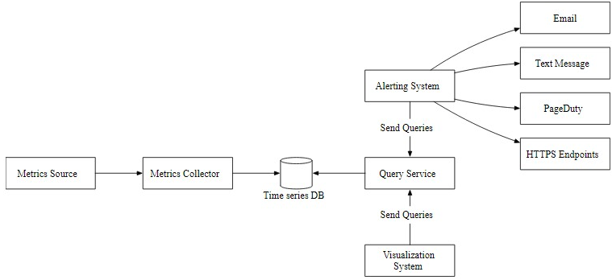

# Logging / Audit notes

::: tip
You never know what data you can collect today that will be useful to you tomorrow.
:::

<TagLinks />

## Correlation ID Pattern 

A correlation ID is a unique identifier assigned to a request as it enters a distributed system. It's propagated through all components involved in processing the request, serving as a thread that connects related log entries, metrics, and traces. This pattern is essential for debugging, monitoring, and troubleshooting complex distributed systems.


### How It Works
1. **Generation**: A correlation ID is typically generated at the entry point of a system (e.g., API gateway, load balancer).
2. **Propagation**: The ID is included in subsequent requests or messages as they move through the system. This can be done through headers, message bodies, or context propagation mechanisms.
3. **Correlation**: Log entries, metrics, and traces are enriched with the correlation ID. This allows for grouping related data points together for analysis.

### Benefits of Correlation ID
- **Improved Debugging**: By correlating log entries, developers can quickly identify the flow of a request and pinpoint issues.
- **Enhanced Monitoring**: Correlation IDs enable tracking request performance and identifying bottlenecks.
- **Facilitated Troubleshooting**: When problems occur, correlation IDs help to isolate the affected components.
- **Security Analysis**: Correlation IDs can aid in detecting suspicious activity by linking related events.

## Observer Pattern

The observers are objects that register themselves to the subject and react to the notifications. This pattern is useful for monitoring and logging, as it allows you to **decouple the logic of the subject from the logic of the observers, and to add or remove observers dynamically**.


## Comparision

### Logging vs Auditing

Logging typically means the **recording of implementation level events** that happen as the program is running (methods get called, objects are created, etc.). As such it focuses on things that interest programmers

Auditing is about **recording domain-level events**: a transaction is created, a user is performing an action, etc. In certain types of application (Banking) there is a legal obligation to record such events.

### Logging vs Tracing vs Metrics


Feature | Logging | Tracing | Metrics 
------- | ------- | --------  | --------
**Purpose** | Records discrete events or states within an application | Tracks the flow of requests through a distributed system. | Aggregates numerical data points over time to provide insights into system health and performance.
**Data** | Textual information, often including timestamps, severity levels, and additional context. | Time-stamped records of actions and their durations, forming a timeline of request execution. | Numerical values, often collected at regular intervals.
**Use Cases** | Debugging, auditing, security analysis, and troubleshooting specific issues. |  Identifying performance bottlenecks, understanding request latency, and diagnosing complex issues. | Monitoring system performance, detecting anomalies, and setting alerts.
**Examples** | Error messages, audit logs, configuration changes. | Distributed tracing, service maps, dependency analysis. | CPU usage, memory consumption, response times, error rates.

### Auditing vs. Profiling vs. Statistics 

Feature | Auditing | Profiling | Statistics 
------- | ------- | --------  | --------
**Focus** | Compliance, security, and accountability. | Performance and optimization. |  Data analysis and inference.
**Purpose** |  To examine records and processes to ensure adherence to rules, regulations, or standards. | To analyze system or application behavior to identify performance bottlenecks and areas for improvement. |  To collect, organize, analyze, interpret, and present data to draw conclusions.
**Methods** | Reviewing logs, documentation, and system activities. |  Measuring resource utilization, code execution time, and memory usage. | Descriptive statistics, inferential statistics, and data visualization.
**Example** |  Auditing financial transactions to detect fraud or ensuring compliance with data privacy regulations. | Profiling a web application to determine which parts are causing slow load times. |  Conducting a statistical analysis of customer behavior to identify trends and preferences.


- **Auditing**: this is sometimes a business requirement. The idea is to capture significant events that matter to the management or legal people. These are statements that describe usually what users of the system are doing (like who signed-in, who edited that, etc…).
- **Profiling**: as logs are timestamped (sometimes to the millisecond level), it can become a good tool to profile sections of a program, for instance by logging the start and end of an operation, you can either automatically (by parsing the log) or during troubleshooting infer some performance metrics without adding those metrics to the program itself.
- **Statistics**: if you log each time a certain event happens (like a certain kind of error or event) you can compute interesting statistics about the running program (or the user behaviors). It’s also possible to hook this to an alert system that can detect too many errors in a row.

## Practices  

Effective logging is crucial for maintaining a healthy and resilient system. Here are some key practices:

### Log Level Management
Use appropriate log levels:
- TRACE: Extremely detailed, used for debugging.
- DEBUG: Detailed information for diagnosing problems.
- INFO: General operational information.
- WARN: Potential issues or unexpected conditions.
- ERROR: Errors that prevent correct operation.
- FATAL: Critical errors that terminate the application.


### Log Formatting
- **Structured logging**: Use a structured format (JSON, XML, or custom) for easier parsing and analysis.
- **Include essential information**: Timestamp, thread ID, process ID, log level, class/method name, and message.
- **Consider additional context**: Correlation ID, user ID, IP address, environment, and exception details.

E.g: [Package bunyan for nodejs](https://www.npmjs.com/package/bunyan)

### Log Rotation
- Implement log rotation: Prevent log files from growing indefinitely.
- Retain logs appropriately: Balance storage requirements with troubleshooting needs.

### Log Aggregation and Centralization
- **Centralize logs**: Collect logs from multiple sources into a centralized repository.
- **Use a log management platform**: Tools like `Elasticsearch`, `Logstash`, and `Kibana` (ELK Stack) can help manage and analyze logs.

### Error Handling and Logging
- **Log exceptions**: Capture detailed exception information, including stack traces.
- **Provide context**: Include relevant data to understand the error's cause.
- **Avoid logging sensitive information**: Protect user data and security.

E.g: [Package verror for js](https://www.npmjs.com/package/verror)

### Performance Considerations
- Minimize log overhead: Avoid excessive logging that impacts performance.
- Optimize log formatting: Use efficient formats to reduce log size.
- Consider asynchronous logging: Improve performance by offloading log writing.

### Security
- Protect SENSITIVE information: Avoid logging sensitive data like passwords, credit card numbers, or personal information.
- Encrypt logs: Consider encrypting logs to protect data in transit and at rest.
- Implement access controls: Restrict access to log data to authorized personnel.

### Additional Tips
- Use a logging framework: Leverage existing libraries to simplify logging.
- Test your logging configuration: Ensure logs are generated as expected.
- Monitor log volume: Keep track of log growth to prevent issues.
- Review and refine logs: Regularly assess log effectiveness and make improvements.
- Avoid excessive logging: Overlogging can impact performance and storage.
- Don’t use `debug` level for system monitoring data


## Log what 

### Requests
- time / start / stop
- correlation id
- user agent
- IP / GPS / ... 
- user id / request id / idempotent key


### Errors and Exceptions:
Logging errors and exceptions is crucial for troubleshooting and debugging. It helps developers identify and fix issues quickly. When an error occurs, logging the relevant error message, stack trace, and any contextual information can provide valuable insights into the root cause of the problem.

```js
try {
    // Code that may throw an exception
} catch (Exception e) {
    logger.error("An error occurred: " + e.getMessage(), e);
}
```

    
### Performance Metrics / Availability

Logging performance metrics such as response times, database queries, or resource utilization can help identify bottlenecks and optimize the application's performance. This information can be valuable for capacity planning, load testing, and identifying areas for improvement.

- Slow queries
- Network error 
- At infra layer / firewall / gateway / ...

```java
long startTime = System.currentTimeMillis();
// Code to measure performance
long endTime = System.currentTimeMillis();
long executionTime = endTime - startTime;
logger.info("Execution time: " + executionTime + "ms");
```

### Configuration Changes

Logging configuration changes can help track modifications made to the application's settings or environment. 

This can be useful for troubleshooting issues related to configuration changes or **ensuring compliance** with security and regulatory requirements.


### User Actions

Logging user actions can be useful for auditing, security, and understanding user behavior. It can help track user interactions, identify patterns, and detect any suspicious or unauthorized activities.

```js
logger.info("User {username} logged in");
```

### Application Events
- Background threads / async job

Logging important application events can help track the flow of execution and provide a detailed history of the application's behavior. This includes logging when the application starts or stops, when specific actions are performed, or when significant milestones are reached.

### Third-Party Integrations

If your application integrates with external services or APIs, logging the interactions with these integrations can help diagnose issues and monitor their performance.


### Security Events/ Threats

Logging security-related events, such as failed login attempts, access control violations, or suspicious activities, can help detect and respond to potential security breaches

- suspicious activities
- unauthorized access to restricted processes or data
- invalid parameters or input
- warnings by the application’s security mechanisms.

### Trace Logging / Audit Trail
- correlation id

## What Not to Log
- large messages
- known errors, all errors  


### Personally Identifiable Information (PII)

PII includes sensitive data such as `names`, `emails`, `addresses`, `social security numbers`, `credit card details`, and other personally identifiable information. Logging this information can pose a significant risk to user privacy and may violate data protection laws.

```py
# Example: Logging PII should be avoided
logger.info(f"User {user_id} logged in with password {password}")
```

### Authentication Credentials
Logging usernames, passwords, or any other authentication credentials is highly discouraged. Storing this information in logs can lead to unauthorized access and compromise the security of user accounts.

```java
// Example: Avoid logging authentication credentials
logger.debug("User login attempt with username: " + username + " and password: " + password);
```

### Sensitive Business Data

Logging sensitive business data, such as trade secrets, financial information, or proprietary algorithms, can expose critical information to unauthorized individuals. It is crucial to protect this type of data from being logged.
```csharp
// Example: Avoid logging sensitive business data
logger.LogInformation("Customer XYZ purchased product ABC for $1000");
```

### Session Identifiers and Tokens

Session identifiers, access tokens, or any other session-related information should not be logged. These values can be used to impersonate users or gain unauthorized access to their accounts.
```javascript
// Example: Do not log session identifiers or tokens
console.log("Session ID: " + sessionId);
```

### Internal System Details

Logging internal system details, such as server configurations, database connection strings, or API keys, can expose critical infrastructure information to potential attackers. It is essential to keep this information confidential and not log it.

```ruby
# Example: Avoid logging internal system details
logger.debug("Database connection string: " + dbConnectionString);
```

## Architecture



- **Metrics source**: This can be application servers, SQL databases, message queues, etc.
- **Metrics collector**: It gathers metrics data and writes data into the time-series database.
- **Time-series database**: This stores metrics data as time series. It usually provides a custom query interface for analyzing and summarizing a large amount of time-series data. It maintains indexes on labels to facilitate the fast lookup of time-series data by labels. (prometheus / S3 / ...)
- **Kafka**: Kafka is used as a highly reliable and scalable distributed messaging platform. It decouples the data collection and data processing services from each other.
- **Consumers**: Consumers or streaming processing services such as Apache Storm, Flink and Spark, process and push data to the time-series database.
- **Query service**: The query service makes it easy to query and retrieve data from the time-series database. This should be a very thin wrapper if we choose a good time-series database. It could also be entirely replaced by the time-series database’s own query interface.
- **Alerting system**: This sends alert notifications to various alerting destinations.
- **Visualization system**: This shows metrics in the form of various graphs/charts.

**E.g Prometheus stack:**
- metrics source - your app 
- collector - promtail
- DB - prometheus/S3
- query service - loki
- visual - grafana, 
- alert is alertmanager


### Prometheus Architecture


### ELK 


## Refs

https://stackoverflow.com/questions/967970/what-information-should-i-be-logging-in-my-web-app

https://www.dataset.com/blog/the-10-commandments-of-logging/

https://www.freecodecamp.org/news/how-to-use-logs-effectively-in-your-code/

https://www.bloghoctap.com/security/authentication-authorization-va-accounting.html

[Four Minute Paper: Facebook’s time series database, Gorilla](https://jessicagreben.medium.com/four-minute-paper-facebooks-time-series-database-gorilla-800697717d72)


[Kubernetes Monitoring: Install Prometheus and Grafana using Helm](https://k21academy.com/docker-kubernetes/prometheus-grafana-monitoring/)