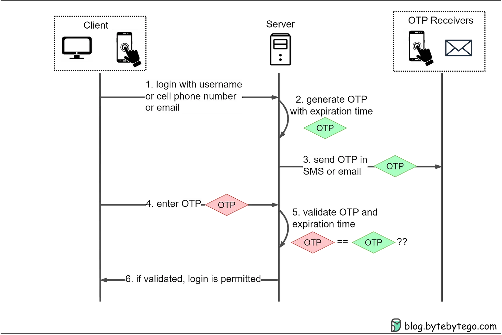
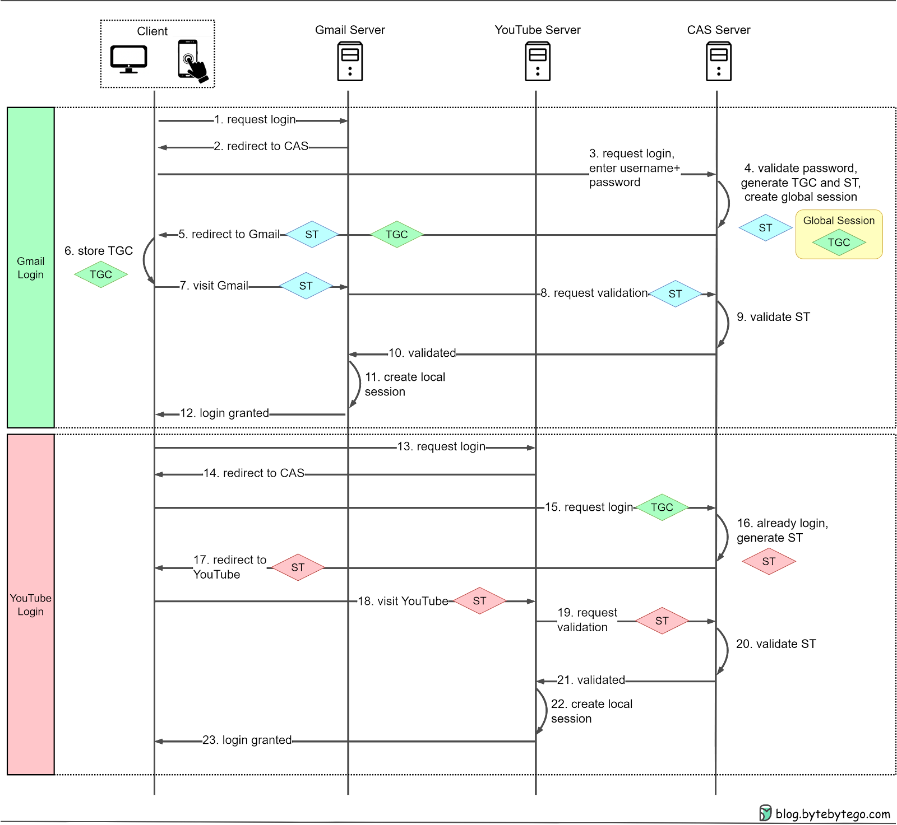

# Authentication

::: tip
Authentication is the act of proving an assertion, such as the identity of a computer system user.
:::

<TagLinks />


## Signal in Request 

There is always a sign in HTTP request to be used for Authenication

- URL: `/post/create?api_key=my_key`
- Cookie: SESSION_ID=CLIENT_TOKEN
- Authorization Header: `Authorization: my_token`
- Custom Header: `Authorization: my_token`
- Body: `content=...&token=my_token`


## Basic Authentication

::: tip
Basic Authentication is a method for an HTTP user agent (e.g., a web browser) to provide a `username` and `password` when making `a request.` 
:::

```
Authorization: Basic <credentials>
```

- The user’s username and password are combined with a `:` (colon) .
- The resulting string is base64 encoded.

**Pros**
- easy, most of browsers & servers support
- easy to integrate with other methods

**Cons**
- Username/password are easy to be leaked because of embeded in every request
- No feature call logout. Except remove browsing history 
- No friendly UI 


## Session-based Authentication

Sometimes, it was also called `cookie-based` authentication. 

::: tip
Session Authentication is a small file, most likely in JSON format, that stores information about the user, such as a unique ID, time of login and expirations, and so on. It is generated and `stored on the server` so that the server can keep track of the user requests.

The user receives some of these details, especially the ID, as cookies that will be sent with every new request, so that the server can recognize the ID and authorize the user’s requests.
:::

Used for monolith system, small website, PHP websites by default, ...


**Pros**
- Inforamtion hiding. Session Id is randomly generated without user infor
- Small size to transfer
- No need to handle at client too much, because all browsers support cookie by default behaviour
- Fully-controlled session. E.g: time to expire for login, force logout, ...

**Cons**
- take up a lot of storage in Server
- difficult to scale out because by default
	- Should configure Session storage to a global storage, all app instances
	- Or should remain the connection of `session id` and the serving `app instance`
- depends on domain 
- `CSRF` attacking


## Token-based Authentication

::: tip
A `token` is an authorization file that cannot be tampered with. It is generated by the server using a **secret key**, sent to and `stored by the user` in their local storage. Like in the case of cookies, the user sends this token to the server with every new request, so that the server can verify its signature and authorize the requests. 
:::

Used for system `Web API`, `Distributed system`, `micro-services`, system has multi-platform `mobile`, `IoT`, `server`,... or UI / API seperation


## Session-based vs Token-based Authentication

Session-based Auth |  Token-based Auth 
------------------ | ----------------
Server stateful, take up a lot of storage in Server | Server stateless, token has attribute `self-contained` 
SessionId at client has no user information | Token contains user information 
Small size to transfer | Bigger size 
Use only on 1 url domain | Token can be sent to many url domains 
No need to handle at client too much, browsers support cookie by default | More complicated handling at client. E.g Store token, refresh token, attach token to each request, ...
Be careful about `CSRF` | Prevent `CSRF`
Use for browsers | Not only browser-to-server but for server-to-server 
Server is difficult to scale out | Easy to scale out

**Criteria Comparision**

Criteria | Session-based Auth |  Token-based Auth 
-------- | ------------------ | ----------------
Which side stores the authentication details | Server  | Client (Browser)
What Client sends to Server to have their requests authorized | A cookie | Token 
What Server does to authorize users’ requests | Look up sesssionId requested by client on storage |  Decrypting the user’s token and verifying its signature
Kind of attacks the method may suffer | `Man-in-middle`, Cross-site request forgery (`CSRF`) | `Man-in-middle`, `Token steal`, breaches of the secret key
Force logout feature by admin | Fully-controlled session | Implemented by coding, make blocklist token, make server becomes stateful


See more: 
[Session vs Token Based Authentication](https://www.geeksforgeeks.org/session-vs-token-based-authentication/)

## Hash based Message Authentication Code (HMAC)

::: tip
Hash-based message authentication code (or HMAC) is a cryptographic authentication technique that uses a hash function and a secret key.

With HMAC, you can achieve authentication and verify that `data is correct` and authentic with shared secrets
:::


Two parties want to communicate, but they want to ensure that the contents of their connection remain private. They also distrust the internet, and they need a way to verify that the packets they receive haven't been tampered with. HMAC is a valid solution. 

**How it works**

1. HMACs provides client and server with a `shared private key` that is known only to them.

2. The client makes a unique hash (HMAC) for every request. When the client requests the server, it hashes the requested data with a private key and sends it as a part of the request. Both the message and key are hashed in separate steps making it secure. 

3. When the server receives the request, it makes its own HMAC. Both the HMACS are compared and if both are equal, the client is considered legitimate. 

The formula for HMAC:  
```
HMAC = hashFunc(secret key + message) 
```

**Example** [PUT method Amazon S3 documentation](http://s3.amazonaws.com/doc/s3-developer-guide/RESTAuthentication.html)

```ts
"Authorization: AWS " + AWSAccessKeyId + ":"  + base64(hmac-sha1(VERB + "\n" 
							     + CONTENT-MD5 + "\n" 
							     + CONTENT-TYPE + "\n" 
							     + DATE + "\n" 
							     + CanonicalizedAmzHeaders + "\n" 
							     + CanonicalizedResource))
```

```
PUT /quotes/nelson HTTP/1.0
Authorization: AWS 44CF9590006BF252F707:jZNOcbfWmD/A/f3hSvVzXZjM2HU=
Content-Md5: c8fdb181845a4ca6b8fec737b3581d76
Content-Type: text/html
Date: Thu, 17 Nov 2005 18:49:58 GMT
X-Amz-Meta-Author: foo@bar.com
X-Amz-Magic: abracadabra
```

**Usage scenarios**
- Verification of e-mail address during activation or creation of an account.
- Authentication of form data that is sent to the client browser and then submitted back.
- HMACs can be used for Internet of things (IoT) due to less cost.
- Whenever there is a need to reset the password, a link that can be used once is sent without adding a server state.
- It can take a message of any length and convert it into a fixed-length message digest. That is even if you got a long message, the message digest will be small and thus permits maximizing bandwidth.

See more:
- [What is HMAC?](https://www.geeksforgeeks.org/what-is-hmachash-based-message-authentication-code/)
- [HMAC Definition](https://www.okta.com/identity-101/hmac/)


## Open Authentication (OAuth)

::: tip 
`OAuth` ra đời nhằm giải quyết vấn đề trên và xa hơn nữa, đây là một phương thức chứng thực giúp các ứng dụng có thể chia sẻ tài nguyên với nhau mà không cần chia sẻ thông tin username và password.
:::

- **Ứng dụng**  (website hoặc mobile app)yêu cầu ủy quyền để truy cập vào **Resource Server** (Gmail,Facebook, Twitter hay Github…) thông qua User
- Nếu **User** ủy quyền cho yêu cầu trên, **Ứng dụng** sẽ nhận được *`ủy quyền từ phía User`* (dưới dạng một token string)
- **Ứng dụng** gửi thông tin *`định danh`* (ID) của mình kèm theo *`ủy quyền của User`* tới **Authorization Server**
- Nếu *`thông tin định danh`* được xác thực và ủy quyền hợp lệ, **Authorization Server** sẽ trả về cho **Ứng dụng** *`access_token`*. Đến đây quá trình ủy quyền hoàn tất.
- Nếu *`access_token`* hợp lệ, **Resource Server** sẽ trả về dữ liệu của tài nguyên đã được yêu cầu cho **Ứng dụng**.


Tóm tắt [bài viết gốc](https://viblo.asia/p/authentication-story-part-1-authentication-la-lam-gi-63vKj2YMK2R)

## Passwordless Authentication

When it comes to authentication, there are three factors to consider:
- Knowledge factors: something you know, such as a password
- Ownership factors: something you own, such as a device or phone number
- Inherence factors: something unique to you, such as your biometric features

### One-Time Passwords (OTP)

Step 1: The user wants to log in to a website and is asked to enter a username, cell phone number, or email.

Step 2: The server generates an OTP with an expiration time.

Step 3: The server sends the OTP to the user’s device via SMS or email.

Step 4: The user enters the OTP received in the login box.

Step 5-6: The server compares the generated OTP with the one the user entered. If they match, login is granted.




### Single Sign-On (SSO)

When a principal tries to access a resource, she is directed to authenticate with an **identity provider**. Once identity provider is satisfied that the principal has been authenticated, it gives informatin to the **service provider**, allowing it to decide whether to grant her access to the resource.

- **Identity provider** could be an externally hosted system, or something inside your own organization. 
    - Goolge, for example, provides an OpenID Connect identity provider.
    - For enterprises, it's common to have your own identity provider, which may be linked to your company's directory service - It could be s.th like *Lightweight Directory Access Protocol (LDAP)* or *Active Directory*


The SSO process mainly relies on a **Central Authentication Service (CAS)** server. Here's a step-by-step breakdown of the SSO process:

1. When we attempt to log in to an application, such as Gmail, we're redirected to the **CAS** server.
2. The **CAS** server verifies our login credentials and creates a **Ticket Granting Ticket (TGT)**. This **TGT** is then stored in a **Ticket Granting Cookie (TGC)** on our browser, **representing our global session.**
3. CAS generates a **Service Ticket (ST)** for our visit to Gmail and redirects us back to Gmail with the **ST**.
4. Gmail uses the **ST** to validate our login with the **CAS** server. After validation, we can access Gmail.

When we want to access another application, like YouTube, the process is simplified:
- Since we already have a **TGC** from our Gmail login, **CAS** recognizes our authenticated status.
- **CAS** generates a new **ST** for YouTube access, and we can use YouTube without inputting our credentials again.

This process reduces the need to remember and enter multiple sets of credentials for different applications.



- SSO: Single Sign-On 
- CAS: Central Authentication Service 
- TGT: Ticket Granting Ticket
- TGC: Ticket Granting Cookie
- ST: Service Ticket