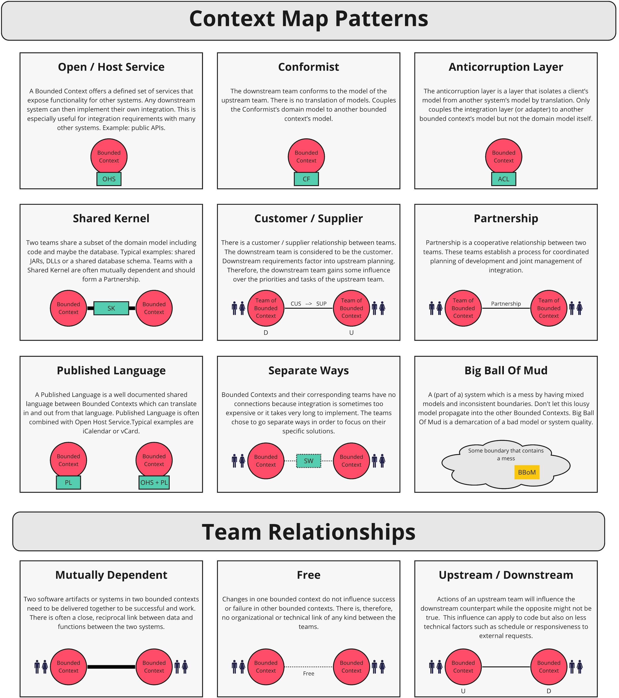

# Context Mapping

Context mapping is a tool that allows developers and domain experts to identify the relationship between bounded contexts and the relationship between the teams that are responsible for them.

## Patterns

- [ddd-crew / context mapping](https://github.com/ddd-crew/context-mapping)
- [Vladik Khononov / Chapter 4. Context Mapping](https://www.oreilly.com/library/view/what-is-domain-driven/9781492057802/ch04.html)

There are different ways of how we can integrate between two or more bounded contexts

### Partnership

When teams in two Contexts will succeed or fail together, a cooperative relationship needs to emerge. The teams institute a process for coordinated planning of development and joint management of integration. The teams must cooperate on the evolution of their interfaces to accommodate the development needs of both systems. Interdependent features should be scheduled so that they are completed for the same release.

### Shared Kernel

Sharing part of the model and associated code forms a very intimate interdependency, which can leverage design work or undermine it. Designate with an explicit boundary some subset of the domain model that the teams agree to share. Keep the kernel small. This explicit shared stuff has special status and shouldn’t be changed without consultation with the other team. Define a continuous integration process that will keep the kernel model tight and align the Ubiquitous Language of the teams.

### Customer-Supplier 

When two teams are in an upstream-downstream relationship, where the upstream team may succeed interdependently of the fate of the downstream team, the needs of the downstream team come to be addressed in a variety of ways with a wide range of consequences. Downstream priorities factor into upstream planning. Negotiate and budget tasks for downstream requirements so that everyone understands the commitment and schedule.

### Conformist

When two development teams have an upstream/downstream relationship in which the upstream team has no motivation to provide for the downstream team’s needs, the downstream team is helpless. Altruism may motivate upstream developers to make promises, but they are unlikely to be fulfilled. The downstream team eliminates the complexity of translation between bounded contexts by slavishly adhering to the model of the upstream team.

### Anticorruption Layer

Translation layers can be simple, even elegant, when bridging well-designed Bounded Contexts with cooperative teams. But when control or communication is not adequate to pull off a shared kernel, partner, or customer-supplier relationship, translation becomes more complex. The translation layer takes on a more defensive tone. As a downstream client, create an isolating layer to provide your system with functionality of the upstream system in terms of your own domain model. This layer talks to the other system through its existing interface, requiring little or no modification to the other system. Internally, the layer translates in one or both directions as necessary between the two models.

### Open Host Service

Define a protocol that gives access to your subsystem as a set of services. Open the protocol so that all who need to integrate with you can use it. Enhance and expand the protocol to handle new integration requirements, except when a single team has idiosyncratic needs. The, use a one-off translator to augment the protocol for that special case so that the shared protocol can stay simple and coherent.

### Published Language

The translation between the models of two Bounded Contexts requires a common language. Use a well-documented shared language that can express the necessary domain information as a common medium of communication, translating as necessary into and out of that language. Published Language is often combined with Open Host Service.

### Separate Ways

We must be ruthless when it comes to defining requirements. If two sets of functionality have no significant relationship, they can be completely cut loose from each other. Integration is always expensive, and sometimes the benefit is small. Declare a Bounded Context to have no connection to the others at all, enabling developers to find simple, specialized solutions within this small scope.

### Big Ball of Mud

As we survey existing systems, we find that, in fact, there are parts of systems, often large ones, where models are mixed and boundaries are inconsistent. Draw a boundary around the entire mess and designate it a Big Ball of Mud. Do not try to apply sophisticated modeling within this Context. Be alert to the tendency for such systems to sprawl into other Contexts.

## Example e-commerce
E-commerce systems are complex and often involve multiple bounded contexts. Understanding the relationships between these contexts is crucial for effective system design and development. Here are some common DDD context mapping patterns used in e-commerce:

### 💎 Core Patterns
**Customer-Supplier:**
- Example: Order Management (consumer) relies on Product Catalog (supplier) for product information.
- Implementation: REST API, message queues

**Anti-Corruption Layer (ACL):**
- Example: Integrating with a legacy payment gateway.
- Implementation: Adapter pattern, facade pattern

**Shared Kernel:**
- Example: Core product information shared between Product Catalog and Inventory Management.
- Implementation: Shared codebase, shared library

**Partnership:**
- Example: Order Management and Fraud Detection tightly collaborating.
- Implementation: Shared team, joint decision-making

### 💎 Additional Patterns
**Open Host Service:**
- Example: Product Catalog exposing a public API for third-party integrations.
- Implementation: REST API, GraphQL

**Published Language:**
- Example: Defining a common product data format for use across different systems.
- Implementation: XML, JSON schema

### 💎 Specific Considerations
- **Multiple Channels**: Different sales channels (website, mobile app, marketplace) might be separate bounded contexts.
- **Third-Party Integrations**: Payment gateways, shipping providers, and other external systems often require ACLs or Customer-Supplier relationships.
- **Data Consistency**: Ensure data consistency between bounded contexts, especially for shared data (e.g., product information).
- **Performance**: Optimize communication between contexts to avoid performance bottlenecks.

## Comparision

### Consumer-Supplier	vs Upstream-Downstream
Feature	| Consumer-Supplier	| Upstream-Downstream
----- | ---- | ----
Emphasis	| Dependency |	Data flow
Relationship |	Consumer relies on supplier	 | Upstream produces data for downstream
Implications |	Consumer affected by supplier changes |	Downstream influenced by upstream changes

### Shared Kernel vs Partnership

**Shared Kernel**
- Strong coupling: Both bounded contexts share the same codebase or model.
- Joint ownership: Changes require agreement from both teams.
- High risk: Changes can impact both contexts.
- Best suited for: Highly cohesive domains with a small, trusted team.

**Partnership**
- Loose coupling: Teams collaborate closely but maintain separate codebases.
- Shared responsibility: Both teams contribute to the shared domain.
- Lower risk: Changes are more isolated.
- Best suited for: Larger teams, complex domains, or when there's a need for more independence.

Feature |	Shared Kernel	| Partnership
----- | ---- | ----
Coupling	| High	| Loose
Ownership |	Joint	| Shared
Risk	| High	 | Lower
Complexity	| High	 | Lower
Collaboration	| Required |	Essential