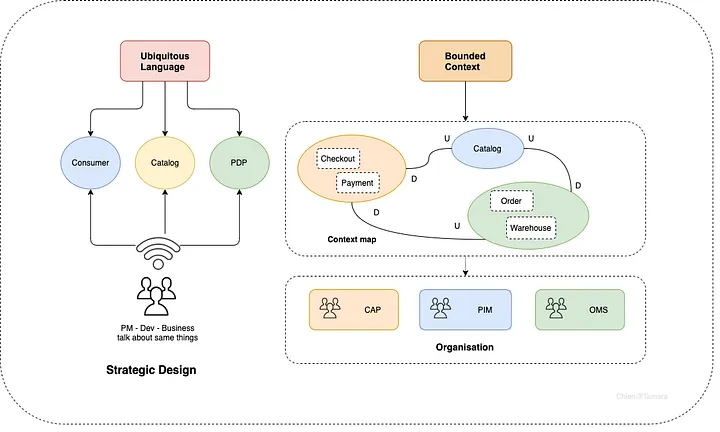
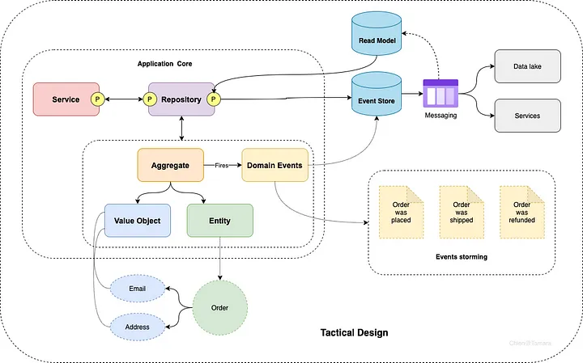
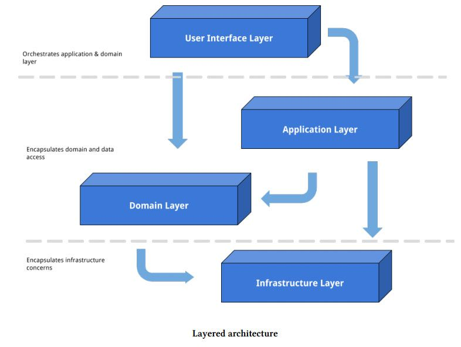
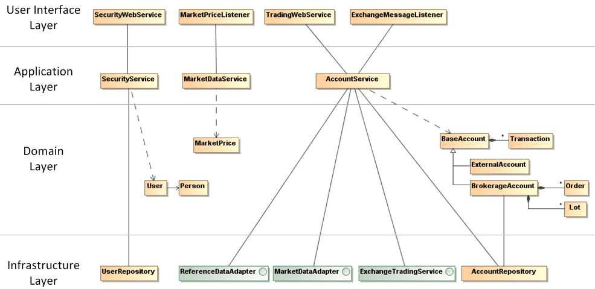

# Domain Driven Design

<TagLinks />

::: tip Domain-Driven Design
is an approach to software development for complex needs by connecting the implementation to an evolving model:
- placing the project's primary focus on the core domain and domain logic
- basing complex designs on a model of the domain
- initiating a creative collaboration between technical and domain experts to iteratively refine a conceptual model that addresses particular domain problems.
:::

It provides us with `strategic and tactical modeling tools` to aid designing high-quality software that meets our business goals.

## Strategic patterns
Strategic pattern helps you design your domains, sub-domains that are communicated by the ubiquitous language then support you to organize/structure your teams based on that outcome.

- U: Upstream
- D: Downstream

## Tactical patterns
Tactical pattern will guide you on how to implement your application in a scaling way.

## Relationship between DDD and Microservices

The relationship between microservices and DDD lies in their shared goals of modularization and encapsulation. Microservices promote the idea of **breaking down a monolithic application into smaller**, more manageable services, each with its own bounded context. This aligns well with the concept of bounded contexts in DDD, where **each context represents a distinct part of the business domain**.

By applying DDD principles within each microservice, developers can **create a clear separation of concerns** and ensure that each **service focuses on a specific business capability**. This allows for **better maintainability**, as changes to one part of the system are less likely to impact other parts. Additionally, DDD helps in designing the microservices internal structure, such as defining aggregates and their boundaries, which further **enhances the modularity and encapsulation** of the system.

DDD also provides a set of patterns and concepts that can be applied at the system level when designing the interactions between microservices. For example, the concept of domain events can be used to enable loose coupling and asynchronous communication between services. Events can be published by one microservice and consumed by others, allowing for eventual consistency and decoupling of services.

## Key terms

### Domain
The domain refers to the specific area or subject matter of the problem being solved. It represents the business or technical area that the software system is built for.

### Domain Model
The domain model is a representation of the domain concepts, rules, and relationships. It captures the essential aspects of the problem domain and serves as a shared understanding between developers and domain experts.

### Ubiquitous Language
Ubiquitous language is a language shared by all team members, including developers, domain experts, and stakeholders. It is a common vocabulary that helps bridge the communication gap between technical and non-technical stakeholders.

### Bounded Context
A bounded context is a specific boundary within which a particular model, language, and set of concepts apply. It defines the scope and context of a specific part of the domain. Bounded contexts help manage complexity and ensure clarity within different parts of a software system.

### Aggregates
Aggregates are clusters of related objects that are treated as a single unit. They encapsulate a set of entities and value objects and enforce consistency and integrity rules within the boundaries of the aggregate.

### Entities
Entities are objects that have a unique identity and are distinguishable from other objects based on their attributes. They have a lifecycle and can change over time while maintaining their identity.

### Value Objects
Value objects are objects that represent a concept or a piece of information. They are immutable and do not have a unique identity. Value objects are often used to encapsulate attributes or behaviors that are not associated with a specific entity.

### Repositories
Repositories provide an abstraction for accessing and persisting domain objects. They encapsulate the logic for retrieving and storing aggregates, allowing the domain model to remain decoupled from the underlying data storage.

### Services
Services represent operations or behaviors that do not naturally belong to a specific entity or value object. They encapsulate domain logic that operates on multiple objects or coordinates interactions between objects.

### Domain Events
Domain events are messages or notifications that capture something significant that has happened within the domain. They represent a change or an occurrence that other parts of the system might be interested in.

## Knowledge Crunching
Knowledge crunching is the process of deeply investigating and analyzing domain knowledge to extract the essential information needed to build a robust domain model. It involves sifting through a wealth of information, identifying patterns, and distilling complex concepts into a simplified, understandable form.

### Key aspects of knowledge crunching:
- **Collaboration**: Typically involves close collaboration between developers and domain experts.
- **Extraction**: Focuses on extracting the most relevant information from a vast amount of data.
- **Domain Modeling**: Aims to create a clear and accurate representation of the domain.
- **Iterative Process**: Often involves multiple rounds of refinement and adjustment.

### Popular Techniques for Knowledge Crunching:
- **Event Storming**: A collaborative workshop format to explore the domain through events.
- **Event Modeling**: A visual approach to understanding the domain by modeling events and their relationships.

In essence, knowledge crunching is the foundation for effective Domain-Driven Design (DDD). By thoroughly understanding the domain, developers can create software solutions that closely align with business requirements.

### Decomposing Domain Knowledge 

Decomposing domain knowledge into generic, core, and supporting domains is a crucial step in DDD to effectively manage complexity and focus on the core business capabilities.

**Understanding the Domains**
- **Core Domain**: The heart of your business. It represents the unique value proposition and competitive advantage. It demands the most attention, resources, and innovation.
    - Example: For an e-commerce platform, the core domain might be product catalog management, order processing, and inventory management.
- **Supporting Domain**: Provides essential services to the core domain but doesn't directly contribute to the competitive advantage. They are often shared across different parts of the system.
    - Example: For an e-commerce platform, supporting domains might include user management, search, and payment processing.
- **Generic Domain**: Contains well-understood and standardized business capabilities that are not unique to your business. They can often be purchased as off-the-shelf solutions.
    - Example: For an e-commerce platform, generic domains might include email, logging, and caching.

**Example: E-commerce Platform**
- **Core Domain**: Product catalog, order processing, inventory management, pricing, promotions.
- **Supporting Domain**: User management, search, payment processing, shipping, returns.
- **Generic Domain**: Email, logging, caching, security.

#### Steps to Decompose Domain Knowledge
- **Identify the Problem Space**: Clearly define the business problem you're trying to solve.
- **Identify Core Capabilities**: Determine the unique value propositions and competitive advantages.
- **Identify Supporting Capabilities**: Identify the essential services needed to support the core domain.
- **Identify Generic Capabilities**: Identify the standardized business capabilities that can be outsourced or purchased.
- **Refine and Iterate**: Continuously refine the domain decomposition as understanding grows.

## Layered Architecture

More detail

<!-- ## Typical Scenario
 -->

### Example

## References 

- [BoundedContext](https://martinfowler.com/bliki/BoundedContext.html)
- [Domain-driven design](https://en.wikipedia.org/wiki/Domain-driven_design)
- [DDD - Introduction](https://archfirst.org/domain-driven-design/)
- [DDD - Layered Architecture](https://archfirst.org/domain-driven-design-6-layered-architecture/)
- [Domain-Driven-Design](https://khalilstemmler.com/articles/domain-driven-design-intro/)
- [The 6 Most Common Types of Logic in Large Applications](https://khalilstemmler.com/articles/software-design-architecture/organizing-app-logic/)
- [https://dddcommunity.org/](https://dddcommunity.org/resources/ddd_terms/)
- [ddd-by-examples](https://github.com/ddd-by-examples/library.git)