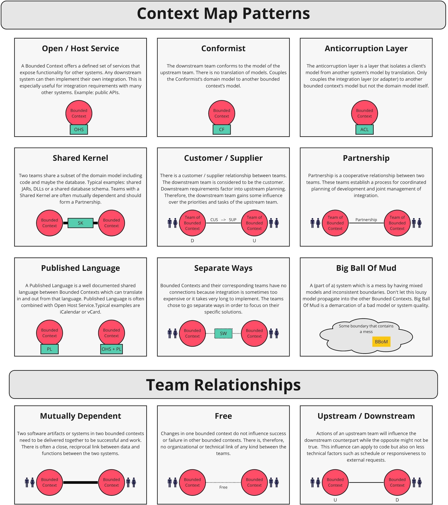

# Domain Driven Design

<TagLinks />

::: tip Domain-Driven Design
is an approach to software development for complex needs by connecting the implementation to an evolving model:
- placing the project's primary focus on the core domain and domain logic
- basing complex designs on a model of the domain
- initiating a creative collaboration between technical and domain experts to iteratively refine a conceptual model that addresses particular domain problems.
:::

It provides us with `strategic and tactical modeling tools` to aid designing high-quality software that meets our business goals.

## Strategic patterns
Strategic pattern helps you design your domains, sub-domains that are communicated by the ubiquitous language then support you to organize/structure your teams based on that outcome.

- U: Upstream
- D: Downstream

## Tactical patterns
Tactical pattern will guide you on how to implement your application in a scaling way.

## Relationship between DDD and Microservices

The relationship between microservices and DDD lies in their shared goals of modularization and encapsulation. Microservices promote the idea of **breaking down a monolithic application into smaller**, more manageable services, each with its own bounded context. This aligns well with the concept of bounded contexts in DDD, where **each context represents a distinct part of the business domain**.

By applying DDD principles within each microservice, developers can **create a clear separation of concerns** and ensure that each **service focuses on a specific business capability**. This allows for **better maintainability**, as changes to one part of the system are less likely to impact other parts. Additionally, DDD helps in designing the microservices internal structure, such as defining aggregates and their boundaries, which further **enhances the modularity and encapsulation** of the system.

DDD also provides a set of patterns and concepts that can be applied at the system level when designing the interactions between microservices. For example, the concept of domain events can be used to enable loose coupling and asynchronous communication between services. Events can be published by one microservice and consumed by others, allowing for eventual consistency and decoupling of services.

## Key terms

### Domain
The domain refers to the specific area or subject matter of the problem being solved. It represents the business or technical area that the software system is built for.

### Domain Model
The domain model is a representation of the domain concepts, rules, and relationships. It captures the essential aspects of the problem domain and serves as a shared understanding between developers and domain experts.

### Ubiquitous Language
Ubiquitous language is a language shared by all team members, including developers, domain experts, and stakeholders. It is a common vocabulary that helps bridge the communication gap between technical and non-technical stakeholders.

### Bounded Context
A bounded context is a specific boundary within which a particular model, language, and set of concepts apply. It defines the scope and context of a specific part of the domain. Bounded contexts help manage complexity and ensure clarity within different parts of a software system.

### Aggregates
Aggregates are clusters of related objects that are treated as a single unit. They encapsulate a set of entities and value objects and enforce consistency and integrity rules within the boundaries of the aggregate.

### Entities
Entities are objects that have a unique identity and are distinguishable from other objects based on their attributes. They have a lifecycle and can change over time while maintaining their identity.

### Value Objects
Value objects are objects that represent a concept or a piece of information. They are immutable and do not have a unique identity. Value objects are often used to encapsulate attributes or behaviors that are not associated with a specific entity.

### Repositories
Repositories provide an abstraction for accessing and persisting domain objects. They encapsulate the logic for retrieving and storing aggregates, allowing the domain model to remain decoupled from the underlying data storage.

### Services
Services represent operations or behaviors that do not naturally belong to a specific entity or value object. They encapsulate domain logic that operates on multiple objects or coordinates interactions between objects.

### Domain Events
Domain events are messages or notifications that capture something significant that has happened within the domain. They represent a change or an occurrence that other parts of the system might be interested in.

## Context Mapping

Context mapping is a tool that allows developers and domain experts to identify the relationship between bounded contexts and the relationship between the teams that are responsible for them.

There are different ways of how we can integrate between two or more bounded contexts

### Partnership

When teams in two Contexts will succeed or fail together, a cooperative relationship needs to emerge. The teams institute a process for coordinated planning of development and joint management of integration. The teams must cooperate on the evolution of their interfaces to accommodate the development needs of both systems. Interdependent features should be scheduled so that they are completed for the same release.

### Shared Kernel

Sharing part of the model and associated code forms a very intimate interdependency, which can leverage design work or undermine it. Designate with an explicit boundary some subset of the domain model that the teams agree to share. Keep the kernel small. This explicit shared stuff has special status and shouldn’t be changed without consultation with the other team. Define a continuous integration process that will keep the kernel model tight and align the Ubiquitous Language of the teams.

### Customer-Supplier Development

When two teams are in an upstream-downstream relationship, where the upstream team may succeed interdependently of the fate of the downstream team, the needs of the downstream team come to be addressed in a variety of ways with a wide range of consequences. Downstream priorities factor into upstream planning. Negotiate and budget tasks for downstream requirements so that everyone understands the commitment and schedule.

### Conformist

When two development teams have an upstream/downstream relationship in which the upstream team has no motivation to provide for the downstream team’s needs, the downstream team is helpless. Altruism may motivate upstream developers to make promises, but they are unlikely to be fulfilled. The downstream team eliminates the complexity of translation between bounded contexts by slavishly adhering to the model of the upstream team.

### Anticorruption Layer

Translation layers can be simple, even elegant, when bridging well-designed Bounded Contexts with cooperative teams. But when control or communication is not adequate to pull off a shared kernel, partner, or customer-supplier relationship, translation becomes more complex. The translation layer takes on a more defensive tone. As a downstream client, create an isolating layer to provide your system with functionality of the upstream system in terms of your own domain model. This layer talks to the other system through its existing interface, requiring little or no modification to the other system. Internally, the layer translates in one or both directions as necessary between the two models.

### Open Host Service

Define a protocol that gives access to your subsystem as a set of services. Open the protocol so that all who need to integrate with you can use it. Enhance and expand the protocol to handle new integration requirements, except when a single team has idiosyncratic needs. The, use a one-off translator to augment the protocol for that special case so that the shared protocol can stay simple and coherent.

### Published Language

The translation between the models of two Bounded Contexts requires a common language. Use a well-documented shared language that can express the necessary domain information as a common medium of communication, translating as necessary into and out of that language. Published Language is often combined with Open Host Service.

### Separate Ways

We must be ruthless when it comes to defining requirements. If two sets of functionality have no significant relationship, they can be completely cut loose from each other. Integration is always expensive, and sometimes the benefit is small. Declare a Bounded Context to have no connection to the others at all, enabling developers to find simple, specialized solutions within this small scope.

### Big Ball of Mud

As we survey existing systems, we find that, in fact, there are parts of systems, often large ones, where models are mixed and boundaries are inconsistent. Draw a boundary around the entire mess and designate it a Big Ball of Mud. Do not try to apply sophisticated modeling within this Context. Be alert to the tendency for such systems to sprawl into other Contexts.

### Cheatsheet

- [ddd-crew / context mapping](https://github.com/ddd-crew/context-mapping)
- [Vladik Khononov / Chapter 4. Context Mapping](https://www.oreilly.com/library/view/what-is-domain-driven/9781492057802/ch04.html)

## Layered Architecture

More detail

<!-- ## Typical Scenario
 -->

### Example

## References 

- [BoundedContext](https://martinfowler.com/bliki/BoundedContext.html)
- [Domain-driven design](https://en.wikipedia.org/wiki/Domain-driven_design)
- [DDD - Introduction](https://archfirst.org/domain-driven-design/)
- [DDD - Layered Architecture](https://archfirst.org/domain-driven-design-6-layered-architecture/)
- [Domain-Driven-Design](https://khalilstemmler.com/articles/domain-driven-design-intro/)
- [The 6 Most Common Types of Logic in Large Applications](https://khalilstemmler.com/articles/software-design-architecture/organizing-app-logic/)
- [https://dddcommunity.org/](https://dddcommunity.org/resources/ddd_terms/)
- [ddd-by-examples](https://github.com/ddd-by-examples/library.git)