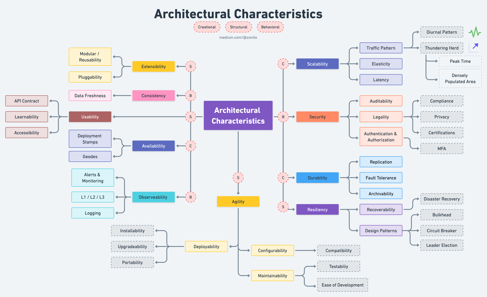

# Architecture Overview

## Architecture Characterics

### Creational
- Availablility
    - Deployment Stamps
    - Geodes
- Scalability
    - Traffic Pattern
        - Diurnal Pattern
        - Thundering Herd
            - Peak Time
            - Densely Populated Area
    - Elasticity
    - Latency
- Durability
    - [Replication](../db/architect.md#replication)
    - Fault Tolerance
    - Archivability

### Behavioral
- Consistency
    - Data Freshness
- Observeability
    - Alerts & Monitoring
    - L1 / L2 / L3
    - [Logging](./audit.md)
- [Security](../common/security/software-security.md)
    - Auditability
    - Legality
        - Compliance
        - Privacy
        - Certifications
    - [Authentication](./authenication.md) & [Authorization](./authorization.md)
        - MFA

### Structural

- Agility
    - [Deployability](../common/deployment/deploy-strategies.md)
        - Installability
        - Upgradeability
        - Portability
    - Configurability
        - Compatibility
    - Maintainability
        - Testability
        - Ease of Development
- Extensibility
    - Modular / Reusability
    - Pluggability
- Usability
    - API Contract
    - Learnability
    - Accessibility
- Resiliency
    - [Recoverability](../aws/architecture.md#disaster-recovery-options)
        - Disaster Recovery
    - Design Patterns
        - Bulkhead
        - Circuit Breaker
        - Leader Election

## Core responsibilities of the evolutionary architect: 
- **Vision**: ensure there is a clearly comunicated technical vision for the system that will help your system meet the requirements of your customers & organization.
- **Empathy**: Understand the impact of your decisions on your customers & colleagues.
- **Collaboration**: Engage with as many of your peers & colleagues as possible to help define, refine, and execute the vision.
- **Adaptability**: make sure that the technical vision changes as your customers or organization requires it.
- **Autonomy**: find the right balance between standardizing & enabling autonomy for your teams.
- **Governance**: ensure that the system being implemented fits the technical vision.

## Right tool for right job
- **Object-Oriented Programming** is the tool best suited for defining how we cross architectural boundaries with polymorhpism and plugins
- **Functional Programming** is the tool we use to push data to the boundaries of our applications
- and **Structured programming** is the tool we use to write algorithms

:::: quote
- Object-Oriented Programming makes code understandable by encapsulating (isolating) moving parts (complexity).
- Functional programming makes code understandable by minimizing (reducing) moving parts (complexity).

::: right 
― Michael Feathers
:::
::::

- [📓 Functional in the small, OO in the large](https://www.johndcook.com/blog/2009/03/23/functional-in-the-small-oo-in-the-large/)
- [Functional Core, Imperative Shell – Using Structured Concurrency to Write Maintainable gRPC Endpoints in Kotlin](https://doordash.engineering/2022/07/26/functional-core-imperative-shell-using-structured-concurrency-to-write-maintainable-grpc-endpoints-in-kotlin/)

## Communication Style

- [Messaging - Async Communication](./messaging.md)
- [RestFull - Sync Communication](./restful.md)
- [Orchestration Vs. Choreography](./OrchestrationVsChoreography.md)

## Clean Architecture
:::: quote
**The goal of software architecture** is to minimize the human resources required to build and maintain the required system. - *Uncle Bob*
::::

**Function** or **Architecture**:

> If you give me a program that works perfectly but impossible to change, then it won't work when the requirements change, and I won't be able to make it work. Therefore the program will becomme **useless**.

> If you give me a program that does not work but easy to change, then I can make it work, and keep it working as requirements change. Therefor the program will remain continually **useful**.

The Architecture of a software system is the shape given to that system by those who build it. The form of that shape is in the division of that system into components, the arrangement of those components, and the ways in which those components communicate with each other.

That purpose of that shape is to facilitate the development, deployment, operation, and maintenance of the software system contained within it.

::: tip
The strategy behind that facilitation is to leave as many options open as possible, for as long as possible.
:::

## Stack

