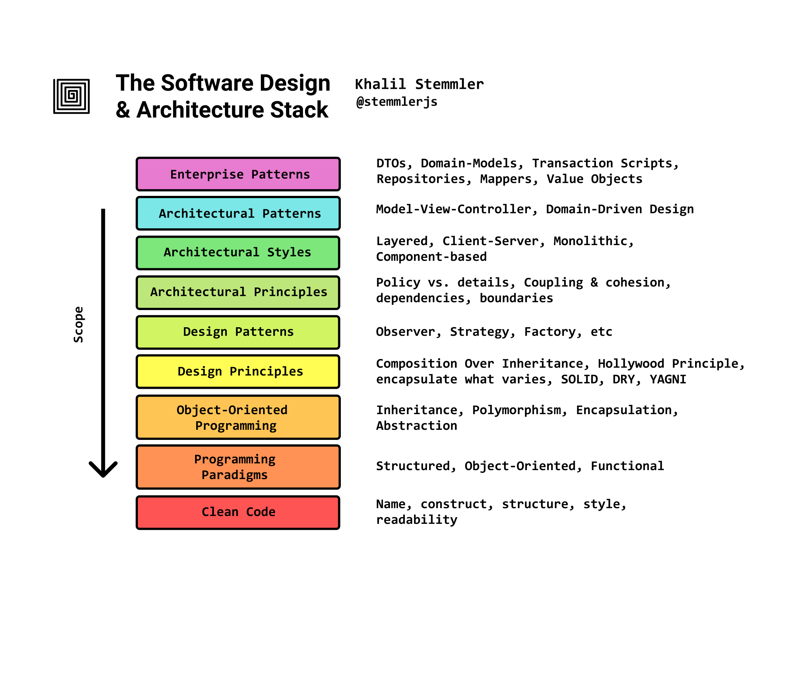

# Architecture Overview

:::: quote
**The goal of software architecture** is to minimize the human resources required to build and maintain the required system. - *Uncle Bob*
::::

**Function** or **Architecture**:

> If you give me a program that works perfectly but impossible to change, then it won't work when the requirements change, and I won't be able to make it work. Therefore the program will becomme **useless**.

> If you give me a program that does not work but easy to change, then I can make it work, and keep it working as requirements change. Therefor the program will remain continually **useful**.

The Architecture of a software system is the shape given to that system by those who build it. The form of that shape is in the division of that system into components, the arrangement of those components, and the ways in which those components communicate with each other.

That purpose of that shape is to facilitate the development, deployment, operation, and maintenance of the software system contained within it.

::: tip
The strategy behind that facilitation is to leave as many options open as possible, for as long as possible.
:::

## Stack

