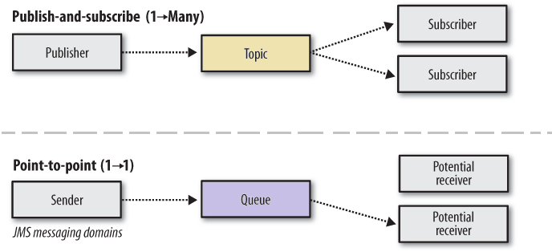

# Messaging

<TagLinks />

- asynchronous communication 
- one-to-one communication (queuing model) 
- one-to-many (Pub/Sub model) 

## Performance characterization

::: tip Scalability
How system is able to handle increases in load without noticeable degradation of latency & availability. Here, load can mean things such as the no. of topics, consumers, producers, messages / sec, ...
:::

::: tip Availability
In a distributed system, a variety of problems can occur at a unit level( servers, disks, network, and so on). The system's availability is a measure of how resilient the system is to these failures so that it is available to end users.
:::

::: tip Latency
how much time it taks for a message to get to a consumer from a producer.
:::

::: tip Throughput
how many messages can be processed / sec by messaging system.
:::

## Broker-based messaging

- A broker is a component that acts as the intermediary in messaging system. 
- The clients connect to the broker and not to each other directly
    - **Producers** connect to the broker & send messages to a specific queue.
    - **Consumers** connect to the broker & specify queue name from which they want to read messages.

### Broker responsibilities:
- **Maintaining the mapping of queues, producers, and consumers reliably**: storing the messages in a durable format
- **Handling message production**: storing messages written by the producers
- **Handling message consumption**: ensuring that consumers reliably get messages & providing constructs to avoid duplicate messages.
- **Routing and transformation**: may transform or maintain multiple copies for each mesages to enable various topology models.

::: tip Advantages 
- There is clear segregation btw connected services.
- Producer & consumer lifetimes don't have to overlap.
:::

::: warning Disadvantages
- The broker can become a bottleneck, where all messages need to squeeze through. This can affect performance
- There is not network I/O which is absolutely necessary
:::

## Models

### Queuing Model
- If more than 1 consumer is registered in the queuing model, each message is delivered to *only one* consumer, thereby enabling load-balancing semantics for message consumption & processing.
- There are 2 ways in which consumers can get to the messages: 
    - **Pull mode**: the messaging client in the consumer periodically polls the broker to check for any new messages.
    - **Push mode**: the consumers register an endpoint and produced messages are sent to the URL using protocols such as HTTPs `POST`

### Pub/Sub Model
- Each consumer gets a copy of the message.
- Messaging systems also provide load balancing semantics with **Topics** using something called **virtual topics**

*Note*: [Read more about virtual topic](https://tuhrig.de/queues-vs-topics-vs-virtual-topics-in-activemq/)

## Delivery semantics

### At-least-once delivery

The **Broker** ensures that it will deliver every required message `at least once` to the **Consumer**. Most of the time, a message will be received only once, but sometimes duplicates might arise.

::: warning NOTICE
To avoid duplicate processing, the **Consumer** would need to deduplicate message on its side.
:::

### At-most-once delivery

Sometimes it is essential to avoid sending duplicate messages, such as emails - don't want to spam your customer. 

### Exactly-once delivery

Exactly-once semantics is the most desirable guarantee, but is impossible to guarantee without some sort of cooperation between the broker & the consumer. 

- If the broker uses **acknowledgements** to producers for publishing message, each message must have `unique IDs` for the broker to deduplicate retires.
- On consumer side, deduplication can be used to ensure that duplicate message are not processed.

## Resilience

A lot of things can go wrong with models: 
- `The broker can fail`, which takes away any messages stored on it. 
    - To overcome this eventuality, generally brokers are deployed in a cluster of redundant instances.
    - Every message is replicated on a set of machines as part of the write commit. If a message is replicated on to *n* brokers, that means the system can tolerate failure of *n-*1 instances.
- `The producer-to-broker communication can fail`, which causes messages to be losts.
    - This is generally solved by **acknowledgements**
    - Duplicate messages being produced can be avoided by having a sequence no. for messages.
- `The consumer-to-broker message communication can fail`, which causes messages to be losts.
    - Hence, messages should not be deleted from the Broker, unless there is an explicit acknowledgement from the consumer that the message has been processed.

## Brokerless messaging

- [Broker vs. Brokerless (zeromq)](http://wiki.zeromq.org/whitepapers:brokerless)
- [Broker vs. Brokerless (rabbitmq)](https://blog.rabbitmq.com/posts/2010/09/broker-vs-brokerless/)