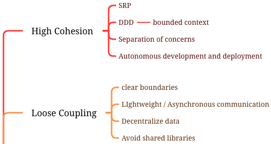

# High Cohesion and Low Coupling

Within a Service | Between Services 
------- | -----
Single Responsibility Principle | SRP
Encapsulation and Information Hiding | Containerization 
Dependency Injection | - Orchestration  - CI/CD  - Monitoring and Observability
Use Interfaces and Abstractions | Service Contracts
Modular Design and Separation of Concerns | - DDD  - API Gateway

## Within a service

### Single Responsibility Principle (SRP)
The Single Responsibility Principle states that a class or module should have only one reason to change. This means that each class should be responsible for a single, well-defined task. By keeping classes focused on a specific responsibility, you can achieve high cohesion. If a class has multiple responsibilities, it becomes harder to understand and maintain.

For example, consider a class that handles both user authentication and database operations. Instead, you can separate these responsibilities into two separate classes: one for user authentication and another for database operations. This separation improves the code's cohesion and makes it easier to modify or extend each class independently.

### Encapsulation and Information Hiding
Encapsulation is the practice of bundling data and methods together within a class, while information hiding involves restricting access to internal implementation details. By encapsulating related data and methods, you can achieve high cohesion within a class. Additionally, by hiding implementation details, you reduce the coupling between classes, as other classes only need to interact with the public interface.

For example, consider a class that represents a bank account. Instead of exposing the account balance as a public variable, encapsulate it within the class and provide public methods to interact with it, such as getBalance() and deposit(amount). This way, other classes can interact with the account without directly accessing its internal state, reducing coupling.

### Dependency Injection
Dependency Injection is a technique that promotes loose coupling by allowing dependencies to be injected into a class from the outside. Instead of creating dependencies within a class, you pass them as parameters or use a dependency injection framework to manage them. This approach reduces the coupling between classes, as they only depend on abstractions rather than concrete implementations.

For example, instead of instantiating a database connection within a class, you can pass it as a parameter to the class constructor or use a dependency injection framework to manage it. This way, the class can work with different database implementations without being tightly coupled to a specific one.

### Use Interfaces and Abstractions
Using interfaces and abstractions is another effective way to achieve low coupling. By programming to interfaces rather than concrete implementations, you can decouple classes from each other. This allows for easier substitution of implementations and promotes modular design.

For example, instead of directly depending on a specific implementation of a data access layer, you can define an interface that represents the required functionality. Classes that depend on the data access layer can then depend on the interface, allowing for different implementations to be used interchangeably.

### Modular Design and Separation of Concerns
Breaking down your code into smaller, modular components that each have a specific responsibility can help achieve high cohesion and low coupling. Each module should be focused on a single concern and have minimal dependencies on other modules. This way, changes to one module have minimal impact on others.

For example, in a web application, you can separate the user interface, business logic, and data access layers into separate modules. This separation allows each module to be developed, tested, and maintained independently, reducing coupling and improving cohesion.

## Between Services 

### Single Responsibility Principle (SRP)
Each microservice should have a single responsibility or purpose. This ensures that the service is focused and does not have unnecessary dependencies on other services. By adhering to SRP, you can achieve high cohesion within each microservice.

### Domain-Driven Design (DDD)
Apply DDD principles to identify and define the boundaries of each microservice based on the business domain. This helps in creating cohesive services that encapsulate related business logic and data. By aligning microservices with the domain, you can minimize dependencies and achieve high cohesion.

### Service Contracts
Define clear and well-defined service contracts between microservices. This includes specifying the input and output data formats, communication protocols, and error handling mechanisms. By having explicit contracts, you can achieve loose coupling between microservices, as they can evolve independently without breaking each other.

### Event-Driven Architecture (EDA)

Utilize event-driven patterns to decouple microservices. Instead of direct synchronous communication, microservices can communicate through events. This allows services to react to events asynchronously, reducing the coupling between them. Event-driven architecture promotes loose coupling and enables scalability and fault tolerance.

### API Gateway
Implement an API gateway as a single entry point for client applications to interact with microservices. The API gateway can handle authentication, routing, and request aggregation. By centralizing these responsibilities, the microservices can focus on their core functionalities, leading to higher cohesion and lower coupling.

### Containerization and Orchestration
Use containerization technologies like Docker and container orchestration platforms like Kubernetes. Containerization provides isolation and encapsulation, allowing microservices to be deployed independently. Orchestration platforms enable scaling, load balancing, and fault tolerance, reducing the coupling between microservices.

### Continuous Integration and Deployment (CI/CD)
Implement CI/CD pipelines to automate the build, test, and deployment processes. This ensures that changes in one microservice do not impact others, promoting low coupling. By automating the deployment process, you can quickly iterate and release new versions of microservices independently.

### Monitoring and Observability
Implement monitoring and observability solutions to gain insights into the behavior and performance of microservices. This helps in identifying dependencies and bottlenecks, allowing you to optimize and refactor services for better cohesion and lower coupling.