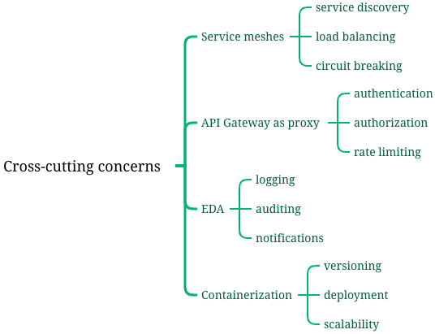

# Cross-cutting concerns

## Overview

Cross-cutting concerns are aspects of a software system that affect multiple components or modules. 

Examples of cross-cutting concerns include logging, security, caching, and error handling. In a monolithic architecture, these concerns can be addressed using **centralized libraries** or **frameworks**. 

However, in a Microservices architecture, where each service is independent and autonomous, handling cross-cutting concerns requires a different approach.

### Clean Architecture

## Terms Comparision

## Service meshes

One way to handle cross-cutting concerns in a Microservices architecture is by using the concept of service meshes. A service mesh is a dedicated infrastructure layer that provides a set of common functionalities to all services in the architecture. It acts as a communication layer between services and can handle cross-cutting concerns such as service discovery, load balancing, and circuit breaking.

## API Gateways

Another approach is to use API gateways. An API gateway is a single entry point for all client requests and acts as a proxy for the underlying services. It can handle cross-cutting concerns such as authentication, authorization, and rate limiting. By centralizing these concerns in the API gateway, individual services can focus on their core business logic.

## Load balancing 

## Event-driven architectures
Additionally, using event-driven architectures can help address cross-cutting concerns. By using an event bus or message broker, services can publish and subscribe to events, allowing them to react to changes or updates in a decoupled manner. This can be useful for handling cross-cutting concerns such as logging, auditing, and notifications.

## Containerization
Furthermore, the use of containerization technologies like Docker can simplify the management of cross-cutting concerns. By packaging each service and its dependencies into a container, concerns such as versioning, deployment, and scalability can be handled more efficiently.

## Keep services maturity levels

1. **Define a clear architecture**: Start by defining a clear architecture that outlines how cross-cutting concerns will be addressed in the system. This architecture should provide guidelines and best practices for implementing these concerns consistently across services.
2. **Use design patterns**: Utilize design patterns that promote the separation of cross-cutting concerns from the core business logic of services. For example, the Aspect-Oriented Programming (AOP) pattern allows you to modularize cross-cutting concerns and apply them to multiple services without modifying their code directly.
3. **Implement reusable components**: Develop reusable components or libraries that encapsulate common cross-cutting concerns. These components can be shared across services, ensuring consistency and reducing duplication of code. For example, a logging component can be created to handle logging functionality across services.
4. **Apply dependency injection**: Use dependency injection to inject cross-cutting concerns into services. This approach allows services to be decoupled from the specific implementation of these concerns, making it easier to modify or replace them in the future. For example, a security module can be injected into services to handle authentication and authorization.
5. **Establish coding standards**: Define coding standards that enforce the implementation of cross-cutting concerns in a consistent manner. These standards should cover aspects such as error handling, logging, and security. Regular code reviews can help ensure adherence to these standards.
6. **Monitor and measure**: Implement monitoring and measurement mechanisms to assess the maturity levels of cross-cutting concerns in services. This can include logging and performance monitoring tools that provide insights into the behavior and performance of services. Regularly analyze these metrics to identify areas for improvement and take corrective actions.

## Conclusion
In conclusion, handling cross-cutting concerns in a Microservices architecture requires a combination of different techniques and technologies. Service meshes, API gateways, event-driven architectures, and containerization can all play a role in addressing these concerns. It is important to carefully analyze the specific requirements of the system and choose the appropriate approach for each concern.