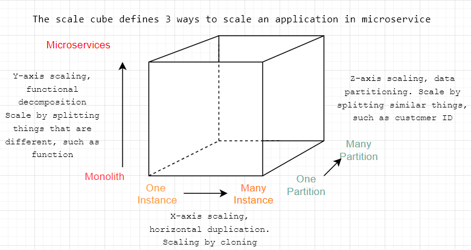
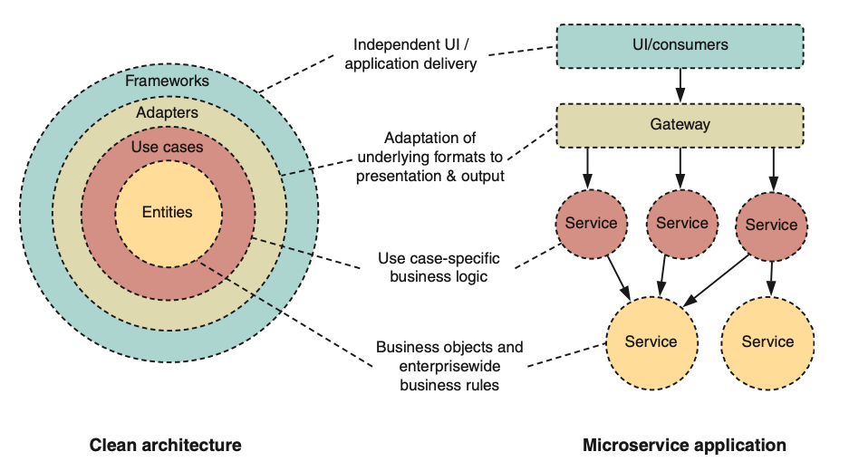

# Microservices Overview

Microservices are small, autonomous services that work together.

<TagLinks />

## Key principles

- Decoupling
- Autonomy  
- Resilience
- Transparency 
- Automation 
- Alignment

> *Gather together those things that change for same reason, and separate those things that change for different reasons.*

**Benefits**
- Technology heterogeneity
- Resilience
- Scaling
- Ease of Deployment
- Organizational Alignment
- Composability
- Optimizing for Replaceability

**Challenges**
- Scoping and identifying microservices
    - may need to refactor across multiple distinct codebases
    - may need to migrate data from one service’s database to another
    - may not have identified implicit dependencies between services, which could lead to errors or incompatibility on deployment.
- Boundaries and contracts
- Distributed systems
    - The network is not reliable.
    - Latency exists.
    - Bandwidth is not infinite.
    - Transport cost is not zero.
- New modes of failure
    - Observability is difficult to achieve
    - Multiplying services multiplies points of failure

## Architecture

### 4 Tiers
- **Platform** — A microservice platform provides tooling, infrastructure, and high-level primitives to support the rapid development, operation, and deployment of microservices. A mature platform layer enables engineers to focus on building features, not plumbing.
- **Services** —In this tier, the services that you build interact with each other to provide business and technical capabilities, supported by the underlying platform.
- **Boundary** — Clients will interact with your application through a defined boundary that exposes underlying functionality to meet the needs of outside consumers. 
    - Authentication and authorization
    - Rate limiting
    - Caching
    - Logs and metrics 
- **Client** — Client applications, such as websites and mobile applications, interact with your microservice backend.

### The Scale Cube

**X-axis**: This is usually referred as scale-out and scale-in which can be achieved with Public-Cloud providers and also **Kubernetes**. One can scale-out using the resource utilisation like CPU, I/O or custom-metrics upon to your architecture.

**Y-axis**: Functional decomposition can be achieved by decoupling your architecture into functions. **Microservices** is an example for functional decomposing.

**Z-axis**: With Data Partitioning, the functions are able to run with a subset of data. Although there maybe several ways to achieve that, **Event Sourcing** is one of the most scalable and widely accepted approach for that.

### Synchoronous vs Asynchoronous Communication

- **With sync communication**, a call is made to a remote server, which blocks until the operation completes.
- **With async communication**, the caller doesn't wait for the operation to complete before returning, and may not even care whether or not the operation completes at all.
    - Async communication can be very useful for long-running jobs

- These 2 different modes of communication can enable 2 different idoomatic styles of collaboration:
    - *resquest / response*
    - *event-based*

### Orchestration vs Choreography

- **With Orchestration**: we rely on a central brain to guide & drive the process. like the conductor in an orchestra.
- **With Choreography:** we inform each part of the system of its job, and let it work out the details, like dancers all finding their way and reacting to others around them in a ballet.

### API Gateway

- Act as a facade to reduce complexity
- Security Gate: Authentication, Rate limiting
- Caching
- Logs and metrics 
- Routing
- Transform input / output
- Backends for frontends

## 3 strategies for scoping services:
- **By business capability or bounded context** — Services should correspond to relatively coarse-grained, but cohesive, areas of business functionality.
- **By use case** — Services should be *verbs* that reflect actions that will occur in a system.
- **By volatility** — Services should encapsulate areas where change is likely to occur in the future.

### Model a Service

::: tip Loose coupling
The whole point of a microservice is being able to make a change to one service and deploy it, without needing to change any other part of the system. 
:::

::: tip High cohesion
We want related behavior to sit together, and unrelated behavior to sit elsewhere. 
- If we want to change behavior, we want to be able to change it one place, and release that change ASAP.
- If we have to change that behavior in lots of different places, we'll have to release lots of different services to deliver that change. Making changes in lots of different places is slower, and deploing lots of services at once is risky.
:::

## Distributed transactions

### two-phase commit (2PC)

[Read 2PC more](./2pc/)

### Sagas

**Orchestration based SAGA**

**Choreography based SAGA**

- The choreographed approach is a basic example of the saga pattern. A saga is a coordinated series of local transactions; a previous step triggers each step in the saga.
- As each local transaction is atomic 
- The system isn’t guaranteed to be returned to the original state

**Three common strategies for handling interwoven sagas are available:** 
- short-circuiting
- locking
- interruption.

### Consistency patterns

| #   | Name | Stategy |
| --- | --- | --- |
| 1   | Compensating action | Perform an action that undoes prior action(s) |
| 2   | Retry | Retry until success or timeout |
| 3   | Ignore | Do nothing in the event of errors |
| 4   | Restart | Reset to the original state & start again |
| 5   | Tentative operation | Perform a tentative operation and confirm (or cancel) later |

## Query in Distributed World
- Queries that return and join substantial data, such as reporting
- Queries that aggregate or perform analytics across multiple services
- Queries that aren’t optimally supported by the service’s own database 

### Storing copies of data
- Maintaining multiple copies of data increases overall application and service complexity (and possibly, overall storage cost).
- Breaking schema changes in events is extremely tricky to manage, as services become increasingly coupled to event content.
- Cache invalidation is notoriously hard.

### Separating queries and commands (CQRS)
- Analytics and reporting
- Build read models

**Architecture**
- The **command** side of an application performs updates to a system—creates, updates and deletes. Commands emit events, either in-band or to a distinct event bus, such as RabbitMQ or Kafka.
- Event handlers consume events to build appropriate query or read models.
- A separate data store may support each side of the system.

**CQRS offers two key benefits:**
- You can optimize the query model for specific queries to improve their perfor- mance and remove the need for cross-service joins.
- It aids in separation of concerns, both within services and at an application level.

**Drawbacks**
- consider eventual consistency because of *replication lag*: inherently, the command state of a service will be updated before the query state. 
- In other systems, it’ll be important to ensure you don’t query invalid state. You can apply three strategies in these scenarios: *optimistic updates*, *polling*, or *publish-subscribe*.

## Reliable Services

### Designing reliable communication

[Detail](./distributed-patterns.md#fault-tolerance)

- Retries
- Fallbacks, caching, and graceful degradation 
- Timeouts and deadlines
- Circuit breakers
- Communication brokers

### Maximizing service reliability
- Load balancing and service health
- Rate limits
- Validating reliability and fault tolerance (load testing & chaos testing)

### Safety by default
- Frameworks
- Service mesh

## Observability

## Integration

### Shared Database
- The consumer is tied to a specific technology of the service. Good bye, loose coupling.
- If the service makes change that can update & deploy into many consumers. Bye, cohesion.

### Summary 
- Avoid database integration at all costs.
- Understand the trade-offs between REST & RPC, but strongly consider REST as a good starting point for request/response integration.
- Prefer Choreography over Orchestration
- Avoid breaking changes and the need to version by understanding Postel's Law and using tolerant readers.
- Think of user interfaces as compositional layers.

## Laws

::: tip DRY
Don't violate DRY within a microservice, but relaxed about violating DRY accross all services. The evils of too much coupling between services are far worse than the problems caused by code duplication. 
:::

::: tip Postel's Law
Be conservative in what you do, be liberal in what you accept from others.
:::

::: tip Murphy's Law
Anything that can possibly go wrong, does.
:::

::: tip Moore's Law
Computer speed, memory, and density double every 18 months.
:::

::: tip Melvin Conway's Law
Any organization that designs a system will inevitably produce a design whose structure is a copy of organization's communication structure.
:::

## Monorepo

::: tip
Monorepos, short for monolithic repository, refer to a version control strategy in which all projects within an organization are stored in a single repository.
:::

*📒 Note*: *A monolith could be managed in a monorepo. But a monolith could also be split into multiple repositories. Similarly, a monorepo could be used with microservices instead of a monolith.*

✅ Advantages: 
- **Improved repository management:** Monorepos allows developers to make changes to multiple projects at once, using advanced tools to detect and test affected areas. This can save time and increase overall stability. E.g upgrade Node version
- **Better handle relationships between repositories**: Monorepos make it easier to see the relationships between projects and automatically trigger tests for affected areas, improving overall stability and saving time. (shared library, dependencies interfaces, API, RPC, ...)
- **Easier detection and prevention of code duplication**: using tools like **SonarCube** to analyze the entire repository and refactor duplicate code into shared libraries.
- **Improved collaboration and domain expertise growth**: Monorepos facilitate better collaboration and understanding of the codebase and business domain, leading to faster problem-solving and a shared understanding of the project.

❌ Disadvantages:
- **Simplicity**: Setting up and managing multi-repos can be simpler than managing a single monorepo, especially for small projects or projects with a strong separation of concerns.
- **Better suited for large teams**: In some cases, multi-repos may be better suited for large teams or projects with many distinct sub-projects, as they allow for more flexibility and separation of concerns.

### Example Upgrade node version
Let's say that you have 10 repositories in your company, If you want to upgrade Node.js to the latest LTS version, you have two options:
- Point all of your repositories to the latest tag and update the latest version in one place. This might lead to unexpected issues, as some projects may not be ready for migration yet.
- Manually migrate each repository to support the latest version

=> **With a monorepo approach**, You only have to update the version in a single CI configuration and test all of the projects in the monorepo to ensure that everything is working as expected. This can save time and reduce the risk of unexpected issues arising.

### [Nx](https://nx.dev/)
- [Nx and Node Microservices](https://blog.nrwl.io/nx-and-node-microservices-b6df3cd1bad6?gi=4a638c06703e)
- [monorepo](https://www.devtip.co/monorepo/)
