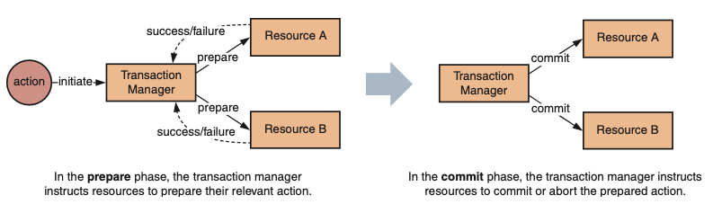

# Two-phase commit (2PC)

This pattern involves a coordinator and multiple participants. The coordinator initiates the transaction and sends a prepare message to all participants. Each participant replies with an agreement or abort decision. If all participants agree, the coordinator sends a commit message to all participants, and they perform the transaction. If any participant aborts, the coordinator sends an abort message to all participants, and they roll back the transaction. While 2PC ensures consistency, it can be slow and prone to blocking if the coordinator fails.

## Workflow

- A common approach is to use the two-phase commit (2PC) protocol. In this approach, you use a transaction manager to split operations across multiple resources into two phases: prepare and commit. 
- synchronicity of communication between the transaction manager and resources. If a resource is unavailable, the transaction can’t be committed and must roll back. 
- increases the volume of retries and decreases the availability of the overall system.
- limiting your technical choices.
- violates one of the core principles of microservices: service autonomy.
- a distributed transaction places a lock on the resources under transaction to ensure isolation. This makes it inappropriate for long-running operations, as it increases the risk of *contention* and *deadlock*

## Discuss

[Why is 2PC not suitable for a microservices architecture?](https://stackoverflow.com/questions/55249656/why-is-2-phase-commit-not-suitable-for-a-microservices-architecture)

1. In most scenarios microservices interact via HTTP (a stateless protocol) and as a result global/ eXtended Architecture (XA) transactions are just not applicable/ possible.
2. Exactly once semantics are not possible and you should go for "at least once". This means all services should be idempotent.
3. One good example of why is not possible of achieving "exactly once" semantics in such a setup is that http connections very frequently are lost on the way back to the client. This means that via a POST the state of the server has changed, while the client receives a timeout error.
4. Inside the boundaries of a microservices you can use them just fine. As you mentioned Kafka you can quite easily consume (from 1 topic) and produce (to 1 or more topics) a single atomic/ all or nothing operation (exactly once semantics).
5. But if you want global and long running transactions among microservices that interact via http the only practical option (you might see global transaction via http if you google, but for a production system just ignore them), is to design for eventual consistency. In brief this means, retry for ever for recoverable errors (this is a whole chapter in itself) and expose compensating endpoints or produce compensating events that will eventually amend non-recoverable errors. Check out the sagas pattern. Narayana Transaction Manager has good Sagas support and a good products comparison.
6. Check out the related microservices patterns that offer an alternative to XA transactions (you might see this as global transactions or 2 phase commit/ 2PC) like Transactional Outbox or Event Sourcing that offer nice "at least once semantics".
7. Distributed systems are very complicated and you should have a reason to go for such a solution. If you go distributed, operations that your monolith can safely delegate to your transaction manager, will have to be dealt by the developer/ architect.
8. Also, the majority of non SQL databases/ systems do not support XA transactions (i.e. global transactions) at all, as they slow processing dramatically.

## Recovery from failures in 2PC Protocol
https://www.geeksforgeeks.org/recovery-from-failures-in-two-phase-commit-protocol-distributed-transaction/
