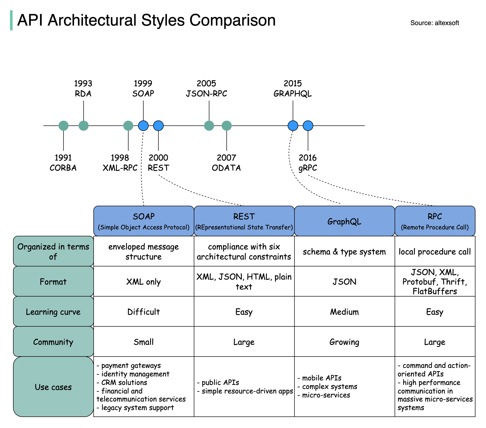

# RESTful

## RESTful API

RESTful API is an architectural style for developing web services that builds upon existing systems and features of HTTP. 

REST is easier to archive than SOAP.

::: tip REST defines 6 architectural constraints:

- **Use of a uniform interface (UI)**: resources should be uniquely identifiable through a single URL. only by using the underlying methods of the network protocol, such as DELETE, PUT and GET with HTTP
- **Client-server based**: there should be a clear delineation between the client and server. Data access, workload management and security are the server’s domain.
- **Stateless operations**: all client-server operations should be stateless, and any state management that is required should take place on the client, not the server.
- **RESTful resource caching**: all resources should allow caching unless explicitly indicated that caching is not possible.
- **Layered system**: REST allows you to use a layered system architecture where you deploy the APIs on server A, and store data on server B and authenticate requests in Server C. A client cannot ordinarily tell whether it is connected directly to the end server or an intermediary along the way.
- **Code on demand**: Most of the time, a server will send back static representations of resources in the form of XML or JSON. However, when necessary, servers can send executable code to the client.
:::

## Definations

### Idempotence

> In computer science, the term idempotent is used more comprehensively to describe an operation that will produce the same results if executed once or multiple times. This may have a different meaning depending on the context in which it is applied. In the case of methods or subroutine calls with side effects, for instance, it means that the modified state remains the same after the first call

### Safety

> Some methods (for example, HEAD, GET, OPTIONS and TRACE) are defined as **safe**, which means they are intended only for information retrieval and should not change the state of the server. In other words, they should not have side effects, beyond relatively harmless effects such as logging, caching, the serving of banner advertisements or incrementing a web counter. Making arbitrary GET requests without regard to the context of the application's state should therefore be considered safe.

`HEAD`, `GET`, `OPTIONS` and `TRACE` have no side effects on server

## Richardson Maturity Model

Richardson Maturity Model is a measure of how RESTful an API definition is. It defines 4 levels

### **Level 0 😱 - swamp of BOX**: 
- has 1 entry point (URI) and 1 method (POST)
- all APIs would be POST to an URL.

### **Level 1 😜 - resources**:
- uses differents URLs to distinguish API resources 
- be still typically only one me method (POST) of interaction

### **Level 2 😍 - HTTP Verbs**:
- uses proptocol properties (HTTP verbs) to define nature of the API
- uses GET for a read, POST for a write, PUT for updating, DELETE ...
- uses standard responses code (`200 OK`, `202 ACCEPTED`) to describe the result
- most REST API implementations are at this level

### **Level 3 🤘 - hypermedia controls**:
- the most RESTful API - uses **Hypertext As The Engine Of Application State** (HATEOAS) to allow clients to deal with discovering the resources and the identifiers.

*Example*: we have a request  `GET /hotels/xyz` and the response looks like:

```json
{
    "city": "Saigon",
    "display_name": "New World",
    "star_rating": 4,
    "links": [
        {
            "href": "xyz/book",
            "rel": "book",
            "type": "POST"
        },
        {
            "href": "xyz/rooms",
            "rel": "rooms",
            "type": "GET"
        }
    ]
}
```

Thus, the client can discover the related API and do the operations.

## Quick Tips

### Wrapped Response

```json
{
    "code": 200,
    "status": "...",
    "data": ".."
}
```

### Sort

```
.../users?sort=last_name|first_name|-hire_date
```
-  **`-`** sort in descending order


### Pagination 

:::: tabs

::: tab Request

Via `Range` header

```
Range: items=25-49
```

Or via query-string

```
GET ...?offset=25&limit=25
```
:::

::: tab Response

```
Content-Range: 25-49/66
or
Content-Range: 25-49/*
```
:::
::::


### Filter 

```
.../users?filter="name::todd|city::denver|title::grand poobah”
```

See [odata](https://www.odata.org/odata-services/#querying-data) to get more examples.

### Versioning Support

:::: tabs

::: tab Request
```
GET .../users/123
Accept: application/json; version=1
```
:::

::: tab Response
```
HTTP/1.1 200 OK
Content-Type: application/json; version=1
```

or deprecated version

```
HTTP/1.1 200 OK
Content-Type: application/json; version=1
Deprecated: true
```

or invalid version

```
HTTP/1.1 406 NOT ACCEPTABLE
Content-Type: application/json
```

:::
::::


**What version is returned if no version provided?**
*"Best match". Should return the oldest supported version of the representation.*

### Date/Time handling

Service should store, process, cache, etc such timestamps in UTC or GTM time.

It is recommended that [ISO 8601](https://en.wikipedia.org/wiki/ISO_8601) be used for all dates represented in REST Service body content (both requests & responses)

Most of languages support convert datetime to ISO
```js
let today = new Date('05 October 2011 14:48 UTC')
console.log(today.toISOString())  // Returns 2011-10-05T14:48:00.000Z
```

### Authentication

[OAuth2](https://oauth.net/2/) is highly recommendation.

All authentication should use SSL. OAuth2 requires authorization server & access token credentials to use TLS.


## References

[RESTful Best Practices](/docs/RESTful-Best-Practices-v1_2.pdf)


### Standard HTTP status codes

[Full list of static code](https://developer.mozilla.org/en-US/docs/Web/HTTP/Status)

Here is top 10 common usage of status codes:

| Status Code | Summary | 
| :---------- | :------ | 
| 200         | OK  | 
| [201](https://developer.mozilla.org/en-US/docs/Web/HTTP/Status/201)  | Created  | 
| [204](https://developer.mozilla.org/en-US/docs/Web/HTTP/Status/204)  | No content  | 
| [304](https://developer.mozilla.org/en-US/docs/Web/HTTP/Status/304)  | Not Modified  | 
| [400](https://developer.mozilla.org/en-US/docs/Web/HTTP/Status/400) | Bad Request  | 
| [401](https://developer.mozilla.org/en-US/docs/Web/HTTP/Status/401) | Unauthorized  | 
| [403](https://developer.mozilla.org/en-US/docs/Web/HTTP/Status/403) | Forbidden  | 
| [404](https://developer.mozilla.org/en-US/docs/Web/HTTP/Status/404)  | Not found  | 
| [409](https://developer.mozilla.org/en-US/docs/Web/HTTP/Status/409) | Conflict  | 
| [500](https://developer.mozilla.org/en-US/docs/Web/HTTP/Status/500) | Internal Server Error  | 

## Comparision



## Others

https://blog.bytebytego.com/p/soap-vs-rest-vs-graphql-vs-rpc