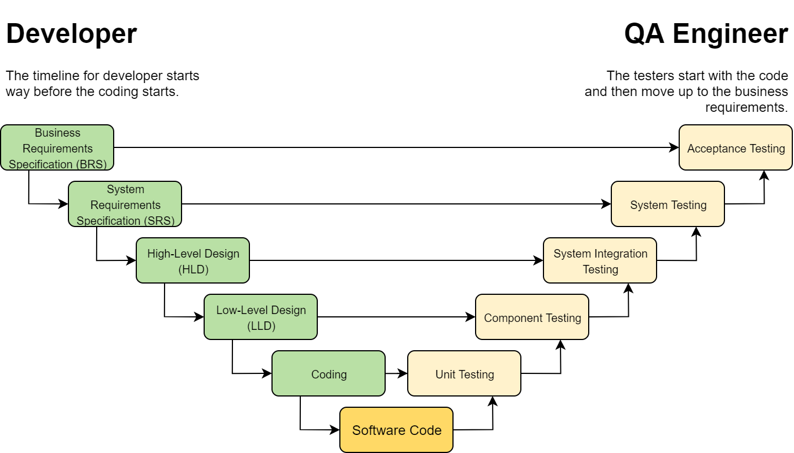
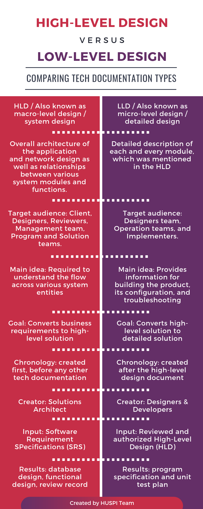

# Architecture Terms

## Vertical scaling vs. Horizontal scaling
- **Horizontal scaling** (*scale out*) means that you scale by adding more machines into your pool of resources 
- **Vertical scaling** (*scale up*) means that you scale by adding more power (CPU, RAM) to an existing machine.

## High availability vs. fault tolerance

- **A fault tolerant environment** has no service interruption but a significantly higher cost
- **A highly available environment** has a minimal service interruption.

**Fault tolerance** relies on specialized hardware to detect a hardware fault and instantaneously switch to a redundant hardware component—whether the failed component is a processor, memory board, power supply, I/O subsystem, or storage subsystem. Although this cutover is apparently seamless and offers non-stop service, a high premium is paid in both hardware cost and performance because the redundant components do no processing. More importantly, the fault tolerant model does not address software failures, by far the most common reason for downtime.

**High availability** views availability not as a series of replicated physical components, but rather as a set of system-wide, shared resources that cooperate to guarantee essential services. High availability combines software with industry-standard hardware to minimize downtime by quickly restoring essential services when a system, component, or application fails. While not instantaneous, services are restored rapidly, often in less than a minute.

## High Level Design vs. Low Level Design

**High-Level Design** (HLD) is a general system design. It includes the description of the following parts:

- System architecture
- Database design
- Brief mention of all the platforms, systems, services, and processes the product would depend on
- Brief description of relationships between the modules and system features

All the data flows, flowcharts, data structures, etc. are in these docs, so that developers can understand how the system is expected to work with regards to the features and the database design.

**Low Level Design** (LLD) is a component-level design process that follows a step-by-step refinement process. It provides the details and definitions for the actual logic for every system component. It is based on HLD but digs deeper, going into the separate modules and features for every program in order to document their specifications.

**Detail Level Design** (DLD) is the most detailed technical document, which describes user stories, error processing algorithms, state transitions, logical sequences, and others. DLD describes the interaction of every low-level process with each other.

## Monolithic vs. Microservices 

## API Gateway 

Think of an API gateway as a specific type **reverse proxy** implementation.

**Pros**:
- Security benefits: hide sensitive API Endpoints, protects from malicious attack vectors such as DoS attacks, SQL injections, ...
- Decreased complexity: API gateway will manage concerns like  **routing**, **rate limiting**, **user access control**, **token authorization**, scaling among others
- Load balancing
- Monitoring and Analytics
- Over time you’ll add some new API services and retire others, but your clients will still want to find all your services in the same place.

**Cons**:
- high availability applications at scale especially since the API gateway is going to be the single point on of entry between the front end and the APIs it will also act as a single point of failure.
- configuring your application and API to interact via an API Gateway will require some more orchestration which will add a level of difficulty for the developers.
- Performance degradation is a concern impact the speed and reliability of your application.

## Coupling and Cohesion

- **Coupling**: Elements are coupled if a change in one forces a change in the other. *For example, if two classes inherit from a common parent, then a change in one class might require a change in the other.*
- **Cohesion**: An element’s cohesion is a measure of whether its responsibilities form a meaningful unit. *For example, a class that parses both dates and URLs is not coherent, because they’re unrelated concepts.*

## Performance terms

- **Response time**: is the amount of time it takes for the system to process a request from the outside.
- **Responsiveness**: how quickly the system acknowledges a request as opposed to processing it.
- **Latency**: is the minimum time required to get any form of response.
- **Throughput**: is how much stuff you can do in a given amount of time.
- **Load**: is a statement of how much stress a system is under, which might be how many users are currently connected to init. The load is usally a context for some other measurement, such as a response time. *E.g: response time is 0.5s with 10 users and 2s with 20users.*
- **Load sensitivity**: is an expression of how the response time varies with the load. 
- **Efficiency**: is performance divided by resources. A system that gets 30 tps on 2 CPUs is more efficient than a system that gets 40tps on 4 CPUs.
- **The Capacity**: is an indication of maximum effective throughput or load.
- **Scalability**: is a measure of how adding resources (usally hardware) affects performance.

## Others
### problems:
1. Overload         =>  recruitment
2. Complexity       =>  seperation of concerns
3. Mishaps          =>  fault tolerance

### Extensibility

### Preprocessing using cron jobs

### Backup servers

### Distributed Systems
