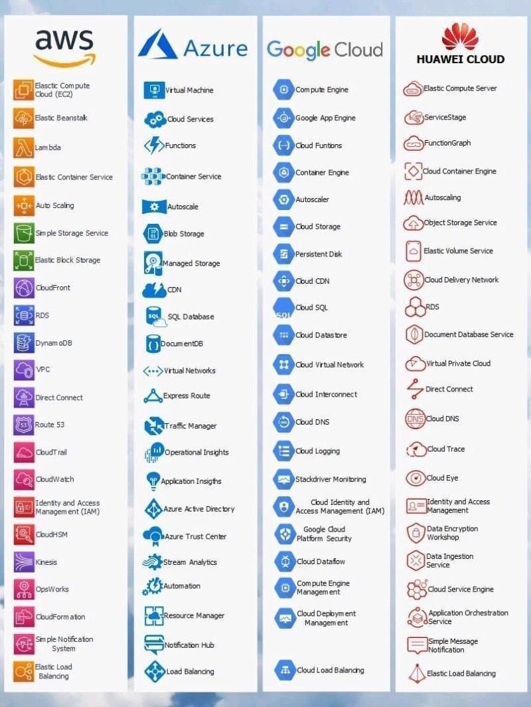

# Cloud Architecture Terms

### Solutions Architect?
A role in a technical organization that architects a technical solution using multiple systems via researching, documentation, experimentation.

### Cloud Architect?
A solutions architect that is focused solely on architecting technical solutions using cloud services.

A cloud architect need to understand the following terms and factor them into their designed architecture based on the business requirements.
- **Availability** - Your ability to ensure a service remains available eg. **Highly Available (HA)**
- **Scalability** - Your ability to grow rapidly or unimpeded
- **Elasticity** - Your ability to shrink and grow to meet the demand
- **Fault Tolerance** - Your ability to prevent a failure
- **Disaster Recovery** - Your ability to recover from a failure eg. **Highly Durable**

A Solutions Architect needs to always consider the following business factors:
- (**Security**) How secure is this solution?
- (**Cost**) How much is this going to cost?

### Durability vs Availability
- Durability: likelihood of data loss in the future
- Availability: probability able to get the object back from the moment you ask for it

## High Availability

Your ability for your service to **remain available** by ensuring there is **no single point of failure** and/or ensure a certain level of performance

Running your workload across multiple **Availability Zones** ensures that if 1 or 2 AZs become unavailable your service / applications remains available.

  **Elastic Load Balancer** A load balancer allows you to evenly distribute traffic to multiple servers in one or more datacenter. If a datacenter or server becomes unavailable (unhealthy) the load balancer will route the traffic to only available datacenters with servers.

## High Scalability

Your ability to **increase your capacity** based on the increasing demand of traffic, memory and computing power

- **Vertical Scaling / Scaling Up**: Upgrade to a bigger server
- **Horizonal Scaling / Scaling Out**: Add more servers of the same size

## High Elasticity

Your ability to **automatically** increase or decrease your capacity based on the current demand of traffic, memory and computing power

- Horizonal Scaling
    - Scaling **Out** - Add more servers of the same size
    - Scaling **In** - Removing underutilized servers of the same size
- Vertical Scaling is generally hard for traditional architecture so you'll usually only see horizontal scaling described with Elasticity.

 **Auto Scaling Groups (ASG)** is an AWS feature that will automatically add or remove servers based on scaling rules you define based on metrics

## High Durability

Your ability to **recover** from a disaster and to prevent **the loss** of data. Solutions that recover from a disaster is known as **Disaster Recovery (DR)**
- Do you have a backup?
- How fast can you restore that backup?
- Does your backup still work?
- How do you ensure current live data is not corrupt?

 **CloudEndure Disaster Recovery** continuously replicates our machines into a low-cost staging area in your target AWS account and preferred Region enabling fast and reliable recovery in case of IT data center failures.

**99.999999999% Durability?**
- Eleven nine (11 9s)
- Example: store 10M objects in S3. You can average expect to incur a loss of a SINGLE OBJECT once every 10,000 year.

## Highly Fault Tolerant

Your ability for your service to ensure there is **no single point of failure**. **Preventing the chance of failure**

**Fail-overs** is when you have a plan to **shift traffic** to a redundant system in case the primary system fails

A common example is having a copy (secondary) of your database where all ongoing changes are synced. The secondary system is not in-use until a fail over occurs and it becomes the primary database. (aka Leader - Followers)

 **RDS Multi-AZ** is when you run a duplicate standby database in another Availability Zone in case your primary database fails.

## Business Continuity Plan (BCP)

A business continuity plan (BCP) is a document that outlines how a business will continue operating **during an unplanned disruption in services**

**Recovery Point Objective (RPO)**: the maximum acceptable amount of data loss after an unplanned data-loss incident, expressed as an amount of time

**Recovery Time Objective (RTO)**: the maximum amount of downtime your business can tolerate without incurring a significant financial loss

**See more**:
- [How Much Data and Time Can You Afford to Lose?](https://www.etechcomputing.com/how-much-data-and-time-can-you-afford-to-lose/)
- [Understanding RPO and RTO](https://www.msp360.com/resources/blog/rto-vs-rpo-difference/)

### Disaster Recovery Options

[Detail](https://docs.aws.amazon.com/whitepapers/latest/disaster-recovery-workloads-on-aws/disaster-recovery-options-in-the-cloud.html)

## IOPS vs Throughput

IOPS = Input Output per second  => **expensive**
Thoughput per volumne: E.g 1000 MiB/s 

E.g: 
- App for downloading => should choose Thoughput
- App for read / write much => should choose IOPS

## Services in Different Clounds

