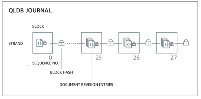
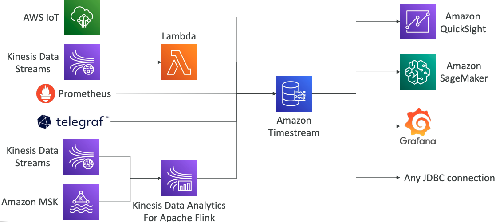

# Databases Overview

## Choosing the Right Database

- We have a lot of managed databases on AWS to choose from

**Questions to choose the right database based on your architecture:**
- Read-heavy, write-heavy, or balanced workload? Throughput needs? Will it change, does it need to scale or fluctuate during the day?
- How much data to store and for how long? Will it grow? Average object size? How are they accessed?
- Data durability? Source of truth for the data ?
- Latency requirements? Concurrent users?
- Data model? How will you query the data? Joins? Structured? Semi-Structured?
- Strong schema? More flexibility? Reporting? Search? RDBMS / NoSQL?
- License costs? Switch to Cloud Native DB such as Aurora?

## Database Types

- RDBMS (= SQL / OLTP): RDS, Aurora – great for joins
- NoSQL database – no joins, no SQL : DynamoDB (~JSON), ElastiCache (key / value pairs), Neptune (graphs), DocumentDB (for MongoDB), Keyspaces (for Apache Cassandra)
- Object Store: S3 (for big objects) / Glacier (for backups / archives)
- Data Warehouse (= SQL Analytics / BI): Redshift (OLAP), Athena, EMR
- Search: OpenSearch (JSON) – free text, unstructured searches
- Graphs: Amazon Neptune – displays relationships between data
- Ledger: Amazon Quantum Ledger Database
- Time series: Amazon Timestream

## Amazon RDS – Summary

- Managed PostgreSQL / MySQL / Oracle / SQL Server / MariaDB / Custom
- Provisioned RDS Instance Size and EBS Volume Type & Size
- Auto-scaling capability for Storage
- Support for Read Replicas and Multi AZ
- Security through IAM, Security Groups, KMS , SSL in transit
- Automated Backup with Point in time restore feature (up to 35 days)
- Manual DB Snapshot for longer-term recovery
- Managed and Scheduled maintenance (with downtime)
- Support for IAM Authentication, integration with Secrets Manager
- RDS Custom for access to and customize the underlying instance (Oracle & SQL Server)

**Use case**: Store relational datasets (RDBMS / OLTP), perform SQL queries, transactions 

## Amazon Aurora – Summary 

- Compatible API for PostgreSQL / MySQL, separation of storage and compute
- Storage: data is stored in 6 replicas, across 3 AZ – highly available, self-healing, auto-scaling
- Compute: Cluster of DB Instance across multiple AZ, auto-scaling of Read Replicas
- Cluster: Custom endpoints for writer and reader DB instances
- Same security / monitoring / maintenance features as RDS
- Know the backup & restore options for Aurora
- **Aurora Serverless** – for unpredictable / intermittent workloads, no capacity planning
- **Aurora Multi-Master** – for continuous writes failover (high write availability)
- **Aurora Global**: up to 16 DB Read Instances in each region, < 1 second storage replication
- **Aurora Machine Learning**: perform ML using SageMaker & Comprehend on Aurora
- **Aurora Database Cloning**: new cluster from existing one, faster than restoring a snapshot

**Use case**: same as RDS, but with less maintenance / more flexibility / more performance / more features

## Amazon ElastiCache – Summary 

- Managed Redis / Memcached (similar offering as RDS, but for caches)
- In-memory data store, sub-millisecond latency
- Select an ElastiCache instance type (e.g., cache.m6g.large)
- Support for Clustering (Redis) and Multi AZ, Read Replicas (sharding)
- Security through IAM, Security Groups, KMS, Redis Auth
- Backup / Snapshot / Point in time restore feature
- Managed and Scheduled maintenance
- **Requires some application code changes to be leveraged**

**Use Case**: Key/Value store, Frequent reads, less writes, cache results for DB queries, store session data for websites, cannot use SQL. 

## Amazon DynamoDB – Summary

- AWS proprietary technology, managed serverless NoSQL database, millisecond latency
- Capacity modes: provisioned capacity with optional auto-scaling or on-demand capacity
- Can replace ElastiCache as a key/value store (storing session data for example, using TTL feature)
- Highly Available, Multi AZ by default, Read and Writes are decoupled, transaction capability
- DAX cluster for read cache, microsecond read latency
- Security, authentication and authorization is done through IAM
- Event Processing: DynamoDB Streams to integrate with AWS Lambda, or Kinesis Data Streams
- Global Table feature: active-active setup
- Automated backups up to 35 days with PITR (restore to new table), or on-demand backups
- Export to S3 without using RCU within the PITR window, import from S3 without using WCU
- **Great to rapidly evolve schemas**

**Use Case**: Serverless applications development (small documents 100s KB), distributed serverless cache

## Amazon S3 – Summary

- S3 is a… key / value store for objects
- Great for bigger objects, not so great for many small objects
- Serverless, scales infinitely, max object size is 5 TB, versioning capability
- **Tiers**: S3 Standard, S3 Infrequent Access, S3 Intelligent, S3 Glacier + lifecycle policy
- **Features**: Versioning, Encryption, Replication, MFA-Delete, Access Logs…
- **Security**: IAM, Bucket Policies, ACL, Access Points, Object Lambda, CORS, Object/Vault Lock
- **Encryption**: SSE-S3, SSE-KMS, SSE-C, client-side, TLS in transit, default encryption
- **Batch operations** on objects using S3 Batch, listing files using S3 Inventory
- **Performance**: Multi-part upload, S3 Transfer Acceleration, S3 Select
- **Automation**: S3 Event Notifications (SNS, SQS, Lambda, EventBridge)

**Use Cases**: static files, key value store for big files, website hosting

## DocumentDB

- Aurora is an “AWS-implementation” of PostgreSQL / MySQL …
- **DocumentDB is the same for MongoDB (which is a NoSQL database)**
- MongoDB is used to store, query, and index JSON data
- Similar “deployment concepts” as Aurora
- Fully Managed, highly available with replication across 3 AZ
- DocumentDB storage automatically grows in increments of 10GB, up to 64 TB.
- Automatically scales to workloads with millions of requests per seconds

## Amazon Neptune

- Fully managed graph database 
- A popular **graph dataset** would be a social network 
    - Users have friends 
    - Posts have comments 
    - Comments have likes from users 
    - Users share and like posts… 
- Highly available across 3 AZ, with up to 15 read replicas 
- Build and run applications working with highly connected datasets – optimized for these complex and hard queries 
- Can store up to billions of relations and query the graph with milliseconds latency
- Highly available with replications across multiple AZs - Great for knowledge graphs (Wikipedia), fraud detection, recommendation engines, social networking

## Amazon Keyspaces (for Apache Cassandra)

- Apache Cassandra is an open-source NoSQL distributed database
- A managed Apache Cassandra-compatible database service
- Serverless, Scalable, highly available, fully managed by AWS
- Automatically scale tables up/down based on the application’s traffic
- Tables are replicated 3 times across multiple AZ
- Using the Cassandra Query Language (CQL)
- Single-digit millisecond latency at any scale, 1000s of requests per second
- Capacity: On-demand mode or provisioned mode with auto-scaling
- Encryption, backup, Point-In-Time Recovery (PITR) up to 35 days

**Use cases:** store IoT devices info, time-series data, …

## Amazon QLDB

- QLDB stands for ”Quantum Ledger Database”
- A ledger is a book **recording financial transactions**
- Fully Managed, Serverless, High available, Replication across 3 AZ
- Used to **review history of all the changes made to your application data** over time
- **Immutable** system: no entry can be removed or modified, cryptographically verifiable
- 2-3x better performance than common ledger blockchain frameworks, manipulate data using SQL (PartiQL)
- Difference with Amazon Managed Blockchain: **no decentralization component**, in accordance with financial regulation rules

## Amazon Timestream

- Fully managed, fast, scalable, serverless time series database 
- Automatically scales up/down to adjust capacity 
- Store and analyze trillions of events per day 
- 1000s times faster & 1/10th the cost of relational databases 
- Scheduled queries, multi-measure records, SQL compatibility 
- Data storage tiering: recent data kept in memory and historical data kept in a cost-optimized storage
- Built-in time series analytics functions (helps you identify patterns in your data in near real-time)
- Encryption in transit and at rest 

**Use cases**: IoT apps, operational applications, real-time analytics, …

