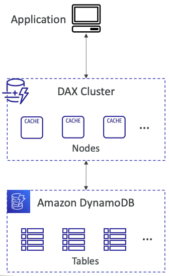

# DynamoDB

## Summary

- AWS proprietary technology, managed serverless NoSQL database, millisecond latency
- Capacity modes: provisioned capacity with optional auto-scaling or on-demand capacity
- Can replace ElastiCache as a key/value store (storing session data for example, using TTL feature)
- Highly Available, Multi AZ by default, Read and Writes are decoupled, transaction capability
- DAX cluster for read cache, microsecond read latency
- Security, authentication and authorization is done through IAM
- Event Processing: DynamoDB Streams to integrate with AWS Lambda, or Kinesis Data Streams
- Global Table feature: active-active setup
- Automated backups up to 35 days with PITR (restore to new table), or on-demand backups
- Export to S3 without using RCU within the PITR window, import from S3 without using WCU
- Great to rapidly evolve schemas

**Use Case**: Serverless applications development (small documents 100s KB), distributed serverless cache

## Basics 

- DynamoDB is made of **Tables**
- Each table has a **Primary Key** (must be decided at creation time)
- Each table can have an **infinite number of items** (= rows)
- Each item has **attributes** (can be added over time – can be null)
- Maximum size of an item is **400KB**
- Data types supported are:
    - **Scalar Types** – String, Number, Binary, Boolean, Null
    - **Document Types** – List, Map
    - **Set Types** – String Set, Number Set, Binary Set
- Therefore, in DynamoDB you can rapidly evolve schemas

## Read/Write Capacity Modes

- Control how you manage your table’s capacity (read/write throughput)

**Provisioned Mode (default)**
- You specify the number of reads/writes per second
- You need to plan capacity beforehand
- Pay for **provisioned** Read Capacity Units (RCU) & Write Capacity Units (WCU)
- Possibility to add **auto-scaling** mode for RCU & WCU

**On-Demand Mode**
- Read/writes automatically scale up/down with your workloads
- No capacity planning needed
- Pay for what you use, more expensive ($$$)
- Great for **unpredictable** workloads, **steep sudden spikes**

## DynamoDB Accelerator (DAX)

- Fully-managed, highly available, seamless inmemory cache for DynamoDB
- **Help solve read congestion by caching**
- **Microseconds latency for cached data**
- Doesn’t require application logic modification (compatible with existing DynamoDB APIs)
- 5 minutes TTL for cache (default)

### DAX vs ElastiCache

## Stream Processing

Ordered stream of item-level modifications (create/update/delete) in a table

**Use cases:**
- React to changes in real-time (welcome email to users)
- Real-time usage analytics
- Insert into derivative tables
- Implement cross-region replication
- Invoke AWS Lambda on changes to your DynamoDB table

### DynamoDB Streams vs Kinesis Data Streams

DynamoDB Streams | Kinesis Data Streams
------ | -----
24 hours retention | 1 year retention
Limited number of consumers | High number of consumers
Process using AWS Lambda Triggers, or DynamoDB Stream Kinesis adapter | Process using AWS Lambda, Kinesis Data Analytics, Kineis Data Firehose, AWS Glue Streaming ETL… 

## DynamoDB Global Tables

- Make a DynamoDB table accessible with low latency in multiple-regions
- Active-Active replication
- Applications can **READ** and **WRITE** to the table in any region
- **Must enable DynamoDB Streams as a pre-requisite**

## Time To Live (TTL)

Automatically delete items after an expiry timestamp

**Use cases**: reduce stored data by keeping only current items, adhere to regulatory obligations, web session handling…

## Backups for disaster recovery

**Continuous backups using point-in-time recovery (PITR)**
- Optionally enabled for the last 35 days
- Point-in-time recovery to any time within the backup window
- The recovery process creates a new table

**On-demand backups**
- Full backups for long-term retention, until explicitely deleted
- Doesn’t affect performance or latency
- Can be configured and managed in AWS Backup (enables cross-region copy)
- The recovery process creates a new table

## Integration with Amazon S3

### Export to S3 (must enable PITR) 

- Works for any point of time in the last 35 days
- Doesn’t affect the read capacity of your table
- Perform data analysis on top of DynamoDB
- Retain snapshots for auditing
- ETL on top of S3 data before importing back into DynamoDB
- Export in DynamoDB JSON or ION format

### Import from S3

- Import CSV, DynamoDB JSON or ION format
- Doesn’t consume any write capacity
- Creates a new table
- Import errors are logged in CloudWatch Logs

## Building a Serverless API

