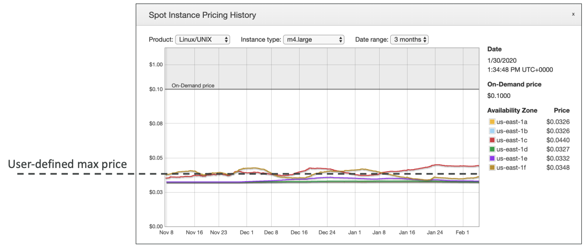
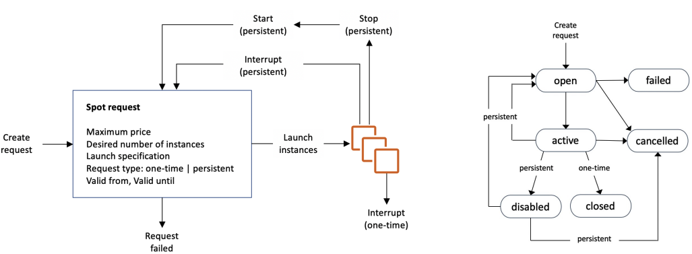

# EC2

EC2 = Elastic Compute Cloud

## Overview

- EC2 is one of the most popular of AWS’ offering 
- It mainly consists in the capability of :
    - Renting virtual machines (EC2)
    - Storing data on virtual drives (EBS)
    - Distributing load across machines (ELB)
    - Scaling the services using an auto-scaling group (ASG)
- Knowing EC2 is fundamental to understand how the Cloud works

### EC2 sizing & configuration options

- Operating System (OS): Linux, Windows or Mac OS
- How much compute power & cores (CPU)
- How much random-access memory (RAM) 
- How much storage space: 
    - Network-attached (**EBS** & *EFS*) 
    - hardware (**EC2 Instance Store**) 
- Network card: speed of the card, Public IP address 
- Firewall rules: **security group**
- Bootstrap script (configure at first launch): EC2 User Data

### EC2 User Data

- It is possible to bootstrap our instances using an EC2 User data script.
- bootstrapping means launching commands when a machine starts
- That script is only run once at the instance first start
- EC2 user data is used to automate boot tasks such as:
    - Installing updates
    - Installing software
    - Downloading common files from the internet
    - Anything you can think of
- The EC2 User Data Script runs with the root user

Example: 

```sh
#!/bin/bash
# Use this for your user data (script from top to bottom)
# install httpd (Linux 2 version)
yum update -y
yum install -y httpd
systemctl start httpd
systemctl enable httpd
echo "<h1>Hello World from $(hostname -f)</h1>" > /var/www/html/index.html
```

## EC2 Instance Types

You can use different types of EC2 instances that are optimised for different [use cases](https://aws.amazon.com/ec2/instance-types/)

**Naming convention**
AWS has the following naming convention: `m5.2xlarge`
- `m`: instance class
- `5`: generation 
- `2xlarge`: size within the instance class

### General Purpose

- Great for a diversity of workloads such as web servers or code repositories
- Balance between:
    - Compute
    - Memory
    - Networking

### Compute optimized

Great for compute-intensive tasks that require high performance processors:
- Batch processing workloads
- Media transcoding
- High performance web servers
- High performance computing (HPC)
- Scientific modeling & machine learning
- Dedicated gaming servers

### Memory optimized

Fast performance for workloads that process large data sets in memory

**Use cases:**
- High performance, relational/non-relational databases
- Distributed web scale cache stores
- In-memory databases optimized for BI (business intelligence)
- Applications performing real-time processing of big unstructured data

### Storage optimized

Great for storage-intensive tasks that require high, sequential read and write access to large data sets on local storage

**Use cases:**
- High frequency online transaction processing (OLTP) systems
- Relational & NoSQL databases
- Cache for in-memory databases (for example, Redis)
- Data warehousing applications
- Distributed file systems


### Instace types examples
Instance | vCPU |  Mem (GiB) | Storage |  Network Performance | EBS Bandwidth (Mbps)
-------| --------| -----------| --------| -----------| ------------
t2.micro    | 1   | 1        | EBS-Only             | Low to Moderate
t2.xlarge   | 4   | 16       | EBS-Only             | Moderate
c5d.4xlarge | 16  | 32       | 1 x 400 NVMe SSD     | Up to 10 Gbps | 4,750
r5.16xlarge | 64  | 512      | EBS Only             | 20 Gbps | 13,600
m5.8xlarge  | 32  | 128      | EBS Only             | 10 Gbps | 6,800

[Full of list ec2 instances.vantage.sh](https://instances.vantage.sh/)

## Purchasing Options

- **On-Demand Instances** – short workload, predictable pricing, pay by second
- **Reserved** (1 & 3 years)
    - **Reserved Instances** – long workloads
    - **Convertible Reserved Instances** – long workloads with flexible instances
- **Savings Plans** (1 & 3 years) – commitment to an amount of usage, long workload
- **Spot Instances** – short workloads, cheap, can lose instances (less reliable)
- **Dedicated Hosts** – book an entire physical server, control instance placement
- **Dedicated Instances** – no other customers will share your hardware
- **Capacity Reservations** – reserve capacity in a specific AZ for any duration

### On Demand

- Pay for what you use:
    - Linux or Windows - billing per second, after the first minute
    - All other operating systems - billing per hour
- Has the highest cost but no upfront payment
- No long-term commitment
- Recommended for **short-term** and **un-interrupted workloads**, where you can't predict how the application will behave

### Reserved Instances

- Up to 72% discount compared to On-demand
- You reserve a specific instance attributes (Instance Type, Region, Tenancy, OS)
- **Reservation Period** – 1 year (+discount) or 3 years (+++discount)
- **Payment Options** – No Upfront (+), Partial Upfront (++), All Upfront (+++)
- **Reserved Instance’s Scope** – Regional or Zonal (reserve capacity in an AZ)
- Recommended for steady-state usage applications (think database)
- You can buy and sell in the Reserved Instance Marketplace
- **Convertible Reserved Instance**
    - Can change the EC2 instance type, instance family, OS, scope and tenancy
    - Up to 66% discount

### Savings Plans

- Get a discount based on long-term usage (up to 72% - same as RIs)
- Commit to a certain type of usage ($10/hour for 1 or 3 years)
- Usage beyond EC2 Savings Plans is billed at the On-Demand price
- Locked to a specific instance family & AWS region (e.g., M5 in us-east-1)
- Flexible across:
    - Instance Size (e.g., m5.xlarge, m5.2xlarge)
    - OS (e.g., Linux, Windows)
    - Tenancy (Host, Dedicated, Default)

### Spot Instances
- Can get a discount of up to 90% compared to On-demand
- Instances that you can “lose” at any point of time if your max price is less than the current spot price
- The **MOST cost-efficient** instances in AWS
- **Useful for workloads that are resilient to failure**
    - Batch jobs
    - Data analysis
    - Image processing
    - Any **distributed** workloads
    - Workloads with a flexible start and end time (resilient to failures)
- **Not suitable for critical jobs or databases**


#### Spot Instances Requests

- Define **max spot price** and get the instance while **current spot price < max**
    - The hourly spot price varies based on offer and capacity
    - If the current spot price > your max price you can choose to **stop** or **terminate** your instance with a 2 minutes grace period.
- Other strategy: **Spot Block** (`NO SUPPORT ANYMORE`)
    - “block” spot instance during a specified time frame (1 to 6 hours) without interruptions
    - In rare situations, the instance may be reclaimed



[Detail link](https://console.aws.amazon.com/ec2sp/v1/spot/home?region=us-east-1)

#### Terminate Sspot instances



- You can only cancel Spot Instance requests that are **open**, **active**, or **disabled**.
- Cancelling a Spot Request does not terminate instances
- You must first cancel a Spot Request, and then terminate the associated Spot Instances

#### Spot fleets
- **Spot Fleets = set of Spot Instances + (optional) On-Demand Instances**
- The Spot Fleet will try to meet the target capacity with price constraints
    - Define possible launch pools: instance type (m5.large), OS, Availability Zone
    - Can have multiple launch pools, so that the fleet can choose
    - Spot Fleet stops launching instances when reaching capacity or max cost
- Strategies to allocate Spot Instances:
    - lowestPrice: from the pool with the lowest price (cost optimization, short workload)
    - diversified: distributed across all pools (great for availability, long workloads)
    - capacityOptimized: pool with the optimal capacity for the number of instances
    - **priceCapacityOptimized (recommended)**: pools with highest capacity available, then select the pool with the lowest price (best choice for most workloads)
- Spot Fleets allow us to automatically request Spot Instances with the lowest price

### Dedicated Hosts

- A physical server with EC2 instance capacity fully dedicated to your use
- Allows you address **compliance requirements** and **use your existing server- bound software licenses** (per-socket, per-core, pe—VM software licenses)
- Purchasing Options:
    - **On-demand** – pay per second for active Dedicated Host
    - **Reserved** - 1 or 3 years (No Upfront, Partial Upfront, All Upfront)
- The most expensive option
- Useful for software that have complicated licensing model (BYOL – Bring Your Own License)
- Or for companies that have strong regulatory or compliance needs

### Dedicated Instances
- Instances run on hardware that’s dedicated to you
- May share hardware with other instances in same account
- No control over instance placement (can move hardware after Stop / Start)

Characteristic | Dedicated Instances |  Dedicated Hosts
---- | ----- | ------
Enables the use of dedicated physical servers |  ✅  | ✅
Per instance billing (subject to a $2 per region fee) | ✅ 
Per host billing |  | ✅
Visibility of sockets, cores, host ID |  | ✅
Affinity between a host and instance |  | ✅
Targeted instance placement |  | ✅
Automatic instance placement | ✅ | ✅
Add capacity using an allocation request |   | ✅

### Capacity Reservations
- Reserve On-Demand instances capacity in a specific AZ for any duration
- You always have access to EC2 capacity when you need it
- **No time commitment** (create/cancel anytime), **no billing discounts**
- Combine with Regional Reserved Instances and Savings Plans to benefit from billing discounts
- You’re charged at On-Demand rate whether you run instances or not
- Suitable for short-term, uninterrupted workloads that needs to be in a specific AZ

### Which option is right for me?
- On demand: coming and staying in resort whenever we like, we pay the full price
- Reserved: like planning ahead and if we plan to stay for a long time, we may get a good discount.
- Savings Plans: pay a certain amount per hour for certain period and stay in any room type (e.g., King, Suite, Sea View, …)
- Spot instances: the hotel allows people to bid for the empty rooms and the highest bidder keeps the rooms. You can get kicked out at any time
- Dedicated Hosts: We book an entire building of the resort 
- Capacity Reservations: you book a room for a period with full price even you don’t stay in it

### Price Comparison 
Example – `m4.large` – `us-east-1` 

Price | Type Price (per hour)
---- | -----
On-Demand  | $0.10
Spot Instance (Spot Price)  | $0.038 - $0.039 (up to 61% off)
Reserved Instance (1 year)  | $0.062 (No Upfront) - $0.058 (All Upfront)
Reserved Instance (3 years)  | $0.043 (No Upfront) - $0.037 (All Upfront)
EC2 Savings Plan (1 year)  | $0.062 (No Upfront) - $0.058 (All Upfront)
Reserved Convertible Instance (1 year)  |  $0.071 (No Upfront) - $0.066 (All Upfront)
Dedicated Host  | On-Demand Price
Dedicated Host Reservation |   Up to 70% off
Capacity Reservations |  On-Demand Price

## Placement Groups

- Sometimes you want control over the EC2 Instance placement strategy
- That strategy can be defined using placement groups
- When you create a placement group, you specify one of the following strategies for the group:
    - *Cluster—clusters* instances into a low-latency group in a single Availability Zone
    - *Spread—spreads* instances across underlying hardware (max 7 instances per group per AZ)
    - *Partition—spreads* instances across many different partitions (which rely on different sets of racks) within an AZ. Scales to 100s of EC2 instances per group (Hadoop, Cassandra, Kafka)

### Placement Groups Cluster

- ✅ Pros: Great network (10 Gbps bandwidth between instances with Enhanced Networking enabled - recommended)
- ❌ Cons: If the rack fails, all instances fails at the same time

**Use case**:
- Big Data job that needs to complete fast
- Application that needs extremely low latency and high network throughput