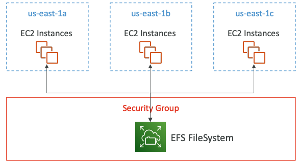
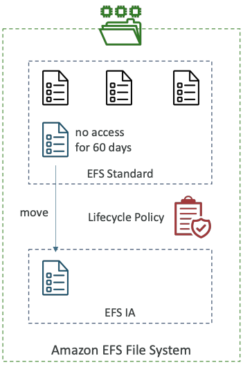

# Amazon Elastic File System (EFS)

## Overview

- Uses NFSv4.1 protocol
- Uses security group to control access to EFS
- Compatible with Linux based AMI (not Windows)
- Encryption at rest using KMS
- POSIX file system (~Linux) that has a standard file API
- File system scales automatically, pay-per-use, no capacity planning!

**Use cases**: content management, web serving, data sharing, Wordpress

## Performance

- **EFS Scale**
    - 1000s of concurrent Network File System (NFS) clients, 10 GB+ /s throughput
    - Grow to Petabyte-scale network file system, automatically
- **Performance Mode (set at EFS creation time)**
    - **General Purpose (default)** – latency-sensitive use cases (web server, CMS, etc…)
    - **Max I/O** – higher latency, throughput, highly parallel (big data, media processing)
- **Throughput Mode**
    - **Bursting** – 1 TB = 50MiB/s + burst of up to 100MiB/s
    - **Provisioned** – set your throughput regardless of storage size, ex: 1 GiB/s for 1 TB storage
    - **Elastic** – automatically scales throughput up or down based on your workloads
        - Up to 3GiB/s for reads and 1GiB/s for writes
        - Used for unpredictable workloads

## Storage Classes

**Storage Tiers (lifecycle management feature – move file after N days)**
- Standard: for frequently accessed files 
- Infrequent access (EFS-IA): cost to retrieve files, lower price to store. Enable EFS -IA with a Lifecycle Policy

**Availability and durability** 
- Standard: Multi-AZ, great for prod
- One Zone: One AZ, great for dev, backup enabled by default, compatible with IA (EFS One Zone-IA)
- Over 90% in cost savings

## EBS vs EFS vs S3

Category | S3  |  EBS |  EFS
------ | ----- | ---- | -----
Storage Type | Object Storage | Block Storage | File Storage
Pricing | Pay as you Use | Pay for provisioned capacity  | Pay as you Use
Storage Size | Unlimited Storage | Limited storage | Unlimited Storage
Scalability | Unlimited Scalability | Increase decrease size **manually** | Unlimited Scalability
Durability | Stored redundantly across multiple Azs | Stored redundantly in a Single AZ | Stored redundantly across multiple Azs
Availability | Max is 99.99% with S3 Standard | 99.99% | No Service-level agreements (SLAs)
Security | Supports Data at Rest & Data in Transit encryption | same | same
Back up & Restore | Use Versioning or cross-region replication |  Automated Backups and Snapshots | EFS to EFS replication
Performace | Slowest | Fastest | Faster than S3, slower than EBS
Accessibility | Publicly & privately | only via the attached EC2 instance | simulatenously from multiple EC2 and on-premises instance
Interface | Web Interface | File System Interface | Web and File System Interface
Use cases | Media, Entertainment, Big data analytics, backups and archives, web serving and content management | Boot volumes, transactional and NoSQL databases, data  warehousing ETL | Media, Entertainment, Big data  analytics, backups and archives, web serving and content management, home directories
