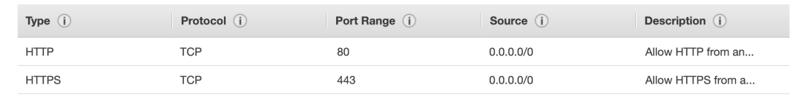
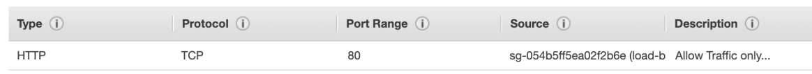
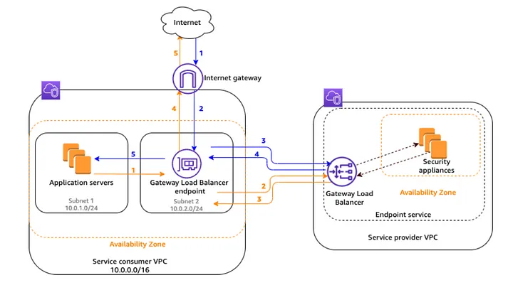
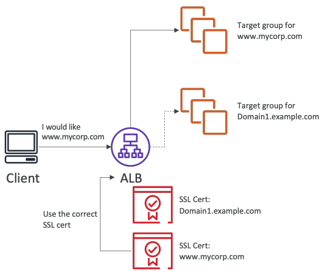
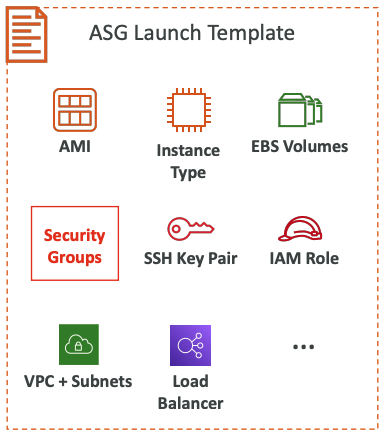
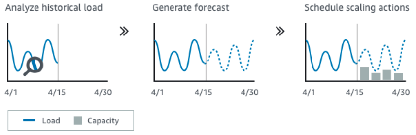

# Elastic Load Balancing (ELB)

## Overview
### What?

Distribute network traffic to improve app scalability

### Why use a load balancer?
- Spread load across multiple downstream instances 
- Expose a single point of access (DNS) to your application 
- Seamlessly handle failures of downstream instances 
- Do regular health checks to your instances 
- Provide SSL termination (HTTPS) for your websites
- **High availability** across zones & automatic scaling
- Separate public traffic from private traffic

### Why use an Elastic Load Balancer?
- An Elastic Load Balancer is a managed load balancer
    - AWS guarantees that it will be working
    - AWS takes care of upgrades, maintenance, high availability
    - AWS provides only a few configuration knobs
- It costs less to setup your own load balancer but it will be a lot more effort on your end
- It is integrated with many AWS offerings / services
    - EC2, EC2 Auto Scaling Groups, Amazon ECS
    - AWS Certificate Manager (ACM), CloudWatch
    - Route 53, AWS WAF, AWS Global Accelerator

## Security Groups 

**Load Balancer Security Group**

**Application Security Group: Allow traffic only from Load Balancer**

## Types & Comparison

Feature | Application LB | Network LB | Gateway LB | Classic LB
--------|----------------|------------|-------------|-----------
Released Year  | 2016 v2 | 2017 v2 | 2020 | 2009 v1
OSI Layer | 7           | 4 | 3 Gateway + 4 LB | 4 / 7  
Target type | IP, Instance, `Lambda` | IP, Instance, `ALB` |  IP, Instance | 
Cross-zone Default | Enabled   | Disabled  | Disabled  | Disabled  
Charges for inter AZ data | No | Yes | Yes | No
Sticky Sessions | ✅ | ✅ | ❌ | ✅
Terminates flow/ proxy behavior | ✅ | ✅ | ❌ | ✅
Reachable via  | VIP  | VIP | Route table entry | 
Protocol listerners | HTTP, HTTPs, gRPC | TCP, UDP, TLS | IP | TCP, SSL/TLS, HTTP, HTTPS
SSL Certificates | multiple with SNI | multiple with SNI | ❌ | only 1 

Notes:
- Overall, it is recommended to use the newer generation load balancers as they provide more features
- Some load balancers can be setup as internal (private) or external (public) ELBs

## Application Load Balancer (ALB)

- Load balancing to multiple HTTP applications across machines (target groups)
- Load balancing to multiple applications on the same machine (ex: containers)

### Features
- Support redirects (from HTTP to HTTPS for example)
- Fixed response
- Desync Mitigation Mode
- Support HTTP2 /gRPC / Websocket
- HTTP header based routing. Routing tables to different target groups:
    - Routing based on path in URL (`example.com/users` & `example.com/posts`)
    - Routing based on hostname in URL (`one.example.com` & `other.example.c`om)
    - Routing based on Query String, Headers (`example.com/users?id=123&order=false`)
- Has a port mapping feature to redirect to a dynamic port in ECS
- ALB are a great fit for micro services & container-based application (example: Docker & Amazon ECS)
- In comparison, we’d need multiple Classic Load Balancer per application

### Target groups
- EC2 instances (can be managed by an Auto Scaling Group) – HTTP
- ECS tasks (managed by ECS itself) – HTTP
- Lambda functions – HTTP request is translated into a JSON event
- IP Addresses – must be private IPs
- ALB can route to **multiple target groups**
- Health checks are at the target group level

### Good to Know

- Fixed hostname (XXX.region.elb.amazonaws.com)
- The application servers don’t see the IP of the client directly
    - The true IP of the client is inserted in the header **X-Forwarded-For**
    - We can also get Port (X-Forwarded-Port) and proto (X-Forwarded-Proto)

## Network Load Balancer (NLB)
- Works on layer 4 allow to:
    - Forward TCP & UDP traffic to your instances
    - Handle millions of request per seconds
    - Less latency ~100 ms (vs 400 ms for ALB)
- NLB has **one static IP per AZ**, and supports assigning Elastic IP (helpful for whitelisting specific IP)
- NLB are used for extreme performance, TCP or UDP traffic
- Not included in the AWS free tier

### Target Groups

- EC2 instances
- IP Addresses – must be private IPs
- Application Load Balancer
- Health Checks support the TCP, HTTP and HTTPS Protocols

## Gateway Load Balancer (GWLB)

- Deploy, scale, and manage a fleet of 3rd party network virtual appliances in AWS
- Example: Firewalls, Intrusion Detection and Prevention Systems, Deep Packet Inspection  Systems, payload manipulation, …
- Operates at Layer 3 (Network Layer) – IP Packets
- Combines the following functions:
    - **Transparent Network Gateway** – single entry/exit for all traffic
    - **Load Balancer** – distributes traffic to your virtual appliances
- Uses the **GENEVE** protocol on port `6081`

https://piyushj02.medium.com/aws-gateway-load-balancer-1o1-26d7cf61b798

## Sticky Sessions (Session Affinity)
- It is possible to implement stickiness so that the same client is always redirected to the same instance behind a load balancer
- This doesn't support Gateway Load Balancer
- For both CLB & ALB, the “cookie” used for stickiness has an expiration date you control
- Enabling stickiness may bring imbalance to the load over the backend EC2 instances 

**Use case**: make sure the user doesn’t lose his session data

### Cookie Names

- Application-based Cookies
    - Custom cookie
        - Generated by the target
        - Can include any custom attributes required by the application
        - Cookie name must be specified individually for each target group
        - Don’t use **AWSALB**, **AWSALBAPP**, or **AWSALBTG** (reserved for use by the ELB)
    - Application cookie
        - Generated by the load balancer
        - Cookie name is **AWSALBAPP**
- Duration-based Cookies
    - Cookie generated by the load balancer
    - Cookie name is **AWSALB** for ALB, **AWSELB** for CLB

## SSL Certificates

- The load balancer uses an X.509 certificate (SSL/TLS server certificate)
- You can manage certificates using ACM (AWS Certificate Manager)
- You can create upload your own certificates alternatively
- HTTPS listener:
    - You must specify a default certificate
    - You can add an optional list of certs to support multiple domains
    - **Clients can use SNI (Server Name Indication) to specify the hostname they reach**
    - Ability to specify a security policy to support older versions of SSL / TLS (legacy clients)

### Server Name Indication (SNI)

- SNI solves the problem of loading **multiple SSL certificates onto one web server (same public IP)** (to serve multiple websites)
- It’s a “newer” protocol, and requires the client to **indicate** the hostname of the target server in the initial SSL handshake
- The server will then find the correct certificate, or return the default one

**Note:**
- Only works for ALB & NLB (newer generation), CloudFront 
- Does not work for CLB (older gen)

### Add new steps
- AWS Certificate Manager to create one, then add listener on port `443` in Loadbalancer dashboard
- Redirect `http` to `https` => add listener on port `80` choose Action `Redirect` => Full URL

## Deregistration Delay / Connection Draining

Same meaning with graceful shutdown.

**Feature naming**
- Connection Draining – for CLB
- Deregistration Delay – for ALB & NLB

- Time to complete **in-flight requests** while the instance is de-registering or unhealthy
- **Stops sending new requests to the EC2 instance which is de-registering**
- Between 1 to 3600 seconds (default: `300 seconds`)
    - Can be disabled (set value to 0)
    - Set to a low value if your requests are short

[Connection Draining – Remove Instances From Service With Care](https://aws.amazon.com/blogs/aws/elb-connection-draining-remove-instances-from-service-with-care/)

## Auto Scaling Group (ASG)

### Attributes

- A Launch Template (older “Launch Configurations” are deprecated)
    - AMI + Instance Type
    - EC2 User Data
    - EBS Volumes
    - Security Groups
    - SSH Key Pair
    - IAM Roles for your EC2 Instances
    - Network + Subnets Information
    - Load Balancer Information
- Min Size / Max Size / Initial Capacity
- Scaling Policies

### CloudWatch Alarms & Scaling

- It is possible to scale an ASG based on CloudWatch alarms
- An alarm monitors a metric (such as **Average CPU**, or a **custom metric**)
- Metrics such as Average CPU are computed for the overall ASG instances
- Based on the alarm:
    - We can create scale-out policies (increase the number of instances)
    - We can create scale-in policies (decrease the number of instances)

### Dynamic Scaling Policies

- **Target Tracking Scaling**
    - Most simple and easy to set-up
    - Example: I want the average ASG CPU to stay at around 40%
- **Simple / Step Scaling**
    - When a CloudWatch alarm is triggered (example CPU > 70%), then add 2 units
    - When a CloudWatch alarm is triggered (example CPU < 30%), then remove 1
- **Scheduled Actions**
    - Anticipate a scaling based on known usage patterns
    - Example: increase the min capacity to 10 at 5 pm on Fridays

### Good metrics to scale on
- **CPUUtilization**: Average CPU utilization across your instances
- **RequestCountPerTarget**: to make sure the number of requests per EC2 instances is stable
- **Average Network In / Out** (if you’re application is network bound)
- **Any custom metric** (that you push using CloudWatch)

### Predictive Scaling

Predictive scaling: continuously forecast load and schedule scaling ahead

### Scaling Cooldowns

- After a scaling activity happens, you are in the **cooldown period (default 300 seconds)**
- During the cooldown period, the ASG will not launch or terminate additional instances (to allow for metrics to stabilize)
- **Advice**: Use a `ready-to-use AMI` to reduce configuration time in order to be serving request fasters and reduce the cooldown period

## Pricing
- Pay for each running / partial running hour
- Number of LCU used per hour
    - ALB: LCU
    - NLB: NLCU
    - GLB: GLCU
- For GLB, pay for GWLBE (AWS PrivateLink)
- Free Tier:
    - 12 months, 750 hours shared per month for CLB, ALB
    - 15GB data for CLB, 15 LCUs for ALB

### LCU
- Dimensions: Charge at highest elements
    - New connections per hour
    - Active connections per hour
    - Processed bytes per hour
    - Rule evaluations
- 1 LCU:
    - 25 new connections per second
    - 3,000 active connections per minutes
    - 1GB data processed for Amazon EC2, containers or IP; 0.4GB data processed for Lambda.
    - 1,000 rule evaluation per second

### Example

An application receives an average of 500 new connections per seconds, 10,000 active connections per minute. 

Request/response messages has 8KB. 

You configured 20 rules on ALB for validation. 

System is served by 70% EC2 and 30% Lambda. 

As a Solution Architect, what is the pricing estimation for this scenario?

**Analysis:**

- New connections per second (25): 500 => 20 LCU
- Active connections per minute (3,000): 10,000 => 3.33 LCU
- Proceed data per hour (1GB EC2, 0.4GB Lambda): 10.08GB for EC2, 4.32GB for Lambda => LCU = 10.08 + 10.8 = 20.88 LCU
- Rule validation per second (1,000): 20* 500 = 10,000 => LCU = 10

**Pricing (Singapore):**
- Provision hour: $0.0252
- LCU = 20.88 * $0.008 = $0.16704
- Hourly: $0.19224 => Monthly: $138.41

[Detail](https://aws.amazon.com/elasticloadbalancing/pricing/)

## Others

### ELB Quotas
- ELB per Region: 50
- Target Group per Region: 3,000
- Listeners per LB: 50
- Targets per LB: 100
- Security Group per LB: 5
- Rules per LB (not counting default rules): 100
- Certificates per LB (not counting default cer): 25
- LBs per Target group: 1
- EC2 / IP per Target group: 1,000
- Lambda per Target group: 1

[Detail](https://docs.aws.amazon.com/elasticloadbalancing/latest/application/load-balancer-limits.html)

### Alias DNS name: 
Use Route53 Service to create an alias for url (DNS Name generated by AWS) 

## Refs

- AMI: Amazon Machine Image 
- LCU: Load Balancer Capacity Units
- VIP: Virtual IP Load Balancing
- ALB: Application Load Balancer
- NLB: Network Load Balancer
- GLB: Gateway Load Balancer
- SNI: Server Name Indication

https://jayendrapatil.com/tag/elb-vs-alb-vs-nlb/