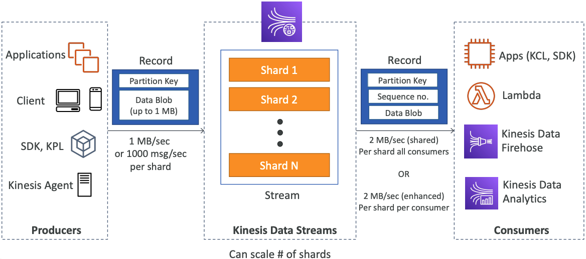
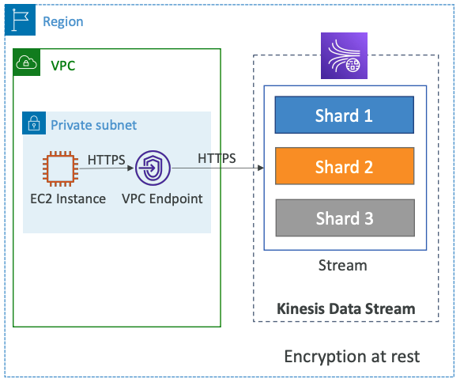
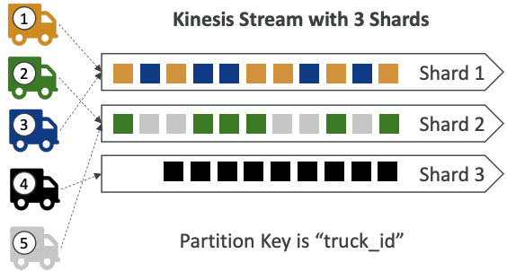

# Kinesis 

## Overview

- Makes it easy to **collect**, **process**, and **analyze** streaming data in real-time
- Ingest real-time data such as: Application logs, Metrics, Website clickstreams, IoT telemetry data…
-  **Kinesis Data Streams**: capture, process, and store data streams
-  **Kinesis Data Firehose**: load data streams into AWS data stores
-  **Kinesis Data Analytics**: analyze data streams with SQL or Apache Flink
-  **Kinesis Video Streams**: capture, process, and store video streams

## Kinesis Data Streams

- Retention between 1 day to 365 days
- Ability to reprocess (replay) data
- Once data is inserted in Kinesis, it can’t be deleted (immutability)
- Data that shares the same partition goes to the same shard (ordering)
- Producers: AWS SDK, Kinesis Producer Library (KPL), Kinesis Agent
- Consumers:
    - Write your own: Kinesis Client Library (KCL), AWS SDK
    - Managed: AWS Lambda, Kinesis Data Firehose, Kinesis Data Analytics, 

### Capacity Modes

**Provisioned mode:**
- You choose the number of shards provisioned, scale manually or using API
- Each shard gets 1MB/s in (or 1000 records per second)
- Each shard gets 2MB/s out (classic or enhanced fan-out consumer)
- You pay per shard provisioned per hour

**On-demand mode:**
- No need to provision or manage the capacity
- Default capacity provisioned (4 MB/s in or 4000 records per second)
- Scales automatically based on observed throughput peak during the last 30 days
- Pay per stream per hour & data in/out per GB

## Security

- Control access / authorization using IAM policies
- Encryption in flight using HTTPS endpoints
- Encryption at rest using KMS 
- You can implement encryption/decryption of data on client side (harder)
- VPC Endpoints available for Kinesis to access within VPC
- Monitor API calls using CloudTrail

## Kinesis Data Firehose

- Fully Managed Service, no administration, automatic scaling, serverless
    - AWS: Redshift / Amazon S3 / OpenSearch
    - 3rd party partner: Splunk / MongoDB / DataDog / NewRelic / …
    - Custom: send to any HTTP endpoint
- Pay for data going through Firehose
- **Near Real Time**
    - 60 seconds latency minimum for non full batches
    - Or minimum 1 MB of data at a time
- Supports many data formats, conversions, transformations, compression
- Supports custom data transformations using AWS Lambda
- Can send failed or all data to a backup S3 bucket

## Kinesis Data Streams vs Firehose

Kinesis Data Streams | Kinesis Data Firehose
---- | ----
Streaming service for ingest at scale | Load streaming data into S3 / Redshift / OpenSearch / 3rd party / custom HTTP
Write custom code (producer / consumer) | Fully managed
Real-time (~200 ms) | Near real-time (buffer time min. 60 sec)
Manage scaling (shard splitting / merging) | Automatic scaling
Data storage for 1 to 365 days | No data storage
Supports replay capability | Doesn’t support replay capability

## Ordering data into Kinesis

- Imagine you have 100 trucks (truck_1, truck_2, … truck_100) on the road sending their GPS positions regularly into AWS.
- You want to consume the data in order for each truck, so that you can track their movement accurately.
- How should you send that data into Kinesis?

- Answer: send using a “Partition Key” value of the “truck_id”
- The same key will always go to the same shard

### Ordering data into SQS

- For SQS standard, there is no ordering.
- For SQS FIFO, if you don’t use a Group ID, messages are consumed in the order they are sent, with only one consumer
- You want to scale the number of consumers, but you want messages to be “grouped” when they are related to each other
- Then you use a Group ID (similar to Partition Key in Kinesis)

[Solving Complex Ordering Challenges with Amazon SQS FIFO Queues](https://aws.amazon.com/blogs/compute/solving-complex-ordering-challenges-with-amazon-sqs-fifo-queues/)

### Kinesis vs SQS ordering

Let’s assume 100 trucks, 5 kinesis shards, 1 SQS FIFO

**Kinesis Data Streams:**
- On average you’ll have 20 trucks per shard
- Trucks will have their data ordered within each shard
- The maximum amount of consumers in parallel we can have is 5
- Can receive up to 5 MB/s of data

**SQS FIFO**
- You only have one SQS FIFO queue
- You will have 100 Group ID
- You can have up to 100 Consumers (due to the 100 Group ID)
- You have up to 300 messages per second (or 3000 if using batching)

## SQS vs SNS vs Kinesis

SQS | SNS | Kinesis
--- | ---- | ----
Consumer “pull data” | Push data to many subscribers | Standard: pull data   *2 MB per shard*
Data is deleted after being consumed | Data is not persisted (lost if not delivered) | Possibility to replay data
Can have as many workers (consumers) as we want | Up to 12,500,000 subscribers | Enhanced-fan out: push data   *2 MB per shard per consumer*
No need to provision throughput | Up to 100,000 topics | Meant for real-time big data, analytics and ETL
Ordering guarantees only on FIFO queues | FIFO capability for SQS FIFO |  Ordering at the shard level
Individual message delay capability | Integrates with SQS for fan-out architecture pattern | Provisioned mode or ondemand capacity mode

## Apache Kafka vs Amazon Kinesis

### Concepts

Concepts | Kafka | Kinesis
--- | ---- | ----
Concepts |	Kafka Streams |	Kinesis Analytics
Stream of records container	| Topic	 | Stream
Data Stored in... | Kafka Partition | Kinesis Shard
Unique ID of a record | Offset number | Sequence number
Ordering under... | Partition level | Shard level

### Features

Features | Kafka | Kinesis
--- | ---- | ----
SDK Support | Kafka SDK supports Java | AWS SDK supports Android, Java, Go, .NET
Configuration & Features | More control on configuration and better performance | Number of days/shards can only be configured
Reliability | The replication factor can be configured | Kinesis writes synchronously to 3 different machines/data-centers
Performance | Kafka wins | Kinesis writes each message synchronously to 3 different machines
Data Retention | Configurable | 7 days at max
Log Compaction | Supported | Not supported
Processing Events | More than 1000s of events/sec | Almost 1000s of events/sec
Producer Throughput | Kafka Wins | Kinesis is a bit slower than Kafka

### Ops

Ops | Kafka | Kinesis
--- | ---- | ----
Setup | Weeks | A couple of hours
Configuration Store | Apache Zookeeper | Amazon DynamoDB
Checkpointing | Offsets stored in a special topic | DynamoDB
Incident Risk/Maintenance | More In Kafka | Amazon takes care
Human Costs | Require human support for installing and managing their clusters, and also accounting for requirements such as high availability, durability, and recovery | Kinesis is just about paying and use

[AWS Kinesis vs Kafka comparison: Which is right for you?](https://www.softkraft.co/aws-kinesis-vs-kafka-comparison/)