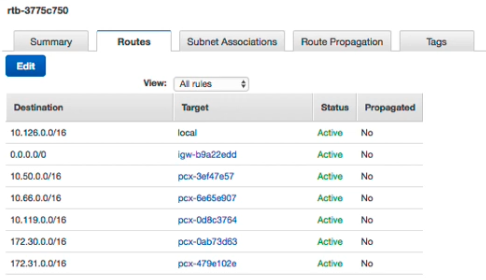

# Miscellaneous

## Lambda
- **Serverless** compute service
- Memory: 128MB-10GB.
- Supported: Node.is, python, Go, C#, Ruby, Powershell, Docker, Java.
- Architect: ×86, arm.
- AWS Lambda is SOC, HIPAA, PCI, ISO Compliant
- Quotas:
    - Concurrent executions: 1,000 (up to 10,000)
    - Storage for uploaded functions (zip) and layers: 75GB (up to TB)
    - Timeout: **15min**
    - Layers: 5
    - Deployment package (zip): 50MB zipped, 250MB unzipped
    - Container image code package size: 10GB
    - Test event: 10
    - /tmp directory storage: 512MB

## Security Group
- Security Group is a Firewall
- Working Level: Instance (Network Interfaces)
- Allow Only
- Stateful (incoming OR outgoing explicitly)
- Audit all rules
- Max:
    - 2,500 NACLs per Region
    - 60 Rules per Security Group Separately
    - 5 Security Groups per Network Interface

## Network Access Control List (NACL)
- Network ACL: is a **Firewall**
- Working Level: **Subnet** (one subnet => one NACL)
- Allow & Deny
- Stateless (incoming AND outgoing explicitly)
- Audit rules by orders (lowest is highest)
- Max:
    - 200 NACLs per VPC
    - 20 Rules per NACL separately.

## Route table

- Determine where network traffic from your subnet or gateway is directed
- Route table will be attached to SUBNET/AZ in a VPC
- One subnet only has ONE route table
- One route table can be attached to many subnet
- Route table is belong to VPC
- Quotas:
    - Route tables per VPC: 200
    - Routes per route table: 50
    - BGP advertised routes per route table: 100

**Blackhole at Route Table**
- Record in Route table become **Blackhole** when assigned NAT deleted.

## NAT Gateways
- Use case: private instances can connect services outside your VPC, but external services cannot initiate a connection with those instances.
- Public NAT & Private NAT (do not require IGW to operate)
- Pricing: by available hour & each GiB of processed data
- HA in AZ Scope and is a managed service.
- Supported protocols: TCP, UDP, IMP
- Bandwidth: 5Gbps and can scale to 45 Gbps

## AWS Web Application Firewall (WAF)

- Protects your web app from common web exploits (Layer7)
- Apply to ALB, API Gateway, CloudFront, AppSync
- Web ACL (Access Control List):
    - Common attacks: SQL injection, XSS
    - DDoS protection (Rate based rules)
    - Block countries (geo-match)
    - Rules can include: IP Address, HTTP headers, HTTP body, URI string.
- Pricing: Web ACL (5$/month), Rule ($1/month), Request ($0.6/1 M)
- Quotas (per Region):
    - Web ACLs: 100
    - Web ACL capacity Unit (WCUs) per Web ACL: 1,500
    - WCUs per rule group: 1,500
    - Requests per second for WebACL (ALB): 25,000
- Ref: [waf](https://docs.aws.amazon.com/waf/latest/developerguide/limits.html)

## Amazon GuardDuty

- Protect your AWS accounts with intelligent threat detection
- Pricing (30-day free trial):
    - CloudTrail management event analysis
    - CloudTrail S3 data event analysis
    - Amazon EKS audit log analysis
    - VPC Flow Log & DNS query log analysis (per GB)

## Amazon Inspector

- Automated and continual near real-time vulnerability management at scale
- Scan: Amazon EC2 & container images on ECR
- Integrate AWS Security Hub and Amazon EventBridge to automate workflows and ticket routing
- Required: SSM Agents, EC2 instances are managed by SSM
- 15 day Free trial
- Pricing:
    - Avg scanned instances per month
    - Scanned container images on ECR per month
    - No of automated rescans for container images in ECR
- Ref: https://aws.amazon.com/inspector/?nc=sn&loc=0

Inspector | GuardDuty
----------| ---------
Enhance security | Enhance security
Security assessments of the app's settings & configuration | Analyse the entirety of AWS accounts for potential threats
EC2 instance, container images on ECR | CloudTrail event, EKS audit log, VPC flow log, DNS query log
Done based on "rules" |  Done by Machine Learning
SSM Agent | N / A
Free-tier eligible | Free-tier eligible

## Public IP vs AWS Elastic IP (EIP)

Feature | Public IP | Elastic IP 
--------| ----------| ----------
WHAT    | A public IP is assigned from Amazon's pool of IPv4, not associate with your Account | Static public IP Address, and associated with vour account 
COST    | Free | Charged if not associate or instance stopped
Static or Dynamic | Dynamic. Changed every time if stop and start |  Static 
No IP per instance | 1 | Can add more than one. Additional EIP will be charged
Quotas |  Unlimited | 5
Share publicity | ✅, but not recommended. | ✅
Recovery | ❌ | You may get it back if not associate to someone else

## EC2 Instance Store

- Provide temporary block level storage for instance
- The storage is a disk that physically attached to host
- Ideal workload: buffers, caches, scratch data, temporary content
- Data is lost when:
    - Underlying disk drive fails
    - Instance stop / hibernates / terminates
- Very high IOPS: up to million IOPS (Eg: i3.16xlarge 3.3M read and 1.4M write IOPS)
- Ref: [here](https://docs.aws.amazon.com/AWSEC2/latest/UserGuide/storage-optimized-instances.html#storage-instances-diskperf)

## Amazon ECS - Lifecycle event hooks

- Is a lambda function that specified after the name of the lifecycle event
- Each hook is executed once per deployment
- 5 Lifecycle events:
    - BeforeInstall
    - Afterinstall
    - AfterAllow TestTraffic
    - BeforeAllowTraffic
    - AfterAllowTraffic
- Ref: https://docs.aws.amazon.com/codedeploy/latest/userguide/reference-appspec-file-structure-hooks.html

## Elastic Network interfaces (ENI)
- Logical component in a VPC that represents a **virtual network card**
- The ENI can have the following attributes:
    - Primary private IPv4, one or more secondary IPv4
    - One Elastic IP (IPv4) per private IPv4
    - One Public IPv4
    - One or more security groups
    - A MAC address
- You can create ENI independently and attach them on the fly (**move them**) on EC2 instances for failover
- Bound to a specific availability zone (AZ)

## Amazon Macie

- Fully managed data security & data privacy service
- Use ML and pattern matching to discover, protect sensitive data on AWS
- Macie inventory: unencrypted buckets, public buckets, and buckets shared with other AWS Account
- Capability: alert sensitive data such as PII
- Help to meet compliance: HIPAA, GDPR
- 30-days Free trial for Inventory, bucket level security, access control assessment at no cost (sensitive data discovery is not included)
- Pricing (Singapore Region):
- Number of Amazon S3 buckets ($0.1 / S3 bucket)
- Data processed: $1.35 per GB for First 50TB per month
- Ref: [https://aws.amazon.com/macie/](https://aws.amazon.com/macie/)

## Nitro System

AWS has completely re-imagined our virtualization infrastructure. 

Traditionally, hypervisors protect the physical hardware and bios, virtualize the CPU, storage, networking, and provide a rich set of management capabilities. 

With the Nitro System, we are able to break apart those functions, offload them to dedicated hardware and software, and reduce costs by delivering practically all of the resources of a server to your instances.

- Divided in parts: Nitro Card, Nitro Security Chip, Nitro Hypervisor, Nitro Enclaves, NitroTPM (in 2022)
- In Development since 2013
- Launched in Nov 2017
- All new launches use Nitro

## Chip AWS Gravion

- Best price performance for workloads in Amazon EC2
- Supported services: Amazon Aurora, Amazon ElastiCache, Amazon MR, AWS Lambda, AWS Fargate
- Eg: M6g, M6gd, T4g, C7g, C6g, R6g, X2gd, Im4gn, G5g
- AWS Graviton2 supports up to 40% better price performance compared current generation ×86-based instance.
- AWS Graviton3: 25% better compute performance, up to 2x higher floating-point performance, up to 2x faster cryptographic workload compare to AWS Graviton2 processors.
- Graviton3 delivery up to 3x better performance compared to Graviton2 for ML workload, including support bfloat16
- Graviton3 support DDR5 with 50% more memory bandwidth compared to DDR4
- Customers: Epic Games, DIRECTV, Intuit, Lyft, Formula 1
- Ref: [https://aws.amazon.com/ec2/graviton/](https://aws.amazon.com/ec2/graviton/)

