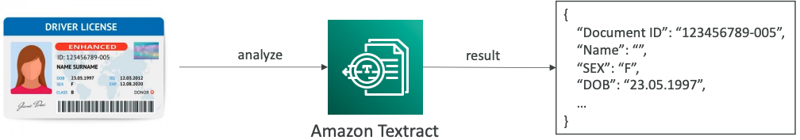

# Machine Learning

## Amazon Rekognition

- Find objects, people, text, scenes in images and videos using ML
- Facial analysis and facial search to do user verification, people counting
- Create a database of “familiar faces” or compare against celebrities

**Use cases:**
- Labeling
- Content Moderation
- Text Detection
- Face Detection and Analysis (gender, age range, emotions…)
- Face Search and Verification
- Celebrity Recognition
- Pathing (ex: for sports game analysis)

### Content Moderation

- Detect content that is inappropriate, unwanted, or offensive (image and videos)
- Used in social media, broadcast media, advertising, and e-commerce situations to create a safer user experience
- Set a Minimum Confidence Threshold for items that will be flagged
- Flag sensitive content for manual review in Amazon Augmented AI (A2I)
- Help comply with regulations

## Amazon Transcribe

- Automatically **convert speech to text**
- Uses a **deep learning process** called **automatic speech recognition** (ASR) to convert speech to text quickly and accurately
- **Automatically remove Personally Identifiable Information (PII) using Redaction**
- **Supports Automatic Language Identification for multi-lingual audio**

**Use cases:**
- transcribe customer service calls
- automate closed captioning and subtitling
- generate metadata for media assets to create a fully searchable arch

## Amazon Polly 

- Turn text into lifelike speech using deep learning 
- Allowing you to create applications that talk

### Lexicon & SSML

- Customize the pronunciation of words with **Pronunciation lexicons**
    - Stylized words: St3ph4ne => “Stephane”
    - Acronyms: AWS => “Amazon Web Services”
- Upload the lexicons and use them in the **SynthesizeSpeech** operation
- Generate speech from plain text or from documents marked up with **Speech Synthesis Markup Language (SSML)** – enables more customization
    - emphasizing specific words or phrases
    - using phonetic pronunciation
    - including breathing sounds, whispering
    - using the Newscaster speaking style

## Amazon Translate

- Natural and accurate **language translation**
- Amazon Translate allows you to localize content - such as websites and applications - for **international users**, and to easily translate large volumes of text efficiently

## Amazon Lex & Connect

**Amazon Lex**: (same technology that powers Alexa)
- Automatic Speech Recognition (ASR) to convert speech to text
- Natural Language Understanding to recognize the intent of text, callers
- Helps build chatbots, call center bots

**Amazon Connect**:
- Receive calls, create contact flows, cloud-based **virtual contact center**
- Can integrate with other CRM systems or AWS
- No upfront payments, 80% cheaper than traditional contact center solutions

## Amazon Textract

- Automatically extracts text, handwriting, and data from any scanned documents using AI and ML
- Extract data from forms and tables
- Read and process any type of document (PDFs, images, …)

**Use cases:**
- Financial Services (e.g., invoices, financial reports)
- Healthcare (e.g., medical records, insurance claims)
- Public Sector (e.g., tax forms, ID documents, passports)

## Amazon Comprehend

- For **Natural Language Processing – NLP**
- Fully managed and serverless service
- Uses machine learning to find insights and relationships in text
    - Language of the text
    - Extracts key phrases, places, people, brands, or events
    - Understands how positive or negative the text is
    - Analyzes text using tokenization and parts of speech
    - Automatically organizes a collection of text files by topic

**Sample use cases:**
- analyze customer interactions (emails) to find what leads to a positive or negative experience
- Create and groups articles by topics that Comprehend will uncover

## Amazon Comprehend Medical

- Amazon Comprehend Medical detects and returns useful information in unstructured clinical text:
    - Physician’s notes
    - Discharge summaries
    - Test results
    - Case notes
- **Uses NLP to detect Protected Health Information (PHI)** – *DetectPHI API*
- Store your documents in Amazon S3, analyze real-time data with Kinesis Data Firehose, or use Amazon Transcribe to transcribe patient narratives into text that can be analyzed by Amazon Comprehend Medical.

## Amazon SageMaker

- Fully managed service for developers / data scientists to build ML models
- Typically, difficult to do all the processes in one place + provision servers
- Machine learning process (simplified): **predicting** your exam score

## Amazon Forecast

- Fully managed service that uses ML to deliver highly accurate forecasts
- Example: predict the future sales of a raincoat
- 50% more accurate than looking at the data itself
- Reduce forecasting time from months to hours
- Use cases: Product Demand Planning, Financial Planning, Resource Planning, …

## Amazon Kendra

- Fully managed **document search service** powered by Machine Learning
- Extract answers from within a document (text, pdf, HTML, PowerPoint, MS Word, FAQs…)
- Natural language search capabilities
- Learn from user interactions/feedback to promote preferred results (Incremental Learning)
- Ability to manually fine-tune search results (importance of data, freshness, custom, …)

## Amazon Personalize

- Fully managed ML-service to build apps with real-time personalized recommendations
    - Example: personalized product recommendations/re-ranking, customized direct marketing
        - Example: User bought gardening tools, provide recommendations on the next one to buy
- Same technology used by Amazon.com
- Integrates into existing websites, applications, SMS, email marketing systems, …
- Implement in days, not months (you don’t need to build, train, and deploy ML solutions)

**Use cases**: retail stores, media and entertainment…

## Summary

- **Rekognition**: face detection, labeling, celebrity recognition
- **Transcribe**: audio to text (ex: subtitles) 
- **Polly**: text to audio 
- **Translate**: translations 
- **Lex**: build conversational bots – chatbots 
- **Connect**: cloud contact center 
- **Comprehend**: natural language processing 
- **SageMaker**: machine learning for every developer and data scientist 
- **Forecast**: build highly accurate forecasts 
- **Kendra**: ML-powered search engine 
- **Personalize**: real-time personalized recommendations 
- **Textract**: detect text and data in documents