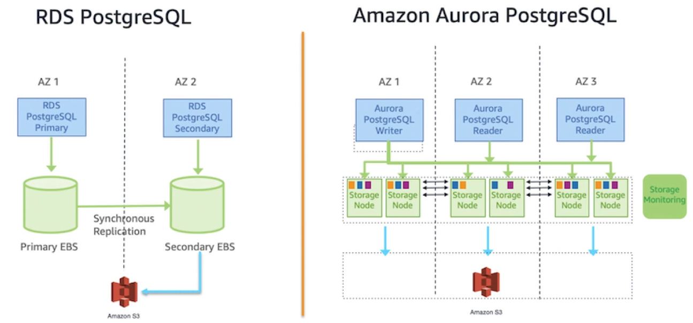

# AWS Postgres

## Amonzon RDS options
- RDS Mysql
- RDS Mssql
- RDS Oracle
- RDS MariaDB
- RDS Postgres
- Aurora (PostgreSQL & MySQL)

### PostgreSQL options
- PostgreSQL on EC2
- Amazon RDS for PostgreSQL 
- Amazon Aurora for PostgreSQL

## RDS PostgreSQL vs Aurora PostgreSQL

### Overview

. |  RDS PostgreSQL | Aurora PostgreSQL
----- | ------ | ----
Fully managed | ✅ | ✅
Ideal for | Small-medium intense workload | Commercial workload
Various types of instances | ✅ | ✅
Multiple version | ✅ | ✅
PITR | ✅ | ✅
Storage Auto Scaling | ✅ | ✅
Monitoring | ✅ | ✅
Multi-AZ  | ✅ | ✅

### Archiecture

### Replication 

. |  RDS PostgreSQL | Aurora PostgreSQL
----- | ------ | ----
Storage supported | 64TB  | 128TB
Storage Types | EBS | High performance subsystem customized
Read Replicas | 5 | 15
Cross-region read replicas | ✅ | ✅
Replica Lag | Few seconds | Few hundred-milliseconds
Max lag | Few minutes | 30 seconds
Replica Sync Types | Async | Async (lower latency)
Replication mechanism | Secondary Replica | Six copies, 3 AZs

### Storage

. |  RDS PostgreSQL | Aurora PostgreSQL
----- | ------ | ----
Max size | 64TB | 128TB
Auto scaling | 5GB | 10GB
OPS | General Purpose: 16K   Provisioned: 80K | No limitation
High Available | Multi-AZ | Multi-AZ
Lag | Few seconds | Milliseconds
Number of AZ | 2 | 3
Global DB | ❌ | ✅

### Crash recovery

. |  RDS PostgreSQL | Aurora PostgreSQL
----- | ------ | ----
Checkpoint recovery | Database node | Storage node
Checkpoint Duration | 5 minutes | Quick
Failover Automation | ✅ | ✅  
Failover duration | 60-120 seconds | 30 seconds

### Backup & instance type

. |  RDS PostgreSQL | Aurora PostgreSQL
----- | ------ | ----
Automation Backup | ✅ | ✅
Performance Impact | Slightly | ❌
Restore | Full backup + WALs   (Transaction logs) | Incremental   (Quick restore)
RPO, RTO | Fast | Very Fast
Instance classes | T2, T3, M3, M4, M5  R3, R4, R5 | T3, R4, R5
AWS Graviton2 Support | ✅ | ✅
Database Cloning | ❌ | ✅
Query Plan Management | ❌ | ✅
Serverless | ❌ | ✅

## Refs

https://aws.amazon.com/blogs/database/is-amazon-rds-for-postgresql-or-amazon-aurora-postgresql-a-better-choice-for-me/