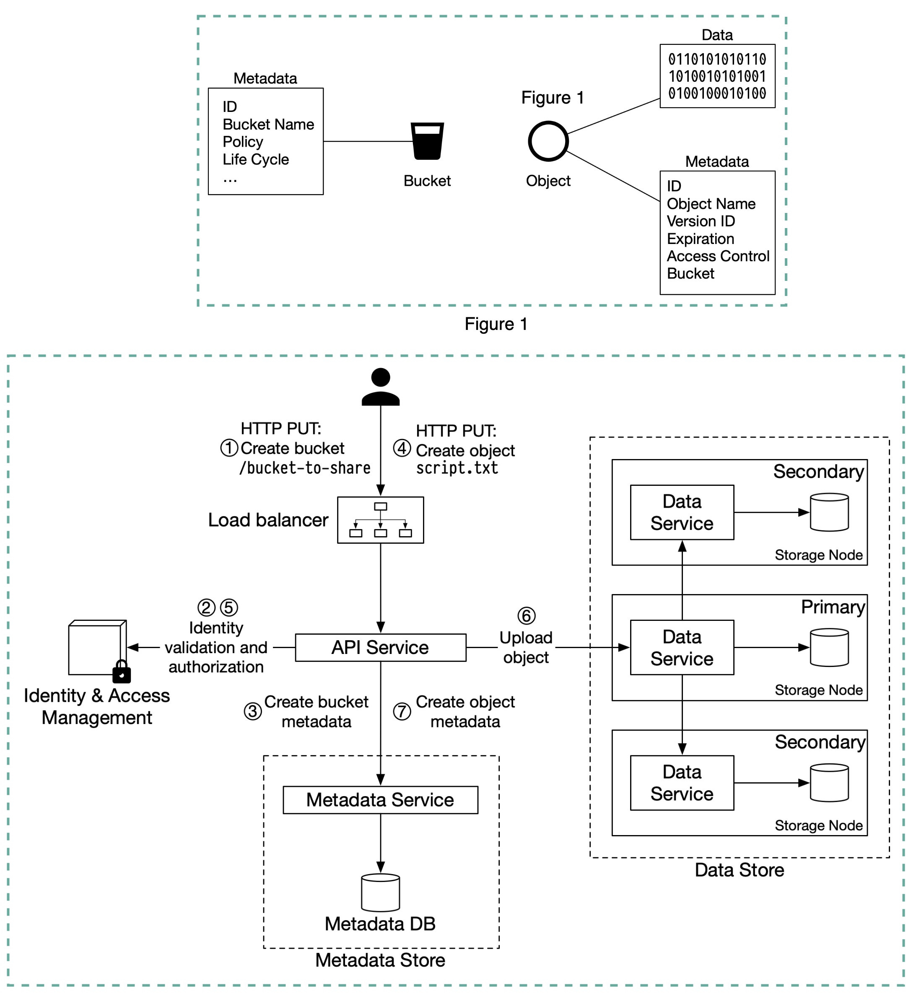

# Simple Storage Service (S3)

**Bucket**. A logical container for objects. The bucket name is globally unique. To upload data to S3, we must first create a bucket. 

**Object**. An object is an individual piece of data we store in a bucket. It contains object data (also called payload) and metadata. Object data can be any sequence of bytes we want to store. The metadata is a set of name-value pairs that describe the object.

An S3 object consists of:
- Metadata. It is mutable and contains attributes such as ID, bucket name, object name, etc.
- Object data. It is immutable and contains the actual data.

## What happens when you upload a file to Amazon S3? 

In S3, an object resides in a bucket. The path looks like this: `/bucket-to-share/script.txt`. The bucket only has **metadata**. The object has metadata and the actual data.

The diagram below (Figure 2) illustrates how file uploading works. In this example, we first create a bucket named “bucket-to-share” and then upload a file named “script.txt” to the bucket.

1. The client sends an HTTP PUT request to create a bucket named “bucket-to-share.” The request is forwarded to the API service.
2. The API service calls Identity and Access Management (IAM) to ensure the user is authorized and has WRITE permission.
3. The API service calls the metadata store to create an entry with the bucket info in the metadata database. Once the entry is created, a success message is returned to the client.
4. After the bucket is created, the client sends an HTTP PUT request to create an object named “script.txt”. 
5. The API service verifies the user’s identity and ensures the user has WRITE permission on the bucket.
6. Once validation succeeds, the API service sends the object data in the HTTP PUT payload to the data store. The data store persists the payload as an object and returns the UUID of the object.
7. The API service calls the metadata store to create a new entry in the metadata database. It contains important metadata such as the object_id (UUID), bucket_id (which bucket the object belongs to), object_name, etc.

## S3 Standard-IA
- lưu data ít sử dụng 

## S3 Intelligent-Tiering

## S3 One zone
- 1 AZ
- cheapest

## S3 Standard-IA

https://aws.amazon.com/s3/storage-classes/

## EBS vs EFS vs S3

[See here](./efs/#ebs-vs-efs-vs-s3)