# Simple Storage Service (S3)

## Bucket
- A logical container for objects
- The bucket name is globally unique (across all regions all accounts)
- S3 looks like a global service but buckets are created in a region
- To upload data to S3, we must first create a bucket. 
- Naming convention
    - No uppercase, No underscore
    - 3-63 characters long
    - Not an IP
    - Must start with lowercase letter or number
    - Must NOT start with the prefix **xn--**
    - Must NOT end with the suffix **-s3alias**

## Object

An object is an individual piece of data we store in a bucket. It contains object data (also called payload) and metadata. Object data can be any sequence of bytes we want to store. The metadata is a set of name-value pairs that describe the object.

An S3 object consists of:
- Metadata. It is mutable and contains attributes such as ID, bucket name, object name, etc. (system or user metadata)
- Object data. It is immutable and contains the actual data.
- Tags (Unicode key / value pair – up to 10) – useful for security / lifecycle
- Version ID (if versioning is enabled)

More notes:
- Objects (files) have a Key
- The key is the FULL path:
    - `s3://my-bucket/my_file.txt`
    - `s3://my-bucket/my_folder1/another_folder/my_file.txt`
- The key is composed of **prefix** + **object name**
    - `s3://my-bucket/my_folder1/another_folder/`**my_file.txt**
- There’s no concept of “directories” within buckets (although the UI will trick you to think otherwise)
- Just keys with very long names that contain slashes (“/”) 
- Object values are the content of the body:
    - Max. Object Size is 5TB (5000GB)
    - If uploading more than 5GB, must use **“multi-part upload”**

## Security

- **User-Based**
    - **IAM Policies** – which API calls should be allowed for a specific user from IAM
- **Resource-Based**
    - **Bucket Policies** – bucket wide rules from the S3 console - allows cross account
    - **Object Access Control List** (ACL) – finer grain (can be disabled)
    - **Bucket Access Control List** (ACL) – less common (can be disabled)
- **Note**: an IAM principal can access an S3 object if
    - The user IAM permissions ALLOW it **OR** the resource policy ALLOWS it
    - **AND** there’s no explicit DENY
- **Encryption**: encrypt objects in Amazon S3 using encryption keys

### Bucket Policies

- JSON based policies 
    - Resources: buckets and objects 
    - Effect: Allow / Deny 
    - Actions: Set of API to Allow or Deny 
    - Principal: The account or user to apply the policy to
- Use S3 bucket for policy to: 
    - Grant public access to the bucket 
    - Force objects to be encrypted at upload 
    - Grant access to another account (Cross Account)

```json
{
    "Version": "2012-10-17",
    "Statement": [
        {
            "Sid": "PublicRead",
            "Effect": "Allow",
            "Principal": "*",
            "Action": [
                "s3:GetObject"
            ],
            "Resource": [
                "arn:aws:s3:::examplebucket/*"
            ]
        }
    ]
}
```

### Object Encryption

- You can encrypt objects in S3 buckets using one of 4 methods
- **Server-Side Encryption (SSE)**
    - Server-Side Encryption with Amazon S3-Managed Keys (SSE-S3) – `Enabled by Default`
        - Encrypts S3 objects using keys handled, managed, and owned by AWS
    - Server-Side Encryption with KMS Keys stored in AWS KMS (SSE-KMS)
        - Leverage AWS Key Management Service (AWS KMS) to manage encryption keys
    - Server-Side Encryption with Customer-Provided Keys (SSE-C)
        - When you want to manage your own encryption keys
- **Client-Side Encryption**
- It’s important to understand which ones are for which situation for the exam

### SSE-S3

- Encryption using keys handled, managed, and owned by AWS 
- Object is encrypted server-side 
- Encryption type is AES-256 - Must set header "x-amz-server-side-encryption": "AES256" 
- Enabled by default for new buckets & new objects

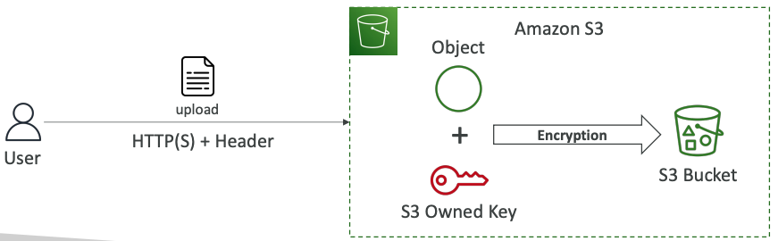

### SSE-KMS

- Encryption using keys handled and managed by AWS KMS (Key Management Service)
- KMS advantages: user control + audit key usage using CloudTrail
- Object is encrypted server side
- Must set header **"x-amz-server-side-encryption": "aws:kms"**

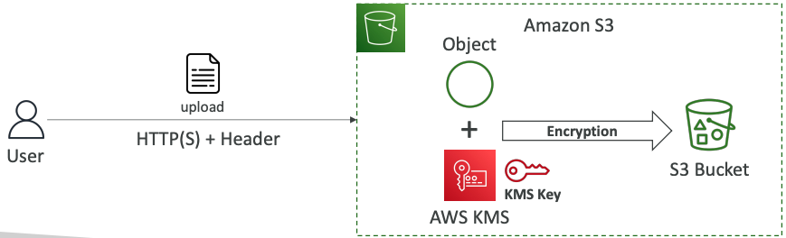

::: warning Limitation
- If you use SSE-KMS, you may be impacted by the KMS limits
- When you upload, it calls the **GenerateDataKey** KMS API
- When you download, it calls the **Decrypt** KMS API
- Count towards the KMS quota per second (5500, 10000, 30000 req/s based on region)
- You can request a quota increase using the Service Quotas Console
:::

### SSE-C

- Server-Side Encryption using keys fully managed by the customer outside of AWS
- Amazon S3 does **NOT** store the encryption key you provide
- **HTTPS must be used**
- Encryption key must provided in HTTP headers, for every HTTP request made

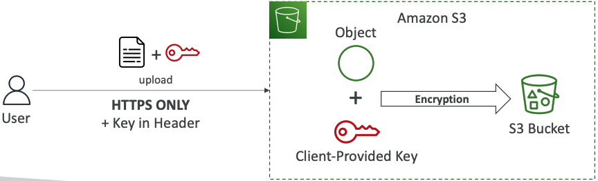

### Encryption in transit (SSL/TLS)

- Encryption in flight is also called SSL/TLS
- Amazon S3 exposes two endpoints:
    - HTTP Endpoint – non encrypted
    - HTTPS Endpoint – encryption in flight
- **HTTPS is recommended**
- **HTTPS is mandatory for SSE-C**
- Most clients would use the HTTPS endpoint by default

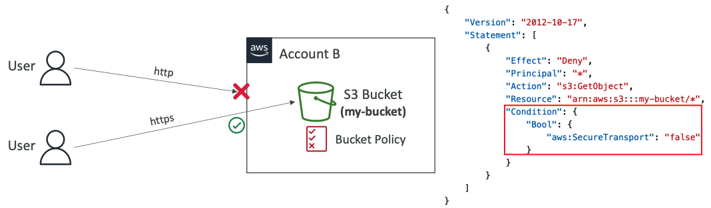

### Default Encryption vs. Bucket Policies

- SSE-S3 encryption is automatically applied to new objects stored in S3 bucket
- Optionally, you can “force encryption” using a bucket policy and refuse any API call to PUT an S3 object without encryption headers (SSE-KMS or SSE-C)

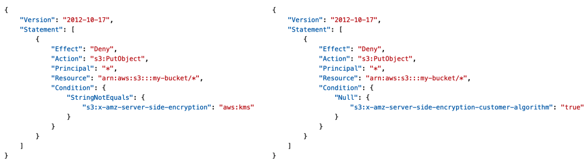

- **Note**: Bucket Policies are evaluated before “Default Encryption”

### CORS

- If a client makes a cross-origin request on our S3 bucket, we need to enable the correct CORS headers
- You can allow **for a specific** origin or **for * (all origins)**

[Read more - CORS](../../common/cross_domain.md#cors-cross-origin-resource-sharing)

### MFA Delete

- **MFA (Multi-Factor Authentication)** – force users to generate a code on a device (usually a mobile phone or hardware) before doing important operations on S3
- MFA will be required to:
    - Permanently delete an object version
    - Suspend Versioning on the bucket
- MFA won’t be required to:
    - Enable Versioning
    - List deleted versions
- To use MFA Delete, **Versioning must be enabled** on the bucket
- **Only the bucket owner (root account) can enable/disable MFA Delete**

### Access Points

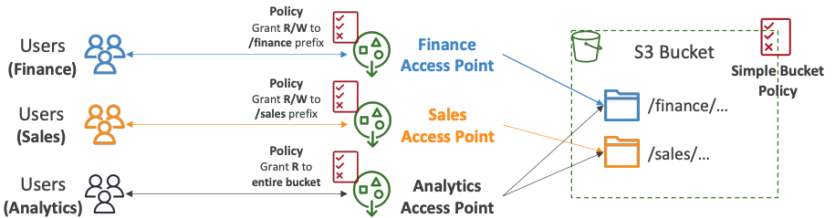

- Access Points simplify security management for S3 Buckets
- Each Access Point has:
    - its own DNS name (Internet Origin or VPC Origin)
    - an access point policy (similar to bucket policy) – manage security at scale

**VPC Origin**

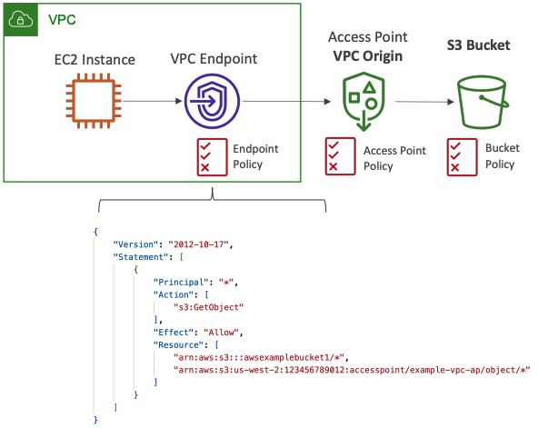

- We can define the access point to be accessible only from within the VPC
- You must create a VPC Endpoint to access the Access Point (Gateway or Interface Endpoint) 
- The VPC Endpoint Policy must allow access to the target bucket and Access Point

## Static Website Hosting

- S3 can host static websites and have them accessible on the Internet 
- The website URL will be (depending on the region)
    - http://`bucket-name`.s3-website-`aws-region`.amazonaws.com 
- If you get a **403 Forbidden** error, make sure the bucket policy allows public reads!

[Hosting a static website using Amazon S3](https://docs.aws.amazon.com/AmazonS3/latest/userguide/WebsiteHosting.html)

## Versioning

- You can version your files in Amazon S3
- It is enabled at the **bucket level**
- Same key overwrite will change the “version”: 1, 2, 3….
- It is best practice to version your buckets
    - Protect against unintended deletes (ability to restore a version)
    - Easy roll back to previous version
- Notes:
    - Any file that is not versioned prior to enabling versioning will have version “null”
    - Suspending versioning does not delete the previous versions

## Replication (CRR & SRR)

- **Must enable Versioning** in source and destination buckets
- **Cross-Region Replication** (CRR)
- **Same-Region Replication** (SRR)
- Buckets can be in different AWS accounts
- Copying is asynchronous
- Must give proper IAM permissions to S3

**Use cases:**
- CRR – compliance, lower latency access, replication across accounts
- SRR – log aggregation, live replication between production and test accounts

**More**:
- After you enable Replication, only new objects are replicated
- Optionally, you can replicate existing objects using **S3 Batch Replication**
    - Replicates existing objects and objects that failed replication
- For DELETE operations
    - **Can replicate delete markers** from source to target (optional setting)
    - Deletions with a version ID are not replicated (to avoid malicious deletes)
- **There is no “chaining” of replication**
    - If bucket 1 has replication into bucket 2, which has replication into bucket 3
    - Then objects created in bucket 1 are not replicated to bucket 3


## Storage Classes

- Amazon S3 Standard - General Purpose
- Amazon S3 Standard-Infrequent Access (IA)
- Amazon S3 One Zone-Infrequent Access
- Amazon S3 Glacier Instant Retrieval
- Amazon S3 Glacier Flexible Retrieval
- Amazon S3 Glacier Deep Archive
- Amazon S3 Intelligent Tiering
- Can move between classes manually or using S3 Lifecycle configurations

### Durability and Availability

**Durability**:
- High durability (`99.999999999%, 11 9’s`) of objects across multiple AZ
- If you store 10,000,000 objects with Amazon S3, you can on average expect to incur a loss of a single object once every 10,000 years
- Same for all storage classes

**Availability**:
- Measures how readily available a service is
- Varies depending on storage class
- Example: S3 standard has 99.99% availability = not available 53 minutes a year

### General Purpose

- 99.99% Availability
- Used for frequently accessed data
- Low latency and high throughput
- Sustain 2 concurrent facility failures
- Use Cases: Big Data analytics, mobile & gaming applications, content distribution ...

### Infrequent Access

- For data that is less frequently accessed, but requires rapid access when needed
- Lower cost than S3 Standard
- **Amazon S3 Standard-Infrequent Access (S3 Standard-IA)**
    - 99.9% Availability
    - Use cases: Disaster Recovery, backups
- **Amazon S3 One Zone-Infrequent Access (S3 One Zone-IA)**
    - High durability (99.999999999%) in a single AZ; data lost when AZ is destroyed
    - 99.5% Availability
    - Use Cases: Storing secondary backup copies of on-premises data, or data you can recreate

### Glacier Storage Classes

- Low-cost object storage meant for archiving / backup
- Pricing: price for storage + object retrieval cost
- **Amazon S3 Glacier Instant Retrieval**
    - Millisecond retrieval, great for data accessed once a quarter
    - Minimum storage duration of 90 days
- **Amazon S3 Glacier Flexible Retrieval** (formerly Amazon S3 Glacier):
    - Expedited (1 to 5 minutes), Standard (3 to 5 hours), Bulk (5 to 12 hours) – free
    - Minimum storage duration of 90 days
- **Amazon S3 Glacier Deep Archive** – for long term storage:
    - Standard (12 hours), Bulk (48 hours)
    - Minimum storage duration of 180 days

### Intelligent-Tiering

- Small monthly monitoring and auto-tiering fee
- Moves objects automatically between Access Tiers based on usage
- There are no retrieval charges in S3 Intelligent-Tiering
- *Frequent Access tier* (automatic): default tier
- *Infrequent Access tier* (automatic): objects not accessed for 30 days
- *Archive Instant Access tier* (automatic): objects not accessed for 90 days
- *Archive Access tier* (optional): configurable from 90 days to 700+ days
- *Deep Archive Access tier* (optional): config. from 180 days to 700+ days

### Comparison

Feature | Standard | Intelligent Tiering | One Zone-IA | Glacier Instant Retrieval | Glacier Flexible Retrieval | Glacier Deep Archive
---- | ---- | ----| --- | ---| --- | ----
Availability | 99.99% | 99.9% | 99.9% | 99.5% |  99.9% |  99.99% | 99.99%
Availability SLA | 99.9% | 99% | 99% | 99% |  99% | 99.9% | 99.9%
Availability Zones | >= 3 | >= 3 | >= 3 | 1 | >= 3 | >= 3 | >= 3
Min. Storage Duration Charge | None | None | 30 Days | 30 Days | 90 Days | 90 Days | 180 Days
Min. Billable Object Size | None | None  | 128 KB | 128 KB | 128 KB  | 40 KB | 40 KB
Retrieval Fee |  None | None  | Per GB retrieved |  Per GB retrieved  | Per GB retrieved  | Per GB retrieved | Per GB retrieved

[S3 Storage Class](https://aws.amazon.com/s3/storage-classes/)


**Price Comparison**

. | Standard | Intelligent Tiering | One Zone-IA | Glacier Instant Retrieval | Glacier Flexible Retrieval | Glacier Deep Archive
---- | ---- | ----| --- | ---| --- | ----
Storage Cost (per GB per month) | $0.023 | $0.0025 - $0.023 | %0.0125 | $0.01 | $0.004 | $0.0036 | $0.00099
Retrieval Cost (per 1000 request) | **GET**: $0.0004<br />**POST**: $0.005 | **GET**: $0.0004<br />**POST**: $0.005 | **GET**: $0.001<br />**POST**: $0.01 | **GET**: $0.001<br />**POST**: $0.01 | **GET**: $0.01<br />**POST**: $0.02 | **GET**: $0.0004<br />POST: $0.03<br /><br />**Expedited**: $10<br />**Standard**: $0.05<br />Bulk: free | **GET**: $0.0004<br />**POST**: $0.05<br /><br />**Standard**: $0.10<br />**Bulk**: $0.025

[S3 Pricing](https://aws.amazon.com/s3/pricing/)

## Moving between Storage Classes

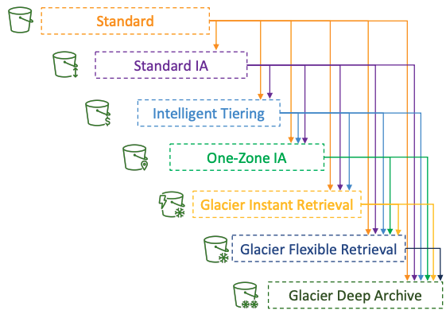

- You can transition objects between storage classes
- For infrequently accessed object, move them to **Standard IA**
- For archive objects that you don’t need fast access to, move them to Glacier or Glacier Deep Archive
- Moving objects can be automated using a Lifecycle Rules


### Lifecycle Rules

- **Transition Actions** – configure objects to transition to another storage class
    - Move objects to Standard IA class 60 days after creation
    - Move to Glacier for archiving after 6 months
- **Expiration actions** – configure objects to expire (delete) after some time
    - Access log files can be set to delete after a 365 days
    - **Can be used to delete old versions of files (if versioning is enabled)**
    - Can be used to delete incomplete Multi-Part uploads
- Rules can be created for a certain prefix (example: `s3://mybucket/mp3/*`)
- Rules can be created for certain objects Tags (example: `Department: Finance`)

#### Scenario 1

Your application on EC2 creates images thumbnails after profile photos are uploaded to Amazon S3. These thumbnails can be easily recreated, and only need to be kept for 60 days. The source images should be able to be immediately retrieved for these 60 days, and afterwards, the user can wait up to 6 hours. How would you design this?

- S3 source images can be on **Standard**, with a lifecycle configuration to transition them to **Glacier** after 60 days
- S3 thumbnails can be on **One-Zone IA**, with a lifecycle configuration to expire them (delete them) after 60 days

#### Scenario 2

A rule in your company states that you should be able to recover your deleted S3 objects immediately for 30 days, although this may happen rarely. After this time, and for up to 365 days, deleted objects should be recoverable within 48 hours.

- **Enable S3 Versioning** in order to have object versions, so that “deleted objects” are in fact hidden by a “delete marker” and can be recovered
- Transition the “noncurrent versions” of the object to **Standard IA**
- Transition afterwards the “noncurrent versions” to **Glacier Deep Archive**

### Analytics

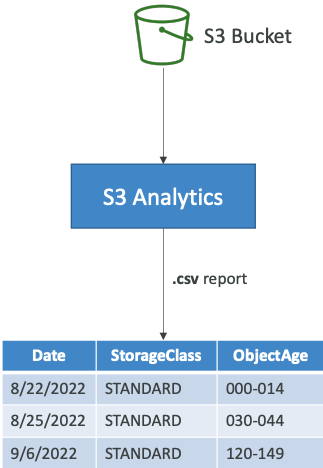

- Help you decide when to transition objects to the right storage class
- Recommendations for **Standard** and **Standard IA**
- Does NOT work for One-Zone IA or Glacier
- Report is updated daily
- 24 to 48 hours to start seeing data analysis
- Good first step to put together Lifecycle Rules (or improve them)!

## Requester Pays

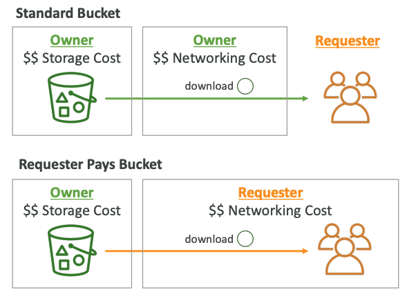

- In general, bucket owners pay for all Amazon S3 storage and data transfer costs associated with their bucket
- With Requester Pays buckets, the requester instead of the bucket owner pays the cost of the request and the data download from the bucket
- Helpful when you want to share large datasets with other accounts
- The requester must be authenticated in AWS (cannot be anonymous)

## Event Notifications

- S3:ObjectCreated, S3:ObjectRemoved, S3:ObjectRestore, S3:Replication…
- Object name filtering possible (*.jpg)
- Use case: generate thumbnails of images uploaded to S3
- **Can create as many “S3 events” as desired**
- S3 event notifications typically deliver events in seconds but can sometimes take a minute or longer

### IAM Permissions
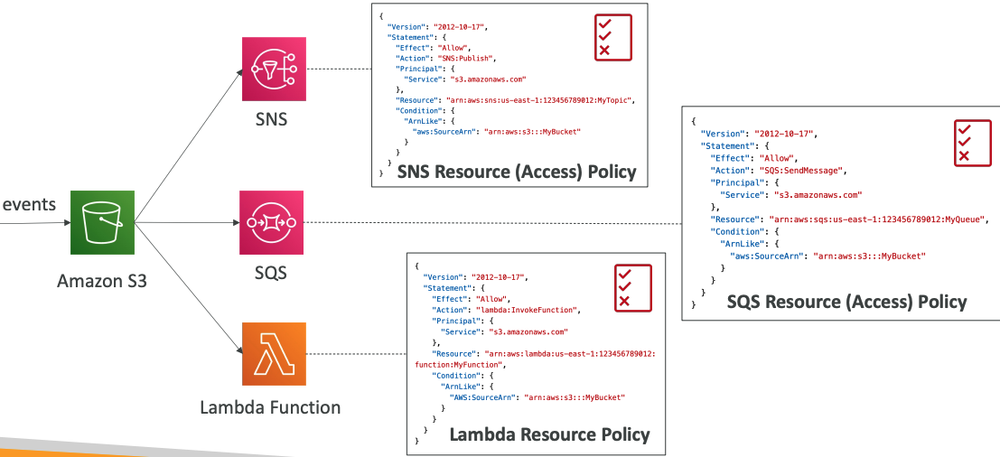

### with Amazon EventBridge

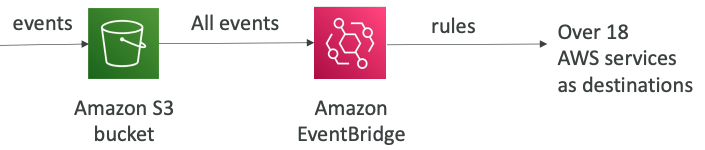

- **Advanced filtering** options with JSON rules (metadata, object size, name...)
- **Multiple Destinations** – ex Step Functions, Kinesis Streams / Firehose…
- **EventBridge Capabilities** – Archive, Replay Events, Reliable delivery

## Performance

### Baseline Performance

- Amazon S3 automatically scales to high request rates, `latency 100-200 ms`
- Your application can achieve at least **3,500 PUT/COPY/POST/DELETE** or **5,500 GET/HEAD requests per second per prefix in a bucket.**
- There are no limits to the number of prefixes in a bucket.
- Example (object path => prefix):
    - `bucket/folder1/sub1/file` => `/folder1/sub1/`
    - `bucket/folder1/sub2/file` => `/folder1/sub2/`
    - `bucket/1/file` => `/1/`
    - `bucket/2/file` => `/2/`
- If you spread reads across all four prefixes evenly, you can achieve 22,000 requests per second for GET and HEAD


### Multi-Part upload:

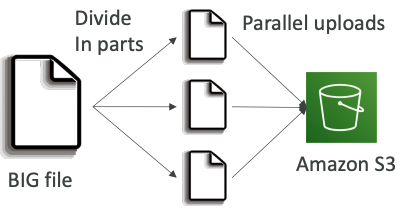

- recommended for files > 100MB, must use for files > 5GB
- Can help parallelize uploads (speed up transfers)


### S3 Transfer Acceleration

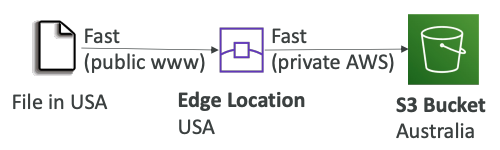

- Increase transfer speed by transferring file to an AWS edge location which will forward the data to the S3 bucket in the target region
- Compatible with multi-part upload

### S3 Byte-Range Fetches

- Parallelize GETs by requesting specific byte ranges => speed up downloads
- Better resilience in case of failures => download only partital data


### S3 Select & Glacier Select

- Retrieve less data using SQL by performing **server-side filtering**
- Can filter by rows & columns (simple SQL statements)
- Less network transfer, less CPU cost client-side

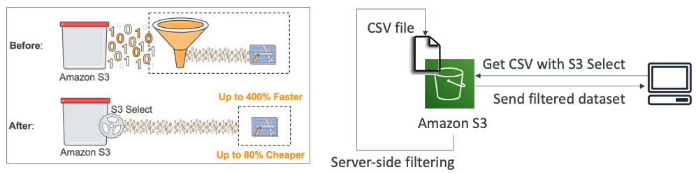

https://aws.amazon.com/blogs/aws/s3-glacier-select/


### S3 Batch Operations

- Perform bulk operations on existing S3 objects with a single request, example:
    - Modify object metadata & properties
    - Copy objects between S3 buckets
    - **Encrypt un-encrypted objects**
    - Modify ACLs, tags
    - Restore objects from S3 Glacier
    - Invoke Lambda function to perform custom action on each object
- A job consists of a list of objects, the action to perform, and optional parameters
- S3 Batch Operations manages retries, tracks progress, sends completion notifications, generate reports …
- **You can use S3 Inventory to get object list and use S3 Select to filter your objects**

## Pre-Signed URLs

- Generate pre-signed URLs using the **S3 Console**, **AWS CLI** or **SDK**
- **URL Expiration**
    - **S3 Console** – 1 min up to 720 mins (12 hours)
    - **AWS CLI** – configure expiration with `--expires-in` parameter in seconds (default 3600 secs, max. 604800 secs ~ 168 hours)
- Users given a pre-signed URL inherit the permissions of the user that generated the URL for GET / PUT

**Examples**:
- Allow only logged-in users to download a premium video from your S3 bucket
- Allow an ever-changing list of users to download files by generating URLs dynamically
- Allow temporarily a user to upload a file to a precise location in your S3 bucket

## S3 Glacier Vault Lock
- Adopt a WORM (Write Once Read Many) model
- Create a Vault Lock Policy 
- Lock the policy for future edits (**can no longer be changed or deleted**)
- Helpful for compliance and data retention


## S3 Object Lock

- Adopt a WORM (Write Once Read Many) model
- Block an object version deletion for a specified amount of time
- **Retention mode - Compliance**:
    - Object versions can't be overwritten or deleted by any user, including the root user
    - Objects retention modes can't be changed, and retention periods can't be shortened
- **Retention mode - Governance**:
    - Most users can't overwrite or delete an object version or alter its lock settings
    - Some users have special permissions to change the retention or delete the object
- **Retention Period**: protect the object for a fixed period, it can be extended
- **Legal Hold**:
    - protect the object indefinitely, independent from retention period
    - can be freely placed and removed using the `s3:PutObjectLegalHold` IAM permission

## S3 Object Lambda

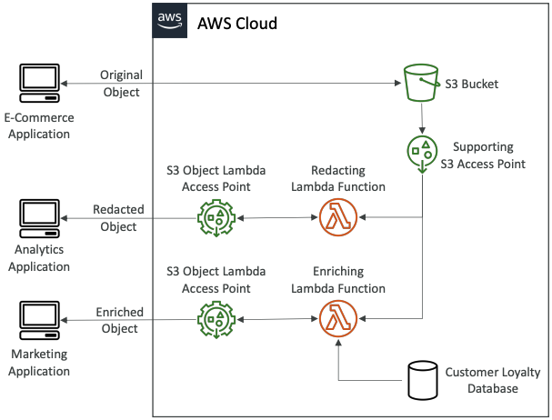

- Use AWS Lambda Functions to change the object before it is retrieved by the caller application
- Only one S3 bucket is needed, on top of which we create S3 Access Point and S3 Object Lambda Access Points.

**Use Cases:**
- Redacting personally identifiable information for analytics or non-production environments.
- Converting across data formats, such as converting XML to JSON.
- Resizing and watermarking images on the fly using caller-specific details, such as the user who requested the object.

## What happens when you upload a file to Amazon S3? 

In S3, an object resides in a bucket. The path looks like this: `/bucket-to-share/script.txt`. The bucket only has **metadata**. The object has metadata and the actual data.

The diagram below (Figure 2) illustrates how file uploading works. In this example, we first create a bucket named “bucket-to-share” and then upload a file named “script.txt” to the bucket.

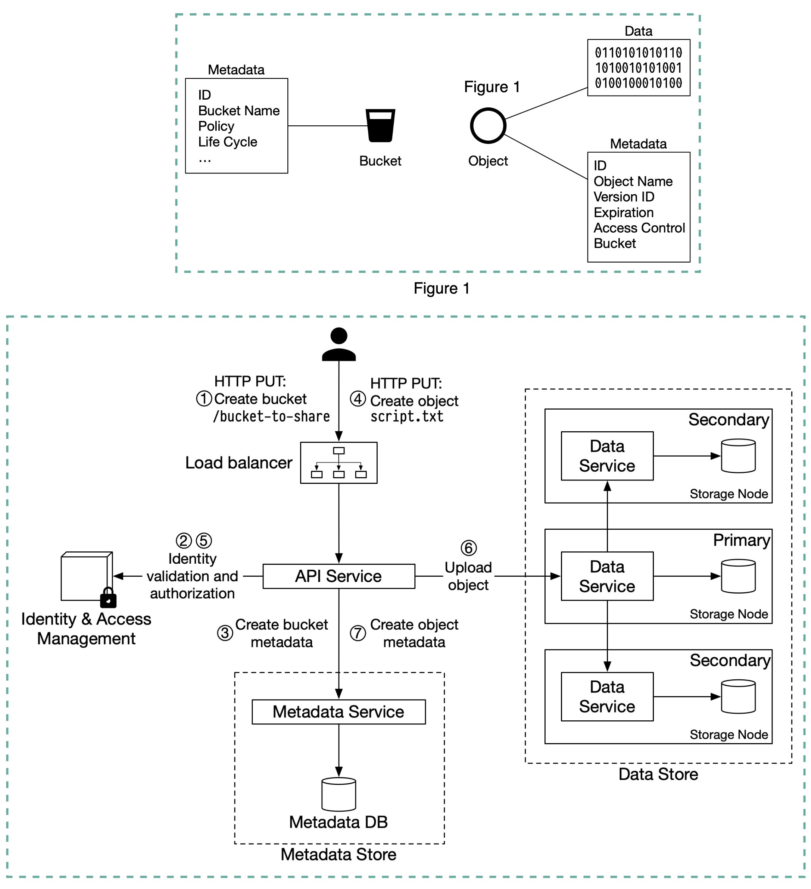

1. The client sends an HTTP PUT request to create a bucket named “bucket-to-share.” The request is forwarded to the API service.
2. The API service calls Identity and Access Management (IAM) to ensure the user is authorized and has WRITE permission.
3. The API service calls the metadata store to create an entry with the bucket info in the metadata database. Once the entry is created, a success message is returned to the client.
4. After the bucket is created, the client sends an HTTP PUT request to create an object named “script.txt”. 
5. The API service verifies the user’s identity and ensures the user has WRITE permission on the bucket.
6. Once validation succeeds, the API service sends the object data in the HTTP PUT payload to the data store. The data store persists the payload as an object and returns the UUID of the object.
7. The API service calls the metadata store to create a new entry in the metadata database. It contains important metadata such as the object_id (UUID), bucket_id (which bucket the object belongs to), object_name, etc.


## EBS vs EFS vs S3

[See here](../efs/#ebs-vs-efs-vs-s3)