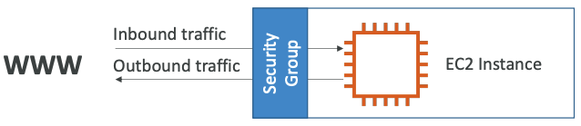
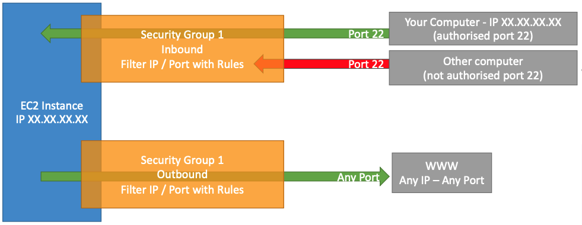

# Security Groups

- Security Groups are the fundamental of network security in AWS
- They control how traffic is allowed into or out of our EC2 Instances
- Security groups only contain **allow** rules
- Security groups rules can reference by IP or by security group

## Deep Dive

- Security groups are acting as a *Firewall* on EC2 instances 
- They regulate:
    - Access to Ports 
    - Authorised IP ranges - IPv4 and IPv6 
    - Control of inbound network (from other to the instance) 
    - Control of outbound network (from the instance to other)

Type | Protocol | Port Range | Source  | Description 
-----| ----- | ----| ----| -----
HTTP | TCP | 80 | 0.0.0.0/0 | test http page 
SSH | TCP | 22 122.149.168.85/32
Custom TCP Rule | TCP | 4567 |  0.0.0.0/0 | java app

## Good to know

- Can be attached to multiple instances
- Locked down to a region / VPC combination
- Does live “outside” the EC2 – if traffic is blocked the EC2 instance won’t see it
- *It’s good to maintain one separate security group for SSH access*
- If your application is not accessible (time out), then it’s a security group issue
- If your application gives a “connection refused“ error, then it’s an application error or it’s not launched
- All inbound traffic is **blocked** by default
- All outbound traffic is **authorised** by default

## Security Group vs NACLs

Feature | SG    | NACL 
--------| ----- | -------
Operates at | instance level | subnet level
Apply to | `associated` instances | all instances deployed in associated subnet
Support |  Allow rules only | Allow & Deny rules
Rules are evaluted | before deciding allow traffic | in order, start with lowest numbered rule when deciding allow traffic
State | **Stateful**. Return traffic is allowed, regardless of the rules | **Stateless**. Return traffic must be explicitly allowed by rules
Relationship | SG & resource is `n - n`  | NACL & subnet is `n - 1`

## Classic Ports to know
- 22 = SSH (Secure Shell) - log into a Linux instance
- 21 = FTP (File Transfer Protocol) – upload files into a file share
- 22 = SFTP (Secure File Transfer Protocol) – upload files using SSH
- 80 = HTTP – access unsecured websites
- 443 = HTTPS – access secured websites
- 3389 = RDP (Remote Desktop Protocol) – log into a Windows instance
