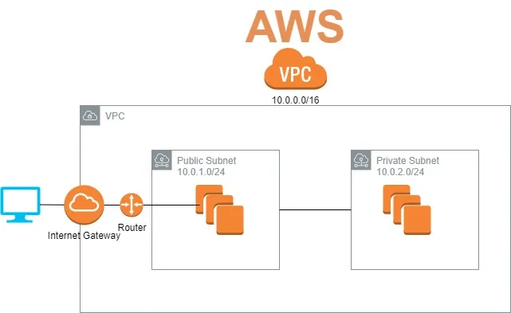

# Virtual Private Cloud

- VPC is like a house
- Subnets are like rooms
- Internet gateway is like your door
- Router is like paths 

## VPC Info
- Resources to create (VPC Only or More)
- Name tag. Should be given this field. E.g: `earthtoday_vpc`
- IPv4 CIDR
    - Manual Input E.g: `10.0.0.0/16`
    - IPAM-allocated ...
- IPv6 CIDR block
- Tenancy

## Subnets

- Choose VPC
- Subnet settings
    - name e.g: `container_public_az1`, `container_public_az2`,...
    - Available Zone
        - choose different AZ for different subnet => increase Availability
    - IPv4 CIDR E.g: `10.0.1.0/24`, `10.0.2.0/24`, `10.0.3.0/24`, ...

[See more](../network/address.html#subnetting)

## Public tier

### Internet gateway

**🔶 Create IGW**
- Name tag. Eg: `container_IGW`
- Tags

**🔶 Attach to VPC**

*✏️ Notes*: 
- No need to config autoscale, HA, ...
- Default VPC has default Internet gateway

### Route table for public 

**🔶 Create route table**
- RT name. Eg: `container_public_rtb`
- VPC
- Tags

**🔶 Edit routes**

Destination | Target  
------------| ---------
`0.0.0.0/0` | Internet Gateway => choose specific one  

**🔶 Edit subnet associations**
- choose subnets & save

### Security Group for Route table  

**🔹 Basic Details**
- SG name. Eg `container_public_SG`
- Description. Eg `Allow http, https`
- VPC

**🔹 Inbound rules**

Type        | Protocol  | Port range | Source 
------------| --------- | --------   | -------
HTTP | TCP | TCP  | 80   | Anywhere `0.0.0.0` 
Custom TCP | TCP  | 8080 | Anywhere `0.0.0.0` 

### Network Access Control List (NACL)
... todo

### NAT Gateway for public tier
- Name
- Subnet (1 subnet / 1 NAT GW)
- Connection type (`public` or private)
- Elastic IP Allocation ID

## Private tier

### Route table for Private 

**🔶 Create route table**
- RT name. Eg: `container_private_rtb`
- VPC
- Tags

**🔶 Edit routes**

Destination | Target  
------------| ---------
`0.0.0.0/0` | NAT Gateway => choose specific one 

**🔶 Edit subnet associations**
- choose subnets & save

### Security Group for Route table 

**🔹 Basic Details**
- SG name
- Description
- VPC

**🔹 Inbound rules**
Type        | Protocol  | Port range | Source 
------------| --------- | --------   | -------
All traffic | All       | All        | Custom  - from Public SG

### Network Access Control List (NACL)
... todo

## Security Group vs NACLs

Feature | SG    | NACL 
--------| ----- | -------
Operates at | instance level | subnet level
Apply to | `associated` instances | all instances deployed in associated subnet
Support |  Allow rules only | Allow & Deny rules
Rules are evaluted | before deciding allow traffic | in order, start with lowest numbered rule when deciding allow traffic
State | **Stateful**. Return traffic is allowed, regardless of the rules | **Stateless**. Return traffic must be explicitly allowed by rules
Relationship | SG & resource is `n - n`  | NACL & subnet is `n - 1`

## Others

## Instance from private subnet call outside

### Check Security group of private subnet

**Rules**
IP Version | Type | Protocol | Port range | Destination  
------------| ------- | ------| ----------| -------------| -------------
IPv4       | All traffic | All | All | `0.0.0.0/0`

### Check NACL of private subnet

**Outbound rules**
Rule number | Type | Protocol | Port range | Destination  | Allow / Deny 
------------| ------- | ------| ----------| -------------| -------------
100         |  All traffic | All | All     | `0.0.0.0/0`  | ✅ Allow

### Check Route table of private subnet
Make sure has a record to NAT Gateway of Public subnet

Destination | Target  
------------| ---------
`0.0.0.0/0` | NAT Gateway => choose the one of PUBLIC subnet

### Check Route table of public subnet
 
Destination | Target  
------------| ---------
`0.0.0.0/0` | Internet Gateway => choose specific one  

## References
- [AWS VPC Creation - Step by Step](https://dev.to/aws-builders/aws-vpc-creation-step-by-step-1pg7)

### Tools
- [Decimal to Binary converter](https://www.rapidtables.com/convert/number/decimal-to-binary.html)
- [Visual Subnet Calculator](https://www.davidc.net/sites/default/subnets/subnets.html)
- [CIDR](https://cidr.xyz/)