# Virtual Private Cloud (VPC)

## VPC Components Diagram

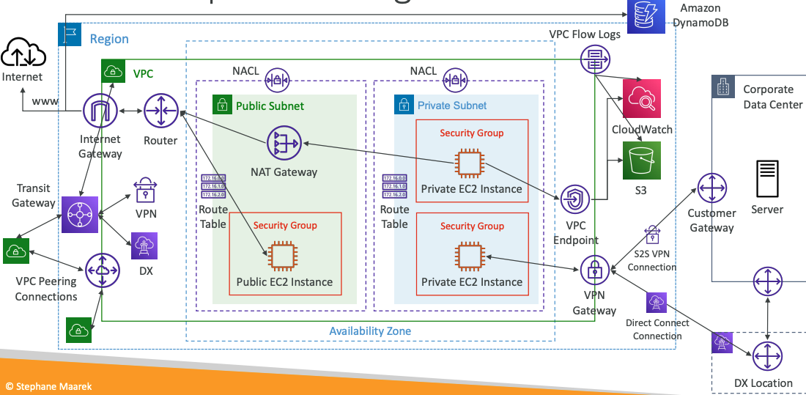

## Understanding CIDR – IPv4

- **Classless Inter-Domain Routing** – a method for allocating IP addresses
- Used in **Security Groups** rules and AWS networking in general

IP Version | Type | Protocol | Port range | Source | Description 
--- | --- | --- | --- | -- | ---
IPv4 | SSH | TCP | 22 | `122.149.196.85/32` | -
IPv4 | HTTP | TCP | 80 | `0.0.0.0/0` | -

They help to define an IP address range:
- We’ve seen `WW.XX.YY.ZZ/32` => one IP
- We’ve seen `0.0.0.0/0` => all IPs
- But we can define: `192.168.0.0/26` => `192.168.0.0 – 192.168.0.63` (64 IP addresses) 

### A CIDR consists of two components 
- **Base IP**
    - Represents an IP contained in the range (XX.XX.XX.XX) 
    - Example: 10.0.0.0, 192.168.0.0, … 
- **Subnet Mask**
    - Defines how many bits can change in the IP 
    - Example: `/0`, `/24`, `/32 `
    - Can take two forms: 
        - /8 <=> 255.0.0.0 
        - /16 <=> 255.255.0.0 
        - /24 <=> 255.255.255.0 
        - /32 <=> 255.255.255.255

### Subnet Mask

The Subnet Mask basically allows part of the underlying IP to get additional next values from the base IP

::: tip Quick Memo
**Octets**
1st   2nd   3rd   4th

- `/32` - no octet can change
- `/24` - last octet can change
- `/16` - last 2 octets can change
- `/8` - last 3 octets can change
- `/0` - all octets can change
:::

## Public vs. Private IP (IPv4)

- The Internet Assigned Numbers Authority (IANA) established certain blocks of IPv4 addresses for the use of private (LAN) and public (Internet) addresses
- **Private IP** can only allow certain values:
    - 10.0.0.0 – 10.255.255.255 (10.0.0.0/8) - in big networks
    - 172.16.0.0 – 172.31.255.255 (172.16.0.0/12) - `AWS default VPC in that range`
    - 192.168.0.0 – 192.168.255.255 (192.168.0.0/16) - e.g., home networks
- All the rest of the IP addresses on the Internet are Public

## Default VPC Walkthrough

- All new AWS accounts have a default VPC
- New EC2 instances are launched into the default VPC if no subnet is specified
- Default VPC has Internet connectivity and all EC2 instances inside it have public IPv4 addresses
- We also get a public and a private IPv4 DNS names

## VPC in AWS – IPv4

- You can have multiple VPCs in an AWS region (max. 5 per region – soft limit)
- Max. CIDR per VPC is 5, for each CIDR:
    - **Min. size is /28 (16 IP addresses)**
    - **Max. size is /16 (65536 IP addresses)**
- Because VPC is private, only the Private IPv4 ranges are allowed:
    - 10.0.0.0 – 10.255.255.255 (10.0.0.0/8)
    - 172.16.0.0 – 172.31.255.255 (172.16.0.0/12)
    - 192.168.0.0 – 192.168.255.255 (192.168.0.0/16)
- Your VPC CIDR should NOT overlap with your other networks (e.g., corporate)

## VPC – Subnet (IPv4)

- AWS reserves **5 IP addresses (first 4 & last 1)** in each subnet
- These 5 IP addresses are not available for use and can’t be assigned to an
EC2 instance
- Example: if CIDR block 10.0.0.0/24, then reserved IP addresses are:
    - 10.0.0.0 – Network Address
    - 10.0.0.1 – reserved by AWS for the VPC router
    - 10.0.0.2 – reserved by AWS for mapping to Amazon-provided DNS
    - 10.0.0.3 – reserved by AWS for future use
    - 10.0.0.255 – Network broadcast Address. AWS does not support broadcast in a VPC, therefore the address is reserved

::: tip  Exam Tip
if you need 29 IP addresses for EC2 instances:
- You can’t choose a subnet of size /27 (32 IP addresses, 32 – 5 = 27 < 29)
- You need to choose a subnet of size /26 (64 IP addresses, 64 – 5 = 59 > 29)
:::

## Internet Gateway (IGW)

- Allows resources (e.g., EC2 instances) in a VPC connect to the Internet
- It scales horizontally and is highly available and redundant
- Must be created separately from a VPC
- One VPC can only be attached to one IGW and vice versa
- Internet Gateways on their own do not allow Internet access…
- Route tables must also be edited!

## Bastion Hosts

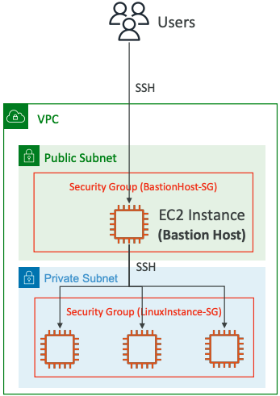

- We can use a Bastion Host to SSH into our private EC2 instances
- The bastion is in the public subnet which is then connected to all other private subnets
- **Bastion Host security group must allow** inbound from the internet on port 22 from restricted CIDR, for example the public CIDR of your corporation
- **Security Group of the EC2 Instances** must allow the Security Group of the Bastion Host, or the __private IP__ of the Bastion host

## NAT Gateway

- AWS-managed NAT, higher bandwidth, high availability, no administration
- Pay per hour for usage and bandwidth
- NATGW is created in a specific Availability Zone, uses an Elastic IP
- Can’t be used by EC2 instance in the same subnet (only from other subnets)
- Requires an IGW (Private Subnet => NATGW => IGW)
- 5 Gbps of bandwidth with automatic scaling up to 45 Gbps
- No Security Groups to manage / required

### NAT Gateway with High Availability

- **NAT Gateway is resilient within a single Availability Zone**
- Must create **multiple NAT Gateways** in **multiple AZs** for fault-tolerance
- There is no cross-AZ failover needed because if an AZ goes down it doesn't need NAT

### NAT Gateway vs. NAT Instance

. | NAT Gateway | NAT Instance (outdated)
--- | ---- | ----
Availability | Highly available within AZ (create in another AZ) | Use a script to manage failover between instances
Bandwidth | Up to 45 Gbps | Depends on EC2 instance type
Maintenance | Managed by AWS  | Managed by you (e.g., software, OS patches, …)
Cost | Per hour & amount of data transferred | Per hour, EC2 instance type and size, + network $
Public IPv4 | ✅  | ✅
Private IPv4 | ✅ | ✅
Security Groups | ❌ | ✅
Use as Bastion Host? | ❌ | ✅

[Compare NAT gateways and NAT instances](https://docs.aws.amazon.com/vpc/latest/userguide/vpc-nat-comparison.html)

## Security Groups & NACLs

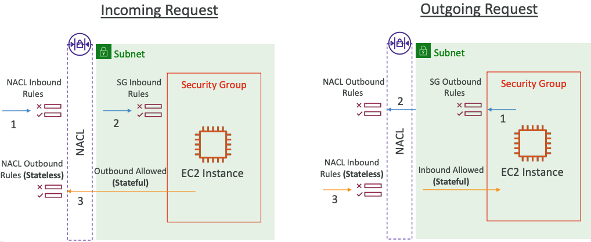

## Network Access Control List (NACL)

- NACL are like a firewall which control traffic from and to subnets
- **One NACL per subnet**, new subnets are assigned the **Default NACL**
- You define **NACL Rules**:
    - Rules have a number (1-32766), higher precedence with a lower number
    - First rule match will drive the decision
    - Example: if you define `#100 ALLOW 10.0.0.10/32` and `#200 DENY 10.0.0.10/32`, the IP address will be allowed because 100 has a higher precedence over 200
    - The last rule is an asterisk (*) and denies a request in case of no rule match
    - AWS recommends adding rules by increment of 100
- Newly created NACLs will deny everything
- NACL are a great way of blocking a specific IP address at the subnet level

### Default NACL

- Accepts everything inbound/outbound with the subnets it’s associated with
- Do **NOT** modify the Default NACL, instead create custom NACLs

**Default NACL for a VPC that supports IPv4**

**Inbound Rules**
Rule # | Type | Protocol | Port Range | Source | Allow /Deny 
---- | --- | --- | ---- | --- | ----
100 | All IPv4 Traffic | All | All | 0.0.0.0/0 | ALLOW
`*` | All IPv4 Traffic | All | All | 0.0.0.0/0 | DENY

**Outbound Rules**
Rule # | Type | Protocol | Port Range | Source | Allow /Deny 
---- | --- | --- | ---- | --- | ----
100 | All IPv4 Traffic | All | All | 0.0.0.0/0 | ALLOW
`*` | All IPv4 Traffic | All | All | 0.0.0.0/0 | DENY

### Ephemeral Ports

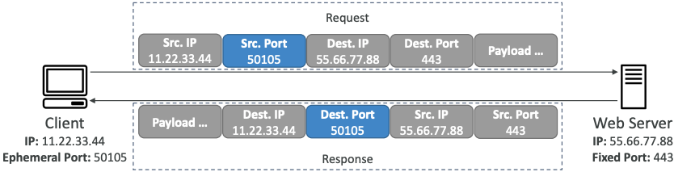

- For any two endpoints to establish a connection, they must use ports
- Clients connect to a **defined port**, and expect a response on an **ephemeral port**
- Different Operating Systems use different port ranges, examples:
    - IANA & MS Windows 10 => 49152 – 65535
    - Many Linux Kernels => 32768 – 60999

### NACL with Ephemeral Ports

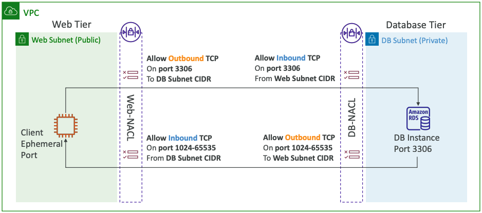

### Security Group vs. NACLs

Security Group | NACL
---- | -----
Operates at the instance level  | Operates at the subnet level
Supports allow rules only | Supports allow rules and deny rules
**Stateful**: return traffic is automatically allowed, regardless of any rules | **Stateless**: return traffic must be explicitly allowed by rules (think of ephemeral ports)
All rules are evaluated before deciding whether to allow traffic | Rules are evaluated in order (lowest to highest) when deciding whether to allow traffic, first match wins
Applies to an EC2 instance when specified by someone | Automatically applies to all EC2 instances in the subnet that it’s associated with

[Control traffic to subnets using network ACLs](https://docs.aws.amazon.com/vpc/latest/userguide/vpc-network-acls.html)

## VPC Peering

- Privately connect two VPCs using AWS’network
- Make them behave as if they were in the same network
- Must not have overlapping CIDRs 
- VPC Peering connection is **NOT transitive** (must be established for each VPC that need to communicate with one another)
- **You must update route tables in each VPC’s subnets to ensure EC2 instances can communicate with each other**

### Good to know

- You can create VPC Peering connection between VPCs in **different AWS accounts/regions**
- You can reference a security group in a peered VPC (works cross accounts – same region)

Type | Protocol |  Port range | Source
---- | --- | --- | ----
HTTP | TCP | 80 | sg004991f9af3474b9349 / default 
HTTP | TCP | 80 | `[Account ID]` / sg-023af754235vhdsfcsdf 

## VPC Endpoints

### Types of Endpoints

**Interface Endpoints (powered by PrivateLink)**

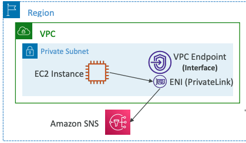

- Provisions an ENI (private IP address) as an entry point (must attach a Security Group)
- Supports most AWS services
- $ per hour + $ per GB of data processed

**Gateway Endpoints**

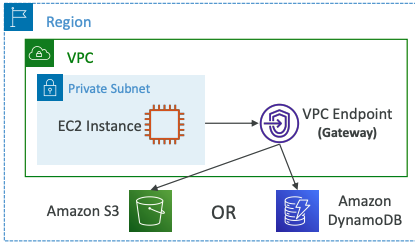

- Provisions a gateway and must be used **as a target in a route table (does not use security groups)**
- Supports both S3 and DynamoDB
- Free 

### VPC Endpoints - AWS PrivateLink

- Every AWS service is publicly exposed (public URL)
- VPC Endpoints (powered by AWS PrivateLink) allows you to connect to AWS services using a **private network** instead of using the public Internet
- They’re redundant and scale horizontally 
- They remove the need of IGW, NATGW, … to access AWS Services
- In case of issues:
    - Check DNS Setting Resolution in your VPC
    - Check Route Tables

### Gateway or Interface Endpoint for S3?

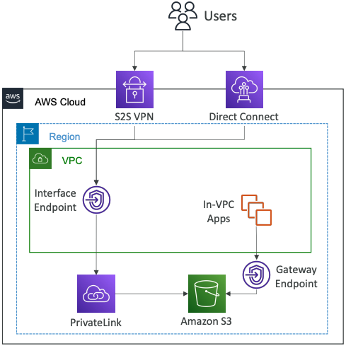

- Gateway is most likely going to be preferred all the time at the exam
- Cost: free for Gateway, $ for interface endpoint
- Interface Endpoint is preferred access is required from onpremises (Site to Site VPN or Direct Connect), a different VPC or a different region

### Lambda in VPC accessing DynamoDB

- DynamoDB is a public service from AWS
- Option 1: Access from the public internet
    - Because Lambda is in a VPC, it needs a NAT Gateway in a public subnet and an internet gateway
- **Option 2 (better & free): Access from the private VPC network**
    - Deploy a VPC Gateway endpoint for DynamoDB
    - Change the Route Tables

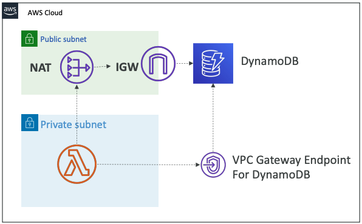

## VPC Flow Logs

- Capture information about IP traffic going into your interfaces:
    - VPC Flow Logs
    - Subnet Flow Logs
    - Elastic Network Interface (ENI) Flow Logs
- Helps to monitor & troubleshoot connectivity issues
- Flow logs data can go to S3, CloudWatch Logs, and Kinesis Data Firehose
- Captures network information from AWS managed interfaces too: ELB, RDS, ElastiCache, Redshift, WorkSpaces, NATGW, Transit Gateway…

### VPC Flow Logs Syntax

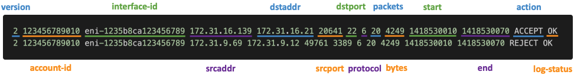

- **srcaddr & dstaddr** – help identify problematic IP
- **srcport & dstport** – help identity problematic ports
- **Action** – success or failure of the request due to Security Group / NACL
- Can be used for analytics on usage patterns, or malicious behavior
- **Query VPC flow logs using Athena on S3 or CloudWatch Logs Insights**
-[Flow Logs examples](https://docs.aws.amazon.com/vpc/latest/userguide/flow-logs-records-examples.html)

### Troubleshoot SG & NACL issues

**Look at the “ACTION” field**

**Incoming Requests**

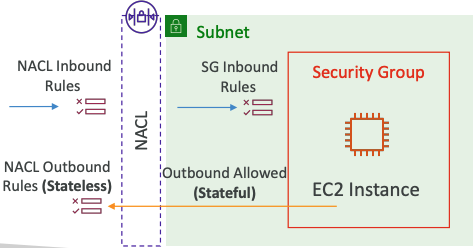

- Inbound REJECT => NACL or SG
- Inbound ACCEPT, Outbound REJECT => NACL

**Outgoing Requests**

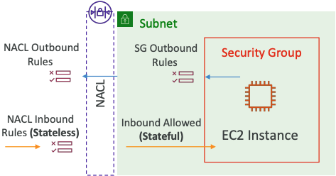

- Outbound REJECT => NACL or SG
- Outbound ACCEPT, Inbound REJECT => NACL

### VPC Flow Logs – Architectures

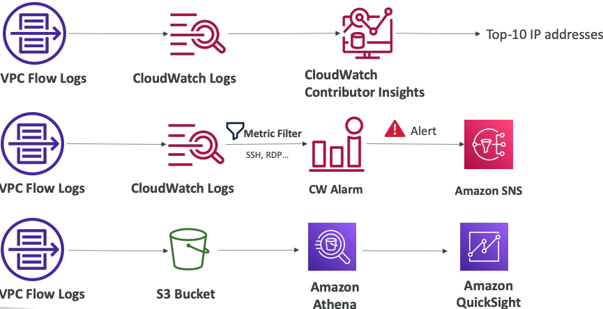

## AWS Site-to-Site VPN

**Virtual Private Gateway (VGW)**
- VPN concentrator on the AWS side of the VPN connection
- VGW is created and attached to the VPC from which you want to create the Site-to-Site VPN connection
- Possibility to customize the ASN (Autonomous System Number)

**Customer Gateway (CGW)**
- Software application or physical device on customer side of the VPN connection
-[Your CGW](https://docs.aws.amazon.com/vpn/latest/s2svpn/your-cgw.html#DevicesTested)

### Site-to-Site VPN Connections

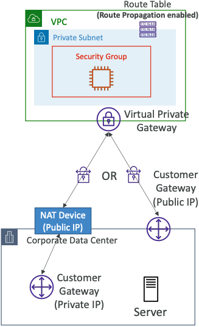

- Customer Gateway Device (On-premises)
    - What IP address to use?
        - Public Internet-routable IP address for your Customer Gateway device
        - If it’s behind a NAT device that’s enabled for NAT traversal (NAT-T), use the public IP address of the NAT device
- **Important step**: enable **Route Propagation** for the Virtual Private Gateway in the route table that is associated with your subnets
- If you need to ping your EC2 instances from on-premises, make sure you add the ICMP protocol on the inbound of your security groups

## AWS VPN CloudHub

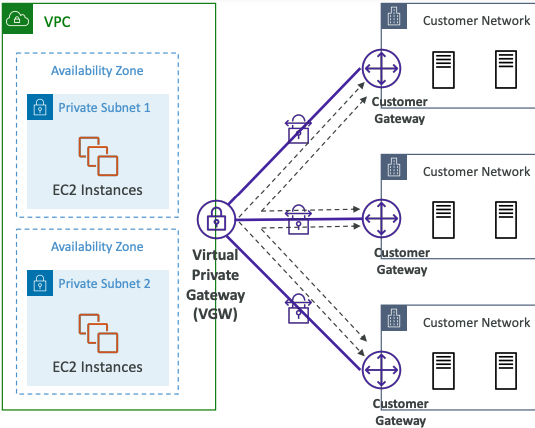

- Provide secure communication between multiple sites, if you have multiple VPN connections
- Low-cost hub-and-spoke model for primary or secondary network connectivity between different locations (VPN only)
- It’s a VPN connection so it goes over the public Internet
- To set it up, connect multiple VPN connections on the same VGW, setup dynamic routing and configure route tables

## Direct Connect (DX)

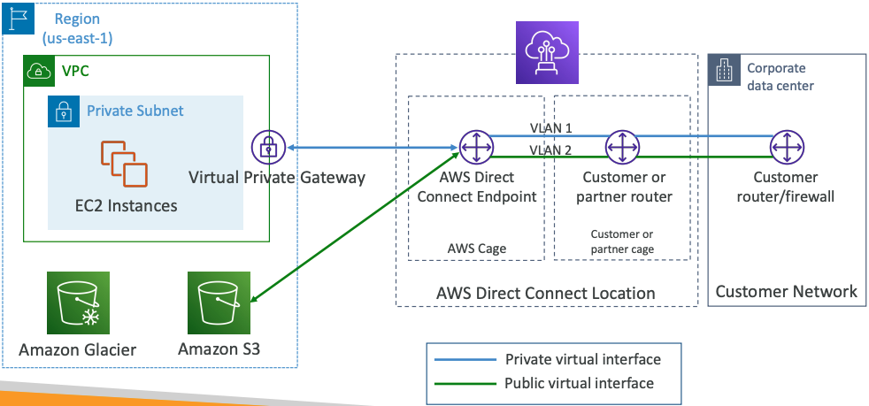

- Provides a dedicated **private** connection from a remote network to your VPC
- Dedicated connection must be setup between your DC and AWS Direct Connect locations
- You need to setup a Virtual Private Gateway on your VPC
- Access public resources (S3) and private (EC2) on same connection
- Use Cases:
    - Increase bandwidth throughput - working with large data sets – lower cost
    - More consistent network experience - applications using real-time data feeds
    - Hybrid Environments (on prem + cloud)
- Supports both IPv4 and IPv6

### Direct Connect Gateway

If you want to setup a Direct Connect to one or more VPC in many different regions (same account), you must use a Direct Connect Gateway

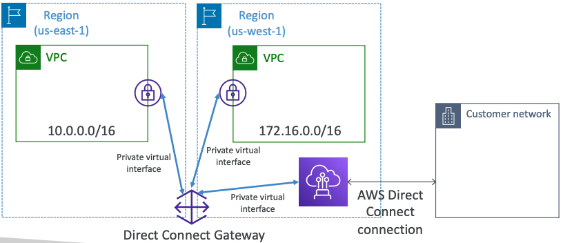

### Direct Connect – Connection Types

- **Dedicated Connections**: 1Gbps,10 Gbps and 100 Gbps capacity
    - Physical ethernet port dedicated to a customer
    - Request made to AWS first, then completed by AWS Direct Connect Partners
- **Hosted Connections**: 50Mbps, 500 Mbps, to 10 Gbps
    - Connection requests are made via AWS Direct Connect Partners
    - Capacity can be a**dded or removed on demand**
    - 1, 2, 5, 10 Gbps available at select AWS Direct Connect Partners
- Lead times are often longer than 1 month to establish a new connection

### Direct Connect – Encryption

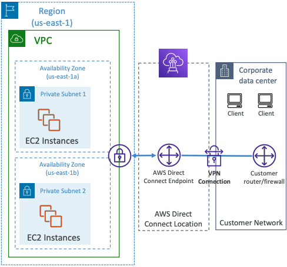

- Data in transit is **not encrypted** but is private 
- AWS Direct Connect + VPN provides an IPsec-encrypted private connection
- Good for an extra level of security, but slightly more complex to put in place

### Direct Connect - Resiliency

**High Resiliency for Critical Workloads**   

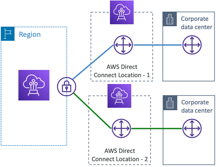

One connection at multiple locations

**Maximum Resiliency for Critical Workloads**

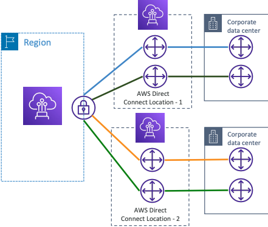

Maximum resilience is achieved by separate connections terminating on separate devices in more than one location.

### Site-to-Site VPN connection as a backup

In case Direct Connect fails, you can set up a backup Direct Connect connection (expensive), or a Site-to-Site VPN connection

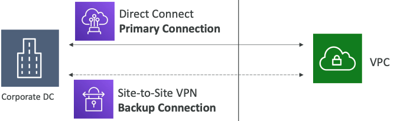

### Network topologies can become complicated

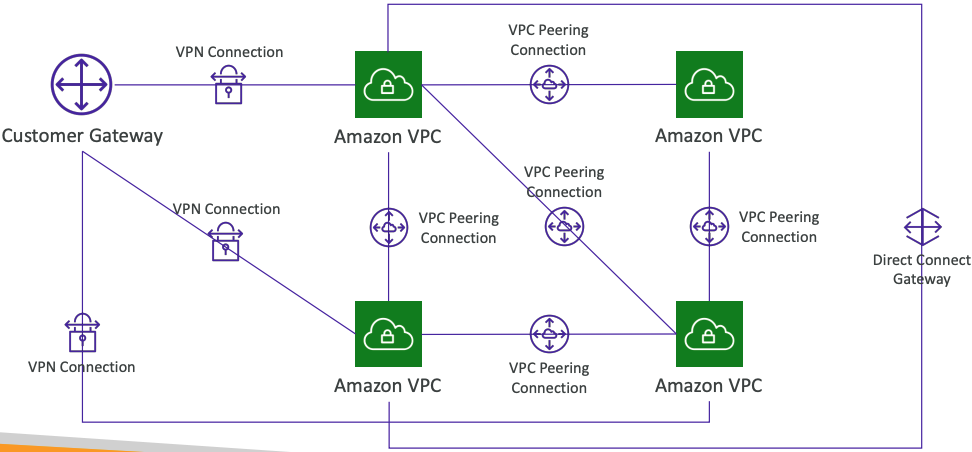

## Transit Gateway

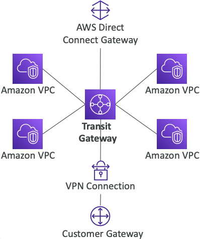

- **For having transitive peering between thousands of VPC and on-premises, hub-and-spoke (star) connection**
- Regional resource, can work cross-region
- Share cross-account using Resource Access Manager (RAM)
- You can peer Transit Gateways across regions
- Route Tables: limit which VPC can talk with other VPC
- Works with Direct Connect Gateway, VPN connections
- Supports **IP Multicast** (not supported by any other AWS service)

### Transit Gateway: Site-to-Site VPN ECMP

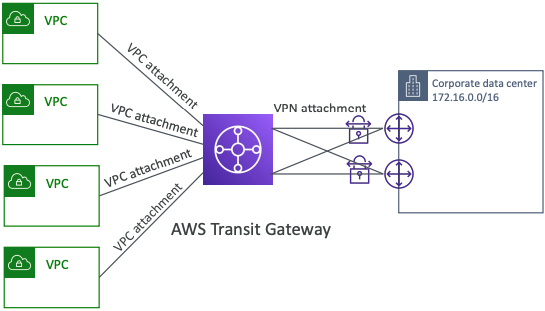

- ECMP = Equal-cost multi-path routing
- Routing strategy to allow to forward a packet over multiple best path
- Use case: create multiple Siteto-Site VPN connections **to increase the bandwidth of your connection to AWS**

## VPC – Traffic Mirroring

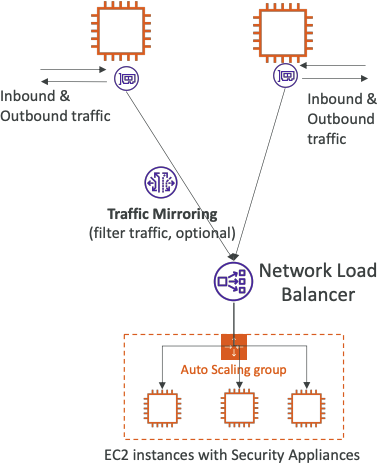

- Allows you to capture and inspect network traffic in your VPC
- Route the traffic to security appliances that you manage
- Capture the traffic
    - From (Source) – ENIs
    - To (Targets) – an ENI or a Network Load Balancinger
- Capture all packets or capture the packets of your interest (optionally, truncate packets)
- Source and Target can be in the same VPC or different VPCs (VPC Peering)
- Use cases: content inspection, threat monitoring, troubleshooting, …

## What is IPv6?

- IPv4 designed to provide 4.3 Billion addresses (they’ll be exhausted soon)
- IPv6 is the successor of IPv4
- IPv6 is designed to provide 3.4 × 1038, unique IP addresses
- Every IPv6 address is public and Internet-routable (no private range)
- Format => `x.x.x.x.x.x.x.x` (x is hexadecimal, range can be from `0000` to `ffff`)
- Examples:
    - `2001:db8:3333:4444:5555:6666:7777:8888`
    - `2001:db8:3333:4444:cccc:dddd:eeee:ffff`
    - `::` => all 8 segments are zero
    - `2001:db8::` => the last 6 segments are zero
    - `::1234:5678` => the first 6 segments are zero
    - `2001:db8::1234:5678` => the middle 4 segments are zero

### IPv6 in VPC

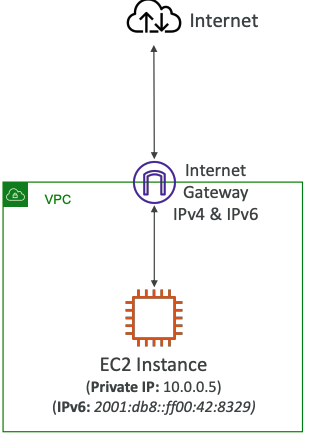

- **IPv4 cannot be disabled for your VPC and subnets**
- You can enable IPv6 (they’re public IP addresses) to operate in dual-stack mode
- Your EC2 instances will get at least a private internal IPv4 and a public IPv6
- They can communicate using either IPv4 or IPv6 to the internet through an Internet Gateway

### IPv6 Troubleshooting

- **IPv4 cannot be disabled for your VPC and subnets**
- So, if you cannot launch an EC2 instance in your subnet
    - It’s not because it cannot acquire an IPv6 (the space is very large)
    - It’s because there are no available IPv4 in your subnet
- Solution: create a new IPv4 CIDR in your subnet

### Egress-only Internet Gateway

- **Used for IPv6 only**
- (similar to a NAT Gateway but for IPv6)
- Allows instances in your VPC outbound connections over IPv6 while preventing the internet to initiate an IPv6 connection to your instances
- **You must update the Route Tables**

### IPv6 Routing

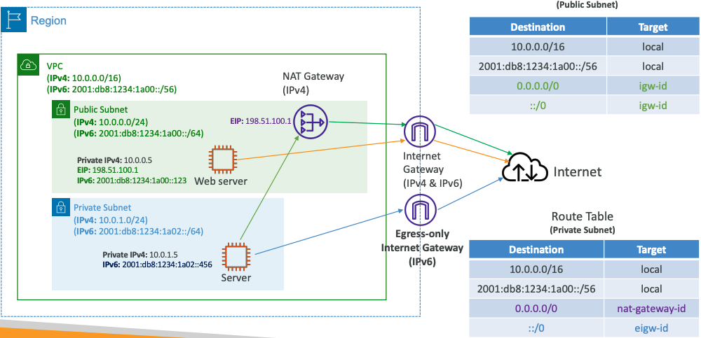

## Summary

- **CIDR** – IP Range
- **VPC** – Virtual Private Cloud => we define a list of IPv4 & IPv6 CIDR
- **Subnets** – tied to an AZ, we define a CIDR
- **Internet Gateway** – at the VPC level, provide IPv4 & IPv6 Internet Access
- **Route Tables** – must be edited to add routes from subnets to the IGW, VPC Peering Connections, VPC Endpoints, …
- **Bastion Host** – public EC2 instance to SSH into, that has SSH connectivity to EC2 instances in private subnets
- **NAT Instances** – gives Internet access to EC2 instances in private subnets. Old, must be setup in a public subnet, disable Source / Destination check flag
- **NAT Gateway** – managed by AWS, provides scalable Internet access to private EC2 instances, IPv4 only
- **Private DNS + Route 53** – enable DNS Resolution + DNS Hostnames (VPC)
- **NACL** – stateless, subnet rules for inbound and outbound, don’t forget Ephemeral Ports
- **Security Groups** – stateful, operate at the EC2 instance level
- **Reachability Analyzer** – perform network connectivity testing between AWS resources
- **VPC Peering** – connect two VPCs with non overlapping CIDR, non-transitive
- **VPC Endpoints** – provide private access to AWS Services (S3, DynamoDB, CloudFormation, SSM) within a VPC
- **VPC Flow Logs** – can be setup at the VPC / Subnet / ENI Level, for ACCEPT and REJECT traffic, helps identifying attacks, analyze using Athena or CloudWatch Logs Insights
- **Site-to-Site VPN** – setup a Customer Gateway on DC, a Virtual Private Gateway on VPC, and site-to-site VPN over public Internet
- **AWS VPN CloudHub** – hub-and-spoke VPN model to connect your sites
- **Direct Connect** – setup a Virtual Private Gateway on VPC, and establish a direct private connection to an AWS Direct Connect Location
- **Direct Connect Gateway** – setup a Direct Connect to many VPCs in different AWS regions
- **AWS PrivateLink / VPC Endpoint Services**:
    - Connect services privately from your service VPC to customers VPC
    - Doesn’t need VPC Peering, public Internet, NAT Gateway, Route Tables
    - Must be used with Network Load Balancer & ENI
- **ClassicLink** – connect EC2-Classic EC2 instances privately to your VPC
- **Transit Gateway** – transitive peering connections for VPC, VPN & DX
- **Traffic Mirroring** – copy network traffic from ENIs for further analysis
- **Egress-only Internet Gateway** – like a NAT Gateway, but for IPv6