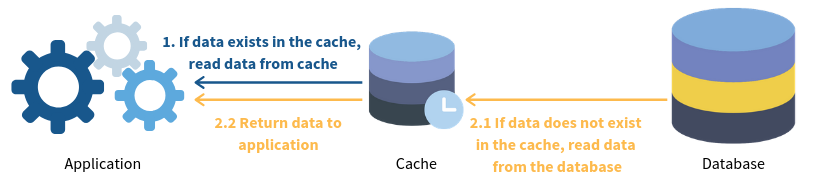

# Cache Strategies 

Choose strategies for applying a cache layer

## Read Strategies

### Cache Aside

- The cache is sitting aside the database. 
- The application will first request the data from the cache. 
    - If the data exists **cache hit**, the app will retrieve the data directly. 
    - If not **cache miss**, the app will request data from the database and write it to the cache so that the data can be retrieved from the cache again next time.

### Read through

- The cache sits in between the application and the database. 
- The application only request data from the cache. 
- If a **cache miss** occurs, the cache is responsible to retrieve data from the database, update itself and return data to the application.

## Write Strategies
### Write through

- The cache sits in between the application and the database. 
- Every writes from the application must go through the cache to the database.

### Write Back (a.k.a Write Behind)

- The application still writes data to the cache. 
- However, there is a delay in writing from the cache to the database. 
- The cache only flushes all updated data to the DB once in a while (e.g. every 2 minutes).

### Write Around

- Write around usually combines with either **cache aside** or **read through** strategy. 
- The application writes directly to the database. 
- Only data that is read goes to the cache.

## 🔗 Readmore 
- [Cache Miss Attack Prevention](../security/software-security.md#cache-miss-attack-prevention)
- [Cache miss : Escaping the Storm](https://dev.to/uzumakinarut0/cache-miss-escaping-the-storm-1f9j)
- [Cache Miss Storm](https://www.percona.com/blog/cache-miss-storm/)