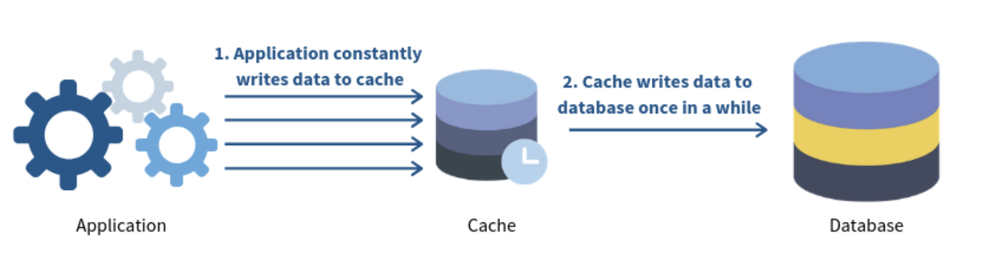

# Cache Notes 

<TagLinks />

## Cache levels
- Browser / Client side
- CDN
- Load Balancer
- Reverse Proxy / API Gateway
- CPU / RAM / Disk 
- Object cache / distributed cache ( redis, memcached)
- Relational Database: 
    - Write ahead log (WAL)
    - Bufferpool
    - Materialized View
    - Transaciton log
    - Replication log
- Message broker

## Things to consider when using cache

### Suitable Scenarios:
- In-memory solution
- Read heavy system
- Data is not frequently updated

### Caching Eviction Algorithm:
- Least Recently Used (LRU)
- Least Frequently Used (LFU)
- First-in First-out (FIFO)
- Random Replacement (RR)

### Key metrics
- Cache hit ratio
- Latency
- Throughput
- Invalidate rate
- Memory usage
- CPU usage
- Network usage

### Other issue
- Thunder herd on cold start
- Time-to-live (TTL)

## Read Strategies

### Cache Aside

- The cache is sitting aside the database. 
- The application will first request the data from the cache. 
    - If the data exists **cache hit**, the app will retrieve the data directly. 
    - If not **cache miss**, the app will request data from the database and write it to the cache so that the data can be retrieved from the cache again next time.

### Read through

- The cache sits in between the application and the database. 
- The application only request data from the cache. 
- If a **cache miss** occurs, the cache is responsible to retrieve data from the database, update itself and return data to the application.

### Refresh-ahead

Cached data, by default, expires after a certain period. This might result in higher latency when clients request an expired key since it requires a trip to the database.

The Refresh-ahead strategy refreshes the **hot data** before it gets expired.

**Implementation**
1. Supposed the cached data’s expiration time is 60 seconds and the refresh-ahead factor is 0.5.
2. If the cached data is accessed at the 25th second, nothing happens.
3. If the cached data is accessed after 30 seconds, said 35th second, the cache returns the data and asynchronously refreshes the data.

**Advantages**
- Hot data is refreshed before it expires and which leads to lower read latency of hot data.
- Data is refreshed periodically, hence, preventing stale data.

**Disadvantages**
- More difficult to implement. 
- It might incur an extra load on the cache if all keys refresh at the same time.

## Write Strategies

### Write through

- The cache sits in between the application and the database. 
- Every writes from the application must go through the cache to the database. (double write)

### Write Back (a.k.a Write Behind)

- The application still writes data to the cache. 
- However, there is a delay in writing from the cache to the database. 
- The cache only flushes all updated data to the DB once in a while (e.g. every 2 minutes).

### Write Around

- Write around usually combines with either **cache aside** or **read through** strategy. 
- The application writes directly to the database. 
- Only data that is read goes to the cache.

## Invalidate cache
- At Read side
    - let the cache item live until its expiration (probably stale data)
    - use [soft expiration (Refresh-ahead)](#refresh-ahead) (probably stale data)
- At write side
    - remove completely cache item from storage if we using [Cache Aside](#cache-aside)
    - remove soft expiration (probably stale data)
    - update new value into the cache item (will be problem if data structure of cache item)
    - emit an event, then cache updator will update itself (CQRS architecture)

## Cache problems

### Cache Penetration

A cache penetration happens when a searched **key does not reside in both the database and the cache.** 

Let’s take a look at how it works.

- It happens when a key does not reside in the cache nor the database.
- When users query for the key, the application hits the database due to `cache miss`.
- Since the database does not contain the key and returns an empty result, the key is never cached.
- Hence, every query will eventually result in cache miss and hit the database.

While this might seem trivial at first, an attacker can attempt to bring down your database by launching lots of searches with such keys.

To mitigate such issues, we can:
- Cache the empty result with a short expiration time.
- Employ a [bloom filter](https://medium.com/codex/how-to-efficiently-check-if-a-username-is-registered-dbbe02cca20f). Before querying the database, the application looks up the key in a bloom filter and returns immediately if the key does not exist.

### Cache Breakdown 
Cache Breakdown  aka Thundering herd problem aka Cache Miss Storm

A cache breakdown happens when a cache key expires, and **multiple requests access the database concurrently** looking for the same key.

Let’s take a look at how it works
- A hot cache key expires.
- Multiple concurrent requests come in searching for the same key.
- The servers launch multiple concurrent requests to the database to look for the same key.

A cache breakdown increases the load on the database dramatically especially when lots of hot keys expire at the same time.

Here are some mitigation plans
- Acquire a lock on the searched key. Other threads need to wait when a thread is trying to update the cache.
- Utilise [Refresh-ahead strategy](##refresh-ahead) to asynchronously refresh hot data so that the hot keys never expire.
- Use [Read-through](#read-through) strategy to move the data fetching logic to the cache and ensures that the cache fires only one request to the database for each query.

### Cache Avalanche

A cache avalanche happens when there’s a **sudden spike of requests to the database.**

This happens when: 
- Lots of cached data expire at the same time.
- A cache service goes down, and all requests access the database directly.

A sudden spike of traffic to the database might result in cascading effects and might eventually bring down your service.

Here are some mitigation plans
- Adjust the expiration time for the cached keys so that they won’t expire at the same time.
- Use [Refresh-ahead strategy](##refresh-ahead) to asynchronously refresh hot data so that they never expire.
- Use cache clusters to avoid single point of failure. When a master crashes, one of the replicas is promoted as the new master.

## 🔗 Readmore 
- [Cache Miss Attack Prevention](../security/software-security.md#cache-miss-attack-prevention)
- [Cache miss : Escaping the Storm](https://dev.to/uzumakinarut0/cache-miss-escaping-the-storm-1f9j)
- [Cache Miss Storm](https://www.percona.com/blog/cache-miss-storm/)
- [A Crash Course in Caching - Part 2](https://blog.bytebytego.com/p/a-crash-course-in-caching-part-2)
- [Cache Systems Every Developer Should Know](https://www.youtube.com/watch?v=dGAgxozNWFE&ab_channel=ByteByteGo)

https://www.youtube.com/watch?v=jIA7z1gxuc8&ab_channel=HusseinNasser