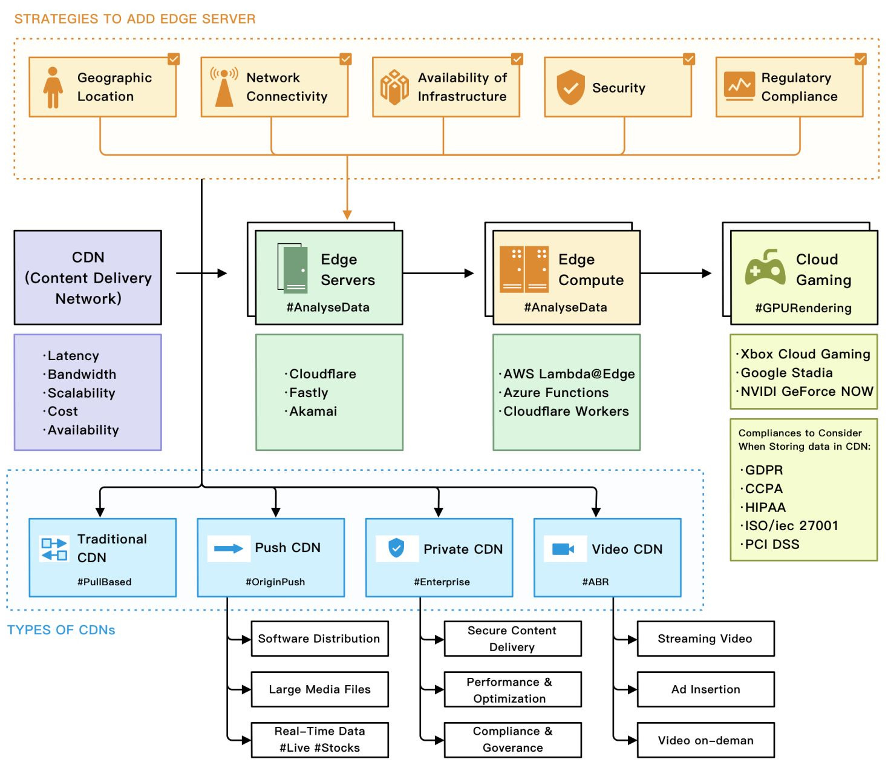
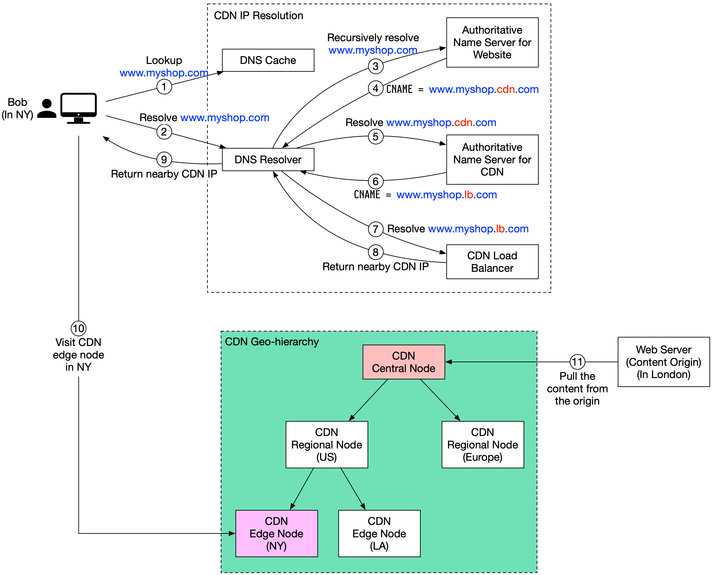

# Content Delivery Network (CDN)

## Overview

Edge servers are located closer to the end user than traditional servers, which helps reduce latency and improve website performance.

Edge computing is a type of computing that processes data closer to the end user rather than in a centralized data center. This helps to reduce latency and improve the performance of applications that require real-time processing, such as video streaming or online gaming.

Cloud gaming is online gaming that uses cloud computing to provide users with high-quality, low-latency gaming experiences.

Together, these technologies are transforming how we access and consume digital content. By providing faster, more reliable, and more immersive experiences for users, they are helping to drive the growth of the digital economy and create new opportunities for businesses and consumers alike.

## Why CDN popular?

## How it works

Suppose Bob who lives in New York wants to visit an eCommerce website that is deployed in London. If the request goes to servers located in London, the response will be quite slow. So we deploy CDN servers close to where Bob lives, and the content will be loaded from the nearby CDN server. 

1. Bob types in `www.myshop.com` in the browser. The browser looks up the domain name in the **local DNS cache**.
2. If the domain name does not exist in the **local DNS cache**, the browser goes to the **DNS resolver** to resolve the name. The DNS resolver usually sits in the Internet Service Provider (ISP).
3. The **DNS resolver** recursively resolves the domain name. Finally, it asks the **authoritative name server** to resolve the domain name. 
4. If we don’t use CDN, the **authoritative name server** returns the *IP address* for `www.myshop.com`. But with CDN, the authoritative name server has an *alias pointing* to `www.myshop.cdn.com` (the domain name of the CDN server).
5. The **DNS resolver** asks the **authoritative name server** to resolve `www.myshop.cdn.com`.
6. The **authoritative name server** returns the domain name for the load balancer of CDN `www.myshop.lb.com`.
7. The **DNS resolver** asks the **CDN load balancer** to resolve `www.myshop.lb.com`. The load balancer chooses an optimal CDN edge server based on the user’s IP address, user’s ISP, the content requested, and the server load.
8. The **CDN load balancer** returns the CDN edge server’s IP address for `www.myshop.lb.com`.
9. Now we finally get the actual IP address to visit. The DNS resolver returns the IP address to the browser.    
10. The browser visits the CDN edge server to load the content. There are two types of contents cached on the CDN servers: *static contents* and *dynamic contents*. The former contains static *pages*, *pictures*, *videos*; the latter one includes *results of edge computing*.
11. If the **edge CDN server** cache doesn't contain the content, it goes upward to the **regional CDN server**. If the content is still not found, it will go upward to the central CDN server, or even go to the origin - the London web server. This is called the CDN distribution network, where the servers are deployed geographically.

## Refs 
- [How does CDN work?](https://blog.bytebytego.com/p/how-does-cdn-work)