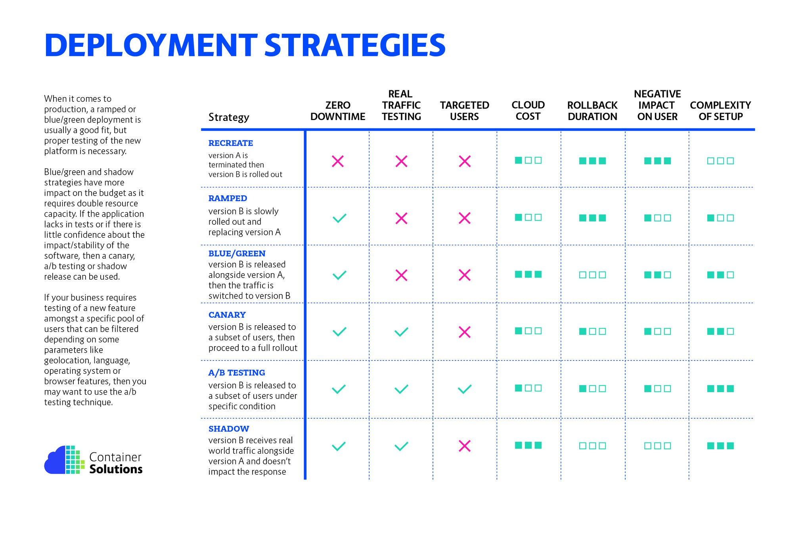

# Deployment Strategies

## Recreate
A Recreate deployment deletes the old version of the application before bring up the new version. As a result, this ensures that two versions of the application never run at the same time, but there is downtime during the deployment

## Blue-Green
A Blue-Green deployment (sometimes referred to as a Red-Black) has both the new and old version of the application deployed at the same time. During this time, only the old version of the application will receive production traffic. This allows the developers to run tests against the new version before switching the live traffic to the new version.

### Pros:

- Instant rollout/rollback.
- Avoid versioning issue, the entire application state is changed in one go.

### Cons:

- Expensive as it requires double the resources.
- Proper test of the entire platform should be done before releasing to production.
- Handling stateful applications can be hard.

## Rolling Update

A RollingUpdate slowly replaces the old version with the new version. As the new version comes up, the old version is scaled down in order to maintain the overall count of the application. This is the default strategy of the Deployment object.

Depending on the system taking care of the ramped deployment, you can tweak the following parameters to increase the deployment time:

Parallelism, max batch size: Number of concurrent instances to roll out.
Max surge: How many instances to add in addition of the current amount.
Max unavailable: Number of unavailable instances during the rolling update procedure.

### Pros:

- Easy to set up.
- Version is slowly released across instances.
- Convenient for stateful applications that can handle rebalancing of the data.

### Cons:
- Rollout/rollback can take time.
- Supporting multiple APIs is hard.
- No control over traffic

## Canary

A Canary deployment exposes a subset of users to the new version of the application while serving the rest of the traffic to the old version. Once the new version is verified to be correct, the new version can gradually replace the old version. Ingress controllers and service meshes such as NGINX and Istio, enable more sophisticated traffic shaping patterns for canarying than what is natively available (e.g. achieving very fine-grained traffic splitting, or splitting based on HTTP headers).

### Pros:
- Version released for a subset of users.
- Convenient for error rate and performance monitoring.
- Fast rollback.

### Cons:
- Slow rollout

## A/B
A/B testing is NOT blue-green deployments. I’ve run into groups that mistake this. A/B testing is a way of testing features in your application for various reasons like usability, popularity, noticeability, etc, and how those factors influence the bottom line
