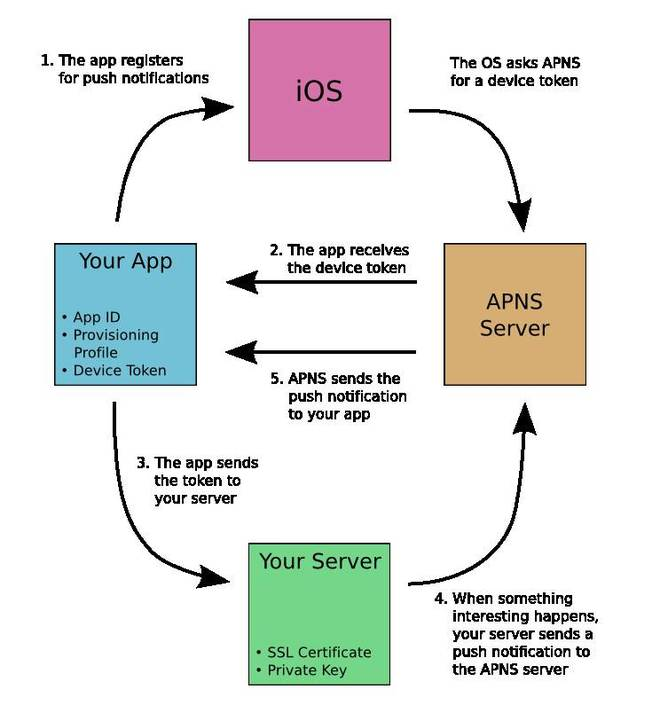
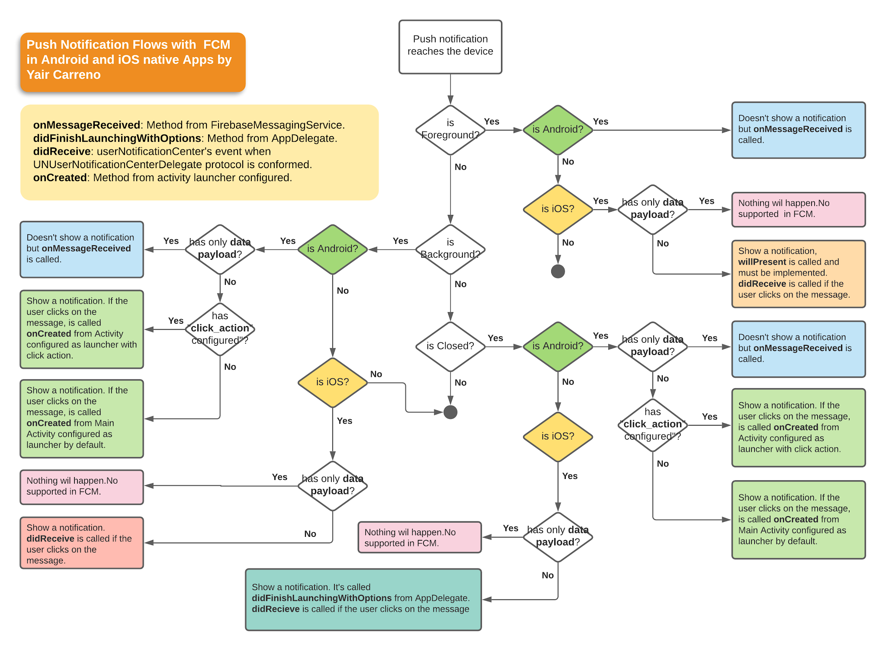

# Notification

## Browser

[Realtime technique](../realtime.md)

https://developer.mozilla.org/en-US/docs/Web/API/Push_API

## Mail

### Simple Mail Transfer Protocol (SMTP)
SMTP is the principal email protocol that is responsible for the **transfer of emails between email clients and email servers.**

### Post Office Protocol (POP) 
Email clients use the POP protocol support in the server to download the emails. This is primarily a **one-way protocol** and **does not sync back the emails to the server.**


### Internet Message Access Protocol (IMAP) 
IMAP Protocol is used to sync the emails in the server with the email clients. It allows **two-way sync** of emails between the server and the email client, while the emails are stored on the server. 

- replicated changes btw multiple devices
- ideal for users who use multiple devices

###  Multipurpose Internet Mail Extensions (MIME) 
is an Internet standard that extends the format of email messages to support text in character sets other than ASCII, as well as attachments of audio, video, images, and application programs. 

Message bodies may consist of multiple parts, and header information may be specified in non-ASCII character sets.

Email messages with MIME formatting are typically transmitted with standard protocols, such as the Simple Mail Transfer Protocol (SMTP), the Post Office Protocol (POP), and the Internet Message Access Protocol (IMAP).


Refs: 
- [Email Protocols](https://www.zoho.com/mail/glossary/email-protocols.html)
- [Difference Between SMTP And MIME](https://pulptastic.com/difference-between-smtp-and-mime/)
- [POP3 và IMAP](https://vietnix.vn/pop3-va-imap-la-gi/)


## iOS App 

<!-- Setting up an Apple push notification service (APN) with a Node.js application today. -->




Node package: [node-apn](https://github.com/node-apn/node-apn)


The remote notification setup is to be configured in your Apple device with proper **device tokens** and **certificates**. Otherwise, there are possibilities that the notification services don’t work as expected. 

### Apple Push Notification service (APNs)

- a collection of services that allows the dev to send the notifications from their server to the targeted iOS devices
- robust and secure methods to **establish a connection** between the provider server and individual Apple devices. 
- APN contains 2 components (must-haves):
    - Gateway component
    - Feedback component

**Gateway component**: establishes the (Transport Layer Secure) TLS connection from a provider side which enables the provider server to send messages to the Apple  It is recommended to keep the connection in an *always-on* mode

**Feedback Component** is established only occasionally to identify and remove the devices which no longer receive notifications for specific applications. 


### Create APNS certificate

Access [ttps://developer.apple.com/account/ios/certificate](ttps://developer.apple.com/account/ios/certificate) to create certificate. 
- Create CSR (by app **Keychain Access** -> Certificate Assistant -> Request a Certificate From a Certificate Authority) => got an `.cer` file
- Get AppId (Identifiers -> [App IDs](https://developer.apple.com/help/account/manage-identifiers/register-an-app-id/)) 


After, create Create APNS certificate successfully. We can download the certificate then import into keychain. Right click on new record => Export `p12` file which will be used at Nodejs server.

Now we got the `certificate` and `private key` from the list and export a `p12 file`. 

### Obtaining device token 


A method [`registerForRemoteNotifications`](https://developer.apple.com/documentation/uikit/uiapplication/1623078-registerforremotenotifications) is called at the launch time by your ios app.

See content of `AppDelegate.swift`.  [Full repo here](https://github.com/fedejordan/SimpleRTApp)

```swift
@UIApplicationMain
class AppDelegate: UIResponder, UIApplicationDelegate {

    var window: UIWindow?


    func application(_ application: UIApplication, didFinishLaunchingWithOptions launchOptions: [UIApplicationLaunchOptionsKey: Any]?) -> Bool {
        TWTRTwitter.sharedInstance().start(withConsumerKey: "<consumer-key>", consumerSecret: "<consumer-secret>")
        registerForPushNotifications()
        return true
    }
    
    func application(_ app: UIApplication, open url: URL, options: [UIApplicationOpenURLOptionsKey : Any] = [:]) -> Bool {
        return TWTRTwitter.sharedInstance().application(app, open: url, options: options)
    }

    func application(_ application: UIApplication,
                     didRegisterForRemoteNotificationsWithDeviceToken deviceToken: Data) {
        let tokenParts = deviceToken.map { data -> String in
            return String(format: "%02.2hhx", data)
        }
        
        let token = tokenParts.joined()
        print("Device Token: \(token)")
    }
    
    func application(_ application: UIApplication,
                     didFailToRegisterForRemoteNotificationsWithError error: Error) {
        print("Failed to register: \(error)")
    }
    
    // MARK:- Push notifications
    
    func registerForPushNotifications() {
        UNUserNotificationCenter.current().requestAuthorization(options: [.alert, .sound, .badge]) {
            (granted, error) in
            print("Permission granted: \(granted)")
            
            guard granted else { return }
            self.getNotificationSettings()
        }
    }

    func getNotificationSettings() {
        UNUserNotificationCenter.current().getNotificationSettings { (settings) in
            print("Notification settings: \(settings)")
            guard settings.authorizationStatus == .authorized else { return }
            UIApplication.shared.registerForRemoteNotifications()
        }
    }

}
```

### Node Server 

[Full repo here](https://github.com/fedejordan/SimpleRTAppAPI)

```js
var deviceToken = '<device-token>';
var apn = require('apn'); 
var join = require('path').join, 
    pfx = join(__dirname, '/simplertapp-certificates.p12');

var options = {
  pfx: pfx,
  passphrase: '<p12-password>',
  production: false
};

var apnProvider = new apn.Provider(options);

let notification = new apn.Notification();
notification.alert = "¡Hola, soy una push notification";

apnProvider.send(notification, [deviceToken]).then( (response) => { 
  process.exit();
});
```


### Refs
- [iOs push notifications](https://www.engineyard.com/blog/ios-push-notifications-via-apns/)
- [Mobile push notifications](https://docs.aws.amazon.com/sns/latest/dg/sns-mobile-application-as-subscriber.html)
- [Build và test app sử dụng APNs](https://viblo.asia/p/build-va-test-app-su-dung-apple-push-notification-service-apns-bWrZneVbKxw)
- [Cấu hình Appple Push Notification sử dụng APNS và SNS AWS](https://blog.daovanhung.com/post/cau-hinh-appple-push-notification-su-dung-apns-va-sns-aws)
- [Phần 2: Certificate Signing Requests - CSR](https://viblo.asia/p/phan-2-certificate-signing-requests-csr-djeZ1D0QKWz)
- [Phần 3: Provisioning Profiles](https://viblo.asia/p/phan-3-provisioning-profiles-gAm5yjqLKdb)
- [Setup Rich Push Notifications Service](https://viblo.asia/p/setup-rich-push-notifications-service-QpmleQe9lrd)


## Android App
// .. TODO

[How to send a push notification from node.js & display it in a kotlin app](https://dev.to/dallington256/how-to-send-push-notification-to-an-android-device-using-firebase-and-nodejs-3o4i)

## Firebase Cloud Messaging ([FCM](https://firebase.google.com/docs/cloud-messaging/fcm-architecture))



```json
{
  "message":{
    "token":"bk3RNwTe3H0:CI2k_HHwgIpoDKCIZvvDMExUdFQ3P1...",
    "notification":{
      "title":"Portugal vs. Denmark",
      "body":"great match!"
    },
    "data" : {
      "Nick" : "Mario",
      "Room" : "PortugalVSDenmark"
    }
  }
}
```

- **When in the background**, apps receive the notification payload in the notification tray, and only handle the data payload when the user taps on the notification.
- **When in the foreground**, your app receives a message object with both payloads available.

[Concepts](https://firebase.google.com/docs/cloud-messaging/concept-options)

## Others
[PushJs](https://devtut.github.io/nodejs/push-notifications.html#web-notification)