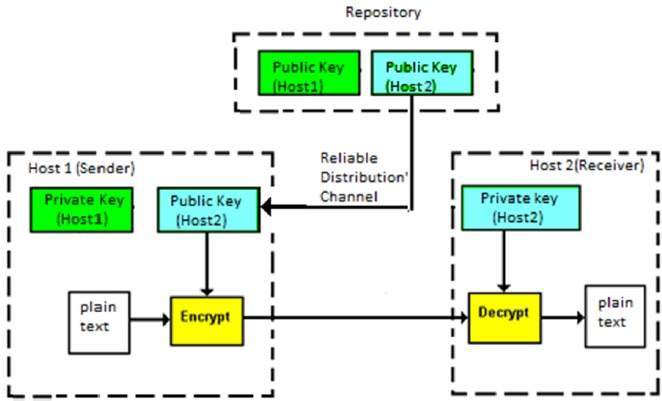
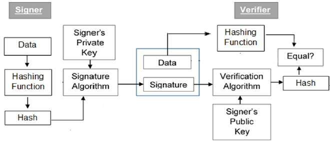

# Cryptography

## Cryptography Primitives

Primitives service | Encryption | Hash function | MAC | Digital Signature 
--------------------| ------| ----- | ---- | ---------
Confidentiality | Yes | No |  No | No
Integrity | No | Sometimes | Yes | Yes 
Authentication | No | No | Yes | Yes
Non-repudiation | No | No | Sometimes | yes


## Encryption
2 types of encryption in widespread use today: symmetric and asymmetric encryption.

### Symmetric encryption 

The same key is used for encryption and decryption.  It is therefore critical that a secure method is considered to transfer the key between sender and recipient.


### Asymmetric encryption?

Asymmetric encryption uses the notion of a key pair: a different key is used for the encryption and decryption process. One of the keys is typically known as the **private key** and the other is known as the **public key**.

The private key is kept secret by the owner and the public key is either shared amongst authorised recipients or made available to the public at large.

Data encrypted with the recipient’s public key can only be decrypted with the corresponding private key. Data can therefore be transferred without the risk of unauthorised or unlawful access to the data.



### RSA in NodeJS

:::: tabs

::: tab KeyGeneration
```js
const crypto = require("crypto");

// The `generateKeyPairSync` method accepts two arguments:
// 1. The type ok keys we want, which in this case is "rsa"
// 2. An object with the properties of the key
const { publicKey, privateKey } = crypto.generateKeyPairSync("rsa", {
  // The standard secure default length for RSA keys is 2048 bits
  modulusLength: 2048,
});

// use the public and private keys
// ...
```
:::

::: tab Encryption

1. The public key that we generated in the previous step
2. The padding scheme (we will use [OAEP padding](https://en.wikipedia.org/wiki/Optimal_asymmetric_encryption_padding) for this)
3. The hashing algorithm (we will be using SHA256, which is a recommended secure hashing function as of this date)
4. The data we want to encrypt. This is in the from of a buffer since the encrypt method accepts encrypt raw bytes.

```js
// This is the data we want to encrypt
const data = "my secret data";

const encryptedData = crypto.publicEncrypt(
  {
    key: publicKey,
    padding: crypto.constants.RSA_PKCS1_OAEP_PADDING,
    oaepHash: "sha256",
  },
  // We convert the data string to a buffer using `Buffer.from`
  Buffer.from(data)
);

// The encrypted data is in the form of bytes, so we print it in base64 format
// so that it's displayed in a more readable form
console.log("encypted data: ", encryptedData.toString("base64"));
```
:::

::: tab Decryption

1. The encrypted data (called the cipher text)
2. The hash that we used to encrypt the data
3. The padding scheme that we used to encrypt the data
4. The private key, which we generated previously

```js
const decryptedData = crypto.privateDecrypt(
  {
    key: privateKey,
    // In order to decrypt the data, we need to specify the
    // same hashing function and padding scheme that we used to
    // encrypt the data in the previous step
    padding: crypto.constants.RSA_PKCS1_OAEP_PADDING,
    oaepHash: "sha256",
  },
  encryptedData
);

// The decrypted data is of the Buffer type, which we can convert to a
// string to reveal the original data
console.log("decrypted data: ", decryptedData.toString());
```
:::
::::


## What about hashing?

Hashing is a technique that generates a fixed length value summarising a file or message contents. It is often incorrectly referred to as an encryption method.

Hash functions are used with cryptography to provide digital signatures and integrity controls but as no secret key is used it does not make the message private as the hash can be recreated.

### Applications of Hash Functions

- **Password Storage**. Instead of storing password in clear, mostly all logon processes store the hash values of passwords in the file. The Password file consists of a table of pairs which are in the form `(user id, h(P))`.
- **Data Integrity Check**. It is used to generate the checksums on data files. This application provides assurance to the user about correctness of the data.

### Message Digest (MD)

- The MD family comprises of hash functions MD2, MD4, MD5 and MD6. It was adopted as Internet Standard RFC 1321. It is a 128-bit hash function.
- MD5 digests have been widely used in the software world to provide assurance about integrity of transferred file. For example, file servers often provide a pre-computed MD5 checksum for the files, so that a user can compare the checksum of the downloaded file to it.
- In 2004, collisions were found in MD5. An analytical attack was reported to be successful only in an hour by using computer cluster. This collision attack resulted in compromised MD5 and hence it is **no longer recommended for use.**

### Secure Hash Function (SHA)
Family of SHA comprise of four SHA algorithms; SHA-0, SHA-1, SHA-2, and SHA-3. Though from same family, there are structurally different.

- The original version is SHA-0, a 160-bit hash function, was published by the National Institute of Standards and Technology (NIST) in 1993. It had few weaknesses and did not become very popular. Later in 1995, SHA-1 was designed to correct alleged weaknesses of SHA-0.
- SHA-1 is the most widely used of the existing SHA hash functions. It is employed in several widely used applications and protocols including Secure Socket Layer (SSL) security.
- In 2005, a method was found for **uncovering collisions** for SHA-1 within practical time frame making long-term employability of SHA-1 doubtful.
- SHA-2 family has four further SHA variants, SHA-224, SHA-256, SHA-384, and SHA-512 depending up on number of bits in their hash value. No successful attacks have yet been reported on SHA-2 hash function.
- Though SHA-2 is a strong hash function. Though significantly different, its basic design is still follows design of SHA-1. Hence, NIST called for new competitive hash function designs.
- In October 2012, the NIST chose the Keccak algorithm as the new SHA-3 standard. Keccak offers many benefits, such as efficient performance and good resistance for attacks.

### RIPEMD

The RIPEMD is an acronym for RACE Integrity Primitives Evaluation Message Digest. This set of hash functions was designed by open research community and generally known as a family of European hash functions.

- The set includes RIPEMD, RIPEMD-128, and RIPEMD-160. There also exist 256, and 320-bit versions of this algorithm.
- Original RIPEMD (128 bit) is based upon the design principles used in MD4 and found to provide questionable security. RIPEMD 128-bit version came as a quick fix replacement to overcome vulnerabilities on the original RIPEMD.
- RIPEMD-160 is an improved version and the most widely used version in the family. The 256 and 320-bit versions reduce the chance of accidental collision, but do not have higher levels of security as compared to RIPEMD-128 and RIPEMD-160 respectively.

### Whirlpool

This is a 512-bit hash function.
- It is derived from the modified version of Advanced Encryption Standard (AES). One of the designer was Vincent Rijmen, a co-creator of the AES.
- Three versions of Whirlpool have been released; namely WHIRLPOOL-0, WHIRLPOOL-T, and WHIRLPOOL.


## Message Authentication Code (MAC)

[See more HMAC](../../architect/authenication.md#hash-based-message-authentication-code-hmac)

MAC algorithm is a symmetric key cryptographic technique to provide message authentication. For establishing MAC process, the sender and receiver share a symmetric key K.

Essentially, a MAC is an encrypted checksum generated on the underlying message that is sent along with a message to ensure message authentication.

### Limitations of MAC

- **Establishment of Shared Secret.**
    - It can provide message authentication among pre-decided legitimate users who have shared key.
    - This requires establishment of shared secret prior to use of MAC.
- **Inability to Provide Non-Repudiation**

## Digital Signature

Digital signatures are the public-key primitives of message authentication. In the physical world, it is common to use handwritten signatures on handwritten or typed messages. They are used to bind signatory to the message.

Digital signature is a cryptographic value that is calculated from the data and a secret key known only by the signer.

### Model



- Each person adopting this scheme has a public-private key pair.
- Generally, the key pairs used for encryption/decryption and signing/verifying are different. 
    - The **private key** used for signing is referred to as the **signature key** 
    - The **public key** as the **verification key**.
- Signer feeds data to the hash function and generates hash of data.
- Hash value and signature key are then fed to the signature algorithm which produces the digital signature on given hash. Signature is appended to the data and then both are sent to the verifier.
- Verifier feeds the digital signature and the **verification key** into the verification algorithm. The verification algorithm gives some value as output.
- Verifier also runs same hash function on received data to generate hash value.
- For verification, this hash value and output of verification algorithm are compared. Based on the comparison result, verifier decides whether the digital signature is valid.
- Since digital signature is created by ‘private’ key of signer and no one else can have this key; the signer cannot repudiate signing the data in future.

**signing a hash is more efficient than signing the entire data.**

### Example in Nodejs

```js
// Create some sample data that we want to sign
const verifiableData = "this need to be verified";

// The signature method takes the data we want to sign, the
// hashing algorithm, and the padding scheme, and generates
// a signature in the form of bytes
const signature = crypto.sign("sha256", Buffer.from(verifiableData), {
  key: privateKey,
  padding: crypto.constants.RSA_PKCS1_PSS_PADDING,
});

console.log(signature.toString("base64"));

// To verify the data, we provide the same hashing algorithm and
// padding scheme we provided to generate the signature, along
// with the signature itself, the data that we want to
// verify against the signature, and the public key
const isVerified = crypto.verify(
  "sha256",
  Buffer.from(verifiableData),
  {
    key: publicKey,
    padding: crypto.constants.RSA_PKCS1_PSS_PADDING,
  },
  signature
);

// isVerified should be `true` if the signature is valid
console.log("signature verified: ", isVerified);
```

## REFS
- [https://www.tutorialspoint.com/cryptography/index.htm](https://www.tutorialspoint.com/cryptography/index.htm)
- [Node.js crypto.privateDecrypt() Method](https://www.geeksforgeeks.org/node-js-crypto-privatedecrypt-method/)