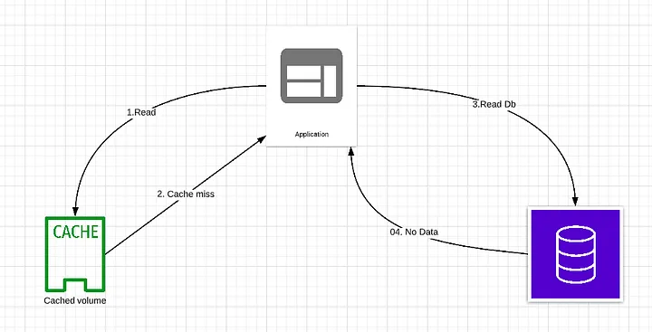

# Software Security

::: tip
**Security vs. Convenience**: The Ultimate Trade-Off? A Balancing Act
:::

## HTTPS

Data is encrypted in transit in both directions: going to and coming from the origin server

avoid man in middle attack 


**How**
- Buy SSL then set up on your server
- Use [let's encrypt](https://letsencrypt.org/) to generate one SSL for free
- Free SSL from [cloudflare](https://www.cloudflare.com/ssl/)

## Limit rating
Limit rating allows us to control the rate at which user requests are processed by our server. Avoid: 
- Brute force attack
- DoS & DDoS attack
- Web scraping

**How**
- Setup at DNS Service like [cloudflare](https://developers.cloudflare.com/support/firewall/tools/configuring-cloudflare-rate-limiting/)
- Setup at Application . E.g [throttler of NestJs](https://docs.nestjs.com/security/rate-limiting). Don't forget storage for this feature must be fast 👿

Read more: [Rate-limiting strategies and techniques](https://cloud.google.com/architecture/rate-limiting-strategies-techniques)


## Information hiding
Attacker can use tool to [scan vulnerability list](https://www.coresecurity.com/blog/top-14-vulnerability-scanners-cybersecurity-professionals) that's why hide information is important thing in to-do list
- Hide detail of error response, turn off debug mode on production
- Hide technologies Backend languages by removing redundant header attributes
- Hide frontend libraries by using obfustace or uglify tool, remove meta information 
- Hide sensitive route , rename default links of system. E.g in wordpress `/wp-admin` to `/no-duty-to-waive-entry` 😎 
- ...

## Cache Miss Attack Prevention


attacker purposely tries to cache miss, the attacker can overload your application and database.

Example: 

```
Example.com?cachemiss1
Example.com?cachemiss2
Example.com?cachemiss3
```




**Solution**
- Whitelist the allowed parameters, strip invalid parameters
- Set a short TTL for keys with null value
- Using Bloom filter. A Bloom filter is a data structure that can rapidly tell us whether an element is present in a set or not. If the key exists,
the request first goes to the cache and then queries the database if needed. If the key doesn't exist in the data set, it means the key doesn’t exist in the cache/database. In this case, the query will not hit the cache or database layer.

Read more: 
- [cache miss attack](https://inside.caratlane.com/cache-miss-attack-4e515a639e9b)
- [Bloom Filters: Tại sao các mạng blockchain lại thường sử dụng nó](https://viblo.asia/p/bloom-filters-tai-sao-cac-mang-blockchain-lai-thuong-su-dung-no-GrLZD07eZk0)

## Payment Security
... TBD

## Authentication

### Store Password Safely

::: danger
- Never store raw/plain password 
- Storing password hashes directly is not sufficient because it is
pruned to precomputation attacks, such as [rainbow tables](https://en.wikipedia.org/wiki/Rainbow_table).
:::


To mitigate precomputation attacks, we **salt** the passwords.


Sending raw password in payload from browser on HTTP protocol is not a good idea. Hash password before send to server is better. Server has no chance to know what is the raw password of user. 


### Two/Multi Factor Authentication (2FA / MFA)
strengthens access security by requiring two methods to verify identity

**How**
- [Hardware Tokens](https://www.sciencedirect.com/topics/computer-science/hardware-token) for 2FA
- SMS Text-Message and Voice-based
- Software Tokens for 2FA. E.g: [Time-based one-time password (TOTP)](https://en.wikipedia.org/wiki/Time-based_one-time_password), [Google Authenticator](https://play.google.com/store/apps/details?id=com.google.android.apps.authenticator2), ...
- Push notification . E.g send request to other devices of owner
- Biometric. E.g: fingerprint, facial recognition, ...


## Authorization aka Access Control

Access control is the application of constraints on who can perform attempted actions or access resources that they have requested. **Broken access controls** are a commonly encountered and often critical security vulnerability. 

Design and management of access controls is a complex and dynamic problem that applies business, organizational, and legal constraints to a technical implementation. Access control design decisions have to be made by humans, not technology, and the potential for errors is high.


**Solution**
- Checking permission 👿 more testing 👿
- Avoid Misconfiguration
- Unless a resource is intended to be publicly accessible, deny access by default
- Wherever possible, use a single application-wide mechanism for enforcing access controls.
- At the code level, make it mandatory for developers to declare the access that is allowed for each resource, and deny access by default.
- Thoroughly audit and test access controls to ensure they are working as designed.

Read more [Access control vulnerabilities and privilege escalation](https://portswigger.net/web-security/access-control)

### Insecure direct object references (IDOR) Prevention

IDOR is a type of access control vulnerability that arises when an application uses user-supplied input to access objects directly. 

**Solution**
- Apply rating limits
- Avoid using `AUTO_INCREMENT` for IDs that allows guessing other Ids easily => Attacker can fetch all of records if there is an accessible API
- Use UUID => allow you to merge rows from different databases or distribute databases across servers
- Use [flake-idgen](https://www.npmjs.com/package/flake-idgen) . The Flake ID is made up of: `timestamp`, `datacenter`, `worker` and `counter` conflict-free ids in a distributed environment.

Read more: 
[MySQL UUID Smackdown: UUID vs. INT for Primary Key](https://www.mysqltutorial.org/mysql-uuid/)

## Cross Site Scripting (XSS) Prevention

3 types of XSS 
- Reflected XSS (aka Non-Persistent) through POST form 
- Stored XSS (aka Persistent) through query string
- DOM Based XSS (new)


### Cookie Attributes 
- `httpOnly` =>  prevents client-side scripts from accessing data

### Web Application Firewall (WAF)

[How do I create an AWS WAF rule to prevent SQLi and XSS?](https://repost.aws/knowledge-center/waf-rule-prevent-sqli-xss)

### Content Security Policy (CSP)

CSP is an added layer of security that helps to detect and mitigate certain types of attacks, including Cross-Site Scripting (XSS) and data injection attacks. 

```html
<meta
  http-equiv="Content-Security-Policy"
  content="default-src 'self'; img-src https://*; child-src 'none';" />
```

- Restricting Remote Scripts
- Restricting Unsafe JavaScript
- Restricting Form submissions
- Restricting Objects => won't be possible to inject malicious flash/Java/other legacy executables on the page.

**Common use cases**

1. A web site administrator wants all content to come from the site's own origin (this excludes subdomains.)

```sh
Content-Security-Policy: default-src 'self'
```

2. A web site administrator wants to allow content from a trusted domain and all its subdomains (it doesn't have to be the same domain that the CSP is set on.)

```sh
Content-Security-Policy: default-src 'self' example.com *.example.com
```

3. A web site administrator wants to allow users of a web application to include images from any origin in their own content, but to restrict audio or video media to trusted providers, and all scripts only to a specific server that hosts trusted code.

```sh
Content-Security-Policy: default-src 'self'; img-src *; media-src example.org example.net; script-src userscripts.example.com
```

4. A web site administrator for an online banking site wants to ensure that all its content is loaded using TLS, in order to prevent attackers from eavesdropping on requests.

```sh
Content-Security-Policy: default-src https://onlinebanking.example.com
```

5. A web site administrator of a web mail site wants to allow HTML in email, as well as images loaded from anywhere, but not JavaScript or other potentially dangerous content.

```sh
Content-Security-Policy: default-src 'self' *.example.com; img-src *
```

Read more: 
- [Content Security Policy Cheat Sheet](https://cheatsheetseries.owasp.org/cheatsheets/Content_Security_Policy_Cheat_Sheet.html) 
- [Content Security Policy](https://developer.mozilla.org/en-US/docs/Web/HTTP/CSP) 

### Validate / sanitize input from user
- Cleaning Content 
  - detect and remove invalid HTML tags. E.g: `<script />`, or `<iframe />`
  - detect and remove invalid attributes. E.g: ``

### Encoding, be careful output

**Using framework**

React
```js
const markup = { __html: '<p>some raw html</p>' };
return <div dangerouslySetInnerHTML={markup} />;
```

Vue 
```html
<p>Using v-html directive: <span v-html="rawHtml"></span></p>
```

**CSS Contexts**

:::: tabs

::: tab Unsafe
```html
<style> selector { property : $varUnsafe; } </style>
<style> selector { property : "$varUnsafe"; } </style>
<span style="property : $varUnsafe">Oh no</span>
```
:::

::: tab Safe
If you're using JavaScript to change a CSS property, look into using `style.property = x`. This is a Safe Sink and will automatically CSS encode data in it.
:::

::::

**URL Contexts**

:::: tabs
::: tab Unsafe
```html
<a href="http://www.owasp.org?test=$varUnsafe">link</a >
```
:::

::: tab Safe
```html
url = "https://site.com?data=" + urlencode(parameter)
<a href='attributeEncode(url)'>link</a>
```

If you're using JavaScript to construct a URL Query Value, look into using `window.encodeURIComponent(x)`. This is a Safe Sink and will automatically URL encode data in it.
:::
::::

**Dangerous Contexts**


```html
<script>Directly in a script</script>
<!-- Inside an HTML comment -->
<style>Directly in CSS</style>
<div ToDefineAnAttribute=test />
<ToDefineATag href="/test" />
```

Other areas to be careful of include:
- Callback functions
- Where URLs are handled in code such as this CSS { background-url : “javascript:alert(xss)”; }
- All JavaScript event handlers (`onclick()`, `onerror()`, `onmouseover()`).
- Unsafe JS functions like `eval()`, `setInterval()`, `setTimeout()`

Don't place variables into dangerous contexts as even with output encoding, it will not prevent an XSS attack fully.


[Source: Cross Site Scripting Prevention Cheat Sheet](https://cheatsheetseries.owasp.org/cheatsheets/Cross_Site_Scripting_Prevention_Cheat_Sheet.html)


## SQL Injection (SQLi) Prevention

Recently, many libraries, frameworks support automatically escapes all variables / parameters by default. But sometimes, you must use a raw query Sql to execute... Read the document carefully.

**mysqli of PHP**

:::: tabs

::: tab Unsafe
```php
$query = sprintf("SELECT CountryCode FROM City WHERE name='%s'", $city);
$result = $mysqli->query($query);
```
:::

::: tab Safe
```php
$query = sprintf("SELECT CountryCode FROM City WHERE name='%s'",
    $mysqli->real_escape_string($city));

$result = $mysqli->query($query);
```

More detail: [mysqli_real_escape_string](https://www.php.net/manual/en/mysqli.real-escape-string.php)
:::
::::

**Prisma of Nodejs**

:::: tabs

::: tab Unsafe
```js
const emailValidated = true
const active = true

const result = await prisma.$executeRawUnsafe(
  `UPDATE User SET active = ${active} WHERE emailValidated = ${emailValidated}`
);
```
:::

::: tab Safe
```js
const emailValidated = true
const active = true

const result: number = await prisma.$executeRaw`UPDATE User SET active = ${active} WHERE emailValidated = ${emailValidated};`
```

Read more [Prisma Client > Raw database access](https://www.prisma.io/docs/concepts/components/prisma-client/raw-database-access#sql-injection)
:::
::::

Read more [excess-xss](https://excess-xss.com/)

## Cross-Site Request Forgery (CSRF) Prevention 

...


## More solution
- If using a wordpress, install plugin  [iThemes Security](https://ithemes.com/security/)
- [10 Ways to Prevent Phishing Attacks](https://www.lepide.com/blog/10-ways-to-prevent-phishing-attacks/)
- [OWASP Top Ten](https://owasp.org/www-project-top-ten/)


## Refs

- [Rate limiting — A Good Approach for Scalable System](https://medium.com/geekculture/rate-limiting-a-good-approach-for-scalable-system-45e338b77ffc)
- [Cyber Security Tutorial](https://www.w3schools.com/cybersecurity/index.php)
- [Tổng hợp các bài viết hay về Web Security](https://whitehat.vn/threads/tong-hop-cac-bai-viet-hay-ve-web-security.9643/)
- [Top 7 PHP Security Issues And Vulnerabilities](https://spectralops.io/blog/top-7-php-security-issues-and-vulnerabilities/)
- [Types of Cybercrime](https://www.tutorialsmate.com/2020/10/types-of-cybercrime.html)