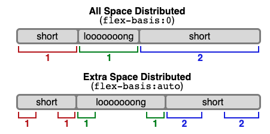

# CSS Flexbox

[A Complete Guide to Flexbox](https://css-tricks.com/snippets/css/a-guide-to-flexbox/)

[Properties in action](https://codepen.io/enxaneta/full/adLPwv/)

## Flex Container Properties

```css
.container {
  display: flex; /* or inline-flex */

  flex-direction: row | row-reverse | column | column-reverse;
  flex-wrap: nowrap | wrap | wrap-reverse;

  flex-flow: row nowrap; /** shorthand for the flex-direction and flex-wrap  */
}
```

### **Justify Content**

```css
.container {
  justify-content: flex-start | flex-end | center | space-between | space-around | space-evenly | start | end | left | right ... + safe | unsafe;
}
```


### **Align Items**

```css
.container {
  align-items: stretch | flex-start | flex-end | center | baseline | first baseline | last baseline | start | end | self-start | self-end + ... safe | unsafe;
}
```


### **Align Content**

```css
.container {
 align-content: flex-start | flex-end | center | space-between | space-around | space-evenly | stretch | start | end | baseline | first baseline | last baseline + ... safe | unsafe;
}
```

::: warning
A single-line flexible container (i.e. flex-wrap `no-wrap`) will not reflect align-content.
:::


### Tips

::: tip Justify Content vs Align Items
- **justify-content**: along primary axis(set horizontal alignment/spacing if flex-direction is row or vertical alignment/spacing if flex-direction is column)
- **align-items**: along secondary axis (set vertical alignment if flex-direction is row or horizontal alignment if flex-direction is column)
:::

::: tip Align content vs Align items
- **align-content** determines the spacing between lines
- **align-items** determines how the items as a whole are aligned within the container.
:::

## Flex Item Properties

### Order

By default, flex items are laid out in the source order. However, the order property controls the order in which they appear in the flex container.

```css
.item {
  order: 5; /* default is 0 */
}
```

### flex-grow

```css
.item {
  flex-grow: 4; /* default 0 */
}
```


### flex-shrink

Opposite to `flex-grow`

```css
.item {
  flex-shrink: 3; /* default 1 */
}
```


### flex-basis

defines the default size of an element before the remaining space is distributed. It can be a length (e.g. 20%, 5rem, etc.) or a keyword. 

```css
.item {
  flex-basis:  | auto; /* default auto */
}
```


### flex

This is the shorthand for `flex-grow`, `flex-shrink` and `flex-basis` combined


```css
.item {
  flex: none | [ <'flex-grow'> <'flex-shrink'>? || <'flex-basis'> ]
}
```

**It is recommended that you use this shorthand property**

### align-self

This allows the default alignment (or the one specified by `align-items`) to be overridden for individual flex items.

```css
.item {
  align-self: auto | flex-start | flex-end | center | baseline | stretch;
}
```


